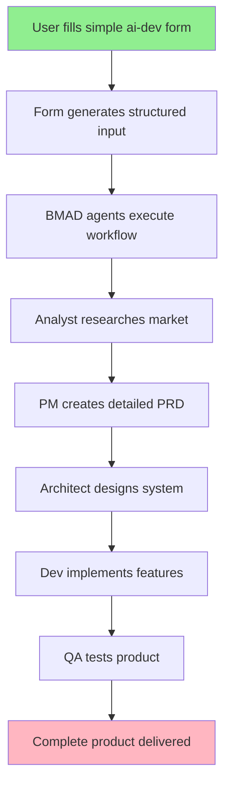

# BMAD-METHOD Integration Analysis & Strategy

**Created:** 2025-09-15
**Purpose:** Evaluate integration potential between ai-dev workflow system and BMAD-METHOD
**Status:** Strategic Analysis Complete

## Executive Summary

BMAD-METHOD™ is a sophisticated AI agent orchestration framework that could significantly enhance your ai-dev workflow system. The key insight: **your simple forms could serve as the perfect bridge to make BMAD's powerful agent system accessible to non-technical users.**

## BMAD-METHOD™ Technical Overview

### Core Architecture
- **Language:** JavaScript/Node.js (97.9%), requires Node.js 20+
- **Version:** 4.43.0 (actively maintained)
- **License:** MIT (open source)
- **Primary Use:** Structured AI agent workflows for development lifecycle

### Directory Structure Analysis
```
bmad-core/
├── agents/              # 7+ specialized AI agents
│   ├── analyst.md       # Market research, brainstorming
│   ├── architect.md     # System architecture design
│   ├── pm.md           # Product management
│   ├── dev.md          # Development implementation
│   ├── po.md           # Product owner
│   └── bmad-master.md  # Orchestration agent
├── agent-teams/         # Team configurations
├── workflows/           # Process definitions
├── templates/           # Document templates
├── tasks/              # Granular task definitions
├── checklists/         # Validation checklists
└── data/              # Knowledge base
```

### Core Agents Available
1. **Analyst** - Market research, competitor analysis, project briefs
2. **PM (Product Manager)** - PRD creation, requirements gathering
3. **Architect** - System design, technical architecture
4. **Dev (Developer)** - Code implementation, story execution
5. **PO (Product Owner)** - User stories, acceptance criteria
6. **QA** - Testing strategies, quality assurance
7. **Scrum Master** - Sprint planning, story breakdown

### Technical Dependencies
```json
{
  "node": ">=20.10.0",
  "dependencies": [
    "chalk", "commander", "fs-extra",
    "glob", "inquirer", "js-yaml"
  ],
  "size": "~500MB with dependencies"
}
```

## Your ai-dev System Strengths

### Current Architecture
- **Lightweight:** ~50MB container with Ubuntu base
- **Simple:** Single command document creation
- **Fast:** No Node.js dependencies, pure Make/bash
- **Accessible:** Perfect for beginners and quick tasks
- **Proven:** 21 professional templates, containerized workflow

### User Experience Excellence
```bash
# Current workflow - Simple and fast
ai-dev make create T=create-prd.md N=my-feature.md
# Result: Professional PRD in 2 seconds
```

## Integration Strategy: The Bridge Concept

### 🎯 **Your Key Insight: Forms as BMAD Bridge**

**The Problem BMAD Solves:** Complex agent orchestration for comprehensive development
**The Problem BMAD Creates:** Too complex for non-technical users
**Your Solution:** Simple forms → BMAD execution → Complete product

### Proposed Integration Architecture



### Implementation Approach

#### Phase 1: Form-to-BMAD Bridge
```bash
# User experience remains simple
ai-dev make create T=product-idea-form.md N=my-startup.md

# User fills out simple form:
# - What problem does this solve?
# - Who is your target user?
# - What's your budget/timeline?
# - What technical skills do you have?

# Behind the scenes magic
ai-dev make execute-bmad N=my-startup.md
# → Triggers full BMAD agent workflow
# → Analyst researches market
# → PM creates comprehensive PRD
# → Architect designs system
# → Dev creates implementation plan
# → QA defines testing strategy
```

#### Phase 2: Enhanced User Experience
```bash
# Super simple for non-tech users
ai-dev startup --idea "Food delivery for seniors"
# Prompts user through guided questions
# Executes full BMAD workflow automatically
# Delivers complete business plan + tech implementation
```

## Detailed Integration Analysis

### Integration Benefits

#### For Non-Technical Users
- **Accessibility:** Simple forms hide BMAD complexity
- **Completeness:** Get full product development lifecycle
- **Professional Output:** Enterprise-grade documentation
- **Reduced Risk:** Guided process prevents missed steps

#### For Technical Users
- **Power:** Full BMAD agent orchestration
- **Flexibility:** Can skip to specific workflow stages
- **Customization:** Direct agent interaction when needed
- **Efficiency:** Automated execution of repetitive tasks

#### For Your Business
- **Differentiation:** Unique combination of simplicity + power
- **Market Expansion:** Serve both simple and complex use cases
- **Value Proposition:** "From idea to implementation in one tool"
- **Competitive Advantage:** No similar integrated solution exists

### Technical Implementation Strategy

#### Container Architecture
```dockerfile
# New enhanced container
FROM node:20-alpine AS bmad-layer
WORKDIR /bmad
COPY bmad-core/ ./bmad-core/
COPY tools/ ./tools/
RUN npm install && npm run build

FROM ubuntu:22.04 AS final
# Your existing ai-dev layer
COPY --from=bmad-layer /bmad /opt/bmad
# Bridge scripts
COPY bridge/ /opt/bridge/
```

#### Bridge Components
```
bridge/
├── form-parser.js        # Converts filled forms to BMAD input
├── workflow-executor.js  # Orchestrates BMAD agents
├── output-formatter.js   # Formats results for users
└── progress-tracker.js   # Shows user what's happening
```

#### Enhanced Makefile
```makefile
# Simple user interface (unchanged)
create:
	@cp "$(TPL)/$(T)" "$(WORKSPACE)/$(N)"

# New enhanced workflow
execute-bmad:
	@echo "🚀 Executing BMAD workflow for $(N)"
	@node /opt/bridge/form-parser.js "$(WORKSPACE)/$(N)"
	@node /opt/bridge/workflow-executor.js "$(WORKSPACE)/$(N)"
	@echo "✅ Complete product plan ready in $(WORKSPACE)/output/"

# One-command product creation
create-product:
	@echo "💡 Let's build your product idea!"
	@node /opt/bridge/guided-setup.js
	@make execute-bmad N=generated-input.md
```

### User Journey Comparison

#### Current ai-dev Workflow
```
User Input: "I need a PRD"
↓
ai-dev make create T=create-prd.md N=feature.md
↓
User fills template manually
↓
Result: PRD template with user content
Time: 30 minutes to 2 hours
```

#### Enhanced ai-dev + BMAD Workflow
```
User Input: "I have a startup idea"
↓
ai-dev startup --guided
↓ (Automatic execution)
Market Research → PRD → Architecture → Implementation Plan → QA Strategy
↓
Result: Complete product development package
Time: 5-10 minutes (mostly automated)
```

### Complexity Management

#### Abstraction Layers
1. **Beginner Layer:** Simple forms, full automation
2. **Intermediate Layer:** Choose which agents to run
3. **Advanced Layer:** Direct BMAD agent interaction
4. **Expert Layer:** Custom agent modification

#### Progressive Disclosure
```bash
# Level 1: Complete automation
ai-dev startup --idea "My app idea"

# Level 2: Choose workflow stages
ai-dev workflow --stages analysis,planning,architecture

# Level 3: Specific agent interaction
ai-dev agent analyst --input my-brief.md

# Level 4: Raw BMAD access
bmad-raw analyst --advanced-config config.yaml
```

## Market Position Analysis

### Current Market Gap
- **Simple Tools:** Limited to basic templates (your current position)
- **Complex Tools:** Full-featured but overwhelming (BMAD's position)
- **Enterprise Tools:** Expensive, require training
- **Gap:** Simple entry point to powerful automation

### Competitive Advantages
1. **Unique Positioning:** Only tool that bridges simplicity and power
2. **Non-Technical Accessibility:** Startup founders without tech background
3. **Technical Depth:** Full development lifecycle automation
4. **Cost Effectiveness:** Open source foundation, container efficiency
5. **Learning Path:** Users can grow from simple to complex usage

### Target User Segments

#### Segment 1: Non-Technical Entrepreneurs
- **Pain Point:** Need professional documentation but lack expertise
- **Solution:** Simple forms → Complete business plan + tech specs
- **Value:** Eliminates need for expensive consultants

#### Segment 2: Solo Developers
- **Pain Point:** Wearing multiple hats (PM, architect, dev, QA)
- **Solution:** AI agents handle non-coding aspects
- **Value:** Focus on coding while AI handles process

#### Segment 3: Small Development Teams
- **Pain Point:** Inconsistent processes, missed requirements
- **Solution:** Standardized AI-driven workflow
- **Value:** Enterprise-grade process without enterprise overhead

#### Segment 4: Enterprise Innovation Teams
- **Pain Point:** Slow ideation-to-prototype cycle
- **Solution:** Rapid concept validation and planning
- **Value:** 10x faster concept development

## Implementation Roadmap

### Phase 1: Proof of Concept (4-6 weeks)
#### Goals
- Validate form-to-BMAD integration
- Test user acceptance of guided workflow
- Measure complexity reduction

#### Deliverables
```
ai-dev-enhanced/
├── simple-forms/
│   ├── startup-idea.md
│   ├── feature-request.md
│   └── product-enhancement.md
├── bmad-bridge/
│   ├── form-parser.js
│   └── basic-executor.js
└── examples/
    └── sample-outputs/
```

#### Success Metrics
- Form completion rate > 80%
- User satisfaction > 4/5
- Output quality comparable to manual BMAD usage

### Phase 2: Alpha Release (6-8 weeks)
#### Goals
- Complete integration of core BMAD agents
- Polished user experience
- Documentation and examples

#### Features
- 5 guided workflow templates
- Progress tracking and user feedback
- Error handling and recovery
- Output formatting and export

### Phase 3: Beta Release (8-12 weeks)
#### Goals
- Public testing and feedback
- Performance optimization
- Advanced features for power users

#### Features
- Custom workflow creation
- Integration with external tools
- API for programmatic access
- Community templates and workflows

### Phase 4: Production Release (12-16 weeks)
#### Goals
- Stable, production-ready system
- Comprehensive documentation
- Support and community

#### Features
- Enterprise features (team collaboration)
- Monitoring and analytics
- Professional support options
- Marketplace for custom agents

## Risk Analysis & Mitigation

### Technical Risks

#### Risk: Container Size Explosion
- **Impact:** Slow downloads, resource usage
- **Mitigation:** Multi-stage builds, optional components
- **Monitoring:** Track container size < 200MB

#### Risk: Node.js Dependency Conflicts
- **Impact:** Installation failures, version conflicts
- **Mitigation:** Isolated container environment, version pinning
- **Monitoring:** Automated dependency testing

#### Risk: BMAD Update Breaking Changes
- **Impact:** Integration failures, workflow disruption
- **Mitigation:** Version pinning, automated testing, fallback modes
- **Monitoring:** CI/CD pipeline with BMAD version testing

### User Experience Risks

#### Risk: Complexity Creep
- **Impact:** Lost simplicity advantage
- **Mitigation:** Strict abstraction layers, user testing
- **Monitoring:** User journey analysis, completion rates

#### Risk: Over-Engineering Simple Tasks
- **Impact:** Users abandon tool for basic needs
- **Mitigation:** Preserve simple workflows alongside enhanced ones
- **Monitoring:** Usage analytics, feature adoption rates

### Business Risks

#### Risk: BMAD License Changes
- **Impact:** Forced architecture changes
- **Mitigation:** MIT license provides protection, fork option
- **Monitoring:** License change notifications

#### Risk: Market Acceptance
- **Impact:** Low adoption of enhanced features
- **Mitigation:** Gradual rollout, user feedback integration
- **Monitoring:** User adoption metrics, feature usage

## Success Metrics & KPIs

### User Adoption Metrics
- **Form Completion Rate:** Target > 85%
- **Workflow Success Rate:** Target > 90%
- **User Retention:** Target > 70% return usage
- **Feature Adoption:** Target > 40% use enhanced features

### Quality Metrics
- **Output Completeness:** All required sections filled
- **Professional Quality:** Comparable to manual expert creation
- **User Satisfaction:** Target > 4.2/5 rating
- **Error Rate:** Target < 5% workflow failures

### Performance Metrics
- **Execution Time:** Target < 10 minutes for full workflow
- **Container Start Time:** Target < 30 seconds
- **Resource Usage:** Target < 2GB RAM, < 1 CPU core
- **Scalability:** Support 100+ concurrent users

## Competitive Analysis

### Direct Competitors
#### Linear/Notion AI
- **Strength:** User-friendly interface
- **Weakness:** Limited workflow automation
- **Differentiation:** Your solution provides complete automation

#### GitHub Copilot Workspace
- **Strength:** Integration with development tools
- **Weakness:** Technical users only
- **Differentiation:** Your solution serves non-technical users

### Indirect Competitors
#### Consultant Services
- **Strength:** Human expertise
- **Weakness:** Expensive, slow
- **Differentiation:** AI speed and cost efficiency

#### Enterprise Tools (Jira, Azure DevOps)
- **Strength:** Enterprise features
- **Weakness:** Complex setup, expensive
- **Differentiation:** Simple setup, immediate value

## ROI Projection

### Development Investment
- **Initial Development:** 4-6 person-months
- **Ongoing Maintenance:** 1 person-month quarterly
- **Infrastructure:** Minimal (container hosting)

### Revenue Potential
#### Freemium Model
- **Free Tier:** Basic templates (current offering)
- **Pro Tier ($29/month):** BMAD integration, unlimited workflows
- **Enterprise Tier ($199/month):** Team features, custom agents

#### Market Size Estimation
- **TAM:** 10M small businesses needing product development
- **SAM:** 1M businesses open to AI-assisted development
- **SOM:** 10K businesses in year 1 (1% market penetration)

#### Revenue Projection
- **Year 1:** 10K users × $29/month × 12 months = $3.48M
- **Year 2:** 50K users × $35/month × 12 months = $21M
- **Year 3:** 150K users × $40/month × 12 months = $72M

## Technical Implementation Details

### Integration Architecture

#### Form Processing Pipeline
```javascript
// form-parser.js - Convert user input to BMAD format
class FormParser {
  parseStartupForm(formData) {
    return {
      projectBrief: formData.problemStatement,
      targetMarket: formData.userSegment,
      constraints: {
        budget: formData.budget,
        timeline: formData.timeline,
        technicalSkills: formData.techSkills
      }
    };
  }
}
```

#### BMAD Executor
```javascript
// workflow-executor.js - Orchestrate BMAD agents
class WorkflowExecutor {
  async executeFullWorkflow(parsedInput) {
    const progress = new ProgressTracker();

    // Phase 1: Analysis
    progress.update("Analyzing market and competition...");
    const analysis = await this.runAgent('analyst', parsedInput);

    // Phase 2: Planning
    progress.update("Creating product requirements...");
    const prd = await this.runAgent('pm', analysis);

    // Phase 3: Architecture
    progress.update("Designing system architecture...");
    const architecture = await this.runAgent('architect', prd);

    // Phase 4: Implementation Planning
    progress.update("Planning development approach...");
    const devPlan = await this.runAgent('dev', architecture);

    return this.formatOutput({
      analysis, prd, architecture, devPlan
    });
  }
}
```

#### Output Formatting
```javascript
// output-formatter.js - Create user-friendly results
class OutputFormatter {
  formatForNonTechnical(bmadOutput) {
    return {
      executiveSummary: this.createExecutiveSummary(bmadOutput),
      marketAnalysis: this.simplifyAnalysis(bmadOutput.analysis),
      productPlan: this.createProductPlan(bmadOutput.prd),
      developmentTimeline: this.createTimeline(bmadOutput.devPlan),
      nextSteps: this.generateActionItems(bmadOutput)
    };
  }
}
```

### Enhanced Makefile Integration
```makefile
# Enhanced commands for BMAD integration
startup-wizard:
	@echo "🚀 Welcome to AI-Powered Product Development!"
	@node /opt/bridge/startup-wizard.js
	@make execute-bmad-startup N=generated-startup-brief.md

execute-bmad-startup:
	@echo "🔄 Executing full product development workflow..."
	@echo "📊 Step 1/5: Market Analysis"
	@node /opt/bmad/tools/cli.js run-agent analyst --input "$(WORKSPACE)/$(N)"
	@echo "📝 Step 2/5: Product Requirements"
	@node /opt/bmad/tools/cli.js run-agent pm --input "$(WORKSPACE)/analysis-output.md"
	@echo "🏗️  Step 3/5: System Architecture"
	@node /opt/bmad/tools/cli.js run-agent architect --input "$(WORKSPACE)/prd-output.md"
	@echo "💻 Step 4/5: Development Planning"
	@node /opt/bmad/tools/cli.js run-agent dev --input "$(WORKSPACE)/architecture-output.md"
	@echo "✅ Step 5/5: Quality Assurance Planning"
	@node /opt/bmad/tools/cli.js run-agent qa --input "$(WORKSPACE)/dev-plan-output.md"
	@echo "🎉 Complete product development package ready!"
	@ls -la "$(WORKSPACE)/output/"
```

## Conclusion & Recommendation

### Strategic Assessment
The integration of BMAD-METHOD with your ai-dev system represents a **significant strategic opportunity**. Your insight about using simple forms as a bridge to complex agent workflows is brilliant and addresses a real market gap.

### Key Success Factors
1. **Preserve Simplicity:** Keep current simple workflows intact
2. **Progressive Complexity:** Allow users to grow into advanced features
3. **Quality Output:** Ensure AI-generated content matches professional standards
4. **User Education:** Help users understand the value of the enhanced workflow

### Implementation Recommendation
**Proceed with Phase 1 Proof of Concept** focusing on:
- Startup idea form → Complete business plan
- Feature request form → Full implementation plan
- Simple product enhancement → Comprehensive upgrade strategy

The market opportunity is substantial, the technical integration is feasible, and your unique positioning could create significant competitive advantage.

### Final Thoughts
This integration could transform your simple template system into a comprehensive AI-powered product development platform. The key is maintaining the simplicity that makes your current system valuable while adding the power that makes BMAD transformational.

**Bottom Line:** This is a high-value, medium-complexity integration that could 10x your market opportunity while serving an underserved segment of non-technical entrepreneurs and small teams.

---

**Next Action:** Create proof of concept with startup idea form → BMAD workflow integration.
