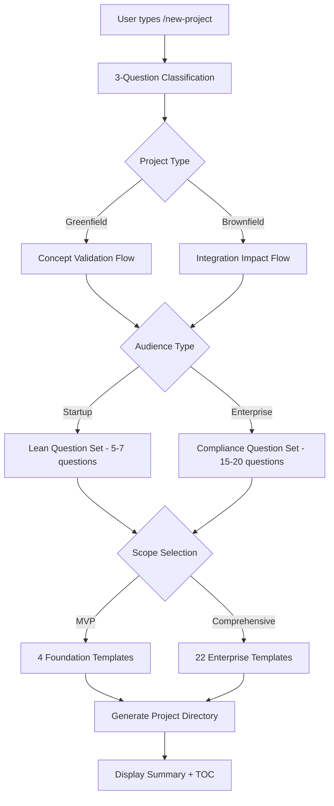

# 📋 Product Requirements Document (PRD)

**Metadata**
- Last Updated: 2025-09-18
- Maintainer: AI-Dev Toolkit
- Related Docs: 02_adr.md, 03_generate_tasks.md, 04_process_task_list.md

> **🎯 Executive Summary**
> This PRD defines the /new-project intelligent intake command for the vibe-prd repository. This feature transforms our template library into an AI-powered documentation generator that guides users through smart questioning flows, supporting both Claude Code CLI and Cursor IDE platforms to become the #1 trending AI documentation repository on GitHub.

---

## 🚀 1. Product Vision & Problem Statement

### 1.1 One-Liner
**Product Vision:** "An intelligent /new-project command that transforms vibe-prd from a template library into a conversational documentation assistant, reducing project setup time from 15+ minutes to 5 minutes while increasing documentation completeness and driving GitHub algorithm dominance."

### 1.2 Problem Definition
- **Who hurts today:** Developers, product managers, startup founders, and enterprise teams needing comprehensive project documentation
- **Current pain points:**
  - Cognitive overhead: Users don't know what questions to ask themselves
  - Command sprawl: 4+ separate commands create friction
  - Inconsistent documentation depth across different project types
  - No guidance for startup vs enterprise context requirements
- **Why now:**
  - AI documentation tools trending on GitHub (README-AI has 13.6k stars)
  - Anthropic's Claude Code CLI gaining widespread adoption
  - Enterprise demand for automated compliance documentation
  - Market gap for intelligent questioning + comprehensive templates
- **Cost of inaction:**
  - Continued user friction reduces adoption and GitHub ranking
  - Competitors gaining market share in AI documentation space
  - Missing revenue opportunity in enterprise documentation automation

**Problem Validation:**
- [x] User pain points identified through direct feedback during development session
- [x] Competitive analysis completed showing market gap
- [x] Technical feasibility validated through existing template system
- [x] Platform compatibility confirmed for Claude CLI + Cursor IDE

---

## 🎯 2. Objectives & Key Results (OKRs)

### 2.1 Primary Objective
**Objective:** Establish vibe-prd as the #1 trending AI documentation generator on GitHub through intelligent user experience and comprehensive enterprise-grade templates.

### 2.2 Key Results (KRs)
| KR | Metric | Current Baseline | Target | Timeline | Owner |
|----|--------|------------------|--------|----------|-------|
| KR1 | GitHub Stars | 50 stars | 1000+ stars | 4 weeks | SEO-Content-Writer |
| KR2 | User Completion Rate | N/A (new feature) | >90% successful doc generation | 2 weeks | Python Pro |
| KR3 | Time to First Success | 15+ minutes | <5 minutes (MVP tier) | 2 weeks | JavaScript Pro |
| KR4 | Platform Adoption | CLI only | 60% CLI, 40% Cursor IDE | 3 weeks | Documentation Architect |
| KR5 | Enterprise Inquiries | 0 enterprise users | 10+ enterprise evaluations | 4 weeks | Frontend Developer |

### 2.3 Success Criteria
- **MVP Success:** /new-project command functional on both platforms with 90%+ completion rate
- **Product-Market Fit:** 1000+ GitHub stars, 70%+ user retention, 5+ enterprise trials
- **Scale Success:** Top 3 trending in AI documentation space, revenue model validated

---

## 🏗 3. Product Architecture & User Flow

### 3.1 Core User Journey

### 3.2 Platform-Specific Implementation
**Claude Code CLI Flow:**
- Conversational questioning with real-time adaptation
- Terminal-based interaction with GUI access instructions
- Natural language project description processing

**Cursor IDE Flow:**
- Structured prompt framework with form-like presentation
- IDE-integrated file generation and explorer view
- Chat panel interaction with @-command system

### 3.3 Tiered Template System
**MVP Tier (4 docs, 3-5 minutes):**
- Product Requirements Document
- User Stories (Essential)
- Task Breakdown (Sprint-ready)
- Success Metrics (Key validation)

**Standard Tier (12 docs, 8-12 minutes):**
- Business foundation (PRD, market research, personas)
- Technical planning (ADR, architecture, tasks)
- Quality & risk (risk register, test plan, release plan)
- User experience (user stories, acceptance criteria)

**Enterprise Tier (22 docs, 15-20 minutes):**
- Complete professional template suite
- Compliance and audit documentation
- Enterprise risk management
- Comprehensive quality assurance

---

## 👥 4. Target Users & Personas

### 4.1 Primary User Segments

#### **Persona 1: "Speed-to-Market Founder" (Greenfield MVP)**
- **Background:** Non-technical founder with validated business idea
- **Goals:** Create investor-ready documentation, validate product-market fit
- **Pain Points:** Doesn't know what investors will ask, limited time for documentation
- **Use Case:** Uses MVP tier to generate lean business documentation in <5 minutes
- **Success Metric:** Complete PRD + business validation docs ready for investor meetings

#### **Persona 2: "Technical Product Manager" (Brownfield Standard)**
- **Background:** PM at established company launching new features
- **Goals:** Coordinate engineering teams, ensure stakeholder alignment
- **Pain Points:** Balancing documentation depth with delivery velocity
- **Use Case:** Uses Standard tier for feature documentation with technical requirements
- **Success Metric:** Engineering team has clear technical direction and implementation plan

#### **Persona 3: "Enterprise Compliance Officer" (Enterprise Comprehensive)**
- **Background:** Product lead at regulated company (healthcare, finance)
- **Goals:** Ensure audit-ready documentation for regulatory compliance
- **Pain Points:** Missing compliance requirements leads to failed audits
- **Use Case:** Uses Enterprise tier for complete compliance documentation
- **Success Metric:** Documentation passes SOX/HIPAA/GDPR compliance review

### 4.2 User Journey Mapping
**Discovery → Evaluation → Onboarding → Usage → Advocacy**
- **Discovery:** GitHub search, social media, word-of-mouth
- **Evaluation:** README.md quick start, live demo on GitHub Pages
- **Onboarding:** 30-second setup via QUICK_START.md
- **Usage:** /new-project command with guided questioning
- **Advocacy:** Social sharing, team invitations, testimonials

---

## 🚀 5. Feature Requirements

### 5.1 Core Features (P0 - Must Have)

#### **F001: Intelligent Project Classification**
- **Description:** 3-question intake system determining optimal documentation approach
- **User Story:** "As a user, I want to answer 3 simple questions so the system can recommend the right documentation depth for my project type"
- **Acceptance Criteria:**
  - [x] Detects Greenfield vs Brownfield project context
  - [x] Identifies target audience (Startup/Business/Enterprise)
  - [x] Allows scope selection (4 foundation vs 22 comprehensive docs)
- **Priority:** P0 (Blocker)

#### **F002: Adaptive Question Flows**
- **Description:** Smart questioning that adapts based on project classification and user responses
- **User Story:** "As a user, I want the system to ask me relevant questions based on my project type so I don't waste time on irrelevant documentation"
- **Acceptance Criteria:**
  - [x] Greenfield flows focus on concept validation and market research
  - [x] Brownfield flows focus on integration and user impact analysis
  - [x] Enterprise flows include compliance and regulatory considerations
  - [x] AI determines when additional clarification is needed
- **Priority:** P0 (Blocker)

#### **F003: Dual Platform Support**
- **Description:** Native support for both Claude Code CLI and Cursor IDE workflows
- **User Story:** "As a developer, I want to use my preferred AI coding environment so the tool fits my existing workflow"
- **Acceptance Criteria:**
  - [x] Claude CLI command at /home/jeremy/.claude/commands/new-project.md
  - [x] Cursor IDE integration via .cursorrules/new-project.mdc
  - [x] Identical output quality across both platforms
  - [x] GUI-to-CLI access instructions for non-terminal users
- **Priority:** P0 (Blocker)

#### **F004: Automated Project Structure Creation**
- **Description:** Generate complete project directories with populated templates and navigation
- **User Story:** "As a user, I want a complete project folder created automatically so I have professional documentation ready to share"
- **Acceptance Criteria:**
  - [x] Creates project directory at user-specified location
  - [x] Generates selected templates with {{DATE}} replacement
  - [x] Includes proper metadata and cross-references between documents
  - [x] Creates index.md with project summary and table of contents
- **Priority:** P0 (Blocker)

### 5.2 Enhanced Features (P1 - Should Have)

#### **F005: GitHub Algorithm Optimization**
- **Description:** Repository enhancements to maximize GitHub discoverability and trending potential
- **Acceptance Criteria:**
  - [x] SEO-optimized repository description with trending keywords
  - [x] Comprehensive GitHub topics for search optimization
  - [x] Essential files (SECURITY.md, CODE_OF_CONDUCT.md, CHANGELOG.md)
  - [x] GitHub Pages site with live demo and documentation browser
- **Priority:** P1 (Important)

#### **F006: Export and Integration Capabilities**
- **Description:** Export generated documentation to popular formats and integrate with third-party tools
- **Acceptance Criteria:**
  - [x] PDF compilation for professional presentation
  - [x] Confluence integration for team wikis
  - [x] Slack bot notifications for team updates
  - [x] GitHub Actions integration for automated documentation
- **Priority:** P1 (Important)

### 5.3 Advanced Features (P2 - Could Have)

#### **F007: Template Marketplace**
- **Description:** Community-driven template contributions and industry-specific variants
- **Acceptance Criteria:**
  - [ ] User template submission system
  - [ ] Industry-specific template collections
  - [ ] Rating and review system for templates
  - [ ] Template customization capabilities
- **Priority:** P2 (Nice to Have)

#### **F008: Analytics and Insights Dashboard**
- **Description:** Usage analytics and documentation quality insights
- **Acceptance Criteria:**
  - [ ] User engagement metrics tracking
  - [ ] Documentation completeness scoring
  - [ ] Template popularity analytics
  - [ ] Performance optimization recommendations
- **Priority:** P2 (Nice to Have)

---

## 📊 6. Success Metrics & KPIs

### 6.1 User Experience Metrics
- **Time to First Success:** <5 minutes for MVP tier, <15 minutes for Enterprise tier
- **Task Completion Rate:** >90% successful documentation generation
- **User Satisfaction Score:** >4.5/5 rating for guided experience
- **Error Rate:** <1% failed generations due to system issues
- **Platform Distribution:** Target 60% Claude CLI, 40% Cursor IDE adoption

### 6.2 Business Impact Metrics
- **Repository Growth:** 1000+ GitHub stars within 4 weeks
- **Community Engagement:** >20% fork-to-star ratio, <24hr issue response time
- **Enterprise Adoption:** 10+ enterprise evaluations, 3+ paying customers
- **Market Position:** Top 3 trending in AI documentation category
- **Revenue Validation:** Freemium model conversion rate >5%

### 6.3 Technical Performance Metrics
- **Command Response Time:** <2 seconds per question interaction
- **Template Generation Speed:** <30 seconds for 22 comprehensive documents
- **System Availability:** 99.9% uptime for command execution
- **Cross-platform Consistency:** 100% identical output across Claude CLI and Cursor IDE

---

## ⚠️ 7. Risks & Mitigation Strategies

### 7.1 Technical Risks

#### **R001: Question Flow Complexity Management**
- **Risk:** Adaptive questioning logic becomes too complex to maintain
- **Impact:** High - Could break user experience and development velocity
- **Probability:** Medium
- **Mitigation:**
  - Start with simple branching logic, iterate based on user feedback
  - Implement comprehensive testing for all question flow paths
  - Create clear documentation for question flow maintenance
- **Owner:** Python Pro Agent

#### **R002: Cross-platform Consistency Issues**
- **Risk:** Claude CLI and Cursor IDE implementations produce different outputs
- **Impact:** High - Undermines user trust and platform credibility
- **Probability:** Medium
- **Mitigation:**
  - Implement shared template generation logic
  - Create automated cross-platform testing suite
  - Establish quality gates for output consistency
- **Owner:** DevOps Troubleshooter Agent

### 7.2 Market Risks

#### **R003: Competitive Response**
- **Risk:** Major players (GitHub, Notion, Confluence) launch similar features
- **Impact:** High - Could commoditize our unique value proposition
- **Probability:** Medium
- **Mitigation:**
  - Focus on speed of execution and first-mover advantage
  - Build strong community and network effects
  - Establish partnerships with Anthropic and Cursor
- **Owner:** SEO-Content-Writer Agent

#### **R004: GitHub Algorithm Changes**
- **Risk:** GitHub changes trending algorithm, reducing our discoverability
- **Impact:** Medium - Could impact organic growth and user acquisition
- **Probability:** Low
- **Mitigation:**
  - Diversify traffic sources (direct, social media, partnerships)
  - Build genuine community engagement beyond algorithm optimization
  - Create valuable content that drives organic sharing
- **Owner:** Frontend Developer Agent

### 7.3 User Experience Risks

#### **R005: Question Fatigue**
- **Risk:** Users abandon flow due to too many questions or complexity
- **Impact:** High - Defeats primary goal of simplifying documentation creation
- **Probability:** Medium
- **Mitigation:**
  - Limit MVP tier to 5-7 questions maximum
  - Implement progress indicators and estimated completion time
  - Allow users to skip questions with reasonable defaults
- **Owner:** JavaScript Pro Agent

---

## 🚀 8. Go-to-Market Strategy

### 8.1 Launch Sequence

#### **Phase 1: Soft Launch (Week 1-2)**
- **Target:** Existing vibe-prd users and early adopters
- **Channels:** GitHub repository updates, existing user notifications
- **Goal:** Validate core functionality and gather initial feedback

#### **Phase 2: Community Launch (Week 3)**
- **Target:** AI development community, Claude Code users
- **Channels:** Reddit (r/ClaudeAI, r/programming), Twitter, Discord communities
- **Goal:** Build community momentum and social proof

#### **Phase 3: Viral Push (Week 4)**
- **Target:** Broader developer and product management community
- **Channels:** Product Hunt launch, tech blogs, influencer outreach
- **Goal:** Achieve trending status and mainstream adoption

### 8.2 Content Marketing Strategy
- **Technical Blog Posts:** "Building an AI Documentation Assistant", "The Future of Product Requirements"
- **Tutorial Content:** YouTube videos, documentation examples, case studies
- **Community Engagement:** Reddit AMAs, Discord workshops, conference presentations
- **Partnership Content:** Anthropic collaboration, Cursor IDE integration stories

### 8.3 Pricing Strategy
- **Free Tier:** MVP templates, basic Claude CLI access, community support
- **Pro Tier ($19/month):** All templates, priority support, export capabilities, Cursor IDE access
- **Enterprise Tier ($99/month):** Custom templates, team features, compliance documentation, SLA support
- **API Access:** Developer tier ($0.10/generation), Enterprise API ($500/month unlimited)

---

## 📅 9. Development Timeline

### 9.1 Sprint Planning (4 weeks total)

#### **Sprint 1: Foundation (Week 1)**
- Repository optimization and GitHub file creation
- README.md overhaul with SEO optimization
- Essential documentation and user guides
- GitHub Actions setup and automation

#### **Sprint 2: Core Feature (Week 2)**
- /new-project command implementation (both platforms)
- Tiered template system development
- Intelligent questioning engine
- Cross-platform testing and validation

#### **Sprint 3: Advanced Features (Week 3)**
- Export capabilities and integrations
- GitHub Pages site with live demo
- Analytics and metrics collection
- Performance optimization

#### **Sprint 4: Community & Growth (Week 4)**
- Template marketplace and community features
- Viral growth mechanisms
- Partnership integrations
- Launch campaign execution

### 9.2 Resource Allocation
- **6 Specialized Agents:** Each focused on specific technical domains
- **Daily Coordination:** 15-minute standups for dependency management
- **Quality Gates:** Weekly reviews and validation checkpoints
- **Risk Management:** Continuous monitoring and mitigation strategies

---

## 📋 10. Success Validation Plan

### 10.1 MVP Validation Criteria
- [ ] /new-project command successfully generates documentation on both platforms
- [ ] >90% user completion rate for MVP tier (4 documents)
- [ ] <5 minute average time from command to completed documentation
- [ ] User satisfaction score >4.0/5 based on initial feedback

### 10.2 Product-Market Fit Indicators
- [ ] 1000+ GitHub stars achieved within 4 weeks
- [ ] 70%+ user retention (return usage within 30 days)
- [ ] 10+ enterprise trial requests or inquiries
- [ ] Top 5 ranking in "AI documentation" search results

### 10.3 Scale Validation Metrics
- [ ] Featured in Anthropic's Claude Code marketplace
- [ ] Integration partnership with Cursor IDE established
- [ ] Revenue model validated with >5% freemium conversion
- [ ] Community contributions (user-generated templates, PRs)

---

**This PRD serves as the single source of truth for the /new-project feature development, ensuring all stakeholders align on vision, requirements, and success criteria for achieving #1 trending repository status in the AI documentation space.**