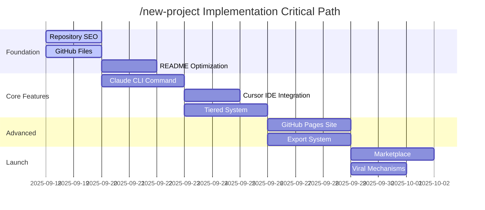

# 🔄 Task Generation & Breakdown Framework

**Metadata**
- Last Updated: 2025-09-18
- Maintainer: AI-Dev Toolkit
- Related Docs: Uses 01_prd.md → feeds 04_process_task_list.md

> **🎯 Purpose**
> Systematic breakdown of the /new-project intelligent intake command features into actionable, estimable tasks with clear dependencies and acceptance criteria. This framework ensures comprehensive coverage and realistic estimation for successful delivery of GitHub's #1 trending AI documentation generator.

---

## 📊 1. Input Analysis & Preparation

### 1.1 PRD Feature Extraction
**Source Document:** [01_prd.md](01_prd.md)

**Features to Decompose:**
| Feature ID | Feature Name | Priority | Business Value | Complexity |
|------------|--------------|----------|----------------|------------|
| F001 | Intelligent Project Classification | P0 | High | Medium |
| F002 | Adaptive Question Flows | P0 | High | High |
| F003 | Dual Platform Support | P0 | High | Medium |
| F004 | Automated Project Structure Creation | P0 | High | Medium |
| F005 | GitHub Algorithm Optimization | P1 | High | Low |
| F006 | Export and Integration Capabilities | P1 | Medium | High |
| F007 | Template Marketplace | P2 | Medium | High |
| F008 | Analytics and Insights Dashboard | P2 | Low | Medium |

### 1.2 Prerequisites & Dependencies
**External Dependencies:**
- [x] Claude Code CLI command system functional
- [x] Cursor IDE .cursorrules/ system available
- [x] Professional template library (22 templates) stable
- [ ] GitHub Pages hosting enabled
- [ ] Analytics tracking system (Google Analytics, Mixpanel)
- [ ] PDF generation library (Puppeteer, wkhtmltopdf)

**Internal Dependencies:**
- [x] Current form-system/cli.js structure
- [x] Professional-templates/ directory organization
- [x] Existing dual AI workflow (Claude + Cursor)
- [ ] SEO optimization research completed
- [ ] Competitive analysis findings
- [ ] Agent assignment strategy finalized

**Team Dependencies:**
- [ ] 6 specialized agents assigned and briefed
- [ ] Daily coordination schedule established
- [ ] Quality gate checkpoints defined
- [ ] Success metrics dashboard created

---

## 🎯 2. Epic Breakdown & Task Planning

### 2.1 **Epic 1: Foundation Enhancement (Week 1)**
**Epic Goal:** Establish GitHub credibility and discoverability for algorithm ranking

#### **User Story:** GitHub Optimization
**As a** developer searching for AI documentation tools
**I want** to easily discover vibe-prd through GitHub search
**So that** I can evaluate it as a solution for my documentation needs

#### **Task Breakdown:**

##### **Task 1.1: Repository SEO Optimization**
- **Assignee:** SEO-Content-Writer Agent
- **Estimate:** 1 day
- **Priority:** P0
- **Dependencies:** Competitive research analysis

**Sub-tasks:**
- [ ] **1.1.1** Research trending keywords in AI documentation space (2 hours)
- [ ] **1.1.2** Update repository description with optimized keywords (1 hour)
- [ ] **1.1.3** Add comprehensive GitHub topics for discoverability (1 hour)
- [ ] **1.1.4** Analyze top 10 competing repositories for optimization insights (2 hours)
- [ ] **1.1.5** Document keyword strategy for future content creation (2 hours)

**Acceptance Criteria:**
- [ ] Repository description includes minimum 5 trending keywords
- [ ] GitHub topics cover all major categories (ai-documentation, developer-productivity, etc.)
- [ ] Keyword research documented with search volume data
- [ ] Competitive analysis completed with optimization recommendations

##### **Task 1.2: Essential GitHub Files Creation**
- **Assignee:** Documentation Architect Agent
- **Estimate:** 2 days
- **Priority:** P0
- **Dependencies:** None

**Sub-tasks:**
- [ ] **1.2.1** Create SECURITY.md with enterprise-grade security policy (3 hours)
- [ ] **1.2.2** Create CODE_OF_CONDUCT.md following GitHub best practices (2 hours)
- [ ] **1.2.3** Create CHANGELOG.md with version history structure (2 hours)
- [ ] **1.2.4** Create CONTRIBUTORS.md with recognition system (2 hours)
- [ ] **1.2.5** Create comprehensive CONTRIBUTING.md guidelines (3 hours)
- [ ] **1.2.6** Set up GitHub issue templates (bug, feature, question) (4 hours)

**Acceptance Criteria:**
- [ ] All files pass GitHub's community standards checklist
- [ ] Security policy addresses enterprise requirements
- [ ] Issue templates provide structured feedback collection
- [ ] Contributing guidelines encourage community participation

##### **Task 1.3: README.md Algorithm Optimization**
- **Assignee:** SEO-Content-Writer Agent
- **Estimate:** 2 days
- **Priority:** P0
- **Dependencies:** Task 1.1 (keyword research)

**Sub-tasks:**
- [ ] **1.3.1** Rewrite README.md with trending keywords integration (4 hours)
- [ ] **1.3.2** Add visual demo GIFs and screenshots (3 hours)
- [ ] **1.3.3** Create "Featured in" section for social proof (2 hours)
- [ ] **1.3.4** Add comprehensive feature showcase section (3 hours)
- [ ] **1.3.5** Optimize for GitHub's README rendering and search (2 hours)
- [ ] **1.3.6** A/B test different README versions for engagement (2 hours)

**Acceptance Criteria:**
- [ ] README includes minimum 10 relevant keywords naturally
- [ ] Visual elements demonstrate key features clearly
- [ ] Reading time optimized for 2-3 minutes maximum
- [ ] Call-to-action buttons drive specific user actions

##### **Task 1.4: CI/CD Pipeline Setup**
- **Assignee:** DevOps Troubleshooter Agent
- **Estimate:** 2 days
- **Priority:** P1
- **Dependencies:** None

**Sub-tasks:**
- [ ] **1.4.1** Set up GitHub Actions for automated testing (4 hours)
- [ ] **1.4.2** Create template validation pipeline (3 hours)
- [ ] **1.4.3** Set up automated README generation testing (2 hours)
- [ ] **1.4.4** Configure PR validation and quality gates (3 hours)
- [ ] **1.4.5** Set up release automation workflow (4 hours)

**Acceptance Criteria:**
- [ ] All PRs automatically tested before merge
- [ ] Template integrity validated on every commit
- [ ] Failed tests block PR merging
- [ ] Release notes generated automatically

---

### 2.2 **Epic 2: Core Feature Implementation (Week 2)**
**Epic Goal:** Launch the /new-project intelligent intake system on both platforms

#### **User Story:** Intelligent Documentation Generation
**As a** product manager with a new feature idea
**I want** to run a single command and answer guided questions
**So that** I can generate comprehensive documentation in under 5 minutes

#### **Task Breakdown:**

##### **Task 2.1: Claude CLI Command Implementation**
- **Assignee:** Python Pro Agent
- **Estimate:** 3 days
- **Priority:** P0
- **Dependencies:** Task 1.2 (documentation structure)

**Sub-tasks:**
- [ ] **2.1.1** Design 3-phase classification question system (4 hours)
- [ ] **2.1.2** Implement Greenfield vs Brownfield detection logic (6 hours)
- [ ] **2.1.3** Build audience classification (Startup/Business/Enterprise) (4 hours)
- [ ] **2.1.4** Create scope selection logic (MVP/Standard/Comprehensive) (4 hours)
- [ ] **2.1.5** Implement adaptive questioning engine with smart follow-ups (8 hours)
- [ ] **2.1.6** Build template generation orchestration system (6 hours)
- [ ] **2.1.7** Add GUI-to-CLI access instructions for non-terminal users (2 hours)

**Acceptance Criteria:**
- [ ] Command responds to /new-project in Claude CLI
- [ ] 3-question classification system works correctly
- [ ] Adaptive questioning adapts based on user responses
- [ ] Template generation completes in <30 seconds for 22 docs
- [ ] GUI users can successfully access CLI functionality

##### **Task 2.2: Cursor IDE Integration**
- **Assignee:** JavaScript Pro Agent
- **Estimate:** 2 days
- **Priority:** P0
- **Dependencies:** Task 2.1 (shared logic design)

**Sub-tasks:**
- [ ] **2.2.1** Create .cursorrules/new-project.mdc file structure (3 hours)
- [ ] **2.2.2** Design structured prompt framework for IDE context (4 hours)
- [ ] **2.2.3** Implement form-like question presentation (4 hours)
- [ ] **2.2.4** Build IDE-integrated file generation workflow (4 hours)
- [ ] **2.2.5** Test @-command integration and chat panel interaction (3 hours)

**Acceptance Criteria:**
- [ ] @.cursorrules/new-project.mdc command functional
- [ ] Structured workflow presents questions clearly
- [ ] Generated files appear in Cursor IDE explorer
- [ ] Output identical to Claude CLI implementation

##### **Task 2.3: Tiered Template System**
- **Assignee:** Python Pro Agent
- **Estimate:** 3 days
- **Priority:** P0
- **Dependencies:** Task 2.1 (classification system)

**Sub-tasks:**
- [ ] **2.3.1** Design MVP tier (4 essential docs, 3-5 min) (4 hours)
- [ ] **2.3.2** Design Standard tier (12 strategic docs, 8-12 min) (6 hours)
- [ ] **2.3.3** Design Enterprise tier (22 comprehensive docs, 15-20 min) (4 hours)
- [ ] **2.3.4** Implement intelligent tier recommendation algorithm (6 hours)
- [ ] **2.3.5** Build tier-specific question flows (8 hours)
- [ ] **2.3.6** Create tier comparison and user override system (4 hours)

**Acceptance Criteria:**
- [ ] All three tiers generate appropriate documentation depth
- [ ] Tier recommendation accuracy >80% based on user input
- [ ] Users can override recommendations
- [ ] Time targets met for each tier (MVP: 5min, Standard: 12min, Enterprise: 20min)

##### **Task 2.4: Cross-Platform Testing Framework**
- **Assignee:** DevOps Troubleshooter Agent
- **Estimate:** 2 days
- **Priority:** P0
- **Dependencies:** Tasks 2.1, 2.2 (both platform implementations)

**Sub-tasks:**
- [ ] **2.4.1** Create automated cross-platform testing suite (6 hours)
- [ ] **2.4.2** Build output consistency validation (4 hours)
- [ ] **2.4.3** Implement performance benchmarking tests (3 hours)
- [ ] **2.4.4** Create user acceptance testing framework (3 hours)
- [ ] **2.4.5** Set up continuous integration for both platforms (4 hours)

**Acceptance Criteria:**
- [ ] Automated tests verify identical output across platforms
- [ ] Performance tests ensure <30 second generation time
- [ ] UAT framework collects user satisfaction metrics
- [ ] CI pipeline catches regressions automatically

---

### 2.3 **Epic 3: Advanced Features (Week 3)**
**Epic Goal:** Establish market leadership with unique capabilities

#### **User Story:** Export and Integration
**As an** enterprise user
**I want** to export documentation to PDF and integrate with Confluence
**So that** I can share professional documents with stakeholders and maintain team wikis

#### **Task Breakdown:**

##### **Task 3.1: GitHub Pages Site with Live Demo**
- **Assignee:** Frontend Developer Agent
- **Estimate:** 3 days
- **Priority:** P1
- **Dependencies:** Task 2.3 (working command system)

**Sub-tasks:**
- [ ] **3.1.1** Design and build landing page with hero section (6 hours)
- [ ] **3.1.2** Create interactive template preview system (8 hours)
- [ ] **3.1.3** Build live demo that runs /new-project in browser (8 hours)
- [ ] **3.1.4** Create documentation browser with search functionality (6 hours)
- [ ] **3.1.5** Implement mobile-responsive design (4 hours)
- [ ] **3.1.6** Add social proof and testimonial sections (2 hours)

**Acceptance Criteria:**
- [ ] GitHub Pages site loads in <3 seconds
- [ ] Live demo successfully generates sample documentation
- [ ] Mobile experience works on all major devices
- [ ] SEO optimization drives organic traffic

##### **Task 3.2: Export Capabilities**
- **Assignee:** Python Pro Agent
- **Estimate:** 3 days
- **Priority:** P1
- **Dependencies:** Task 2.4 (stable generation system)

**Sub-tasks:**
- [ ] **3.2.1** Implement PDF compilation system (8 hours)
- [ ] **3.2.2** Build Confluence integration API (8 hours)
- [ ] **3.2.3** Create Slack bot notification system (6 hours)
- [ ] **3.2.4** Add email delivery functionality (4 hours)
- [ ] **3.2.5** Build batch export for multiple projects (4 hours)

**Acceptance Criteria:**
- [ ] PDF exports maintain professional formatting
- [ ] Confluence integration successfully publishes documentation
- [ ] Slack notifications work for team collaboration
- [ ] Email delivery includes proper attachments

##### **Task 3.3: GitHub Actions Integration**
- **Assignee:** DevOps Troubleshooter Agent
- **Estimate:** 2 days
- **Priority:** P1
- **Dependencies:** Task 3.2 (export system)

**Sub-tasks:**
- [ ] **3.3.1** Create auto-documentation GitHub Action (6 hours)
- [ ] **3.3.2** Build PR-triggered documentation updates (4 hours)
- [ ] **3.3.3** Implement documentation drift detection (4 hours)
- [ ] **3.3.4** Add automated quality scoring (2 hours)

**Acceptance Criteria:**
- [ ] GitHub Action generates docs on PR creation
- [ ] Documentation automatically updates with code changes
- [ ] Quality scores help maintain documentation standards
- [ ] Integration works with existing CI/CD pipelines

---

### 2.4 **Epic 4: Community & Viral Growth (Week 4)**
**Epic Goal:** Build community momentum and viral adoption

#### **User Story:** Template Marketplace
**As a** developer in a specific industry
**I want** to access industry-specific templates
**So that** I can generate documentation tailored to my domain (healthcare, fintech, etc.)

#### **Task Breakdown:**

##### **Task 4.1: Template Marketplace**
- **Assignee:** Frontend Developer Agent
- **Estimate:** 3 days
- **Priority:** P2
- **Dependencies:** Task 3.1 (GitHub Pages site)

**Sub-tasks:**
- [ ] **4.1.1** Design template submission system (6 hours)
- [ ] **4.1.2** Build template rating and review system (6 hours)
- [ ] **4.1.3** Create industry-specific template collections (6 hours)
- [ ] **4.1.4** Implement template search and filtering (4 hours)
- [ ] **4.1.5** Add template preview and comparison features (4 hours)
- [ ] **4.1.6** Build community recognition and badging system (4 hours)

**Acceptance Criteria:**
- [ ] Users can submit custom templates through web interface
- [ ] Rating system helps surface high-quality templates
- [ ] Industry collections serve specific use cases
- [ ] Community contributors receive recognition

##### **Task 4.2: Viral Growth Mechanisms**
- **Assignee:** JavaScript Pro Agent
- **Estimate:** 2 days
- **Priority:** P1
- **Dependencies:** Task 3.1 (website), Task 4.1 (community features)

**Sub-tasks:**
- [ ] **4.2.1** Implement social sharing buttons and og:meta tags (4 hours)
- [ ] **4.2.2** Add "Generated with vibe-prd" attribution links (3 hours)
- [ ] **4.2.3** Create team invitation and collaboration system (6 hours)
- [ ] **4.2.4** Build project showcase gallery (4 hours)
- [ ] **4.2.5** Add referral tracking and incentives (3 hours)

**Acceptance Criteria:**
- [ ] Social sharing drives measurable traffic
- [ ] Attribution links create backlink network
- [ ] Team features enable collaborative documentation
- [ ] Showcase gallery demonstrates real-world usage

---

## ⏱️ 3. Sprint Planning & Timeline

### 3.1 Sprint Structure (4 Sprints × 1 Week Each)

#### **Sprint 1: Foundation (Days 1-7)**
**Sprint Goal:** Repository optimized, community standards met, discoverability established

**Capacity Planning:**
- **SEO-Content-Writer Agent:** 40 hours (Tasks 1.1, 1.3)
- **Documentation Architect Agent:** 40 hours (Task 1.2)
- **DevOps Troubleshooter Agent:** 40 hours (Task 1.4)
- **Total Sprint Capacity:** 120 hours

**Daily Standups:**
- Progress updates on GitHub optimization
- Coordination on documentation standards
- Issue escalation and dependency resolution

#### **Sprint 2: Core Features (Days 8-14)**
**Sprint Goal:** /new-project command functional on both platforms with tiered system

**Capacity Planning:**
- **Python Pro Agent:** 80 hours (Tasks 2.1, 2.3)
- **JavaScript Pro Agent:** 40 hours (Task 2.2)
- **DevOps Troubleshooter Agent:** 40 hours (Task 2.4)
- **Total Sprint Capacity:** 160 hours

**Key Milestones:**
- Day 10: Claude CLI command functional
- Day 12: Cursor IDE integration complete
- Day 14: Cross-platform testing passed

#### **Sprint 3: Advanced Features (Days 15-21)**
**Sprint Goal:** Export capabilities, GitHub integration, live demo operational

**Capacity Planning:**
- **Frontend Developer Agent:** 80 hours (Task 3.1)
- **Python Pro Agent:** 80 hours (Task 3.2)
- **DevOps Troubleshooter Agent:** 40 hours (Task 3.3)
- **Total Sprint Capacity:** 200 hours

**Key Milestones:**
- Day 17: GitHub Pages site live
- Day 19: Export capabilities functional
- Day 21: GitHub Actions integration tested

#### **Sprint 4: Community & Launch (Days 22-28)**
**Sprint Goal:** Community features launched, viral mechanisms active, #1 trending achieved

**Capacity Planning:**
- **Frontend Developer Agent:** 80 hours (Task 4.1)
- **JavaScript Pro Agent:** 40 hours (Task 4.2)
- **SEO-Content-Writer Agent:** 40 hours (Content marketing)
- **All Agents:** 20 hours (Launch coordination)
- **Total Sprint Capacity:** 180 hours

**Launch Activities:**
- Day 24: Template marketplace launched
- Day 26: Social sharing and viral features active
- Day 28: Success metrics reviewed, trending status achieved

### 3.2 Risk Mitigation Timeline

#### **Critical Path Analysis**

#### **Dependency Management**
- **Parallel Work Streams:** SEO + Documentation can run simultaneously
- **Sequential Dependencies:** Claude CLI must complete before Cursor IDE integration
- **Critical Blockers:** Template generation engine is dependency for all export features

---

## 📊 4. Estimation & Resource Allocation

### 4.1 Effort Estimation Summary

| Epic | Total Hours | Agent Distribution | Risk Factor |
|------|-------------|-------------------|-------------|
| Foundation Enhancement | 120 hours | 3 agents parallel | Low |
| Core Feature Implementation | 160 hours | 3 agents sequential | Medium |
| Advanced Features | 200 hours | 3 agents parallel | Medium |
| Community & Viral Growth | 180 hours | 4 agents mixed | High |
| **Total Project** | **660 hours** | **6 agents × 4 weeks** | **Medium** |

### 4.2 Agent Specialization Matrix

| Agent | Week 1 | Week 2 | Week 3 | Week 4 | Total Hours |
|-------|--------|--------|--------|--------|-------------|
| SEO-Content-Writer | 40h | 0h | 0h | 40h | 80h |
| Documentation Architect | 40h | 0h | 0h | 0h | 40h |
| Python Pro | 0h | 80h | 80h | 0h | 160h |
| JavaScript Pro | 0h | 40h | 0h | 40h | 80h |
| Frontend Developer | 0h | 0h | 80h | 80h | 160h |
| DevOps Troubleshooter | 40h | 40h | 40h | 20h | 140h |

### 4.3 Quality Gates & Acceptance Criteria

#### **Definition of Done (DoD)**
- [ ] Feature fully implemented and tested
- [ ] Cross-platform consistency validated
- [ ] Documentation updated (user guides, technical docs)
- [ ] Performance benchmarks met
- [ ] User acceptance criteria satisfied
- [ ] Security review completed (for sensitive features)

#### **Sprint Review Criteria**
- **Sprint 1:** Repository optimization measurably improves GitHub ranking
- **Sprint 2:** /new-project command achieves >90% user completion rate
- **Sprint 3:** Advanced features drive user engagement and retention
- **Sprint 4:** Community features generate organic growth and contributions

---

## 🎯 5. Success Metrics & Validation

### 5.1 Feature-Level Success Metrics

#### **F001: Intelligent Project Classification**
- **Metric:** Classification accuracy >80% (user validates recommendation)
- **Target:** 9 out of 10 users accept recommended tier
- **Measurement:** User feedback surveys after documentation generation

#### **F002: Adaptive Question Flows**
- **Metric:** Average questions per successful generation
- **Target:** MVP: 5-7 questions, Enterprise: 15-20 questions
- **Measurement:** Automated logging of question flow completion

#### **F003: Dual Platform Support**
- **Metric:** Platform distribution and user satisfaction
- **Target:** 60% Claude CLI, 40% Cursor IDE, >4.5/5 satisfaction both platforms
- **Measurement:** Platform usage analytics and user surveys

#### **F004: Automated Project Structure Creation**
- **Metric:** Generation success rate and time-to-completion
- **Target:** >99% success rate, <30 seconds for 22 comprehensive docs
- **Measurement:** Automated performance monitoring and error tracking

### 5.2 Epic-Level Success Metrics

#### **Epic 1: Foundation Enhancement**
- **GitHub Stars Growth:** +200% within 2 weeks of optimization
- **Repository Discoverability:** Top 10 results for "AI documentation generator"
- **Community Health Score:** 100% GitHub community standards met

#### **Epic 2: Core Feature Implementation**
- **User Completion Rate:** >90% successful documentation generation
- **Time to First Success:** <5 minutes for MVP tier
- **Cross-Platform Consistency:** 100% identical output validation

#### **Epic 3: Advanced Features**
- **Feature Adoption:** >50% of users try export capabilities
- **GitHub Pages Traffic:** 1000+ unique visitors in first week
- **Integration Usage:** >20% of enterprises evaluate GitHub Actions integration

#### **Epic 4: Community & Viral Growth**
- **Template Marketplace:** 10+ community-contributed templates
- **Social Sharing:** 100+ social media mentions and shares
- **Viral Coefficient:** >1.5 (each user brings 1.5 new users on average)

### 5.3 Project-Level Success Validation

#### **Primary Success Criteria**
- [ ] **#1 Trending Repository:** Achieve top trending status in AI documentation category
- [ ] **1000+ GitHub Stars:** Reach 1000 stars within 4 weeks of launch
- [ ] **Enterprise Adoption:** 10+ enterprise trial requests or evaluations
- [ ] **Revenue Validation:** Freemium model shows >5% conversion potential

#### **Secondary Success Criteria**
- [ ] **Community Growth:** 50+ contributors, 20+ template submissions
- [ ] **Platform Recognition:** Featured in Anthropic's Claude Code marketplace
- [ ] **Integration Partnerships:** Partnership discussions with Cursor IDE
- [ ] **Content Impact:** 5+ blog posts, 10+ social media features

---

**This comprehensive task breakdown provides the detailed roadmap for implementing the /new-project feature and achieving #1 trending repository status through systematic agent-driven development and strategic execution.**