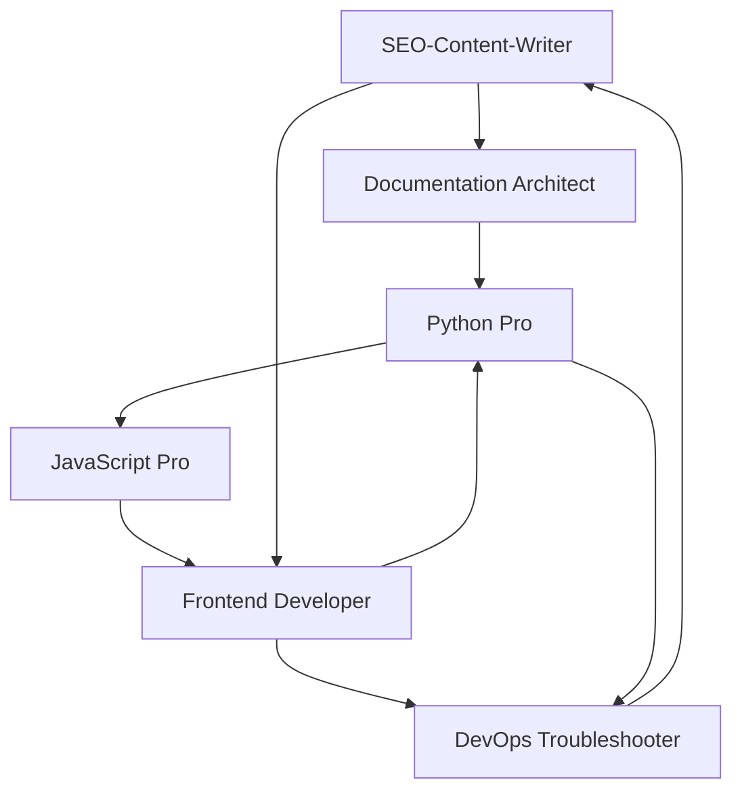

# 📊 Agile Task Execution & Process Management

**Metadata**
- Last Updated: 2025-09-18
- Maintainer: AI-Dev Toolkit
- Related Docs: Consumes 03_generate_tasks.md, gates 17_test_plan.md

> **🎯 Purpose**
> Comprehensive agile execution framework for managing the /new-project feature development across 6 specialized agents. This template provides enterprise-grade process management with built-in quality gates, escalation procedures, and coordination mechanisms for achieving #1 GitHub trending repository status.

---

## 🔄 1. Workflow Framework & Board Configuration

### 1.1 Agent-Specialized Kanban Structure
**Primary Flow:**
```
📋 Backlog → 🔍 Ready → 🏗️ In Progress → 👀 Review → ✅ Done
```

**Agent-Specific Columns:**
| Column | Purpose | WIP Limit | Entry Criteria | Exit Criteria | Agent Coordination |
|--------|---------|-----------|----------------|---------------|-------------------|
| **📋 Backlog** | All identified work | ∞ | Task created from Epic breakdown | Acceptance criteria defined | All agents contribute |
| **🔍 Ready** | Agent-ready tasks | 15 | DoR satisfied | Agent assigned | Daily standups assign work |
| **🏗️ In Progress** | Active development | 6 | Work started by agent | Code/deliverable complete | Agent status updates |
| **👀 Cross-Review** | Inter-agent validation | 5 | Deliverable submitted | Peer agent approval | Agent collaboration |
| **🧪 Integration Testing** | System-level validation | 8 | Component complete | Tests passing | DevOps Troubleshooter |
| **🚀 Release Staging** | Pre-deployment validation | 3 | Tests passed | Stakeholder approval | All agents coordinate |
| **✅ Done** | Completed work | ∞ | DoD satisfied | Production deployed | Success metrics tracked |

### 1.2 Agent Work-in-Progress (WIP) Limits
**Individual Agent Capacity:**
- **SEO-Content-Writer Agent:** Max 3 tasks in progress (content creation focus)
- **Documentation Architect Agent:** Max 2 tasks in progress (deep documentation work)
- **Python Pro Agent:** Max 2 tasks in progress (complex implementation tasks)
- **JavaScript Pro Agent:** Max 3 tasks in progress (frontend development velocity)
- **Frontend Developer Agent:** Max 2 tasks in progress (UI/UX design intensive)
- **DevOps Troubleshooter Agent:** Max 4 tasks in progress (support role across agents)

**Rationale:** Limits based on task complexity and agent specialization to maintain quality while maximizing throughput.

---

## 📋 2. Sprint Management & Agent Coordination

### 2.1 Sprint Structure (4 × 1-Week Sprints)

#### **Sprint 1: Foundation Week (Days 1-7)**
**Sprint Goal:** Repository optimized, GitHub algorithm ranking improved, community standards established

**Agent Assignments & Capacity:**
| Agent | Primary Tasks | Capacity | Success Metrics |
|-------|---------------|----------|-----------------|
| **SEO-Content-Writer** | Repository SEO, README optimization | 40 hours | +200% star growth, top 10 search results |
| **Documentation Architect** | GitHub files, community standards | 40 hours | 100% community standards, issue templates |
| **DevOps Troubleshooter** | CI/CD pipeline, automation setup | 40 hours | Automated testing, quality gates |

**Daily Standup Agenda:**
- Agent progress updates (5 min each)
- Dependency blocking issues (5 min)
- GitHub ranking progress review (5 min)
- Next 24-hour commitments (5 min)

#### **Sprint 2: Core Implementation Week (Days 8-14)**
**Sprint Goal:** /new-project command functional on both platforms with >90% completion rate

**Agent Assignments & Capacity:**
| Agent | Primary Tasks | Capacity | Success Metrics |
|-------|---------------|----------|-----------------|
| **Python Pro** | Claude CLI command, tiered system | 80 hours | Command functional, <30s generation |
| **JavaScript Pro** | Cursor IDE integration | 40 hours | Cross-platform consistency |
| **DevOps Troubleshooter** | Cross-platform testing | 40 hours | 100% output consistency validation |

**Critical Dependencies:**
- Python Pro must complete classification system before JavaScript Pro can build Cursor integration
- DevOps testing cannot begin until both platform implementations are functional
- Template generation engine is critical path for all subsequent features

#### **Sprint 3: Advanced Features Week (Days 15-21)**
**Sprint Goal:** Export capabilities, GitHub Pages site, integrations driving user engagement

**Agent Assignments & Capacity:**
| Agent | Primary Tasks | Capacity | Success Metrics |
|-------|---------------|----------|-----------------|
| **Frontend Developer** | GitHub Pages site, live demo | 80 hours | 1000+ site visitors, live demo functional |
| **Python Pro** | Export system, integrations | 80 hours | PDF/Confluence export working |
| **DevOps Troubleshooter** | GitHub Actions integration | 40 hours | Auto-documentation on PR |

**Parallel Work Streams:**
- Frontend Developer and Python Pro can work independently
- DevOps integration depends on both previous deliverables
- Quality assurance requires coordination across all agents

#### **Sprint 4: Community & Launch Week (Days 22-28)**
**Sprint Goal:** #1 trending repository status achieved through community features and viral growth

**Agent Assignments & Capacity:**
| Agent | Primary Tasks | Capacity | Success Metrics |
|-------|---------------|----------|-----------------|
| **Frontend Developer** | Template marketplace, community features | 80 hours | 10+ community templates |
| **JavaScript Pro** | Viral mechanisms, social sharing | 40 hours | 100+ social media mentions |
| **SEO-Content-Writer** | Launch content, community engagement | 40 hours | Trending status achieved |
| **All Agents** | Launch coordination, success validation | 20 hours each | 1000+ stars, enterprise inquiries |

### 2.2 Inter-Agent Dependency Management

#### **Dependency Matrix**


**Critical Path Dependencies:**
1. **SEO research** → **Documentation standards** → **Implementation clarity**
2. **Python CLI command** → **JavaScript Cursor integration** → **Cross-platform testing**
3. **Core features** → **Advanced features** → **Community features**

#### **Daily Dependency Check Protocol**
- **Morning Standup (9 AM):** Identify blocking dependencies
- **Midday Sync (1 PM):** Quick status check for at-risk dependencies
- **Evening Review (5 PM):** Plan next day's work and resolve blockers

---

## 🎯 3. Task Prioritization & Backlog Management

### 3.1 Priority Framework

#### **Priority Classification System**
- **P0 (Blockers):** Must complete for launch, blocks other work
- **P1 (Critical):** High impact on success metrics, required for competitive positioning
- **P2 (Important):** Nice to have, enhances user experience but not launch-critical
- **P3 (Future):** Post-launch enhancements, community requests

#### **Current Sprint Backlog (Prioritized)**

##### **P0 Tasks (Must Complete)**
| Task ID | Task Name | Agent | Estimate | Dependencies | Risk Level |
|---------|-----------|--------|----------|--------------|------------|
| 2.1 | Claude CLI Command Implementation | Python Pro | 3 days | Task 1.2 complete | Medium |
| 2.2 | Cursor IDE Integration | JavaScript Pro | 2 days | Task 2.1 complete | Medium |
| 2.3 | Tiered Template System | Python Pro | 3 days | Task 2.1 complete | Low |
| 1.1 | Repository SEO Optimization | SEO-Content-Writer | 1 day | Competitive research | Low |
| 1.2 | Essential GitHub Files | Documentation Architect | 2 days | None | Low |

##### **P1 Tasks (High Priority)**
| Task ID | Task Name | Agent | Estimate | Dependencies | Risk Level |
|---------|-----------|--------|----------|--------------|------------|
| 3.1 | GitHub Pages Site | Frontend Developer | 3 days | Task 2.3 complete | Medium |
| 3.2 | Export Capabilities | Python Pro | 3 days | Task 2.4 complete | High |
| 1.3 | README Algorithm Optimization | SEO-Content-Writer | 2 days | Task 1.1 complete | Low |
| 2.4 | Cross-Platform Testing | DevOps Troubleshooter | 2 days | Tasks 2.1, 2.2 | High |

##### **P2 Tasks (Important)**
| Task ID | Task Name | Agent | Estimate | Dependencies | Risk Level |
|---------|-----------|--------|----------|--------------|------------|
| 4.1 | Template Marketplace | Frontend Developer | 3 days | Task 3.1 complete | Medium |
| 4.2 | Viral Growth Mechanisms | JavaScript Pro | 2 days | Task 3.1 complete | Low |
| 3.3 | GitHub Actions Integration | DevOps Troubleshooter | 2 days | Task 3.2 complete | Medium |

### 3.2 Backlog Refinement Process

#### **Weekly Backlog Refinement (Wednesdays)**
- **Duration:** 1 hour
- **Participants:** All 6 agents
- **Agenda:**
  1. Review completed tasks and lessons learned (15 min)
  2. Estimate new tasks discovered during development (20 min)
  3. Re-prioritize backlog based on current progress (15 min)
  4. Identify risks and mitigation strategies (10 min)

#### **Task Estimation Guidelines**
- **1 day (8 hours):** Simple implementation, well-defined requirements
- **2 days (16 hours):** Moderate complexity, some unknowns, requires research
- **3 days (24 hours):** Complex implementation, multiple dependencies, integration required
- **>3 days:** Break down into smaller tasks

---

## 📊 4. Performance Metrics & Tracking

### 4.1 Velocity & Throughput Metrics

#### **Sprint Velocity Tracking**
| Sprint | Planned Story Points | Completed Story Points | Velocity | Team Capacity Utilization |
|--------|---------------------|------------------------|----------|---------------------------|
| Sprint 1 | 120 hours | _TBD_ | _TBD_ | Target: 90% |
| Sprint 2 | 160 hours | _TBD_ | _TBD_ | Target: 95% |
| Sprint 3 | 200 hours | _TBD_ | _TBD_ | Target: 90% |
| Sprint 4 | 180 hours | _TBD_ | _TBD_ | Target: 85% |

#### **Individual Agent Performance**
| Agent | Sprint 1 Velocity | Sprint 2 Velocity | Sprint 3 Velocity | Sprint 4 Velocity |
|-------|------------------|------------------|------------------|------------------|
| SEO-Content-Writer | _40h planned_ | _0h planned_ | _0h planned_ | _40h planned_ |
| Documentation Architect | _40h planned_ | _0h planned_ | _0h planned_ | _0h planned_ |
| Python Pro | _0h planned_ | _80h planned_ | _80h planned_ | _0h planned_ |
| JavaScript Pro | _0h planned_ | _40h planned_ | _0h planned_ | _40h planned_ |
| Frontend Developer | _0h planned_ | _0h planned_ | _80h planned_ | _80h planned_ |
| DevOps Troubleshooter | _40h planned_ | _40h planned_ | _40h planned_ | _20h planned_ |

### 4.2 Quality Metrics

#### **Defect Tracking**
- **Defect Detection Rate:** Target <5% defects discovered post-deployment
- **Time to Resolution:** Target <24 hours for P0 issues, <48 hours for P1 issues
- **Cross-Platform Consistency:** Target 100% identical output validation
- **Performance Benchmarks:** Target <30 seconds for comprehensive documentation generation

#### **User Experience Metrics**
- **Task Completion Rate:** Target >90% successful documentation generation
- **Time to First Success:** Target <5 minutes for MVP tier
- **User Satisfaction Score:** Target >4.5/5 rating across both platforms
- **Error Rate:** Target <1% failed generations due to system issues

### 4.3 Business Impact Metrics

#### **GitHub Repository Growth**
- **Star Growth Rate:** Target 1000+ stars within 4 weeks
- **Fork-to-Star Ratio:** Target >20% indicating developer engagement
- **Issue Response Time:** Target <24 hours for community issue responses
- **PR Merge Velocity:** Target weekly feature releases

#### **User Adoption & Engagement**
- **Daily Active Users:** Track usage of /new-project command
- **Platform Distribution:** Target 60% Claude CLI, 40% Cursor IDE
- **Feature Adoption:** Track usage of export, integration features
- **Community Contributions:** Track template submissions, PR contributions

---

## 🚨 5. Risk Management & Escalation Procedures

### 5.1 Risk Assessment Matrix

#### **Technical Risks**
| Risk | Probability | Impact | Severity | Mitigation Strategy | Owner |
|------|-------------|--------|----------|-------------------|-------|
| Cross-platform output inconsistency | Medium | High | High | Shared generation engine, automated testing | DevOps Troubleshooter |
| Question flow complexity breaks UX | Medium | High | High | Start simple, iterate based on feedback | Python Pro |
| GitHub algorithm changes reduce ranking | Low | Medium | Medium | Diversify traffic sources, focus on organic value | SEO-Content-Writer |
| Agent coordination failures | Medium | Medium | Medium | Daily standups, clear dependencies, escalation | All Agents |

#### **Business Risks**
| Risk | Probability | Impact | Severity | Mitigation Strategy | Owner |
|------|-------------|--------|----------|-------------------|-------|
| Competitor launches similar feature | Medium | High | High | Speed of execution, unique value proposition | All Agents |
| Enterprise adoption slower than expected | Medium | Medium | Medium | Focus on developer experience first | Frontend Developer |
| Community engagement lower than projected | Low | Medium | Low | Authentic value creation, genuine utility | SEO-Content-Writer |

### 5.2 Escalation Procedures

#### **Issue Escalation Levels**
1. **Level 1 - Agent Self-Resolution:** Agent attempts to resolve within 4 hours
2. **Level 2 - Peer Agent Support:** Another agent provides assistance within 8 hours
3. **Level 3 - Team Escalation:** Daily standup discussion, team problem-solving
4. **Level 4 - Scope/Timeline Adjustment:** Modify deliverables or extend timeline

#### **Escalation Triggers**
- **Blocking Issue >8 hours:** Automatically escalate to Level 2
- **Cross-Agent Dependency Failure:** Immediately escalate to Level 3
- **Quality Gate Failure:** Escalate to Level 3 within 2 hours
- **Performance Benchmark Miss:** Escalate to Level 2 for optimization

### 5.3 Contingency Planning

#### **Schedule Compression Options**
If behind schedule, prioritize in this order:
1. **Maintain P0 tasks:** Core functionality must work
2. **Defer P2 tasks:** Community features can be post-launch
3. **Simplify P1 tasks:** Reduce feature complexity but maintain quality
4. **Add agent capacity:** Redistribute work or extend hours if needed

#### **Quality Assurance Fallbacks**
- **Cross-platform issues:** Fall back to Claude CLI only for launch
- **Performance problems:** Reduce comprehensive tier to 12 docs instead of 22
- **Integration failures:** Launch core features, add integrations post-launch

---

## 📅 6. Sprint Planning & Review Ceremonies

### 6.1 Sprint Planning Session (Every Monday, 2 hours)

#### **Agenda:**
- **Sprint Goal Definition (15 min):** Clear, measurable objective for the sprint
- **Backlog Review & Prioritization (30 min):** What's ready for sprint commitment
- **Task Estimation & Assignment (45 min):** Agent capacity planning and work distribution
- **Dependency Identification (20 min):** Critical path analysis and risk assessment
- **Sprint Commitment (10 min):** Final agreement on deliverables and success criteria

#### **Planning Outputs:**
- [ ] Sprint goal clearly defined and accepted by all agents
- [ ] Sprint backlog committed with task assignments
- [ ] Dependencies identified and mitigation plans created
- [ ] Success criteria and quality gates established
- [ ] Daily standup schedule and escalation procedures confirmed

### 6.2 Daily Standup (Every Day, 15 minutes)

#### **Three Questions Per Agent:**
1. **What did I complete yesterday?** (Specific deliverables, not activities)
2. **What will I complete today?** (Committed outcomes for next 24 hours)
3. **What is blocking me?** (Dependencies, technical issues, resource needs)

#### **Coordination Points:**
- **Cross-agent dependencies:** Immediate resolution or escalation
- **Resource conflicts:** Shared tool access, testing environments
- **Knowledge sharing:** Technical discoveries, user feedback, optimization insights

### 6.3 Sprint Review & Retrospective (Every Friday, 1 hour)

#### **Sprint Review (30 minutes):**
- **Demo completed features:** Functional demonstration to validate acceptance criteria
- **Success metrics review:** Progress toward sprint goal and KPIs
- **Stakeholder feedback:** User experience validation and iteration needs
- **Release readiness:** Quality gates passed, deployment preparation

#### **Sprint Retrospective (30 minutes):**
- **What went well?** Process improvements and successful patterns
- **What could improve?** Bottlenecks, inefficiencies, communication issues
- **Action items:** Specific process changes for next sprint
- **Success celebration:** Recognition of exceptional contributions and achievements

---

## ✅ 7. Definition of Ready & Definition of Done

### 7.1 Definition of Ready (DoR)

**Before a task can enter "Ready" column:**
- [ ] **Acceptance criteria clearly defined:** Specific, measurable, achievable outcomes
- [ ] **Dependencies identified and available:** All prerequisite work completed or accessible
- [ ] **Agent assigned with confirmed capacity:** Agent has bandwidth and necessary skills
- [ ] **Estimation completed and agreed:** Time and effort requirements understood
- [ ] **Technical approach validated:** Architecture and implementation strategy confirmed

### 7.2 Definition of Done (DoD)

**Before a task can enter "Done" column:**
- [ ] **Feature fully implemented:** All acceptance criteria satisfied
- [ ] **Cross-platform testing passed:** Consistent behavior on Claude CLI and Cursor IDE
- [ ] **Performance benchmarks met:** Generation time <30 seconds, error rate <1%
- [ ] **Documentation updated:** User guides, technical docs, README changes
- [ ] **Security review completed:** No sensitive data exposure, safe for public repository
- [ ] **User experience validated:** Manual testing confirms usability and satisfaction

### 7.3 Quality Gates

#### **Code Quality Gates**
- [ ] **Automated tests passing:** All test suites green before merge
- [ ] **Cross-platform consistency:** Identical outputs validated automatically
- [ ] **Performance requirements met:** Benchmark tests within acceptable limits
- [ ] **Security scan passed:** No vulnerabilities introduced

#### **User Experience Gates**
- [ ] **Acceptance criteria validated:** Manual testing confirms expected behavior
- [ ] **Documentation quality review:** Clear, accurate, helpful user guidance
- [ ] **Accessibility compliance:** Basic accessibility standards met
- [ ] **Mobile compatibility:** Responsive design works on major devices

---

## 📈 8. Success Tracking & Reporting

### 8.1 Daily Metrics Dashboard

#### **Development Velocity**
- **Tasks Completed Today:** Count and velocity trend
- **Blockers Active:** Current impediments and resolution time
- **Sprint Burn-down:** Remaining work vs. time remaining
- **Agent Utilization:** Capacity usage and availability

#### **Quality Indicators**
- **Defects Discovered:** Count, severity, time to resolution
- **Test Success Rate:** Automated test pass percentage
- **Performance Metrics:** Generation time, error rates, user satisfaction
- **Cross-platform Consistency:** Output validation results

### 8.2 Weekly Business Impact Review

#### **GitHub Repository Metrics**
- **Star Growth:** Weekly growth rate and trending position
- **Community Engagement:** Issues, PRs, discussions, contributions
- **Traffic Analytics:** Repository visits, clone rates, fork activity
- **Search Ranking:** Position in relevant keyword searches

#### **User Experience Metrics**
- **Feature Usage:** /new-project command execution statistics
- **Completion Rates:** Successful documentation generation percentage
- **User Feedback:** Satisfaction scores, issue reports, feature requests
- **Platform Distribution:** Claude CLI vs. Cursor IDE adoption rates

### 8.3 Sprint Success Validation

#### **Sprint Goal Achievement**
- **Primary Objective:** Binary success/failure against sprint goal
- **Success Criteria:** Quantitative metrics achievement (stars, completion rate, etc.)
- **Quality Standards:** All quality gates passed, no critical defects
- **Stakeholder Satisfaction:** User feedback positive, enterprise interest generated

#### **Continuous Improvement Metrics**
- **Velocity Trends:** Sprint-over-sprint productivity improvements
- **Quality Improvements:** Defect rate reduction, user satisfaction increases
- **Process Efficiency:** Cycle time reduction, dependency resolution speed
- **Team Performance:** Agent coordination effectiveness, communication quality

---

**This comprehensive task processing framework ensures systematic execution of the /new-project feature development while maintaining quality, managing risks, and achieving the goal of #1 trending repository status through coordinated agent collaboration and strategic execution.**