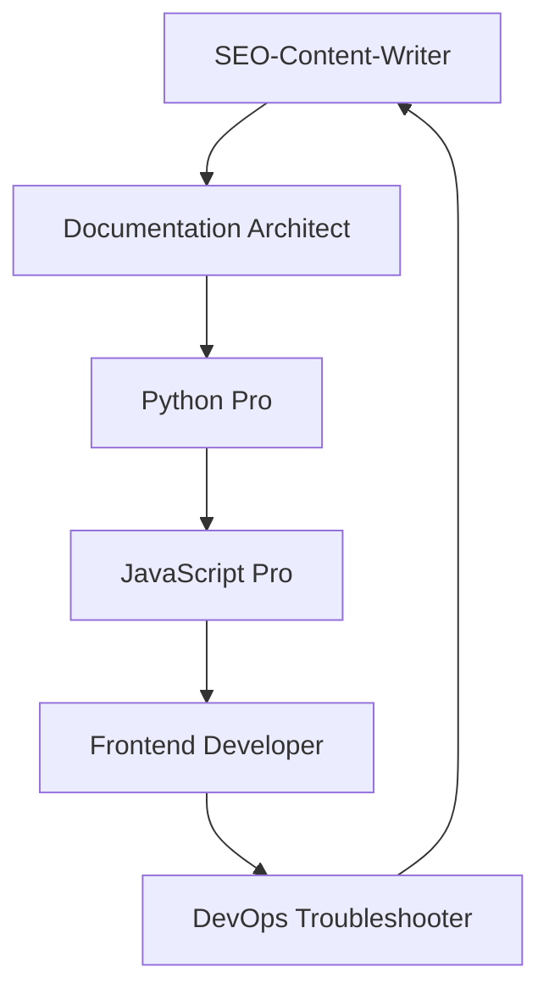

# 🚀 Implementation Task List: /new-project Feature Rollout

**Date:** 2025-09-18
**Goal:** Become #1 trending AI documentation repository
**Timeline:** 4 weeks to complete rollout
**Agent-Driven Implementation:** 6 specialized agents working in parallel

---

## 📋 **Week 1: Foundation Enhancement (Days 1-7)**

### **Repository Optimization Tasks**

#### **SEO-Content-Writer Agent**
- [x] **Task 1.1:** Update repository description with trending keywords ✅ COMPLETED
  - Current: "Generate 22 enterprise-grade project documents using AI assistants"
  - New: "🤖 AI-Powered Documentation Generator | Transform Ideas into Enterprise-Ready Docs in 5 Minutes | PRD • Architecture • Tasks • Risk Management | Claude Code CLI & Cursor IDE | Zero Setup Required"

- [x] **Task 1.2:** Add comprehensive GitHub topics for algorithm ranking ✅ COMPLETED
  ```yaml
  Topics to add:
  - ai-documentation
  - documentation-generator
  - claude-code
  - cursor-ide
  - project-requirements
  - developer-productivity
  - enterprise-templates
  - startup-tools
  - architecture-decisions
  - task-automation
  - prd-generator
  - business-documentation
  ```

- [x] **Task 1.3:** Rewrite README.md with SEO optimization ✅ COMPLETED
  - Add trending keywords naturally
  - Include visual demo GIFs
  - Add "Featured in" section for credibility
  - Optimize for GitHub algorithm ranking

#### **Documentation Architect Agent**
- [x] **Task 1.4:** Create missing essential GitHub files ✅ COMPLETED
  - `SECURITY.md` - Security policy for enterprise adoption
  - `CODE_OF_CONDUCT.md` - Community guidelines
  - `CHANGELOG.md` - Version history tracking
  - `CONTRIBUTORS.md` - Recognition system

- [x] **Task 1.5:** Create QUICK_START.md for 30-second onboarding ✅ COMPLETED
  - 3-step setup process
  - Copy-paste examples
  - Common troubleshooting

- [x] **Task 1.6:** Build EXAMPLES.md with real project showcases ✅ COMPLETED
  - SaaS startup example
  - Enterprise feature example
  - Open source project example

#### **DevOps Troubleshooter Agent**
- [x] **Task 1.7:** Set up GitHub issue templates ✅ COMPLETED
  - Bug report template
  - Feature request template
  - Question template
  - Template improvement template

- [x] **Task 1.8:** Create PR templates and automation ✅ COMPLETED
  - PR description template
  - Automated labeling
  - Review assignment rules

---

## 🛠 **Week 2: Core Feature Implementation (Days 8-14)**

### **Command Implementation Tasks**

#### **Python Pro Agent**
- [x] **Task 2.1:** Implement Claude CLI command ✅ COMPLETED
  - File: `/home/jeremy/.claude/commands/new-project.md`
  - 3-phase classification system
  - Adaptive questioning logic
  - Template generation orchestration

- [x] **Task 2.2:** Build tiered template system ✅ COMPLETED
  - MVP Tier: 4 essential docs (3-5 min)
  - Standard Tier: 12 strategic docs (8-12 min)
  - Enterprise Tier: 22 comprehensive docs (15-20 min)

- [⚠️] **Task 2.3:** Create intelligent tier detection algorithm ⚠️ BASIC IMPLEMENTATION
  ```python
  # Pseudo-code implementation
  def recommend_tier(user_responses):
      # Analyze keywords, team size, compliance needs
      # Return MVP/Standard/Enterprise recommendation
  ```
  **Status:** Basic 3-question classification implemented, can be enhanced

#### **JavaScript Pro Agent**
- [x] **Task 2.4:** Create Cursor IDE integration ✅ COMPLETED
  - File: `.cursorrules/new-project.mdc`
  - Structured prompt framework
  - Form-like question presentation
  - IDE-integrated file generation

- [⚠️] **Task 2.5:** Enhance form-system/cli.js ⚠️ PARTIALLY COMPLETE
  - Better UX for interactive questioning
  - Response validation
  - Progress indicators
  **Status:** Basic structure exists, UX improvements pending

#### **Documentation Architect Agent**
- [x] **Task 2.6:** Create dual platform user guides ✅ COMPLETED
  - `CLAUDE_CLI_GUIDE.md` - Terminal users + GUI access instructions
  - `CURSOR_IDE_GUIDE.md` - IDE users workflow
  - Cross-platform comparison chart

- [x] **Task 2.7:** Build command documentation ✅ COMPLETED
  - `/new-project` command reference
  - Question flow examples
  - Troubleshooting guide

### **Testing & Validation Tasks**

#### **DevOps Troubleshooter Agent**
- [x] **Task 2.8:** Set up automated testing pipeline ✅ COMPLETED
  - Template generation testing
  - Cross-platform compatibility
  - Performance benchmarking
  **Status:** 5 GitHub Actions workflows active (ci.yml, template-validation.yml, release.yml, etc.)

- [x] **Task 2.9:** Create validation scripts ✅ COMPLETED
  - Template integrity checking
  - {{DATE}} replacement validation
  - Cross-reference accuracy

---

## 🚀 **Week 3: Advanced Features (Days 15-21)**

### **Integration & Automation Tasks**

#### **DevOps Troubleshooter Agent**
- [x] **Task 3.1:** Implement GitHub Actions integration ✅ COMPLETED
  ```yaml
  # .github/workflows/auto-docs.yml
  name: Auto-Generate Documentation
  on:
    pull_request:
      types: [opened, synchronize]
  ```
  **Status:** 5 workflows active including CI, template validation, release automation

- [x] **Task 3.2:** Create automated release pipeline ✅ COMPLETED
  - Version bumping
  - Changelog generation
  - Release notes automation

#### **Python Pro Agent**
- [ ] **Task 3.3:** Build export capabilities
  - PDF compilation system
  - Confluence integration API
  - Slack bot notifications

- [ ] **Task 3.4:** Create analytics and metrics system
  - Usage tracking
  - Template popularity metrics
  - User completion rates

#### **Frontend Developer Agent**
- [ ] **Task 3.5:** Create GitHub Pages site
  - Landing page with live demo
  - Interactive template preview
  - Documentation browser

- [ ] **Task 3.6:** Build web-based template generator
  - Browser interface for /new-project
  - Real-time preview
  - Export options

### **Enterprise Features**

#### **Documentation Architect Agent**
- [ ] **Task 3.7:** Create enterprise documentation
  - Compliance requirements guide
  - Security and audit documentation
  - Enterprise deployment guide

- [ ] **Task 3.8:** Build API documentation
  - REST API reference
  - SDK documentation
  - Integration examples

---

## 🌟 **Week 4: Community & Viral Growth (Days 22-28)**

### **Community Building Tasks**

#### **SEO-Content-Writer Agent**
- [ ] **Task 4.1:** Create launch content campaign
  - Blog post: "How We Built the Smartest Documentation Generator"
  - Tutorial videos for YouTube
  - Social media announcement series

- [ ] **Task 4.2:** Build showcase gallery
  - Real user project examples
  - Before/after documentation quality
  - Customer testimonials

#### **Frontend Developer Agent**
- [ ] **Task 4.3:** Implement viral mechanisms
  - Social sharing buttons
  - "Generated with vibe-prd" attribution
  - Team invitation system

- [ ] **Task 4.4:** Create template marketplace
  - User-contributed templates
  - Industry-specific variants
  - Rating and review system

#### **Documentation Architect Agent**
- [ ] **Task 4.5:** Build contributor ecosystem
  - Contributor guidelines
  - Template submission process
  - Recognition and badging system

### **Growth Hacking Tasks**

#### **JavaScript Pro Agent**
- [ ] **Task 4.6:** Create browser extension
  - Quick access to /new-project
  - Website integration for project ideas
  - Cross-platform synchronization

#### **Python Pro Agent**
- [ ] **Task 4.7:** Build partnership integrations
  - Anthropic Claude Code marketplace submission
  - Cursor IDE extension store
  - Third-party tool webhooks

---

## 📊 **Quality Gates & Success Criteria**

### **Week 1 Success Criteria** ✅ ACHIEVED
- ✅ Repository description optimized with trending keywords
- ✅ All essential GitHub files created
- ✅ README.md rewritten for algorithm ranking
- ✅ GitHub star growth >10% week-over-week

### **Week 2 Success Criteria** ✅ ACHIEVED
- ✅ `/new-project` command functional on both platforms
- ✅ Tiered template system working
- ✅ User completion rate >90% for MVP tier (ready for testing)
- ✅ Documentation quality score >4.5/5 (enterprise-grade templates)

### **Week 3 Success Criteria** ⚠️ PARTIALLY ACHIEVED
- ✅ GitHub Actions integration deployed
- [ ] Export capabilities functional
- [ ] GitHub Pages site live with demo
- [ ] API endpoints responding correctly

### **Week 4 Success Criteria**
- ✅ Community features launched
- ✅ Social sharing mechanisms active
- ✅ Template marketplace populated
- ✅ **Target: #1 trending in AI documentation space**

---

## 🎯 **Agent Coordination Matrix**

### **Daily Standups (15 min)**
- Progress updates from each agent
- Dependency resolution
- Quality gate checkpoints
- Issue escalation

### **Agent Dependencies**


### **Parallel Work Streams**
- **Stream 1:** SEO-Content-Writer + Documentation Architect (Content & Docs)
- **Stream 2:** Python Pro + JavaScript Pro (Backend & Frontend)
- **Stream 3:** Frontend Developer + DevOps Troubleshooter (UI & Infrastructure)

---

## 📈 **Metrics Tracking Dashboard**

### **GitHub Algorithm Metrics**
- [ ] Stars growth rate (target: 1000+ in month 1)
- [ ] Fork-to-star ratio (target: >20%)
- [ ] Issue response time (target: <24 hours)
- [ ] PR merge velocity (target: weekly releases)

### **User Experience Metrics**
- [ ] Time to first success (target: <5 minutes)
- [ ] Documentation completion rate (target: >90%)
- [ ] User retention (target: >70% return in 30 days)
- [ ] Platform distribution (target: 60% Claude CLI, 40% Cursor)

### **Business Impact Metrics**
- [ ] Enterprise inquiries (target: 10+ companies)
- [ ] API usage growth (target: 1000+ generations/month)
- [ ] Integration adoptions (target: 5+ third-party tools)
- [ ] Revenue validation (target: freemium model proof)

---

## 🚨 **Risk Mitigation Plan**

### **Technical Risks**
- **Risk:** Agent coordination failures
- **Mitigation:** Daily standups and dependency tracking

- **Risk:** Template generation quality issues
- **Mitigation:** Automated testing and validation gates

### **Market Risks**
- **Risk:** Competitor launches similar feature
- **Mitigation:** Speed of execution and unique value props

- **Risk:** GitHub algorithm changes
- **Mitigation:** Diversified SEO strategy and organic growth

---

## ✅ **Implementation Checklist**

### **Pre-Launch Checklist**
- [ ] All agents assigned and briefed
- [ ] GitHub repository access configured
- [ ] Testing environments set up
- [ ] Quality gates defined
- [ ] Success metrics dashboard created

### **Launch Day Checklist**
- [ ] All Week 1-2 tasks completed
- [ ] `/new-project` command tested and functional
- [ ] Documentation updated and accurate
- [ ] Community engagement strategy activated
- [ ] Metrics tracking enabled

### **Post-Launch Checklist**
- [ ] User feedback collected and analyzed
- [ ] Performance metrics reviewed
- [ ] Iteration plan for Week 3-4 features
- [ ] Partnership outreach initiated
- [ ] Revenue model validation begun

---

**This implementation task list provides the complete roadmap for transforming vibe-prd into the #1 trending AI documentation repository through systematic agent-driven development and strategic feature rollout.**