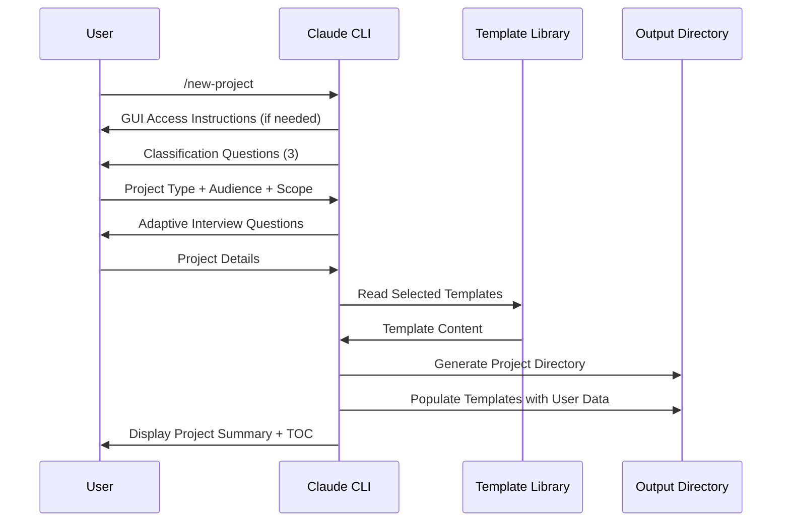
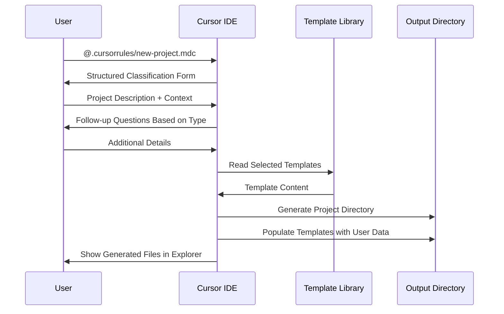

# 🏗 Architecture Decision Record (ADR)

**Metadata**
- Last Updated: 2025-09-18
- Maintainer: AI-Dev Toolkit Enhancement Team
- Related Docs: new-project-command-prd.md, new-project-command-analysis.md
- ADR Status: **Proposed**
- Decision Impact: **High** - Core system architecture change

> **🎯 Decision Summary**
> This ADR documents the key architectural decisions for implementing the `/new-project` intelligent intake command within the existing vibe-prd system. These decisions balance user experience optimization with system maintainability and backwards compatibility.

---

## 🚀 1. Context & Problem Statement

### 1.1 Background
The vibe-prd system currently provides 22 professional templates through:
- **Dual AI Support:** Claude Code CLI one-paste workflow + Cursor IDE structured workflow
- **Individual Commands:** 4 separate commands (/create-prd, /create-adr, /generate-tasks, /process-tasks)
- **Template Library:** Static templates with {{DATE}} placeholders in `professional-templates/`
- **Form System:** Basic intake via `form-system/cli.js` with 7 hardcoded questions

### 1.2 Business Problem
- **User Friction:** 15+ minute setup time, cognitive overhead of formulating questions
- **Command Sprawl:** Multiple separate commands reduce user experience flow
- **Inconsistent Documentation:** No guidance for different project contexts (startup vs enterprise)
- **Template Coordination:** Manual cross-referencing between related documents

### 1.3 Technical Constraints
- **Backwards Compatibility:** Must preserve existing workflows (Claude one-paste, Cursor structured)
- **Template Stability:** Cannot modify existing 22 professional templates
- **Command System:** Must work within Claude Code CLI command architecture
- **Zero Dependencies:** Cannot introduce external dependencies or complex setup

---

## 🎯 2. Architectural Decisions

### 2.1 **ADR-001: Dual Platform Implementation Strategy**

#### **Decision**
Implement `/new-project` as a **dual-platform solution** supporting both Claude Code CLI and Cursor IDE users through complementary implementations.

#### **Context**
Need to support two distinct user bases:
- **Claude Code CLI Users:** Command-line interface with conversational flow
- **Cursor IDE Users:** IDE-integrated workflow with .cursorrules/ system
- **GUI Users:** Need instructions to access CLI functionality

Must choose between:
- **Option A:** Claude-only implementation (excludes Cursor users)
- **Option B:** Cursor-only implementation (excludes Claude CLI users)
- **Option C:** Dual implementation with shared underlying logic

#### **Decision Rationale**
**Selected: Option C - Dual Implementation Strategy**

**Implementation Architecture:**
```markdown
Dual Platform Support:

Claude Code CLI Implementation:
├── File: /home/jeremy/.claude/commands/new-project.md
├── Strategy: Conversational flow with intelligent questioning
├── Access: Direct /new-project command in terminal
└── GUI Access: Instructions for opening terminal from Claude Code GUI

Cursor IDE Implementation:
├── File: .cursorrules/new-project.mdc
├── Strategy: Structured workflow with @-commands
├── Access: @.cursorrules/new-project.mdc [project description]
└── Integration: Uses existing .cursorrules/ system
```

**Why Option C (Dual Implementation):**
- ✅ **Universal Access:** Supports both major AI coding platforms
- ✅ **Platform-Optimized UX:** Conversational for Claude, structured for Cursor
- ✅ **Shared Logic:** Same question flows and template generation
- ✅ **No User Exclusion:** Every user can access the feature
- ✅ **Backwards Compatible:** Preserves existing workflows on both platforms

**Why Not Option A (Claude-only):**
- ❌ **User Exclusion:** Abandons significant Cursor user base
- ❌ **Platform Lock-in:** Reduces repo accessibility and adoption

**Why Not Option B (Cursor-only):**
- ❌ **CLI Limitation:** Loses conversational intelligence benefits
- ❌ **Command Loss:** No /new-project command for CLI users

#### **Platform-Specific Implementation**

**Claude Code CLI:**
```markdown
# /home/jeremy/.claude/commands/new-project.md
- Conversational questioning flow
- Real-time adaptive follow-ups
- Natural language project description
- Terminal-based interaction

# GUI User Instructions:
1. Open Claude Code
2. Press Ctrl+` (Windows/Linux) or Cmd+` (Mac) to open terminal
3. Type /new-project and follow guided questions
```

**Cursor IDE:**
```markdown
# .cursorrules/new-project.mdc
- Structured prompt-based workflow
- Form-like question presentation
- IDE-integrated file generation
- Chat panel interaction

# Usage:
@.cursorrules/new-project.mdc
Describe your project: [detailed description]
```

#### **Consequences**
- ✅ **Positive:** Universal platform support, optimized UX per platform
- ⚠️ **Trade-off:** Two implementations to maintain (but shared logic)
- ❌ **Complexity:** Dual testing and documentation requirements

---

### 2.2 **ADR-002: Question Flow Architecture**

#### **Decision**
Implement **adaptive branching logic** using conditional conversation flows rather than static question trees.

#### **Context**
Need to handle different project types with appropriate question depth:
- **Greenfield Projects:** Focus on concept validation, market research
- **Brownfield Projects:** Focus on integration, user impact, technical constraints
- **Enterprise Context:** Add compliance, audit, regulatory requirements
- **Scope Selection:** 4 foundation docs vs 22 comprehensive docs

#### **Decision Rationale**
**Selected: Adaptive Branching with AI-Driven Follow-ups**

```mermaid
graph TD
    A[/new-project] --> B[Classification Questions]
    B --> C{Project Type}
    C -->|Greenfield| D[Concept Validation Flow]
    C -->|Brownfield| E[Integration Impact Flow]
    D --> F{Audience Type}
    E --> F
    F -->|Startup| G[Lean Question Set]
    F -->|Enterprise| H[Compliance Question Set]
    G --> I[Scope Selection]
    H --> I
    I -->|Foundation| J[4 Core Templates]
    I -->|Comprehensive| K[22 Template Interview]
```

**Architecture Benefits:**
- ✅ **Intelligent Adaptation:** Questions tailored to project context
- ✅ **Scalable:** Easy to add new project types or audience categories
- ✅ **User-Focused:** Reduces cognitive load through guided experience
- ✅ **AI-Enhanced:** Leverages Claude's ability to determine when clarification needed

#### **Implementation Strategy**
```markdown
## Phase 1: Classification (3 Questions)
1. Starting Point: Greenfield vs Brownfield
2. Audience: Startup vs Business vs Enterprise
3. Scope: Foundation (4) vs Comprehensive (22)

## Phase 2: Adaptive Interview
IF greenfield + startup + foundation:
  → 5-7 concept validation questions
IF brownfield + enterprise + comprehensive:
  → 15-20 integration + compliance questions
```

#### **Consequences**
- ✅ **Positive:** Personalized experience, appropriate documentation depth
- ⚠️ **Trade-off:** More complex logic to maintain and test
- ❌ **Risk:** Potential for question flow dead-ends if logic is flawed

---

### 2.3 **ADR-003: Template Generation Strategy**

#### **Decision**
Use **template composition** rather than template modification - read existing templates, populate with user responses, generate new files.

#### **Context**
Need to balance template customization with template library stability:
- **Option A:** Modify existing templates in professional-templates/
- **Option B:** Create new template variants for different contexts
- **Option C:** Compose templates dynamically from user responses

#### **Decision Rationale**
**Selected: Option C - Dynamic Template Composition**

**Architecture:**
```python
# Template Generation Flow
1. Read base template from professional-templates/
2. Extract user responses from conversation
3. Map responses to template sections
4. Replace {{DATE}} with current timestamp
5. Generate cross-references to related docs
6. Write populated template to completed-docs/[project]/
```

**Why Option C:**
- ✅ **Template Integrity:** Never modifies source templates
- ✅ **Flexibility:** Can generate infinite variations from same base
- ✅ **Maintainability:** Changes only affect generation logic, not templates
- ✅ **Consistency:** All projects use same professional template foundation

**Why Not Option A:**
- ❌ **Template Pollution:** Would corrupt clean template library
- ❌ **Version Control:** Difficult to track template vs user-specific changes

**Why Not Option B:**
- ❌ **Template Explosion:** Would need variants for every context combination
- ❌ **Maintenance Burden:** 22 templates × 3 audiences × 2 project types = 132 templates

#### **Implementation Details**
```markdown
Template Mapping Strategy:
- User Response → Template Section Mapping
- Smart Content Generation (AI fills gaps)
- Cross-Reference Generation (Related Docs metadata)
- Date Stamping ({{DATE}} → 2025-09-18)
```

#### **Consequences**
- ✅ **Positive:** Preserves template library, enables infinite customization
- ⚠️ **Trade-off:** More complex generation logic
- ❌ **Risk:** Template population might feel generic without careful mapping

---

### 2.4 **ADR-004: Project Structure and Output Organization**

#### **Decision**
Generate **self-contained project directories** with index-based navigation rather than flat file output.

#### **Context**
Need to organize generated documentation for easy navigation and maintenance:
- **Option A:** Flat files in completed-docs/ with project prefix
- **Option B:** Project subdirectories with index and cross-references
- **Option C:** Integration with existing project directories

#### **Decision Rationale**
**Selected: Option B - Self-Contained Project Directories**

**Directory Structure:**
```
completed-docs/[project-name]/
├── index.md                    # Project summary + TOC
├── 01_prd.md                   # Product Requirements
├── 02_adr.md                   # Architecture Decisions
├── 03_generate_tasks.md        # Task Breakdown
├── 04_process_task_list.md     # Task Management
├── [additional templates...]    # If comprehensive selected
└── .metadata/                  # Generation timestamp, user responses
    ├── generation-log.json
    └── user-responses.json
```

**Why Option B:**
- ✅ **Organization:** Clear project boundaries, easy navigation
- ✅ **Portability:** Self-contained, can be moved/shared easily
- ✅ **Cross-References:** index.md provides central navigation hub
- ✅ **Auditability:** .metadata/ tracks what was generated and why

**Why Not Option A:**
- ❌ **File Sprawl:** Difficult to manage multiple projects
- ❌ **Navigation:** No central index for project documentation

**Why Not Option C:**
- ❌ **Complexity:** Would require understanding diverse project structures
- ❌ **Risk:** Could disrupt existing project organization

#### **Index.md Generation**
```markdown
# [Project Name] - Documentation Index

**Generated:** 2025-09-18
**Project Type:** Greenfield Startup MVP
**Documentation Scope:** Foundation (4 docs)

## 📋 Documentation Overview
- [Product Requirements](01_prd.md) - Core product definition
- [Architecture Decisions](02_adr.md) - Technical choices
- [Task Breakdown](03_generate_tasks.md) - Implementation plan
- [Task Management](04_process_task_list.md) - Execution tracking

## 🎯 Key Assumptions Made
- Target audience: Small business users
- MVP timeline: 3 months
- Technology stack: React + Node.js
```

#### **Consequences**
- ✅ **Positive:** Professional organization, easy project management
- ⚠️ **Trade-off:** Slightly more complex directory creation logic
- ❌ **Risk:** Directory naming conflicts if projects have same name

---

### 2.5 **ADR-005: Integration with Existing Workflows**

#### **Decision**
Implement `/new-project` as **additive enhancement** that preserves all existing workflows while providing new streamlined path.

#### **Context**
Must maintain backwards compatibility with:
- **Claude One-Paste Workflow:** README.md instructions for bulk generation
- **Cursor Structured Workflow:** .cursorrules/ integration
- **Individual Commands:** /create-prd, /create-adr, /generate-tasks, /process-tasks
- **Form System:** form-system/cli.js for structured input

#### **Decision Rationale**
**Selected: Additive Enhancement Strategy**

**Integration Points:**
```markdown
Existing Workflows (Preserved):
├── Claude One-Paste → Still works via README instructions
├── Cursor Structured → Still works via .cursorrules/
├── Individual Commands → Still work for single template generation
└── Form System → Still works for advanced users

New Workflow (Added):
└── /new-project → Intelligent guided experience
```

**Why Additive:**
- ✅ **Zero Breaking Changes:** Existing users unaffected
- ✅ **Migration Path:** Users can gradually adopt new workflow
- ✅ **Flexibility:** Different workflows for different use cases
- ✅ **Risk Mitigation:** Can rollback if new workflow has issues

#### **Command Relationship**
```markdown
/new-project (New) - Comprehensive guided experience
├── Can recommend individual commands for specific updates
├── Generates same output as existing workflows
└── Provides central coordination lacking in current system

Individual Commands (Existing) - Specific template generation
├── /create-prd - Still useful for adding PRD to existing project
├── /create-adr - Still useful for documenting specific decisions
├── /generate-tasks - Still useful for task breakdowns
└── /process-tasks - Still useful for task management
```

#### **Consequences**
- ✅ **Positive:** Zero user disruption, gradual adoption possible
- ⚠️ **Trade-off:** More commands to maintain and document
- ❌ **Risk:** Potential user confusion about which workflow to use

---

## 🛠 3. Implementation Strategy

### 3.1 **Dual Platform Technical Architecture**

#### **Claude Code CLI Structure**
```markdown
File: /home/jeremy/.claude/commands/new-project.md
Size: ~500 lines (estimated)
Structure:
├── GUI Access Instructions (How to open terminal)
├── Phase 1: Project Classification Logic
├── Phase 2: Adaptive Question Flows
├── Phase 3: Template Generation Instructions
├── Phase 4: Project Structure Creation
└── Phase 5: Completion Summary Display
```

#### **Cursor IDE Structure**
```markdown
File: .cursorrules/new-project.mdc
Size: ~300 lines (estimated)
Structure:
├── Structured Prompt Framework
├── Project Type Classification Forms
├── Question Templates by Context
├── Template Selection Logic
└── File Generation Instructions
```

#### **Dual Platform Data Flow**

**Claude Code CLI Flow:**


**Cursor IDE Flow:**


### 3.2 **Quality Assurance Strategy**

#### **Testing Approach**
```markdown
1. **Dual Platform Testing**
   - Claude CLI: Test conversational flow and command execution
   - Cursor IDE: Test .cursorrules/ integration and file generation
   - Cross-platform: Verify identical output from both platforms
   - GUI Access: Test terminal opening instructions for GUI users

2. **Template Generation Testing**
   - Verify all 22 templates generate correctly on both platforms
   - Test {{DATE}} replacement accuracy
   - Validate cross-reference generation consistency

3. **Question Flow Testing**
   - Test all branching paths (Greenfield/Brownfield × 3 audiences × 2 scopes)
   - Verify adaptive questioning logic works in both CLI and IDE contexts
   - Test edge cases (minimal responses, verbose responses)

4. **Platform-Specific Integration Testing**
   - Claude CLI: Verify existing /command system compatibility
   - Cursor IDE: Verify .cursorrules/ system integration
   - Both: Test output directory creation in different project contexts

5. **User Experience Testing**
   - Time-to-completion measurement (both platforms)
   - Platform preference analysis
   - Documentation quality assessment
   - GUI-to-CLI transition testing
```

#### **Rollback Strategy**
```markdown
If /new-project Command Fails:
1. Remove /home/jeremy/.claude/commands/new-project.md
2. All existing workflows continue functioning
3. Zero impact on template library or existing projects
4. Users fall back to individual commands or one-paste workflow
```

---

## 📊 4. Decision Consequences

### 4.1 **Positive Outcomes**
- **User Experience:** Single command replaces 4+ separate commands
- **Guided Experience:** Eliminates "what questions to ask" problem
- **Professional Output:** Maintains template quality while adding intelligence
- **Backwards Compatibility:** Zero disruption to existing workflows
- **Maintainability:** Simple architecture, easy to extend and modify

### 4.2 **Trade-offs Accepted**
- **Complexity:** More sophisticated logic than simple template copying
- **Claude Dependency:** Relies on Claude's conversation management capabilities
- **Command Proliferation:** Adds 5th command to system (but solves command sprawl problem)
- **Testing Overhead:** More complex testing due to adaptive questioning

### 4.3 **Risks Mitigated**
- **Template Corruption:** Dynamic composition preserves template library integrity
- **User Disruption:** Additive approach ensures backwards compatibility
- **Maintenance Burden:** Single file implementation keeps complexity manageable
- **Adoption Risk:** Preserves existing workflows for gradual migration

---

## 🔄 5. Decision Review & Evolution

### 5.1 **Review Criteria**
This ADR should be reviewed if:
- User feedback indicates question flow improvements needed
- Template library undergoes major restructuring
- Claude command system architecture changes
- New project types or audiences require support

### 5.2 **Success Metrics for Architecture**
- **Performance:** Command execution <30 seconds for 22 templates
- **Reliability:** >99% successful template generation rate
- **Maintainability:** Feature additions require <1 day implementation
- **User Adoption:** >50% of new users choose /new-project over alternatives

### 5.3 **Evolution Path**
```markdown
Phase 1: Core Implementation (ADR-001 to ADR-005)
Phase 2: Question Flow Optimization (Based on user feedback)
Phase 3: Advanced Features (Template customization, export options)
Phase 4: Enterprise Features (Compliance templates, audit trails)
```

---

## 📚 6. Related Decisions

### 6.1 **Previous ADRs**
- **None:** This is the first ADR for the vibe-prd system
- **Template Architecture:** Implicit decisions in professional-templates/ structure
- **Dual AI Support:** Implicit decisions in README.md and .cursorrules/ design

### 6.2 **Future ADRs**
- **ADR-006:** Template customization architecture (if needed)
- **ADR-007:** Export and integration capabilities (if needed)
- **ADR-008:** Enterprise compliance features (if needed)

### 6.3 **External Dependencies**
- **Claude Code CLI:** Command system must remain stable
- **Template Library:** professional-templates/ structure must remain consistent
- **Form System:** form-system/cli.js should remain available for advanced users

---

**ADR Status:** Proposed
**Decision Date:** 2025-09-18
**Review Date:** 2025-12-18 (3 months post-implementation)
**Decision Makers:** AI-Dev Toolkit Enhancement Team