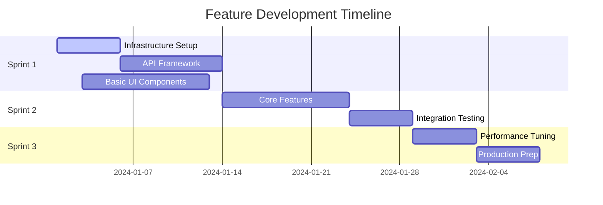

# 🔄 Task Generation & Breakdown Framework

**Metadata**
- Last Updated: {{DATE}}
- Maintainer: AI-Dev Toolkit
- Related Docs: Uses 01_prd.md → feeds 04_process_task_list.md

> **🎯 Purpose**
> Systematic breakdown of PRD features into actionable, estimable tasks with clear dependencies and acceptance criteria. This template ensures comprehensive coverage and realistic estimation for successful project delivery.

---

## 📊 1. Input Analysis & Preparation

### 1.1 PRD Feature Extraction
**Source Document:** _{Link to PRD (01_prd.md)}_

**Features to Decompose:**
| Feature ID | Feature Name | Priority | Business Value | Complexity |
|------------|--------------|----------|----------------|------------|
| F001 | _{Feature name}_ | P0 | High | Medium |
| F002 | _{Feature name}_ | P1 | Medium | High |
| F003 | _{Feature name}_ | P2 | Low | Low |

### 1.2 Prerequisites & Dependencies
**External Dependencies:**
- [ ] _{Design system components ready}_
- [ ] _{API specifications finalized}_
- [ ] _{Infrastructure provisioned}_
- [ ] _{Third-party integrations available}_

**Technical Prerequisites:**
- [ ] _{Development environment setup}_
- [ ] _{Code repository configured}_
- [ ] _{CI/CD pipeline established}_
- [ ] _{Testing frameworks installed}_

### 1.3 Team Capacity Assessment
| Role | Available Hours/Sprint | Skill Level | Specialty Areas |
|------|----------------------|-------------|----------------|
| **Frontend Developer** | _{40 hours}_ | Senior | React, TypeScript |
| **Backend Developer** | _{40 hours}_ | Mid-level | Node.js, PostgreSQL |
| **DevOps Engineer** | _{20 hours}_ | Senior | AWS, Docker |
| **QA Engineer** | _{30 hours}_ | Mid-level | Automation, API testing |

---

## 🏗️ 2. User Story Generation

### 2.1 Story Template & Standards
**Standard Format:**
```
As a [user type]
I want [capability/feature]
So that [outcome/benefit]
```

**Story Quality Criteria:**
- [ ] **Independent:** Can be developed separately
- [ ] **Negotiable:** Details can be discussed
- [ ] **Valuable:** Provides user/business value
- [ ] **Estimable:** Size can be determined
- [ ] **Small:** Fits in one sprint
- [ ] **Testable:** Acceptance criteria are clear

### 2.2 Epic Breakdown Process

#### Epic: _{Feature Name}_ (F001)
**Business Objective:** _{What business goal this achieves}_
**User Impact:** _{How this improves user experience}_

##### User Story US001: _{Story Title}_
**Story:** As a _{user type}_, I want _{capability}_ so that _{outcome}_

**Business Value:** _{High/Medium/Low + justification}_
**Story Points:** _{Fibonacci estimate: 1,2,3,5,8,13}_
**Sprint Assignment:** _{Sprint X}_

**Acceptance Criteria:**
- [ ] **AC001:** Given _{context}_, when _{action}_, then _{expected result}_
- [ ] **AC002:** Given _{context}_, when _{action}_, then _{expected result}_
- [ ] **AC003:** System handles _{error condition}_ gracefully
- [ ] **AC004:** Performance meets _{specific requirement}_

**Definition of Done:**
- [ ] Code reviewed and approved
- [ ] Unit tests written (≥80% coverage)
- [ ] Integration tests passing
- [ ] Security review completed
- [ ] Documentation updated
- [ ] Accessibility requirements met
- [ ] Performance benchmarks achieved

##### User Story US002: _{Story Title}_
[Repeat format above]

### 2.3 Cross-Cutting Stories
**Infrastructure Stories:**
- US-INF-001: Set up monitoring and alerting
- US-INF-002: Implement security scanning
- US-INF-003: Configure backup and recovery

**Technical Debt Stories:**
- US-TECH-001: Refactor legacy authentication
- US-TECH-002: Upgrade outdated dependencies
- US-TECH-003: Improve error handling consistency

---

## ⚙️ 3. Task Decomposition Framework

### 3.1 Task Breakdown Structure (WBS)

#### Epic F001: _{Feature Name}_

##### User Story US001: _{Story Title}_

**Frontend Tasks:**
| Task ID | Description | Estimate | Dependencies | Owner | Sprint |
|---------|-------------|----------|--------------|-------|--------|
| T001-FE-01 | Create component wireframes | 4h | Design approval | Frontend Dev | S1 |
| T001-FE-02 | Implement React component | 8h | T001-FE-01 | Frontend Dev | S1 |
| T001-FE-03 | Add responsive design | 6h | T001-FE-02 | Frontend Dev | S1 |
| T001-FE-04 | Implement state management | 6h | T001-FE-02 | Frontend Dev | S1 |
| T001-FE-05 | Add error handling | 4h | T001-FE-04 | Frontend Dev | S1 |
| T001-FE-06 | Write component tests | 6h | T001-FE-02 | Frontend Dev | S1 |

**Backend Tasks:**
| Task ID | Description | Estimate | Dependencies | Owner | Sprint |
|---------|-------------|----------|--------------|-------|--------|
| T001-BE-01 | Design API endpoints | 4h | PRD approval | Backend Dev | S1 |
| T001-BE-02 | Implement data models | 8h | T001-BE-01 | Backend Dev | S1 |
| T001-BE-03 | Create API controllers | 12h | T001-BE-02 | Backend Dev | S1 |
| T001-BE-04 | Add input validation | 6h | T001-BE-03 | Backend Dev | S1 |
| T001-BE-05 | Implement business logic | 16h | T001-BE-03 | Backend Dev | S2 |
| T001-BE-06 | Add error handling | 4h | T001-BE-05 | Backend Dev | S2 |
| T001-BE-07 | Write API tests | 8h | T001-BE-05 | Backend Dev | S2 |

**DevOps Tasks:**
| Task ID | Description | Estimate | Dependencies | Owner | Sprint |
|---------|-------------|----------|--------------|-------|--------|
| T001-DO-01 | Configure staging environment | 8h | Infrastructure | DevOps | S1 |
| T001-DO-02 | Set up CI/CD pipeline | 12h | T001-DO-01 | DevOps | S1 |
| T001-DO-03 | Configure monitoring | 6h | T001-DO-01 | DevOps | S2 |
| T001-DO-04 | Set up automated backups | 4h | T001-DO-01 | DevOps | S2 |

**QA Tasks:**
| Task ID | Description | Estimate | Dependencies | Owner | Sprint |
|---------|-------------|----------|--------------|-------|--------|
| T001-QA-01 | Write test scenarios | 6h | US001 definition | QA Engineer | S1 |
| T001-QA-02 | Create automated tests | 12h | T001-FE-02, T001-BE-03 | QA Engineer | S2 |
| T001-QA-03 | Perform integration testing | 8h | All development tasks | QA Engineer | S2 |
| T001-QA-04 | Load testing | 6h | T001-QA-03 | QA Engineer | S2 |
| T001-QA-05 | Security testing | 4h | T001-QA-03 | QA Engineer | S2 |

### 3.2 Estimation Methodology

#### 3.2.1 Planning Poker Process
**Estimation Scale:** Modified Fibonacci (1, 2, 3, 5, 8, 13, 21)

**Estimation Guidelines:**
- **1 point:** Simple configuration change (1-2 hours)
- **2 points:** Minor feature addition (2-4 hours)
- **3 points:** Standard feature implementation (4-8 hours)
- **5 points:** Complex feature or integration (1-2 days)
- **8 points:** Major feature with dependencies (2-3 days)
- **13 points:** Epic-level work requiring breakdown
- **21 points:** Requires further analysis and breakdown

#### 3.2.2 Estimation Factors
**Technical Complexity:**
- Algorithm complexity
- Integration points
- Performance requirements
- Security considerations

**Risk Factors:**
- Team familiarity with technology
- External dependencies
- Changing requirements
- Technical debt impact

**Buffer Calculation:**
- Low risk tasks: +10% buffer
- Medium risk tasks: +25% buffer
- High risk tasks: +50% buffer

### 3.3 Dependency Management

#### 3.3.1 Dependency Types
**Technical Dependencies:**
- Code dependencies (A needs B to be completed)
- Resource dependencies (shared infrastructure)
- Skill dependencies (specialist knowledge required)

**Business Dependencies:**
- Stakeholder approvals
- External vendor deliverables
- Regulatory compliance

#### 3.3.2 Dependency Tracking Matrix
| Task ID | Depends On | Dependency Type | Risk Level | Mitigation |
|---------|------------|-----------------|------------|------------|
| T001-FE-02 | T001-FE-01 | Technical | Low | Overlap design and development |
| T001-BE-05 | External API | External | High | Mock implementation for development |
| T001-QA-02 | T001-FE-02, T001-BE-03 | Technical | Medium | Parallel test development |

#### 3.3.3 Critical Path Analysis
**Critical Path:** _{T001-BE-01 → T001-BE-02 → T001-BE-03 → T001-BE-05 → T001-QA-03}_
**Total Duration:** _{44 hours (5.5 days)}_
**Buffer Recommendations:** _{Add 2-day buffer for integration issues}_

---

## 📋 4. Quality Gates & Validation

### 4.1 Story Validation Checklist
**For Each User Story:**
- [ ] **Clear Value:** Business value is articulated
- [ ] **User-Centric:** Written from user perspective
- [ ] **Testable:** Acceptance criteria are verifiable
- [ ] **Estimable:** Team can size the story
- [ ] **Independent:** Can be developed separately
- [ ] **Right-Sized:** Fits within one sprint

### 4.2 Task Validation Checklist
**For Each Task:**
- [ ] **Atomic:** Cannot be meaningfully subdivided
- [ ] **Assignable:** Clear owner identified
- [ ] **Estimable:** Time estimate provided
- [ ] **Trackable:** Progress can be measured
- [ ] **Testable:** Completion criteria defined
- [ ] **Sized Appropriately:** ≤ 2 days of work

### 4.3 Completeness Validation
**Coverage Verification:**
- [ ] All PRD features have corresponding user stories
- [ ] All user stories have complete task breakdown
- [ ] Cross-cutting concerns (security, performance) addressed
- [ ] Non-functional requirements included
- [ ] Technical debt and refactoring tasks identified

### 4.4 Risk Assessment
**High-Risk Tasks Identified:**
- Tasks with external dependencies
- Tasks requiring new technology learning
- Tasks with unclear requirements
- Tasks on critical path

**Risk Mitigation Strategies:**
- Spike tasks for research
- Proof of concept development
- Early stakeholder validation
- Parallel development tracks

---

## 📊 5. Estimation Summary & Metrics

### 5.1 Sprint Planning Summary
| Sprint | Total Story Points | Total Hours | Team Capacity | Utilization |
|--------|-------------------|-------------|---------------|-------------|
| Sprint 1 | 21 | 84h | 90h | 93% |
| Sprint 2 | 34 | 136h | 90h | 151% (Over-allocated) |
| Sprint 3 | 18 | 72h | 90h | 80% |

### 5.2 Resource Allocation
| Role | Sprint 1 | Sprint 2 | Sprint 3 | Total Hours |
|------|----------|----------|----------|-------------|
| **Frontend** | 34h | 28h | 20h | 82h |
| **Backend** | 40h | 48h | 32h | 120h |
| **DevOps** | 20h | 22h | 8h | 50h |
| **QA** | 12h | 38h | 20h | 70h |

### 5.3 Velocity Tracking
**Historical Velocity:** _{Last 3 sprints average}_
**Planned Velocity:** _{Based on current breakdown}_
**Confidence Level:** _{High/Medium/Low with reasoning}_

### 5.4 Risk Indicators
**Red Flags:**
- Sprint over-allocation (>100% capacity)
- Critical path dependencies
- Unclear requirements (stories marked as spikes)
- Resource bottlenecks

**Mitigation Recommendations:**
- Redistribute work across sprints
- Add buffer time for high-risk tasks
- Schedule dependency resolution early
- Consider parallel development streams

---

## 🚀 6. Implementation Roadmap

### 6.1 Sprint Goals
**Sprint 1: Foundation**
- **Goal:** Establish core infrastructure and basic functionality
- **Deliverables:** API framework, basic UI components, CI/CD pipeline
- **Success Criteria:** Development environment fully operational

**Sprint 2: Core Features**
- **Goal:** Implement primary user workflows
- **Deliverables:** Complete user stories US001-US003
- **Success Criteria:** End-to-end user journey functional

**Sprint 3: Polish & Integration**
- **Goal:** Finalize features and prepare for release
- **Deliverables:** Performance optimization, testing complete
- **Success Criteria:** Ready for production deployment

### 6.2 Milestone Tracking
| Milestone | Target Date | Dependencies | Success Criteria |
|-----------|-------------|--------------|------------------|
| **Dev Environment Ready** | Week 1 | Infrastructure setup | All developers can commit code |
| **API MVP Complete** | Week 4 | Core backend tasks | Frontend can integrate |
| **Feature Complete** | Week 8 | All user stories | Acceptance criteria met |
| **Production Ready** | Week 10 | Testing complete | Launch criteria satisfied |

### 6.3 Delivery Pipeline


---

## 📝 7. Documentation & Handoff

### 7.1 Task Documentation Standards
**Required for Each Task:**
- Clear description and acceptance criteria
- Technical specifications or wireframes
- Dependencies and blockers identified
- Testing requirements defined
- Documentation requirements specified

### 7.2 Knowledge Transfer Plan
**Documentation Deliverables:**
- [ ] API documentation (OpenAPI/Swagger)
- [ ] Component library documentation
- [ ] Deployment runbooks
- [ ] Testing procedures
- [ ] Troubleshooting guides

### 7.3 Team Handoff Checklist
**Before Sprint Start:**
- [ ] All tasks have clear acceptance criteria
- [ ] Dependencies resolved or mitigated
- [ ] Required resources available
- [ ] Team capacity confirmed
- [ ] Risk mitigation plans in place

**During Sprint:**
- [ ] Daily standup updates
- [ ] Blocker escalation process
- [ ] Code review requirements
- [ ] Testing milestone checks

**Sprint Completion:**
- [ ] All acceptance criteria validated
- [ ] Documentation updated
- [ ] Knowledge transfer completed
- [ ] Retrospective feedback captured

---

## 📊 8. Success Metrics & KPIs

### 8.1 Delivery Metrics
| Metric | Target | Tracking Method |
|--------|--------|-----------------|
| **Sprint Goal Achievement** | 100% | Story completion rate |
| **Velocity Consistency** | ±10% of planned | Story points delivered |
| **Estimation Accuracy** | ±20% of actual | Hours tracked vs estimated |
| **Defect Rate** | <5% of stories | Bug reports per story |

### 8.2 Quality Metrics
| Metric | Target | Tracking Method |
|--------|--------|-----------------|
| **Code Coverage** | ≥80% | Automated testing tools |
| **Code Review Coverage** | 100% | PR review process |
| **Security Scan Pass Rate** | 100% | Automated security scans |
| **Performance Benchmarks** | Meet SLA requirements | Performance testing |

### 8.3 Team Metrics
| Metric | Target | Tracking Method |
|--------|--------|-----------------|
| **Team Velocity** | Consistent trend | Sprint retrospectives |
| **Blocker Resolution Time** | <24 hours | Issue tracking |
| **Knowledge Sharing** | Weekly sessions | Team calendar |
| **Technical Debt Ratio** | <20% of velocity | Backlog analysis |

---

**📋 Task Generation Checklist:**
- [ ] All PRD features decomposed into user stories
- [ ] All user stories broken into actionable tasks
- [ ] Dependencies identified and mapped
- [ ] Estimates provided using team standards
- [ ] Resource allocation verified
- [ ] Risk assessment completed
- [ ] Quality gates defined
- [ ] Sprint planning ready

**Next Steps:** Proceed to 04_process_task_list.md for execution planning.
