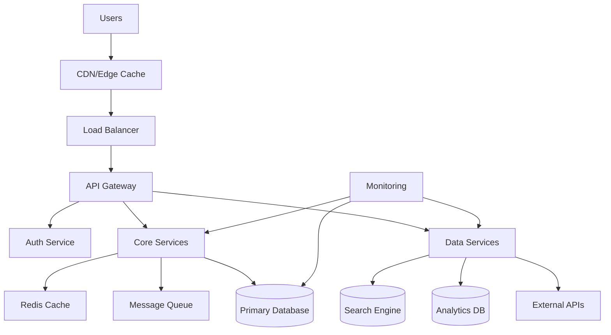
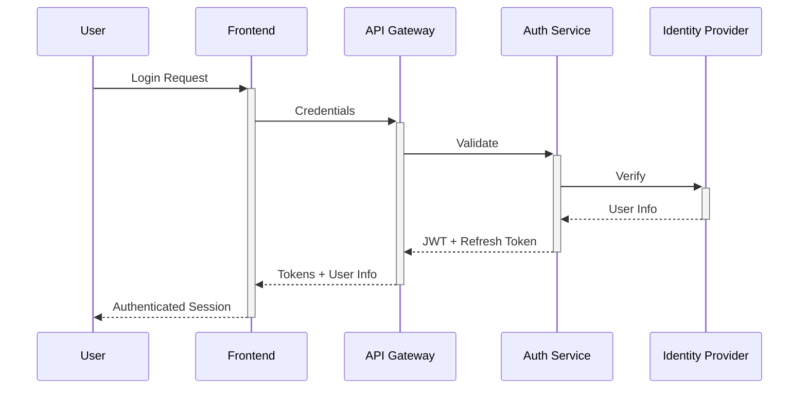
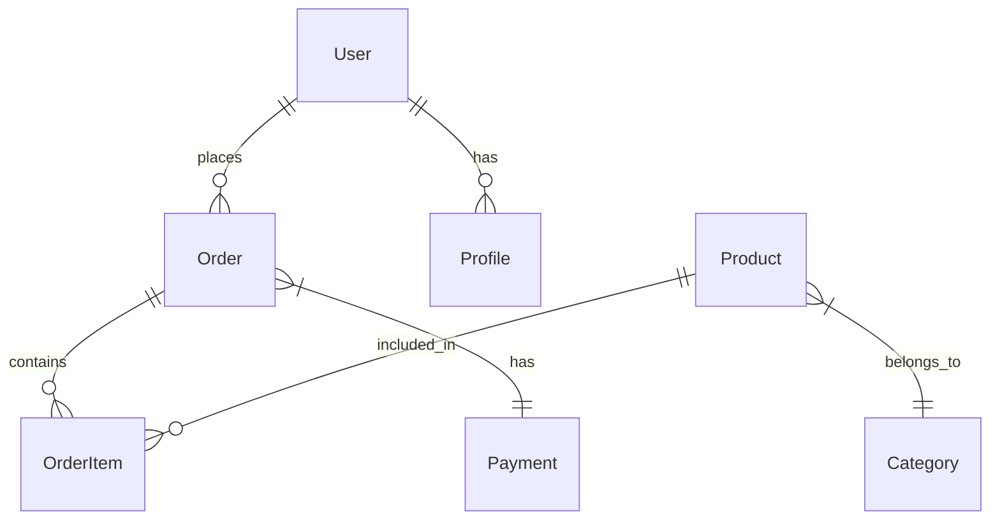
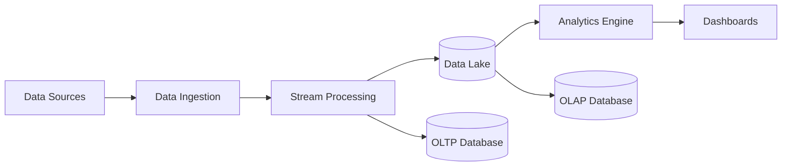
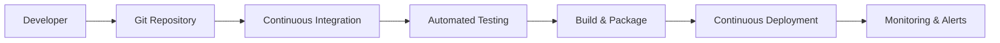

# 🏛️ System Architecture Design

**Metadata**
- Last Updated: {{DATE}}
- Maintainer: AI-Dev Toolkit

> **🎯 Purpose**
> Comprehensive system architecture specification covering technical design, security framework, performance requirements, and scalability considerations. This template ensures robust, maintainable, and enterprise-ready system design.

---

## 🔍 1. Architecture Context & Constraints

### 1.1 Business Context
**System Purpose:** _{High-level description of what the system does and why it exists}_
**Business Drivers:**
- **Scalability:** Support 10x user growth over 3 years
- **Reliability:** 99.9% uptime SLA for critical operations
- **Security:** Enterprise-grade data protection and compliance
- **Performance:** Sub-200ms response times for core operations

**Success Criteria:**
- Handle 100K concurrent users
- Process 1M transactions per day
- Support global deployment across 3 regions
- Maintain <2 second page load times

### 1.2 Technical Constraints
**Technology Stack Constraints:**
- **Platform:** Cloud-native, containerized architecture
- **Languages:** TypeScript/JavaScript, Python for data processing
- **Databases:** PostgreSQL primary, Redis caching, Elasticsearch search
- **Infrastructure:** AWS/Azure/GCP with Kubernetes orchestration

**Integration Requirements:**
- **External APIs:** Payment processors, authentication providers, analytics
- **Legacy Systems:** Enterprise resource planning, customer relationship management
- **Data Sources:** Internal databases, third-party data feeds, user-generated content

**Compliance Requirements:**
- **Data Privacy:** GDPR, CCPA compliance
- **Security Standards:** SOC 2 Type II, ISO 27001
- **Industry Regulations:** PCI DSS for payments, HIPAA for healthcare data

### 1.3 Quality Attributes
| Quality Attribute | Requirement | Measurement | Priority |
|-------------------|-------------|-------------|----------|
| **Performance** | 95th percentile <200ms | Response time monitoring | High |
| **Availability** | 99.9% uptime | SLA monitoring | Critical |
| **Scalability** | 10x capacity growth | Load testing | High |
| **Security** | Zero data breaches | Security audits | Critical |
| **Maintainability** | <2 week feature cycle | Development velocity | Medium |
| **Usability** | <3 clicks to core action | User analytics | High |

---

## 🏗️ 2. System Architecture Overview

### 2.1 High-Level Architecture


### 2.2 Architectural Patterns
**Primary Patterns:**
- **Microservices:** Domain-driven service decomposition
- **Event-Driven:** Asynchronous communication via message queues
- **CQRS:** Command Query Responsibility Segregation for read/write optimization
- **API Gateway:** Centralized API management and security

**Supporting Patterns:**
- **Circuit Breaker:** Fault tolerance for external dependencies
- **Bulkhead:** Resource isolation to prevent cascade failures
- **Saga:** Distributed transaction management
- **Backend for Frontend (BFF):** Optimized APIs per client type

### 2.3 Technology Stack
**Frontend Layer:**
- **Framework:** React 18 with TypeScript
- **State Management:** Redux Toolkit + RTK Query
- **UI Components:** Custom design system built on TailwindCSS
- **Build Tools:** Vite for development, Webpack for production
- **Testing:** Jest + React Testing Library + Cypress

**Backend Services:**
- **API Framework:** Node.js with Express/Fastify
- **Language:** TypeScript for type safety
- **Authentication:** OAuth 2.0 + JWT with refresh tokens
- **Documentation:** OpenAPI 3.0 with automated generation

**Data Layer:**
- **Primary Database:** PostgreSQL 14+ with read replicas
- **Caching:** Redis 7+ with clustering
- **Search:** Elasticsearch 8+ for full-text search
- **Message Queue:** Apache Kafka for event streaming
- **File Storage:** AWS S3/Azure Blob with CDN

**Infrastructure:**
- **Containerization:** Docker with multi-stage builds
- **Orchestration:** Kubernetes with Helm charts
- **Service Mesh:** Istio for traffic management and security
- **Monitoring:** Prometheus + Grafana + Jaeger tracing

---

## 🔐 3. Security Architecture

### 3.1 Security Framework
**Defense in Depth Strategy:**
```
Internet → WAF → Load Balancer → API Gateway → Services → Database
    ↓         ↓         ↓            ↓          ↓         ↓
  DDoS    SSL/TLS   Rate Limit   AuthN/AuthZ  RBAC   Encryption
 Protection  Term.   + Firewall  + Validation        at Rest
```

**Security Layers:**
1. **Network Security:** WAF, DDoS protection, VPN access
2. **Application Security:** Input validation, output encoding, CSRF protection
3. **Data Security:** Encryption at rest and in transit, key management
4. **Identity Security:** Multi-factor authentication, role-based access control
5. **Infrastructure Security:** Container scanning, vulnerability management

### 3.2 Authentication & Authorization
**Authentication Flow:**


**Authorization Model:**
- **Role-Based Access Control (RBAC):** Hierarchical permissions
- **Attribute-Based Access Control (ABAC):** Dynamic policy evaluation
- **Resource-Level Permissions:** Fine-grained access control
- **API Rate Limiting:** Per-user and per-endpoint limits

### 3.3 Data Protection
**Encryption Standards:**
- **Data in Transit:** TLS 1.3 for all communications
- **Data at Rest:** AES-256 encryption for databases and storage
- **Key Management:** Hardware Security Modules (HSM) or cloud KMS
- **Secrets Management:** Kubernetes secrets + external secret stores

**Privacy Controls:**
- **Data Classification:** Public, Internal, Confidential, Restricted
- **Data Retention:** Automated deletion based on policy
- **Data Anonymization:** PII removal for analytics and testing
- **Consent Management:** Granular consent tracking and enforcement

### 3.4 Security Monitoring
**Security Information and Event Management (SIEM):**
- **Log Aggregation:** Centralized logging with correlation rules
- **Threat Detection:** Behavioral analysis and anomaly detection
- **Incident Response:** Automated alerting and response playbooks
- **Compliance Monitoring:** Continuous compliance validation

**Security Metrics:**
| Metric | Target | Current | Alert Threshold |
|--------|--------|---------|-----------------|
| **Failed Login Attempts** | <5% | 2.1% | >10% |
| **API Security Violations** | 0 | 0 | >0 |
| **Vulnerability Scan Score** | A+ | A | <A |
| **Security Training Completion** | 100% | 95% | <90% |

---

## ⚡ 4. Performance Architecture

### 4.1 Performance Requirements
**Response Time Targets:**
| Operation Type | Target | Percentile | SLA |
|----------------|--------|------------|-----|
| **Page Load** | <2s | 95th | 99% |
| **API Calls** | <200ms | 95th | 99.5% |
| **Search** | <500ms | 90th | 99% |
| **File Upload** | <5s | 95th | 95% |

**Throughput Requirements:**
- **Concurrent Users:** 100,000 peak
- **API Requests:** 10,000 req/sec
- **Database Queries:** 50,000 queries/sec
- **File Processing:** 1,000 files/min

### 4.2 Performance Optimization Strategy
**Frontend Optimization:**
- **Code Splitting:** Dynamic imports for route-based chunking
- **Bundle Optimization:** Tree shaking, minification, compression
- **Caching Strategy:** Service workers for offline functionality
- **CDN Distribution:** Global edge caching for static assets

**Backend Optimization:**
- **Database Optimization:** Query optimization, indexing strategy
- **Caching Layers:** Redis for session data, application cache
- **Connection Pooling:** Optimized database connection management
- **Asynchronous Processing:** Background job processing

**Infrastructure Optimization:**
- **Auto-scaling:** Horizontal pod autoscaling based on metrics
- **Load Balancing:** Intelligent traffic distribution
- **Resource Allocation:** CPU/memory optimization per service
- **Network Optimization:** Service mesh for optimized routing

### 4.3 Caching Strategy
**Multi-Level Caching:**
```
Browser Cache → CDN Cache → API Gateway Cache → Application Cache → Database Cache
     ↓              ↓              ↓                ↓               ↓
   1 hour      24 hours       5 minutes        15 minutes    Query-specific
```

**Cache Implementation:**
| Layer | Technology | TTL | Strategy |
|-------|------------|-----|----------|
| **Browser** | HTTP Cache Headers | 1 hour | Static assets |
| **CDN** | CloudFlare/CloudFront | 24 hours | Global distribution |
| **API Gateway** | Built-in cache | 5 minutes | Response caching |
| **Application** | Redis Cluster | 15 minutes | Session + data |
| **Database** | Query cache | Dynamic | Query optimization |

### 4.4 Performance Monitoring
**Key Performance Indicators:**
- **Application Performance Monitoring (APM):** New Relic/DataDog
- **Real User Monitoring (RUM):** User experience metrics
- **Synthetic Monitoring:** Automated performance testing
- **Infrastructure Monitoring:** Resource utilization tracking

**Performance Metrics Dashboard:**
```yaml
metrics:
  response_time:
    p50: <100ms
    p95: <200ms
    p99: <500ms

  throughput:
    requests_per_second: target_10k
    concurrent_users: target_100k

  error_rates:
    4xx_errors: <2%
    5xx_errors: <0.1%

  infrastructure:
    cpu_utilization: <70%
    memory_utilization: <80%
    disk_utilization: <85%
```

---

## 📈 5. Scalability & High Availability

### 5.1 Scalability Design
**Horizontal Scaling Strategy:**
- **Stateless Services:** All application services designed stateless
- **Database Scaling:** Read replicas + sharding strategy
- **Auto-scaling:** Kubernetes HPA based on CPU/memory/custom metrics
- **Global Distribution:** Multi-region deployment with data replication

**Scaling Triggers:**
| Metric | Scale Up Threshold | Scale Down Threshold | Min/Max Replicas |
|--------|-------------------|---------------------|------------------|
| **CPU Usage** | >70% for 5 min | <30% for 10 min | 2/20 |
| **Memory Usage** | >80% for 5 min | <40% for 10 min | 2/20 |
| **Request Rate** | >80% capacity | <40% capacity | 2/50 |
| **Queue Length** | >1000 messages | <100 messages | 1/10 |

### 5.2 High Availability Architecture
**Availability Zones:**
```
Region A (Primary)     Region B (Secondary)     Region C (DR)
     ├─ AZ-1               ├─ AZ-1                ├─ AZ-1
     ├─ AZ-2               ├─ AZ-2                └─ AZ-2
     └─ AZ-3               └─ AZ-3
```

**Failover Strategy:**
- **Active-Active:** Primary regions serve traffic simultaneously
- **Active-Passive:** Secondary region for disaster recovery
- **Database Replication:** Streaming replication with automatic failover
- **Health Checks:** Comprehensive service health monitoring

### 5.3 Disaster Recovery Plan
**Recovery Time Objectives (RTO):**
- **Critical Services:** 15 minutes
- **Standard Services:** 1 hour
- **Non-critical Services:** 4 hours

**Recovery Point Objectives (RPO):**
- **Transactional Data:** 5 minutes (sync replication)
- **User Data:** 15 minutes (async replication)
- **Analytics Data:** 1 hour (batch replication)

**Backup Strategy:**
- **Database Backups:** Continuous WAL backup + daily full backup
- **File Storage:** Cross-region replication with versioning
- **Configuration:** GitOps with infrastructure as code
- **Testing:** Monthly disaster recovery drills

---

## 🔄 6. Data Architecture

### 6.1 Data Model Design
**Domain-Driven Design:**


**Data Partitioning Strategy:**
- **Horizontal Partitioning:** Time-based partitioning for logs/events
- **Vertical Partitioning:** Feature-based service databases
- **Sharding:** User-based sharding for high-volume tables
- **Archival:** Cold storage for historical data

### 6.2 Data Flow Architecture
**Data Pipeline:**


**Real-time Processing:**
- **Event Streaming:** Kafka for real-time data streams
- **Stream Processing:** Apache Kafka Streams for real-time analytics
- **Change Data Capture:** Database change event streaming
- **Event Sourcing:** Immutable event log for audit trails

### 6.3 Data Security & Governance
**Data Classification:**
- **Public:** Marketing content, documentation
- **Internal:** Business metrics, non-sensitive user data
- **Confidential:** User PII, financial data
- **Restricted:** Payment information, authentication data

**Data Governance Framework:**
- **Data Lineage:** Track data flow and transformations
- **Data Quality:** Automated data validation and monitoring
- **Access Control:** Fine-grained permissions per data classification
- **Retention Policies:** Automated data lifecycle management

---

## 🛠️ 7. DevOps & Deployment Architecture

### 7.1 CI/CD Pipeline
**Development Workflow:**


**Pipeline Stages:**
1. **Source Control:** Git with feature branch workflow
2. **Build:** Docker multi-stage builds with layer caching
3. **Test:** Unit, integration, security, and performance tests
4. **Security Scan:** Container and dependency vulnerability scanning
5. **Deploy:** Blue-green deployment with automated rollback
6. **Validate:** Health checks and smoke tests

### 7.2 Infrastructure as Code
**IaC Stack:**
- **Infrastructure:** Terraform for cloud resource provisioning
- **Configuration:** Ansible for server configuration management
- **Orchestration:** Kubernetes with Helm for application deployment
- **GitOps:** ArgoCD for declarative deployment management

**Environment Strategy:**
| Environment | Purpose | Auto-Deploy | Data |
|-------------|---------|-------------|------|
| **Development** | Feature development | Yes | Synthetic |
| **Staging** | Integration testing | Yes | Anonymized production |
| **Pre-Production** | Performance testing | Manual | Production mirror |
| **Production** | Live system | Manual | Real data |

### 7.3 Monitoring & Observability
**Observability Stack:**
- **Metrics:** Prometheus + Grafana for system metrics
- **Logging:** ELK Stack (Elasticsearch, Logstash, Kibana)
- **Tracing:** Jaeger for distributed tracing
- **APM:** Application Performance Monitoring tools

**Monitoring Strategy:**
```yaml
monitoring:
  infrastructure:
    - cpu_usage
    - memory_usage
    - disk_usage
    - network_io

  application:
    - response_times
    - error_rates
    - throughput
    - user_sessions

  business:
    - conversion_rates
    - user_engagement
    - revenue_metrics
    - feature_adoption

alerts:
  critical:
    - system_down
    - data_breach
    - payment_failures

  warning:
    - high_error_rate
    - slow_response_time
    - resource_exhaustion
```

---

## 📋 8. Architecture Decision Records

### 8.1 Key Architectural Decisions
#### ADR-001: Microservices vs Monolith
**Decision:** Adopt microservices architecture
**Rationale:** Team scalability, technology diversity, fault isolation
**Trade-offs:** Increased complexity for operational benefits

#### ADR-002: Database Strategy
**Decision:** PostgreSQL primary with domain-specific databases
**Rationale:** ACID compliance, mature ecosystem, SQL familiarity
**Trade-offs:** Potential scaling challenges vs consistency benefits

#### ADR-003: Frontend Framework
**Decision:** React with TypeScript
**Rationale:** Team expertise, ecosystem maturity, performance
**Trade-offs:** Bundle size vs developer productivity

### 8.2 Technology Evaluation Matrix
| Technology Choice | Alternatives Considered | Decision Factors | Confidence Level |
|-------------------|------------------------|------------------|------------------|
| **React** | Vue.js, Angular | Team skills, ecosystem | High |
| **PostgreSQL** | MySQL, MongoDB | ACID, SQL support | High |
| **Kubernetes** | Docker Swarm, ECS | Feature richness, community | Medium |
| **TypeScript** | JavaScript, Flow | Type safety, tooling | High |

---

## 🎯 9. Implementation Roadmap

### 9.1 Architecture Evolution
**Phase 1: Foundation (Months 1-3)**
- Core services implementation
- Basic security framework
- CI/CD pipeline setup
- Monitoring foundation

**Phase 2: Scale (Months 4-6)**
- Performance optimization
- Auto-scaling implementation
- Advanced security features
- Multi-region deployment

**Phase 3: Optimize (Months 7-12)**
- Advanced analytics
- Machine learning integration
- Edge computing capabilities
- Advanced automation

### 9.2 Migration Strategy
**Strangler Fig Pattern:**
1. **Parallel Implementation:** New services alongside legacy
2. **Gradual Migration:** Feature-by-feature transition
3. **Legacy Retirement:** Phase out old systems
4. **Data Migration:** Zero-downtime data transition

### 9.3 Success Metrics
| Phase | Key Metrics | Success Criteria |
|-------|-------------|------------------|
| **Foundation** | System uptime, basic functionality | 99% uptime, core features working |
| **Scale** | Performance, user capacity | <200ms response, 10K users |
| **Optimize** | Efficiency, advanced features | 50% cost reduction, ML features live |

---

## 📚 10. Architecture Documentation

### 10.1 Documentation Standards
**Required Documentation:**
- [ ] Architecture diagrams (C4 model)
- [ ] API specifications (OpenAPI)
- [ ] Database schema documentation
- [ ] Security model documentation
- [ ] Deployment runbooks
- [ ] Disaster recovery procedures

### 10.2 Architecture Review Process
**Review Cycle:**
- **Weekly:** Technical design reviews
- **Monthly:** Architecture health assessment
- **Quarterly:** Strategic architecture review
- **Annually:** Complete architecture audit

**Review Checklist:**
- [ ] Performance requirements met
- [ ] Security standards followed
- [ ] Scalability requirements addressed
- [ ] Maintainability ensured
- [ ] Documentation updated

---

**🏛️ Architecture Success Criteria:**
- System handles target load (100K users)
- Security requirements met (zero breaches)
- Performance SLAs achieved (99.9% uptime)
- Scalability demonstrated (10x growth ready)
- Team productivity maintained (2-week feature cycles)

**Next Steps:** Implement architecture foundation and proceed to frontend specification (16_frontend_spec.md).
