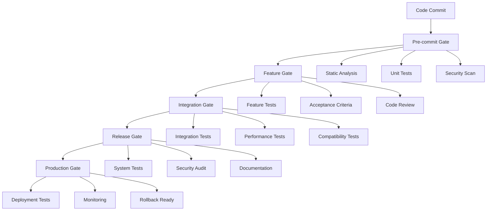
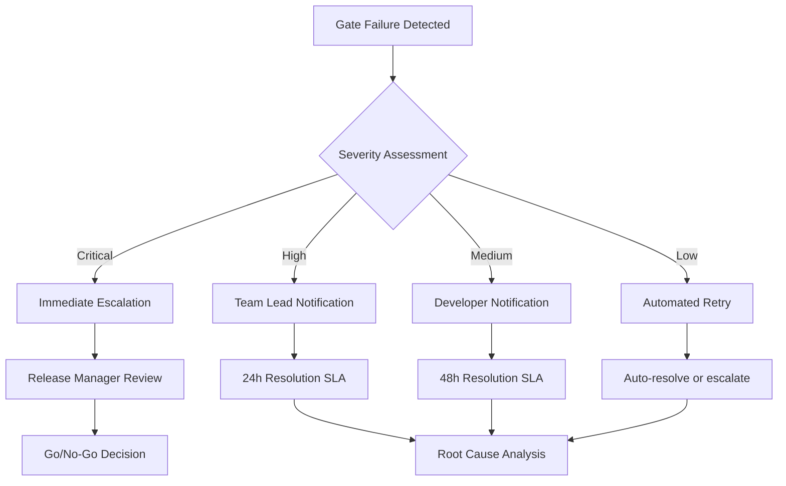

# 🛡️ Quality Assurance Gate & Release Readiness Framework

**Metadata**
- Last Updated: {{DATE}}
- Maintainer: AI-Dev Toolkit
- Related Docs: Consumes 11_acceptance_criteria.md, feeds 18_release_plan.md, 17_test_plan.md

> **🎯 Purpose**
> Comprehensive quality gate framework ensuring enterprise-grade software quality through multi-layered validation. This framework establishes mandatory quality checkpoints that prevent defects from reaching production while maintaining development velocity.

---

## 🚦 1. Quality Gate Framework & Standards

### 1.1 Quality Gate Hierarchy
**Gate Levels:**


### 1.2 Gate Success Criteria
| Gate Level | Success Threshold | Automated | Manual Review | Escalation Path |
|------------|------------------|-----------|---------------|-----------------|
| **Pre-commit** | 100% pass | ✅ | ❌ | Block commit |
| **Feature** | 95% pass | ✅ | ✅ | Team lead review |
| **Integration** | 98% pass | ✅ | ✅ | QA manager approval |
| **Release** | 100% pass | ✅ | ✅ | Release manager sign-off |
| **Production** | 100% pass | ✅ | ✅ | Emergency rollback |

### 1.3 Quality Metrics Standards
**Core Quality Metrics:**
- **Code Coverage:** ≥80% (critical paths 100%)
- **Defect Density:** <1 bug per 100 lines of code
- **Security Vulnerabilities:** Zero high/critical issues
- **Performance Degradation:** <5% from baseline
- **Documentation Coverage:** 100% public APIs

---

## 🔒 2. Pre-Commit Quality Gate

### 2.1 Static Code Analysis
**Automated Checks (Must Pass 100%):**
```yaml
static_analysis:
  code_quality:
    - sonarqube_quality_gate: passed
    - complexity_score: <10 per function
    - maintainability_index: >20
    - code_duplication: <3%

  security_analysis:
    - sonarqube_security: no_high_issues
    - dependency_scan: no_vulnerabilities
    - secrets_detection: no_secrets
    - license_compliance: approved_only

  style_compliance:
    - linting_errors: 0
    - formatting_consistent: true
    - naming_conventions: enforced
    - import_organization: standardized
```

**Quality Checklist:**
- [ ] **ESLint/TSLint:** Zero errors, warnings under threshold
- [ ] **Prettier:** Code formatting consistent
- [ ] **SonarQube:** Quality gate passed
- [ ] **Dependency Check:** No vulnerable dependencies
- [ ] **License Scan:** Only approved licenses used
- [ ] **Secret Detection:** No hardcoded secrets found
- [ ] **Type Safety:** TypeScript strict mode compliance
- [ ] **Dead Code:** No unreachable or unused code

### 2.2 Unit Testing Requirements
**Coverage Thresholds:**
```javascript
// Jest configuration example
module.exports = {
  coverageThreshold: {
    global: {
      branches: 80,
      functions: 85,
      lines: 80,
      statements: 80
    },
    './src/critical-modules/': {
      branches: 100,
      functions: 100,
      lines: 100,
      statements: 100
    }
  }
};
```

**Unit Test Quality Standards:**
- [ ] **Coverage Target:** ≥80% overall, 100% for critical paths
- [ ] **Test Quality:** Each test validates single responsibility
- [ ] **Mock Strategy:** External dependencies properly mocked
- [ ] **Edge Cases:** Boundary conditions tested
- [ ] **Error Handling:** Exception scenarios covered
- [ ] **Performance:** Test suite runs in <60 seconds
- [ ] **Deterministic:** Tests pass consistently (no flaky tests)
- [ ] **Documentation:** Complex test scenarios documented

### 2.3 Pre-commit Hook Configuration
```bash
#!/bin/sh
# .pre-commit-hook example

# Run static analysis
npm run lint:check || exit 1
npm run type:check || exit 1
npm run format:check || exit 1

# Run unit tests
npm run test:unit || exit 1

# Security scan
npm audit --audit-level high || exit 1
npm run security:scan || exit 1

# Documentation check
npm run docs:validate || exit 1

echo "✅ Pre-commit checks passed"
```

---

## 🎯 3. Feature Quality Gate

### 3.1 Functional Testing Validation
**Feature Acceptance Criteria:**
```gherkin
# Example feature gate validation
Feature: Feature Quality Gate Validation

  Scenario: All acceptance criteria verified
    Given a feature has been implemented
    When the feature gate validation runs
    Then all acceptance criteria should be verified as passing
    And manual testing should confirm expected behavior
    And edge cases should be validated
    And error handling should be confirmed

  Scenario: Cross-browser compatibility confirmed
    Given the feature affects user interface
    When compatibility testing is performed
    Then the feature should work in Chrome, Firefox, Safari, Edge
    And mobile responsiveness should be confirmed
    And accessibility standards should be met
    And performance should be acceptable across browsers
```

**Feature Testing Checklist:**
- [ ] **Acceptance Criteria:** All scenarios pass
- [ ] **User Story Validation:** Feature meets stated requirements
- [ ] **Happy Path Testing:** Core functionality verified
- [ ] **Error Scenarios:** Exception handling confirmed
- [ ] **Data Validation:** Input validation working correctly
- [ ] **UI/UX Review:** Design specifications met
- [ ] **Accessibility:** WCAG 2.1 AA compliance verified
- [ ] **Mobile Compatibility:** Responsive design confirmed

### 3.2 Code Review Standards
**Mandatory Review Checklist:**
```markdown
## Code Review Checklist

### Functionality
- [ ] Code implements requirements correctly
- [ ] Edge cases are handled appropriately
- [ ] Error handling is comprehensive
- [ ] Performance implications considered

### Code Quality
- [ ] Code is readable and maintainable
- [ ] Functions have single responsibility
- [ ] Naming conventions followed
- [ ] Comments explain complex logic

### Security
- [ ] No sensitive data exposed
- [ ] Input validation implemented
- [ ] Authentication/authorization correct
- [ ] SQL injection prevention in place

### Testing
- [ ] Adequate test coverage provided
- [ ] Tests are meaningful and robust
- [ ] Mock strategies appropriate
- [ ] Integration points tested

### Documentation
- [ ] Public APIs documented
- [ ] Complex algorithms explained
- [ ] Configuration changes noted
- [ ] Migration steps provided
```

**Review Approval Requirements:**
- Minimum 2 reviewers for critical features
- At least 1 senior developer approval
- Security team review for security-related changes
- Architecture team review for structural changes

### 3.3 Feature Branch Validation
**Automated Feature Gate Pipeline:**
```yaml
# GitHub Actions example
name: Feature Quality Gate

on:
  pull_request:
    branches: [ develop ]

jobs:
  quality-gate:
    runs-on: ubuntu-latest

    steps:
    - name: Checkout code
      uses: actions/checkout@v3

    - name: Run unit tests
      run: npm run test:unit:coverage

    - name: Run integration tests
      run: npm run test:integration

    - name: Security scan
      run: npm run security:full-scan

    - name: Performance benchmarks
      run: npm run performance:baseline

    - name: Code quality analysis
      run: npm run quality:sonar

    - name: Documentation validation
      run: npm run docs:verify

    - name: Feature gate report
      run: npm run gate:feature-report
```

---

## 🔗 4. Integration Quality Gate

### 4.1 Integration Testing Framework
**API Integration Testing:**
```javascript
// Example integration test structure
describe('Payment Integration Tests', () => {
  beforeAll(async () => {
    // Setup test database
    await setupTestDatabase();
    // Initialize external service mocks
    await initializeServiceMocks();
  });

  describe('Stripe Payment Flow', () => {
    it('should process successful payment end-to-end', async () => {
      // Test complete payment flow
      const paymentResult = await processPayment({
        amount: 2999,
        currency: 'usd',
        paymentMethod: 'pm_card_visa'
      });

      expect(paymentResult.status).toBe('succeeded');
      expect(paymentResult.amount).toBe(2999);

      // Verify database state
      const order = await getOrderById(paymentResult.orderId);
      expect(order.status).toBe('paid');
    });

    it('should handle payment failures gracefully', async () => {
      const paymentResult = await processPayment({
        amount: 2999,
        currency: 'usd',
        paymentMethod: 'pm_card_chargeDeclined'
      });

      expect(paymentResult.status).toBe('requires_payment_method');
      expect(paymentResult.last_payment_error).toBeDefined();
    });
  });
});
```

**Integration Test Requirements:**
- [ ] **API Contracts:** All endpoints validate schema compliance
- [ ] **Database Interactions:** Data integrity maintained
- [ ] **External Services:** Third-party integrations working
- [ ] **Message Queues:** Async processing validated
- [ ] **File Operations:** Upload/download functionality tested
- [ ] **Email Services:** Notification delivery confirmed
- [ ] **Payment Processing:** Financial transactions validated
- [ ] **Authentication:** SSO and OAuth flows tested

### 4.2 Performance Testing Validation
**Load Testing Requirements:**
```yaml
# K6 performance test configuration
performance_tests:
  load_test:
    virtual_users: 100
    duration: '10m'
    thresholds:
      http_req_duration:
        - 'p(95)<2000'  # 95% of requests under 2s
        - 'p(99)<5000'  # 99% of requests under 5s
      http_req_failed: ['rate<0.01']  # Error rate under 1%

  stress_test:
    virtual_users: 500
    duration: '5m'
    thresholds:
      http_req_duration: ['p(95)<5000']
      http_req_failed: ['rate<0.05']

  spike_test:
    stages:
      - duration: '1m', target: 100
      - duration: '30s', target: 500
      - duration: '1m', target: 100
```

**Performance Benchmarks:**
- [ ] **Response Time:** API endpoints <500ms (95th percentile)
- [ ] **Throughput:** System handles 1000 concurrent users
- [ ] **Resource Usage:** CPU <70%, Memory <80%
- [ ] **Database Performance:** Query times <100ms average
- [ ] **Frontend Performance:** Page load <2 seconds
- [ ] **Mobile Performance:** Mobile experience <3 seconds
- [ ] **CDN Performance:** Static assets <500ms globally
- [ ] **Cache Efficiency:** Cache hit ratio >90%

### 4.3 Security Integration Testing
**Security Test Suite:**
```python
# Example security integration tests
class SecurityIntegrationTests(unittest.TestCase):

    def test_authentication_required(self):
        """Test that protected endpoints require authentication"""
        response = self.client.get('/api/user/profile')
        self.assertEqual(response.status_code, 401)

    def test_authorization_enforced(self):
        """Test that users can only access authorized resources"""
        user_token = self.get_user_token('regular_user')
        response = self.client.get(
            '/api/admin/users',
            headers={'Authorization': f'Bearer {user_token}'}
        )
        self.assertEqual(response.status_code, 403)

    def test_input_validation(self):
        """Test that malicious input is properly sanitized"""
        malicious_input = "<script>alert('xss')</script>"
        response = self.client.post('/api/comments', json={
            'content': malicious_input
        })

        # Verify XSS prevention
        comment = response.json()
        self.assertNotIn('<script>', comment['content'])

    def test_sql_injection_prevention(self):
        """Test that SQL injection attempts are blocked"""
        malicious_query = "'; DROP TABLE users; --"
        response = self.client.get(f'/api/search?q={malicious_query}')

        # Should not cause database error
        self.assertNotEqual(response.status_code, 500)
```

**Security Gate Requirements:**
- [ ] **Authentication Testing:** Login flows secure
- [ ] **Authorization Testing:** Access controls enforced
- [ ] **Input Validation:** XSS and injection prevention
- [ ] **Session Management:** Session security verified
- [ ] **Data Encryption:** Sensitive data protected
- [ ] **API Security:** Rate limiting and validation
- [ ] **Infrastructure Security:** Network security tested
- [ ] **Compliance Validation:** GDPR/SOX requirements met

---

## 🚀 5. Release Quality Gate

### 5.1 System-Level Testing
**End-to-End Test Suite:**
```yaml
# Cypress E2E test configuration
e2e_tests:
  user_journeys:
    - user_registration_flow
    - login_and_dashboard_access
    - payment_processing_flow
    - data_export_functionality
    - account_settings_management

  cross_browser_testing:
    browsers: [chrome, firefox, safari, edge]
    viewports: [desktop, tablet, mobile]

  accessibility_testing:
    standards: wcag_2_1_aa
    tools: [axe-core, lighthouse]

  performance_testing:
    lighthouse_scores:
      performance: '>90'
      accessibility: '>95'
      best_practices: '>90'
      seo: '>90'
```

**System Test Requirements:**
- [ ] **User Journey Testing:** Critical paths work end-to-end
- [ ] **Cross-Browser Testing:** Functionality across browsers
- [ ] **Mobile Testing:** Mobile experience validated
- [ ] **Accessibility Testing:** WCAG compliance verified
- [ ] **Performance Testing:** Core web vitals met
- [ ] **SEO Testing:** Search optimization validated
- [ ] **Backup/Recovery:** Data backup procedures tested
- [ ] **Disaster Recovery:** System recovery validated

### 5.2 Production Readiness Assessment
**Infrastructure Validation:**
```yaml
# Production readiness checklist
production_readiness:
  infrastructure:
    - monitoring_configured: true
    - alerting_setup: true
    - logging_centralized: true
    - backup_strategy: implemented
    - scaling_configuration: ready
    - security_hardening: complete

  deployment:
    - blue_green_deployment: configured
    - rollback_procedures: documented
    - database_migrations: tested
    - environment_parity: verified
    - secrets_management: secure
    - ssl_certificates: valid

  operations:
    - runbooks_updated: true
    - on_call_procedures: documented
    - incident_response: tested
    - capacity_planning: complete
    - performance_baselines: established
    - sla_definitions: agreed
```

**Production Gate Checklist:**
- [ ] **Deployment Automation:** CI/CD pipeline tested
- [ ] **Environment Parity:** Staging matches production
- [ ] **Database Migrations:** Schema changes validated
- [ ] **Configuration Management:** Environment variables set
- [ ] **Monitoring Setup:** Application monitoring active
- [ ] **Alerting Configuration:** Critical alerts defined
- [ ] **Log Aggregation:** Centralized logging configured
- [ ] **Security Hardening:** Production security measures

### 5.3 Release Documentation Requirements
**Documentation Validation:**
```markdown
## Release Documentation Checklist

### User-Facing Documentation
- [ ] Feature documentation updated
- [ ] API documentation current
- [ ] User guides revised
- [ ] Changelog prepared
- [ ] Migration guides provided

### Technical Documentation
- [ ] Architecture diagrams updated
- [ ] Database schema documented
- [ ] Configuration changes noted
- [ ] Deployment procedures updated
- [ ] Troubleshooting guides current

### Operational Documentation
- [ ] Runbooks updated
- [ ] Monitoring procedures documented
- [ ] Incident response procedures current
- [ ] Rollback procedures tested
- [ ] Support procedures updated
```

---

## 📊 6. Quality Metrics & Monitoring

### 6.1 Real-time Quality Dashboard
**Quality Metrics Tracking:**
```yaml
# Quality metrics configuration
quality_metrics:
  code_quality:
    - technical_debt_ratio: <20%
    - code_coverage: >80%
    - duplication_ratio: <3%
    - maintainability_index: >20

  defect_metrics:
    - bugs_per_kloc: <1
    - critical_bugs: 0
    - security_vulnerabilities: 0
    - performance_regressions: 0

  process_metrics:
    - gate_pass_rate: >95%
    - review_cycle_time: <24h
    - time_to_production: <2weeks
    - rollback_frequency: <1%
```

**Quality Dashboard Components:**
- **Real-time Gate Status:** Current gate pass/fail rates
- **Trend Analysis:** Quality metrics over time
- **Bottleneck Identification:** Gate failure patterns
- **Team Performance:** Quality metrics by team
- **Predictive Analytics:** Quality risk assessment

### 6.2 Quality Gate Metrics
**Gate Performance Tracking:**
| Gate Level | Success Rate | Avg Duration | Common Failures | Improvement Actions |
|------------|-------------|--------------|-----------------|-------------------|
| **Pre-commit** | 95% | 3 minutes | Test failures | Developer training |
| **Feature** | 92% | 2 hours | Review issues | Review guidelines |
| **Integration** | 89% | 4 hours | Integration bugs | Test improvements |
| **Release** | 96% | 8 hours | Documentation | Doc automation |
| **Production** | 99% | 1 hour | Config issues | Config validation |

### 6.3 Continuous Improvement Framework
**Quality Gate Optimization:**
1. **Weekly Gate Review:** Analyze gate failures and bottlenecks
2. **Monthly Process Review:** Update gate criteria based on feedback
3. **Quarterly Standards Review:** Evolve quality standards
4. **Annual Framework Assessment:** Major framework improvements

**Feedback Loop Integration:**
- Collect feedback from development teams
- Analyze gate effectiveness metrics
- Implement process improvements
- Measure improvement impact
- Share best practices across teams

---

## 🚨 7. Gate Failure & Escalation Procedures

### 7.1 Gate Failure Response
**Immediate Actions:**


**Escalation Matrix:**
| Failure Type | Severity | Response Time | Escalation Path | Resolution SLA |
|--------------|----------|---------------|-----------------|----------------|
| **Security Critical** | P0 | Immediate | CISO → CTO | 4 hours |
| **Production Blocker** | P1 | 15 minutes | Release Manager | 24 hours |
| **Feature Incomplete** | P2 | 1 hour | Team Lead | 48 hours |
| **Documentation Gap** | P3 | 4 hours | Tech Writer | 1 week |

### 7.2 Gate Override Procedures
**Emergency Override Process:**
```yaml
# Override authorization levels
gate_override:
  pre_commit:
    authorization: team_lead
    documentation: required
    post_override_action: immediate_fix

  feature:
    authorization: engineering_manager
    documentation: detailed_justification
    post_override_action: technical_debt_tracking

  integration:
    authorization: qa_manager + release_manager
    documentation: risk_assessment
    post_override_action: expedited_fix_timeline

  release:
    authorization: cto_approval
    documentation: business_justification
    post_override_action: immediate_hotfix_plan

  production:
    authorization: incident_commander
    documentation: incident_report
    post_override_action: post_mortem_required
```

**Override Documentation Requirements:**
- **Business Justification:** Why override is necessary
- **Risk Assessment:** Potential impact of proceeding
- **Mitigation Plan:** Steps to address issues post-release
- **Timeline:** When issues will be resolved
- **Stakeholder Approval:** Required sign-offs obtained

### 7.3 Quality Debt Management
**Technical Debt Tracking:**
```javascript
// Technical debt tracking structure
const technicalDebt = {
  id: 'TD-2024-001',
  type: 'gate_override',
  severity: 'high',
  description: 'Security scan bypassed for urgent release',
  created: '2024-01-15',
  owner: 'security-team',
  resolveBy: '2024-01-22',
  effort: '3 story points',
  businessImpact: 'potential security vulnerability',
  resolutionPlan: 'Implement missing security controls',
  trackingEpic: 'SEC-2024-Q1'
};
```

**Debt Resolution Process:**
1. **Documentation:** All overrides create technical debt tickets
2. **Prioritization:** Debt prioritized in next sprint planning
3. **Resolution:** Debt addressed within agreed timeline
4. **Validation:** Resolution verified through gates
5. **Closure:** Debt ticket closed with verification

---

## 📈 8. Quality Gate Success Metrics

### 8.1 Key Performance Indicators
**Gate Effectiveness Metrics:**
- **Gate Pass Rate:** 95% target across all gates
- **Defect Escape Rate:** <1% defects reach production
- **Time to Resolution:** Average gate failure resolution <24h
- **Process Efficiency:** Gate overhead <10% of development time
- **Quality Improvement:** 20% YoY defect reduction

### 8.2 Business Impact Metrics
**Quality Business Value:**
- **Production Incidents:** 50% reduction in severity 1/2 incidents
- **Customer Satisfaction:** 95% satisfaction with software quality
- **Development Velocity:** Maintained while improving quality
- **Cost of Quality:** <15% of total development cost
- **Time to Market:** Quality gates improve overall delivery time

### 8.3 Continuous Monitoring
**Automated Quality Reporting:**
```yaml
# Quality monitoring configuration
quality_monitoring:
  daily_reports:
    - gate_pass_rates
    - active_quality_debt
    - critical_issues_count
    - process_efficiency_metrics

  weekly_reports:
    - quality_trends
    - team_performance
    - bottleneck_analysis
    - improvement_opportunities

  monthly_reports:
    - quality_scorecard
    - business_impact_analysis
    - process_maturity_assessment
    - strategic_recommendations
```

---

**🛡️ Quality Gate Success Metrics:**
- Gate pass rate: 95%+
- Defect escape rate: <1%
- Production incident reduction: 50%+
- Development efficiency: <10% overhead
- Team satisfaction with quality process: 8.5+/10

**Next Steps:** Implement quality gates across development pipeline and integrate with comprehensive testing strategy (17_test_plan.md) and release planning (18_release_plan.md).
