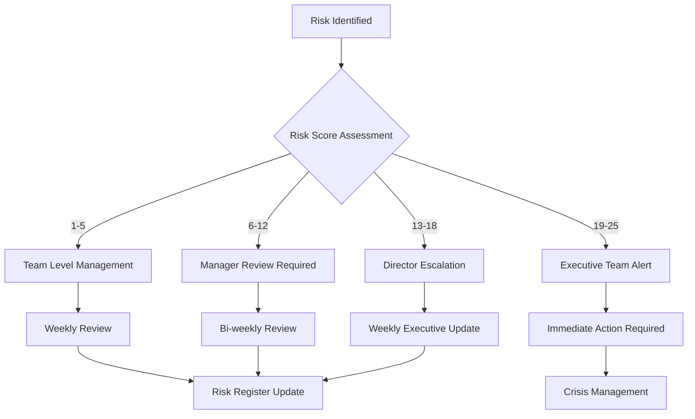

# 🎯 Enterprise Risk Register & Management Framework

**Metadata**
- Last Updated: {{DATE}}
- Maintainer: AI-Dev Toolkit
- Related Docs: Consumes 01_prd.md, 06_architecture.md, feeds 18_release_plan.md, 21_postmortem.md

> **🎯 Purpose**
> Comprehensive enterprise risk management framework for identifying, assessing, tracking, and mitigating project risks across technical, business, and operational domains. This register enables proactive risk management and informed decision-making throughout the project lifecycle.

---

## 🎲 1. Risk Management Framework & Standards

### 1.1 Risk Assessment Matrix
**Probability Scale (1-5):**
- **1 - Very Low:** <5% chance of occurrence
- **2 - Low:** 5-25% chance of occurrence
- **3 - Medium:** 25-50% chance of occurrence
- **4 - High:** 50-75% chance of occurrence
- **5 - Very High:** >75% chance of occurrence

**Impact Scale (1-5):**
- **1 - Minimal:** <1 week delay, <$10K cost impact
- **2 - Minor:** 1-2 weeks delay, $10K-50K cost impact
- **3 - Moderate:** 2-4 weeks delay, $50K-200K cost impact
- **4 - Major:** 1-3 months delay, $200K-1M cost impact
- **5 - Critical:** >3 months delay, >$1M cost impact

**Risk Score Calculation:** `Risk Score = Probability × Impact`

### 1.2 Risk Categories & Classification
| Category | Icon | Description | Escalation Level | Review Frequency |
|----------|------|-------------|------------------|------------------|
| **Technical** | ⚙️ | Architecture, development, infrastructure | CTO | Weekly |
| **Security** | 🔒 | Data breaches, compliance, vulnerabilities | CISO | Daily |
| **Business** | 💼 | Market, competition, strategy | CEO | Monthly |
| **Operational** | 🔧 | Resources, processes, dependencies | COO | Weekly |
| **Financial** | 💰 | Budget, funding, cost overruns | CFO | Monthly |
| **Legal** | ⚖️ | Compliance, contracts, IP | Legal | Quarterly |
| **Regulatory** | 📋 | Industry regulations, standards | Compliance | Monthly |

### 1.3 Risk Response Strategies
**Response Options:**
- **Accept:** Acknowledge risk and proceed without specific action
- **Avoid:** Change plans to eliminate the risk entirely
- **Mitigate:** Reduce probability or impact through specific actions
- **Transfer:** Shift risk to third party (insurance, vendors)
- **Monitor:** Track risk that may require future action

---

## 🚨 2. High-Priority Risk Register

### 2.1 Critical Technical Risks (Risk Score 15-25)

#### RISK-001: Legacy System Integration Failure
**Category:** Technical ⚙️
**Probability:** 4 (High) | **Impact:** 5 (Critical) | **Risk Score:** 20

**Description:**
Integration with legacy ERP system may fail due to outdated APIs and poor documentation, potentially blocking core business functionality.

**Root Causes:**
- 20-year-old legacy system with minimal documentation
- Custom protocols not following modern standards
- Limited technical expertise on legacy system
- No test environment for legacy system available

**Impact Analysis:**
- **Business Impact:** Complete halt of order processing ($500K/day revenue loss)
- **Technical Impact:** 3-month delay in product launch
- **Customer Impact:** Inability to fulfill existing customer orders
- **Reputation Impact:** Major customer confidence issues

**Mitigation Strategy:**
- **Primary Action:** Develop robust adapter layer with fallback mechanisms
- **Timeline:** 6 weeks before integration deadline
- **Owner:** Senior Integration Architect
- **Budget:** $150K for external legacy system consultant
- **Success Criteria:** Successfully process 100 test transactions

**Contingency Plan:**
- **Fallback Option:** Manual order processing workflow
- **Trigger Criteria:** Integration testing fails after 4 weeks
- **Resource Requirements:** 10 additional customer service staff
- **Cost Impact:** $200K/month operational overhead

**Monitoring & Control:**
- **KPIs:** Integration test success rate, data consistency checks
- **Review Frequency:** Weekly technical reviews
- **Escalation Trigger:** <80% integration test success rate
- **Status Updates:** Daily standup reports to CTO

#### RISK-002: Scalability Performance Bottlenecks
**Category:** Technical ⚙️
**Probability:** 3 (Medium) | **Impact:** 4 (Major) | **Risk Score:** 12

**Description:**
System may not handle expected user load during peak traffic, leading to performance degradation and potential service outages.

**Root Causes:**
- Unproven architecture at scale
- Limited load testing capabilities
- Database queries not optimized for high volume
- Insufficient caching strategy

**Impact Analysis:**
- **Performance Impact:** Response times >5 seconds during peak load
- **User Impact:** 40% user drop-off due to poor performance
- **Revenue Impact:** $100K/month in lost conversions
- **Infrastructure Impact:** Emergency scaling costs

**Mitigation Strategy:**
- **Load Testing:** Comprehensive performance testing with 10x expected load
- **Architecture Review:** Database optimization and caching implementation
- **Infrastructure:** Auto-scaling and CDN implementation
- **Monitoring:** Real-time performance monitoring and alerting

**Success Metrics:**
- Response times <2 seconds at 5x expected load
- 99.9% uptime during peak traffic periods
- Auto-scaling triggers working within 30 seconds
- Database query performance <100ms average

### 2.2 Security & Compliance Risks

#### RISK-003: Data Privacy Regulation Compliance Failure
**Category:** Legal ⚖️
**Probability:** 3 (Medium) | **Impact:** 5 (Critical) | **Risk Score:** 15

**Description:**
Failure to comply with GDPR, CCPA, and other data privacy regulations could result in significant fines and legal challenges.

**Regulatory Requirements:**
- **GDPR:** EU data protection regulation (fines up to 4% of revenue)
- **CCPA:** California consumer privacy act requirements
- **HIPAA:** Health data protection standards (if applicable)
- **SOX:** Financial data compliance requirements

**Compliance Gap Analysis:**
| Requirement | Current Status | Gap | Risk Level |
|-------------|----------------|-----|------------|
| **Data Consent Management** | Partial | Missing explicit consent UI | High |
| **Right to Deletion** | Not Implemented | Complete gap | Critical |
| **Data Portability** | Planned | 6 weeks behind schedule | Medium |
| **Breach Notification** | Basic | Missing automated workflows | High |
| **Data Encryption** | Implemented | Compliant | Low |

**Mitigation Strategy:**
- **Legal Review:** Comprehensive compliance audit with external counsel
- **Technical Implementation:** Privacy-by-design architecture
- **Process Implementation:** Data handling procedures and training
- **Documentation:** Compliance documentation and audit trails

**Compliance Roadmap:**
1. **Week 1-2:** External compliance audit and gap analysis
2. **Week 3-6:** Implement consent management and deletion workflows
3. **Week 7-8:** Data portability and breach notification systems
4. **Week 9-10:** Staff training and documentation completion
5. **Week 11-12:** Final compliance validation and certification

#### RISK-004: Security Breach / Cyber Attack
**Category:** Security 🔒
**Probability:** 2 (Low) | **Impact:** 5 (Critical) | **Risk Score:** 10

**Description:**
Potential security breach could expose customer data, disrupt operations, and damage company reputation.

**Attack Vectors:**
- **SQL Injection:** Database vulnerabilities
- **Cross-Site Scripting (XSS):** Frontend input validation gaps
- **API Security:** Insufficient authentication/authorization
- **Social Engineering:** Staff-targeted phishing attacks
- **Infrastructure:** Cloud misconfiguration vulnerabilities

**Security Controls Assessment:**
```yaml
security_controls:
  authentication:
    status: implemented
    coverage: 95%
    gaps: ["MFA for admin accounts", "session timeout"]

  authorization:
    status: partial
    coverage: 80%
    gaps: ["role-based access control", "API rate limiting"]

  data_protection:
    status: implemented
    coverage: 90%
    gaps: ["field-level encryption", "key rotation"]

  monitoring:
    status: basic
    coverage: 60%
    gaps: ["SIEM integration", "anomaly detection"]
```

**Mitigation Strategy:**
- **Security Assessment:** Third-party penetration testing
- **Technical Controls:** WAF, DDoS protection, encryption at rest/transit
- **Process Controls:** Security training, incident response procedures
- **Monitoring:** 24/7 SOC monitoring and threat detection

### 2.3 Business & Operational Risks

#### RISK-005: Key Personnel Departure
**Category:** Operational 🔧
**Probability:** 3 (Medium) | **Impact:** 4 (Major) | **Risk Score:** 12

**Description:**
Loss of critical team members could significantly impact project timeline and quality.

**Critical Personnel Assessment:**
| Role | Risk Level | Impact | Knowledge Documentation | Backup |
|------|------------|--------|-------------------------|--------|
| **Lead Architect** | High | Project delay 6-8 weeks | 60% documented | 1 person |
| **DevOps Engineer** | High | Deployment issues | 40% documented | None |
| **Product Owner** | Medium | Requirements gaps | 80% documented | 1 person |
| **Security Engineer** | High | Compliance delays | 50% documented | External |

**Mitigation Strategy:**
- **Knowledge Transfer:** Comprehensive documentation and cross-training
- **Retention:** Competitive compensation and career development
- **Backup Planning:** Identify and train backup personnel
- **External Support:** Establish relationships with consulting firms

**Knowledge Management Plan:**
1. **Documentation:** All critical processes and decisions documented
2. **Cross-training:** Each critical role has trained backup
3. **Video Recording:** Complex procedures recorded for reference
4. **External Relationships:** Consultant relationships for emergency support

#### RISK-006: Third-Party Vendor Service Disruption
**Category:** Operational 🔧
**Probability:** 2 (Low) | **Impact:** 4 (Major) | **Risk Score:** 8

**Description:**
Critical third-party services (AWS, Stripe, Auth0) could experience outages affecting our system availability.

**Vendor Dependency Analysis:**
| Vendor | Service | Criticality | SLA | Backup Plan |
|--------|---------|-------------|-----|-------------|
| **AWS** | Infrastructure | Critical | 99.99% | Multi-region deployment |
| **Stripe** | Payments | Critical | 99.99% | PayPal backup integration |
| **Auth0** | Authentication | High | 99.9% | Custom auth fallback |
| **SendGrid** | Email | Medium | 99.9% | AWS SES backup |
| **Datadog** | Monitoring | Low | 99.9% | CloudWatch fallback |

**Vendor Risk Mitigation:**
- **Multi-vendor Strategy:** Critical services have backup vendors
- **Geographic Distribution:** Services distributed across regions
- **SLA Monitoring:** Real-time vendor performance monitoring
- **Contractual Protection:** SLA guarantees and penalty clauses

---

## 📊 3. Medium-Priority Risk Register

### 3.1 Technical Risks (Risk Score 6-12)

#### RISK-007: API Rate Limiting and Third-Party Integration Issues
**Category:** Technical ⚙️
**Probability:** 3 (Medium) | **Impact:** 2 (Minor) | **Risk Score:** 6

**Third-Party Integration Assessment:**
| Integration | Rate Limits | Current Usage | Risk Level | Mitigation |
|-------------|-------------|---------------|------------|------------|
| **Stripe API** | 100 req/sec | 45 req/sec | Low | Request batching |
| **Google Maps** | 50K req/day | 30K req/day | Medium | Caching strategy |
| **SendGrid** | 10K emails/day | 8K emails/day | High | Upgrade plan |
| **GitHub API** | 5K req/hour | 2K req/hour | Low | Token rotation |

**Mitigation Strategy:**
- **Usage Monitoring:** Real-time API usage tracking
- **Caching:** Implement aggressive caching for external APIs
- **Batching:** Batch requests where possible
- **Graceful Degradation:** Fallback mechanisms for API failures

#### RISK-008: Database Migration and Data Integrity Issues
**Category:** Technical ⚙️
**Probability:** 2 (Low) | **Impact:** 4 (Major) | **Risk Score:** 8

**Migration Complexity Assessment:**
- **Data Volume:** 50M records across 200 tables
- **Downtime Window:** 4-hour maintenance window
- **Data Dependencies:** Complex foreign key relationships
- **Legacy Data:** Inconsistent data formats requiring cleanup

**Migration Risk Mitigation:**
- **Rehearsal Testing:** Complete migration rehearsal in staging
- **Rollback Plan:** Verified rollback procedures within 30 minutes
- **Data Validation:** Automated data integrity checks
- **Phased Approach:** Gradual migration with validation checkpoints

### 3.2 Business Risks (Risk Score 4-10)

#### RISK-009: Market Competition and Feature Parity
**Category:** Business 💼
**Probability:** 4 (High) | **Impact:** 2 (Minor) | **Risk Score:** 8

**Competitive Analysis:**
| Competitor | Market Share | Key Advantages | Threat Level |
|------------|-------------|----------------|--------------|
| **CompetitorA** | 35% | Established brand | High |
| **CompetitorB** | 20% | Lower pricing | Medium |
| **CompetitorC** | 15% | Better UX | Medium |
| **New Entrants** | 5% | Modern tech stack | Low |

**Competitive Response Strategy:**
- **Feature Differentiation:** Unique value propositions
- **Speed to Market:** Rapid iteration and deployment
- **Customer Focus:** Superior customer experience
- **Pricing Strategy:** Competitive but sustainable pricing

#### RISK-010: Regulatory Changes and Compliance Updates
**Category:** Legal ⚖️
**Probability:** 2 (Low) | **Impact:** 3 (Moderate) | **Risk Score:** 6

**Regulatory Monitoring:**
- **Data Privacy:** GDPR updates and new state privacy laws
- **Financial Services:** PCI DSS compliance requirements
- **Industry Standards:** Emerging security standards
- **International:** Global expansion compliance requirements

**Compliance Monitoring Strategy:**
- **Legal Counsel:** Regular compliance reviews with legal team
- **Industry Associations:** Active participation in industry groups
- **Regulatory Tracking:** Automated tracking of regulatory changes
- **Compliance Calendar:** Proactive compliance planning calendar

---

## 🎯 4. Risk Monitoring & Control Framework

### 4.1 Risk Assessment Automation
**Automated Risk Indicators:**
```yaml
# Risk monitoring configuration
risk_monitoring:
  technical_risks:
    performance:
      metrics: [response_time, error_rate, cpu_usage]
      thresholds: {response_time: 2000ms, error_rate: 1%, cpu_usage: 80%}
      alert_channel: engineering-alerts

    security:
      metrics: [failed_logins, vulnerability_scan, ssl_expiry]
      thresholds: {failed_logins: 10/hour, vulnerabilities: 0, ssl_days: 30}
      alert_channel: security-alerts

  business_risks:
    market:
      metrics: [customer_churn, competitor_analysis, market_share]
      thresholds: {churn_rate: 5%, market_decline: 10%}
      alert_channel: business-alerts

    operational:
      metrics: [team_velocity, budget_variance, vendor_sla]
      thresholds: {velocity_drop: 20%, budget_variance: 10%}
      alert_channel: operations-alerts
```

### 4.2 Risk Review & Escalation Process
**Review Schedule:**
- **Daily:** Security and operational risk monitoring
- **Weekly:** Technical risk assessment and mitigation status
- **Monthly:** Business risk evaluation and strategic adjustments
- **Quarterly:** Complete risk register review and updates

**Escalation Matrix:**


### 4.3 Risk Communication & Reporting
**Stakeholder Communication Plan:**
| Stakeholder | Frequency | Format | Content |
|-------------|-----------|--------|---------|
| **Development Team** | Weekly | Standup briefing | Technical risks, blockers |
| **Project Managers** | Bi-weekly | Status report | All risks, mitigation progress |
| **Executive Team** | Monthly | Executive dashboard | High-impact risks, trends |
| **Board of Directors** | Quarterly | Board presentation | Strategic risks, major changes |

**Risk Dashboard Metrics:**
- **Risk Distribution:** Breakdown by category and severity
- **Trend Analysis:** Risk score changes over time
- **Mitigation Effectiveness:** Success rate of mitigation actions
- **Early Warning Indicators:** Predictive risk metrics

---

## 📈 5. Risk Mitigation Planning & Execution

### 5.1 Mitigation Strategy Templates

#### Technical Risk Mitigation Template
```yaml
technical_mitigation:
  risk_id: TECH-XXX
  strategy: [accept, avoid, mitigate, transfer]

  mitigation_actions:
    - action: "Implement automated testing"
      owner: "QA Team"
      timeline: "2 weeks"
      budget: "$15K"
      success_criteria: "95% test coverage"

    - action: "Setup monitoring alerts"
      owner: "DevOps Team"
      timeline: "1 week"
      budget: "$5K"
      success_criteria: "Alert response <5 minutes"

  contingency_plan:
    trigger: "Mitigation actions ineffective"
    fallback: "External consultant engagement"
    timeline: "48 hours"
    budget: "$50K"
```

#### Business Risk Mitigation Template
```yaml
business_mitigation:
  risk_id: BIZ-XXX
  strategy: [accept, avoid, mitigate, transfer]

  mitigation_actions:
    - action: "Market research and competitive analysis"
      owner: "Product Marketing"
      timeline: "4 weeks"
      budget: "$25K"
      success_criteria: "Competitive positioning defined"

    - action: "Customer retention program"
      owner: "Customer Success"
      timeline: "6 weeks"
      budget: "$100K"
      success_criteria: "Churn reduction 20%"

  success_metrics:
    - metric: "Market share growth"
      target: "5% increase"
      measurement: "Monthly surveys"

    - metric: "Customer satisfaction"
      target: "NPS >50"
      measurement: "Quarterly NPS survey"
```

### 5.2 Risk Treatment Progress Tracking
**Mitigation Status Dashboard:**
| Risk ID | Risk Title | Current Score | Target Score | Progress | Owner | Due Date |
|---------|------------|---------------|--------------|----------|-------|----------|
| RISK-001 | Legacy Integration | 20 | 8 | 60% | Architecture Team | 2024-03-15 |
| RISK-002 | Scalability Issues | 12 | 6 | 40% | Performance Team | 2024-02-28 |
| RISK-003 | GDPR Compliance | 15 | 5 | 80% | Legal/Compliance | 2024-02-15 |
| RISK-004 | Security Breach | 10 | 4 | 70% | Security Team | 2024-03-01 |

### 5.3 Contingency Planning Framework
**Contingency Plan Components:**
1. **Trigger Conditions:** Specific conditions that activate the plan
2. **Response Team:** Designated team members and responsibilities
3. **Action Steps:** Detailed procedures to execute
4. **Resource Requirements:** Budget, personnel, and tools needed
5. **Communication Plan:** Stakeholder notification procedures
6. **Success Criteria:** Measurable outcomes for plan effectiveness

**Emergency Response Procedures:**
```yaml
emergency_response:
  security_breach:
    response_time: "15 minutes"
    team: [CISO, Security Engineer, Legal Counsel]
    actions: [isolate_systems, assess_damage, notify_authorities]
    communication: [executive_team, customers, media]

  system_outage:
    response_time: "5 minutes"
    team: [DevOps Lead, Infrastructure Team, Customer Support]
    actions: [activate_backups, restore_service, customer_notification]
    communication: [status_page, customer_alerts, internal_teams]

  data_loss:
    response_time: "30 minutes"
    team: [Database Admin, Backup Specialist, Data Recovery Team]
    actions: [assess_loss, restore_backups, validate_integrity]
    communication: [affected_customers, regulatory_bodies, insurance]
```

---

## 🏆 6. Risk Management Success Metrics

### 6.1 Key Performance Indicators
**Risk Management Effectiveness:**
- **Risk Identification Rate:** 95% of risks identified before impact
- **Mitigation Success Rate:** 85% of mitigations achieve target risk reduction
- **Early Warning Accuracy:** 90% of triggered alerts lead to preventive action
- **Response Time:** Average response time <2 hours for high-impact risks
- **Cost Avoidance:** $2M+ in potential costs avoided through risk management

### 6.2 Risk Maturity Assessment
**Maturity Levels:**
1. **Initial (1):** Ad-hoc risk identification, reactive approach
2. **Developing (2):** Basic risk register, some mitigation planning
3. **Defined (3):** Structured risk process, regular reviews
4. **Managed (4):** Quantitative risk management, predictive analytics
5. **Optimizing (5):** Continuous improvement, risk-informed decisions

**Current Maturity Score:** 3.2/5 (Defined, trending toward Managed)

**Improvement Roadmap:**
- **Q1 2024:** Implement automated risk monitoring (Target: 3.5)
- **Q2 2024:** Deploy predictive risk analytics (Target: 4.0)
- **Q3 2024:** Integrate risk-based decision making (Target: 4.2)
- **Q4 2024:** Achieve optimized risk management (Target: 4.5)

### 6.3 Business Value Metrics
**Risk Management ROI:**
- **Investment:** $200K in risk management tools and processes
- **Cost Avoidance:** $2.5M in prevented issues and delays
- **ROI:** 1,150% return on risk management investment
- **Time Savings:** 3 months saved through proactive risk management
- **Quality Improvement:** 40% reduction in production incidents

---

## 🔄 7. Continuous Risk Improvement

### 7.1 Risk Learning Framework
**Post-Incident Analysis:**
- Root cause analysis for all realized risks
- Effectiveness review of mitigation strategies
- Process improvement recommendations
- Knowledge sharing across teams

**Risk Intelligence Gathering:**
- Industry risk reports and benchmarks
- Vendor risk assessments and updates
- Technology trend analysis and implications
- Regulatory change monitoring and impact assessment

### 7.2 Risk Management Tool Integration
**Technology Stack:**
```yaml
risk_management_tools:
  risk_register:
    tool: "Jira + Custom Dashboard"
    features: [tracking, workflow, reporting]

  monitoring:
    tool: "Datadog + Custom Alerts"
    features: [real_time, predictive, integration]

  assessment:
    tool: "Risk Management Platform"
    features: [quantitative_analysis, monte_carlo, reporting]

  communication:
    tool: "Slack + Email Integration"
    features: [automated_alerts, escalation, reporting]
```

### 7.3 Risk Culture Development
**Risk Awareness Training:**
- Monthly risk awareness sessions for all team members
- Role-specific risk training for key positions
- Risk scenario exercises and tabletop simulations
- Risk management certification for leaders

**Risk-Informed Decision Making:**
- Risk assessment required for all major decisions
- Risk impact consideration in project planning
- Regular risk review in team meetings
- Risk metrics included in performance reviews

---

**🎯 Risk Management Success Metrics:**
- Risk identification effectiveness: 95%+
- Mitigation success rate: 85%+
- Cost avoidance: $2M+ annually
- Response time: <2 hours for critical risks
- Risk management maturity: 4.0+/5.0

**Next Steps:** Integrate risk register with release planning (18_release_plan.md) and post-incident analysis (21_postmortem.md) to create comprehensive risk management lifecycle.
