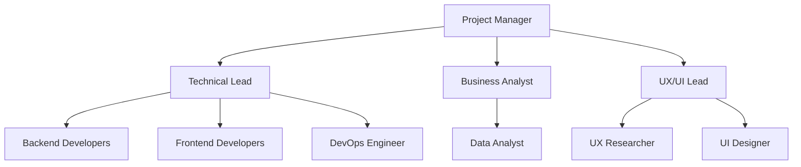
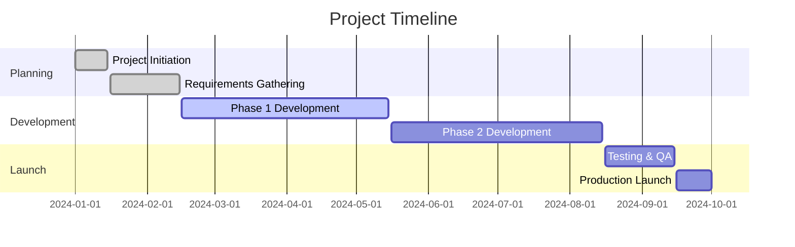
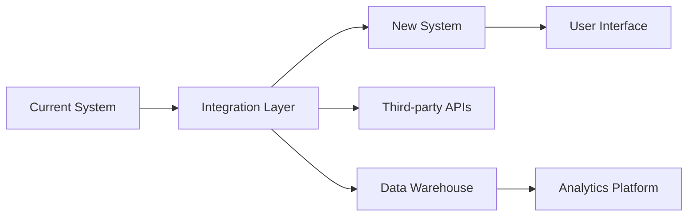

# 📊 Executive Project Brief

**Metadata**
- Last Updated: {{DATE}}
- Maintainer: AI-Dev Toolkit
- Related Docs: 01_prd.md, 03_generate_tasks.md, 11_roadmap.md, 13_implementation_plan.md

> **🎯 Executive Summary**
> A comprehensive project brief that provides leadership with essential project information for decision-making, resource allocation, and strategic alignment. This document serves as the single source of truth for project justification and high-level planning.

---

## 🚀 1. Project Overview & Business Case

### 1.1 Project Vision Statement
**Vision:** _[One-sentence description of what success looks like]_

**Example:**
> "Deliver a next-generation customer analytics platform that reduces time-to-insight from days to minutes, driving 25% improvement in customer retention through data-driven decision making."

### 1.2 Strategic Alignment
| Strategic Pillar | Alignment Score | Justification |
|------------------|----------------|---------------|
| **Digital Transformation** | High/Medium/Low | _[How this project advances digital initiatives]_ |
| **Customer Experience** | High/Medium/Low | _[Impact on customer satisfaction/retention]_ |
| **Operational Excellence** | High/Medium/Low | _[Process improvements and efficiency gains]_ |
| **Market Leadership** | High/Medium/Low | _[Competitive advantage and market position]_ |

### 1.3 Business Justification
- **Problem Statement:** _[Clear articulation of the business problem]_
- **Opportunity Size:** _[Market opportunity, revenue potential, cost savings]_
- **Strategic Importance:** _[Why this project matters to the organization]_
- **Risk of Inaction:** _[Consequences of not proceeding]_

---

## 💰 2. Financial Impact & ROI Analysis

### 2.1 Investment Summary
| Category | Year 1 | Year 2 | Year 3 | Total |
|----------|--------|--------|--------|-------|
| **Development Costs** | $X | $X | $X | $X |
| **Infrastructure** | $X | $X | $X | $X |
| **Personnel** | $X | $X | $X | $X |
| **Third-party Services** | $X | $X | $X | $X |
| ****Total Investment** | **$X** | **$X** | **$X** | **$X** |

### 2.2 Expected Returns
| Benefit Category | Year 1 | Year 2 | Year 3 | Total |
|------------------|--------|--------|--------|-------|
| **Revenue Generation** | $X | $X | $X | $X |
| **Cost Reduction** | $X | $X | $X | $X |
| **Efficiency Gains** | $X | $X | $X | $X |
| **Risk Mitigation** | $X | $X | $X | $X |
| ****Total Benefits** | **$X** | **$X** | **$X** | **$X** |

### 2.3 ROI Metrics
- **Net Present Value (NPV):** _$[Amount] over 3 years_
- **Internal Rate of Return (IRR):** _[Percentage]%_
- **Payback Period:** _[Months] months_
- **Break-even Point:** _[Date/milestone]_

### 2.4 Sensitivity Analysis
| Scenario | Probability | NPV Impact | Risk Mitigation |
|----------|------------|------------|-----------------|
| **Best Case** | 20% | +$X | _[Upside capture strategy]_ |
| **Base Case** | 60% | $X | _[Standard execution plan]_ |
| **Worst Case** | 20% | -$X | _[Risk mitigation measures]_ |

---

## 🎯 3. Objectives & Success Criteria

### 3.1 Primary Objectives
1. **Business Objective:** _[High-level business goal]_
   - **Metric:** _[How success is measured]_
   - **Target:** _[Specific numeric goal]_
   - **Timeline:** _[Target achievement date]_

2. **Technical Objective:** _[Key technical achievement]_
   - **Metric:** _[Performance/quality measure]_
   - **Target:** _[Specific benchmark]_
   - **Timeline:** _[Delivery milestone]_

3. **User Experience Objective:** _[UX/customer impact goal]_
   - **Metric:** _[User satisfaction measure]_
   - **Target:** _[Improvement percentage]_
   - **Timeline:** _[Measurement period]_

### 3.2 Key Performance Indicators (KPIs)
| KPI Category | Metric | Current Baseline | Target | Measurement Method |
|--------------|--------|------------------|--------|--------------------|
| **Business** | _[Business metric]_ | _[Current state]_ | _[Goal]_ | _[How measured]_ |
| **Technical** | _[Performance metric]_ | _[Current state]_ | _[Goal]_ | _[How measured]_ |
| **User** | _[User metric]_ | _[Current state]_ | _[Goal]_ | _[How measured]_ |
| **Operational** | _[Ops metric]_ | _[Current state]_ | _[Goal]_ | _[How measured]_ |

### 3.3 Success Criteria by Phase
#### Phase 1: Foundation (Months 1-3)
- [ ] _[Foundational milestone 1]_
- [ ] _[Foundational milestone 2]_
- [ ] _[Foundational milestone 3]_

#### Phase 2: Development (Months 4-8)
- [ ] _[Development milestone 1]_
- [ ] _[Development milestone 2]_
- [ ] _[Development milestone 3]_

#### Phase 3: Launch (Months 9-12)
- [ ] _[Launch milestone 1]_
- [ ] _[Launch milestone 2]_
- [ ] _[Launch milestone 3]_

---

## 👥 4. Team Structure & Governance

### 4.1 Executive Sponsorship
| Role | Name | Responsibilities | Time Commitment |
|------|------|------------------|-----------------|
| **Executive Sponsor** | _[Name]_ | Strategic alignment, resource approval | 2-4 hours/month |
| **Business Owner** | _[Name]_ | Requirements, acceptance, ROI tracking | 8-12 hours/week |
| **Technical Sponsor** | _[Name]_ | Architecture decisions, technical risk | 4-6 hours/week |

### 4.2 Core Team Structure

### 4.3 Team Roles & Responsibilities
| Role | Name | Primary Responsibilities | Skills Required |
|------|------|-------------------------|-----------------|
| **Project Manager** | _[Name]_ | Timeline, budget, risk management | PMP, Agile, stakeholder management |
| **Technical Lead** | _[Name]_ | Architecture, code quality, technical decisions | 8+ years experience, cloud platforms |
| **Business Analyst** | _[Name]_ | Requirements, process design, user stories | Business analysis, domain expertise |
| **UX/UI Lead** | _[Name]_ | User research, design, usability testing | UX research, design systems, prototyping |

### 4.4 Governance Structure
#### Steering Committee
- **Meeting Cadence:** Monthly
- **Attendees:** Executive sponsors, project manager, technical lead
- **Decisions:** Budget approval, scope changes, resource allocation

#### Project Review Board
- **Meeting Cadence:** Bi-weekly
- **Attendees:** Core team, business stakeholders
- **Decisions:** Sprint planning, priority adjustments, issue resolution

#### Technical Advisory Group
- **Meeting Cadence:** Weekly
- **Attendees:** Technical leads, architects, senior developers
- **Decisions:** Technical design, tool selection, quality standards

---

## 📅 5. Timeline & Milestones

### 5.1 High-Level Timeline

### 5.2 Critical Milestones
| Milestone | Target Date | Success Criteria | Dependencies | Risk Level |
|-----------|-------------|------------------|--------------|------------|
| **Project Kickoff** | _[Date]_ | Team assembled, charter approved | Funding approval | Low |
| **Requirements Freeze** | _[Date]_ | BRD/PRD signed off | Stakeholder alignment | Medium |
| **MVP Delivery** | _[Date]_ | Core features functional | Development completion | High |
| **Beta Launch** | _[Date]_ | Limited user testing | MVP + testing | Medium |
| **Production Launch** | _[Date]_ | Full feature availability | Beta feedback incorporation | High |
| **Post-Launch Review** | _[Date]_ | Success metrics achieved | 30-day production run | Low |

### 5.3 Sprint Planning Overview
#### Sprint 1-4: Foundation (Months 1-2)
- **Focus:** Infrastructure setup, core architecture
- **Key Deliverables:** Development environment, CI/CD pipeline, data models
- **Success Metrics:** All development tools operational, team onboarded

#### Sprint 5-8: Core Development (Months 3-4)
- **Focus:** Core business logic, primary user workflows
- **Key Deliverables:** User authentication, primary features, basic UI
- **Success Metrics:** Core functionality demonstrable, unit tests passing

#### Sprint 9-12: Advanced Features (Months 5-6)
- **Focus:** Advanced functionality, integrations, performance optimization
- **Key Deliverables:** Third-party integrations, reporting, analytics
- **Success Metrics:** Performance benchmarks met, integration tests passing

#### Sprint 13-16: Testing & Launch (Months 7-8)
- **Focus:** QA, user acceptance testing, production deployment
- **Key Deliverables:** Bug fixes, documentation, monitoring setup
- **Success Metrics:** All acceptance criteria met, production ready

---

## ⚠️ 6. Risk Assessment & Mitigation

### 6.1 Risk Register
| Risk Category | Risk Description | Probability | Impact | Risk Score | Mitigation Strategy |
|---------------|------------------|-------------|--------|------------|-------------------|
| **Technical** | _[Technical risk]_ | High/Med/Low | High/Med/Low | _[1-25]_ | _[Mitigation approach]_ |
| **Business** | _[Business risk]_ | High/Med/Low | High/Med/Low | _[1-25]_ | _[Mitigation approach]_ |
| **Resource** | _[Resource risk]_ | High/Med/Low | High/Med/Low | _[1-25]_ | _[Mitigation approach]_ |
| **External** | _[External risk]_ | High/Med/Low | High/Med/Low | _[1-25]_ | _[Mitigation approach]_ |

### 6.2 Top 5 Critical Risks
1. **[Risk Name]**
   - **Impact:** _[Detailed impact description]_
   - **Probability:** _[Likelihood assessment]_
   - **Mitigation:** _[Prevention/response strategy]_
   - **Contingency:** _[Backup plan]_
   - **Owner:** _[Risk owner]_

2. **[Risk Name]**
   - **Impact:** _[Detailed impact description]_
   - **Probability:** _[Likelihood assessment]_
   - **Mitigation:** _[Prevention/response strategy]_
   - **Contingency:** _[Backup plan]_
   - **Owner:** _[Risk owner]_

### 6.3 Risk Monitoring & Escalation
- **Risk Review Frequency:** Weekly team review, monthly steering committee
- **Escalation Triggers:** Risk score >15, new critical risks, mitigation failure
- **Escalation Process:** Team Lead → Project Manager → Executive Sponsor
- **Risk Documentation:** All risks logged in project management system

---

## 🔄 7. Dependencies & Integration Points

### 7.1 External Dependencies
| Dependency | Type | Owner | Required Date | Status | Risk Level |
|------------|------|-------|---------------|--------|------------|
| _[System/Service]_ | Technical | _[Team/Vendor]_ | _[Date]_ | Green/Yellow/Red | High/Med/Low |
| _[Approval/Decision]_ | Business | _[Stakeholder]_ | _[Date]_ | Green/Yellow/Red | High/Med/Low |
| _[Resource/Budget]_ | Financial | _[Department]_ | _[Date]_ | Green/Yellow/Red | High/Med/Low |

### 7.2 Integration Architecture

### 7.3 Data Flow Dependencies
1. **Upstream Systems:** _[Systems providing data/services]_
2. **Downstream Systems:** _[Systems consuming our outputs]_
3. **Integration Points:** _[APIs, databases, file transfers]_
4. **SLA Requirements:** _[Performance, availability, data freshness]_

---

## 📊 8. Quality & Compliance Requirements

### 8.1 Quality Standards
| Category | Standard | Measurement | Target | Verification Method |
|----------|----------|-------------|--------|-------------------|
| **Performance** | Response time | API latency | <200ms | Load testing |
| **Reliability** | Uptime | System availability | 99.9% | Monitoring |
| **Security** | Data protection | Vulnerability score | 0 critical | Security scans |
| **Usability** | User experience | Task completion rate | >95% | User testing |

### 8.2 Compliance Requirements
#### Data Privacy & Security
- [ ] GDPR compliance assessment completed
- [ ] Data classification and handling procedures defined
- [ ] Security controls implemented and tested
- [ ] Privacy impact assessment conducted

#### Industry Standards
- [ ] SOC 2 Type II readiness assessment
- [ ] ISO 27001 compliance gap analysis
- [ ] Industry-specific regulations reviewed
- [ ] Audit trail requirements implemented

### 8.3 Testing Strategy
#### Testing Levels
1. **Unit Testing:** 90% code coverage minimum
2. **Integration Testing:** All API endpoints and data flows
3. **System Testing:** End-to-end workflows and performance
4. **User Acceptance Testing:** Business scenarios and edge cases

#### Quality Gates
- **Gate 1:** Code review and unit tests (Development)
- **Gate 2:** Integration testing and security scan (Testing)
- **Gate 3:** Performance testing and UAT (Pre-production)
- **Gate 4:** Production readiness review (Deployment)

---

## 🚀 9. Launch Strategy & Go-to-Market

### 9.1 Launch Phases
#### Soft Launch (Week 1-2)
- **Audience:** Internal users and beta testers
- **Scope:** Core functionality only
- **Success Criteria:** No critical issues, basic workflows functional
- **Feedback Collection:** In-app feedback, user interviews

#### Limited Launch (Week 3-6)
- **Audience:** Select customer segments
- **Scope:** Full feature set with monitoring
- **Success Criteria:** Performance targets met, user adoption >50%
- **Support:** Enhanced support team availability

#### Full Launch (Week 7+)
- **Audience:** All target customers
- **Scope:** Complete product experience
- **Success Criteria:** All KPIs met, customer satisfaction >4.5/5
- **Marketing:** Full marketing campaign activation

### 9.2 Communication Plan
| Audience | Message | Channel | Timing | Owner |
|----------|---------|---------|--------|-------|
| **Internal Team** | Progress updates | Weekly standup | Weekly | Project Manager |
| **Executives** | Status dashboard | Executive briefing | Monthly | Business Owner |
| **End Users** | Feature announcements | Email, in-app | Milestone-based | Product Marketing |
| **Customers** | Value proposition | Marketing channels | Launch phases | Marketing Team |

### 9.3 Training & Enablement
#### Internal Training
- [ ] Technical training for support teams
- [ ] Sales training on new capabilities
- [ ] Customer success playbook development
- [ ] Documentation and knowledge base updates

#### Customer Enablement
- [ ] User onboarding experience design
- [ ] Tutorial and help content creation
- [ ] Webinar and training program development
- [ ] Customer success outreach plan

---

## 📈 10. Success Measurement & Reporting

### 10.1 Metrics Dashboard
#### Business Metrics
- **Revenue Impact:** Monthly recurring revenue growth
- **Cost Savings:** Operational cost reduction percentage
- **Customer Satisfaction:** NPS score and CSAT ratings
- **Market Position:** Competitive analysis and market share

#### Technical Metrics
- **Performance:** System response times and throughput
- **Reliability:** Uptime percentage and error rates
- **Security:** Vulnerability count and security incidents
- **Quality:** Defect density and customer-reported issues

#### User Metrics
- **Adoption:** Daily/monthly active users
- **Engagement:** Feature usage and session duration
- **Retention:** User retention rates by cohort
- **Support:** Ticket volume and resolution times

### 10.2 Reporting Schedule
| Report Type | Frequency | Audience | Content | Owner |
|-------------|-----------|----------|---------|-------|
| **Executive Dashboard** | Weekly | C-suite | KPIs, risks, milestones | Project Manager |
| **Operational Report** | Daily | Operations team | System health, incidents | Technical Lead |
| **Business Review** | Monthly | Business stakeholders | ROI, metrics, insights | Business Owner |
| **Technical Review** | Weekly | Engineering team | Performance, quality, debt | Technical Lead |

### 10.3 Post-Launch Analysis
#### 30-Day Review
- **Metrics Analysis:** Compare actual vs. projected KPIs
- **User Feedback:** Compilation and analysis of user feedback
- **Issue Resolution:** Review of post-launch issues and fixes
- **Lessons Learned:** Documentation of key learnings

#### 90-Day Review
- **ROI Assessment:** Actual financial impact vs. projections
- **User Adoption:** Deep dive into adoption patterns and behaviors
- **Performance Analysis:** System performance under production load
- **Strategic Alignment:** Validation of strategic objectives achievement

---

## 🔄 11. Post-Launch Roadmap

### 11.1 Enhancement Pipeline
#### Short-term (0-3 months)
- **Priority 1:** _[Critical improvements based on user feedback]_
- **Priority 2:** _[Performance optimizations]_
- **Priority 3:** _[Minor feature additions]_

#### Medium-term (3-6 months)
- **Feature Set 2:** _[Next major feature release]_
- **Platform Expansion:** _[Additional integrations or platforms]_
- **Scale Optimization:** _[Improvements for larger user base]_

#### Long-term (6-12 months)
- **Strategic Evolution:** _[Major platform evolution]_
- **Market Expansion:** _[New market segments or use cases]_
- **Technology Advancement:** _[Next-generation technology adoption]_

### 11.2 Continuous Improvement Process
- **Feedback Loops:** Regular user feedback collection and analysis
- **Performance Monitoring:** Continuous monitoring and optimization
- **Competitive Analysis:** Ongoing market and competitor assessment
- **Technology Evolution:** Regular technology stack evaluation and updates

---

## 📋 12. Appendices

### Appendix A: Detailed Financial Model
_[Link to comprehensive financial spreadsheet]_

### Appendix B: Technical Architecture Diagrams
_[Link to detailed technical specifications]_

### Appendix C: User Research and Market Analysis
_[Link to user research reports and market studies]_

### Appendix D: Risk Assessment Details
_[Link to comprehensive risk register and analysis]_

### Appendix E: Compliance Documentation
_[Link to legal and compliance requirements documentation]_

---

## 📞 13. Key Contacts & Escalation

### Project Team Contacts
| Role | Name | Email | Phone | Availability |
|------|------|-------|-------|-------------|
| **Project Manager** | _[Name]_ | _[Email]_ | _[Phone]_ | Business hours |
| **Technical Lead** | _[Name]_ | _[Email]_ | _[Phone]_ | Business hours + on-call |
| **Business Owner** | _[Name]_ | _[Email]_ | _[Phone]_ | Business hours |

### Escalation Matrix
1. **Level 1:** Project team and direct manager
2. **Level 2:** Department head and business owner
3. **Level 3:** Executive sponsor and C-level
4. **Level 4:** CEO and board (critical business impact)

---

**Document Control:**
- **Version:** 1.0
- **Last Review:** 2025-09-16
- **Next Review:** _[Date + 30 days]_
- **Approval Status:** Draft/Under Review/Approved
- **Digital Signature:** _[Electronic signature block]_

**Template Usage Notes:**
- Replace all placeholders marked with _[brackets]_
- Update 2025-09-16 with current date
- Customize sections based on project complexity
- Remove unused sections for smaller projects
- Maintain version control for all changes
