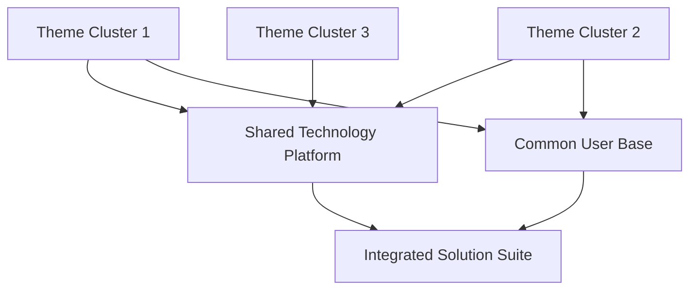
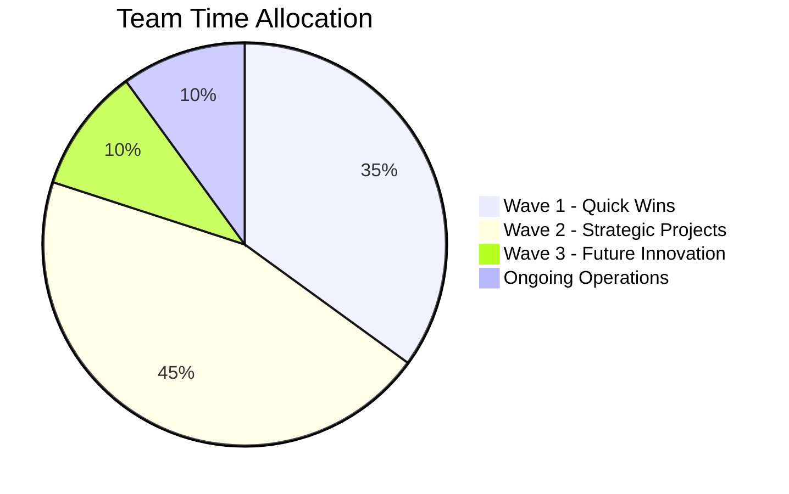

# 🧠 Strategic Brainstorming & Innovation Framework

**Metadata**
- Last Updated: {{DATE}}
- Maintainer: AI-Dev Toolkit
- Related Docs: 01_prd.md, 14_project_brief.md, 11_roadmap.md, 17_competitive_analysis.md

> **🎯 Executive Summary**
> A structured framework for capturing, organizing, and prioritizing innovative ideas through systematic brainstorming methodologies. This document transforms raw creative thinking into actionable strategic initiatives with clear evaluation criteria and implementation pathways.

---

## 🚀 1. Brainstorming Session Overview

### 1.1 Session Metadata
- **Session Date:** _[Date of brainstorming session]_
- **Duration:** _[Total session time]_
- **Facilitator:** _[Session leader name]_
- **Methodology:** _[Brainstorming technique used]_
- **Objective:** _[Primary goal of the session]_

### 1.2 Participants & Expertise
| Participant | Role | Department | Expertise Area | Contribution Focus |
|-------------|------|------------|----------------|-------------------|
| _[Name]_ | _[Title]_ | _[Department]_ | _[Domain expertise]_ | _[Perspective brought]_ |
| _[Name]_ | _[Title]_ | _[Department]_ | _[Domain expertise]_ | _[Perspective brought]_ |
| _[Name]_ | _[Title]_ | _[Department]_ | _[Domain expertise]_ | _[Perspective brought]_ |

### 1.3 Session Context & Constraints
#### Business Context
- **Market Opportunity:** _[Current market dynamics and opportunities]_
- **Strategic Goals:** _[Organizational objectives this session supports]_
- **Success Metrics:** _[How success will be measured]_
- **Timeline Constraints:** _[Implementation timeframes to consider]_

#### Technical Constraints
- **Technology Stack:** _[Current tech limitations and capabilities]_
- **Infrastructure:** _[Available platforms and resources]_
- **Integration Requirements:** _[Systems that must work together]_
- **Compliance Needs:** _[Regulatory or policy requirements]_

#### Resource Constraints
- **Budget Range:** _[Financial parameters for implementation]_
- **Team Capacity:** _[Available human resources]_
- **Time to Market:** _[Launch window requirements]_
- **Risk Tolerance:** _[Acceptable risk levels]_

---

## 💡 2. Raw Ideas Collection

### 2.1 Idea Generation Methods Used
- [ ] **Traditional Brainstorming** - Open floor discussion
- [ ] **Brainwriting** - Silent individual idea generation
- [ ] **6-3-5 Method** - Structured idea building
- [ ] **Mind Mapping** - Visual idea connection
- [ ] **SCAMPER Technique** - Systematic creativity prompts
- [ ] **Reverse Brainstorming** - Problem-focused thinking
- [ ] **Crazy 8s** - Rapid sketching method
- [ ] **Design Thinking Workshops** - User-centered ideation

### 2.2 Unfiltered Idea Repository
> **Note:** All ideas captured without judgment during the generative phase

#### Innovation Category: Product Features
1. **Idea ID: P001**
   - **Description:** _[Detailed idea description]_
   - **Contributor:** _[Person who suggested]_
   - **Initial Notes:** _[Raw context and reasoning]_
   - **Potential Impact:** _[Immediate thoughts on value]_

2. **Idea ID: P002**
   - **Description:** _[Detailed idea description]_
   - **Contributor:** _[Person who suggested]_
   - **Initial Notes:** _[Raw context and reasoning]_
   - **Potential Impact:** _[Immediate thoughts on value]_

#### Innovation Category: Process Improvements
1. **Idea ID: PR001**
   - **Description:** _[Detailed idea description]_
   - **Contributor:** _[Person who suggested]_
   - **Initial Notes:** _[Raw context and reasoning]_
   - **Potential Impact:** _[Immediate thoughts on value]_

2. **Idea ID: PR002**
   - **Description:** _[Detailed idea description]_
   - **Contributor:** _[Person who suggested]_
   - **Initial Notes:** _[Raw context and reasoning]_
   - **Potential Impact:** _[Immediate thoughts on value]_

#### Innovation Category: Technology Solutions
1. **Idea ID: T001**
   - **Description:** _[Detailed idea description]_
   - **Contributor:** _[Person who suggested]_
   - **Initial Notes:** _[Raw context and reasoning]_
   - **Potential Impact:** _[Immediate thoughts on value]_

2. **Idea ID: T002**
   - **Description:** _[Detailed idea description]_
   - **Contributor:** _[Person who suggested]_
   - **Initial Notes:** _[Raw context and reasoning]_
   - **Potential Impact:** _[Immediate thoughts on value]_

#### Innovation Category: Business Model Innovation
1. **Idea ID: B001**
   - **Description:** _[Detailed idea description]_
   - **Contributor:** _[Person who suggested]_
   - **Initial Notes:** _[Raw context and reasoning]_
   - **Potential Impact:** _[Immediate thoughts on value]_

#### Innovation Category: User Experience Enhancement
1. **Idea ID: UX001**
   - **Description:** _[Detailed idea description]_
   - **Contributor:** _[Person who suggested]_
   - **Initial Notes:** _[Raw context and reasoning]_
   - **Potential Impact:** _[Immediate thoughts on value]_

### 2.3 Idea Generation Statistics
- **Total Ideas Generated:** _[Number]_
- **Ideas per Participant:** _[Average]_
- **Ideas per Time Block:** _[Rate of generation]_
- **Most Prolific Contributor:** _[Name and count]_
- **Most Diverse Category:** _[Category with most variety]_

---

## 🎯 3. Thematic Clustering & Analysis

### 3.1 Clustering Methodology
**Approach Used:** _[Description of clustering method]_
- **Similarity Criteria:** _[How ideas were grouped]_
- **Validation Process:** _[How clusters were verified]_
- **Refinement Rounds:** _[Number of iterations]_

### 3.2 Primary Theme Clusters

#### Theme Cluster 1: _[Theme Name]_
**Central Concept:** _[Core idea that unifies this cluster]_

**Component Ideas:**
- **P001:** _[Brief description]_ - Impact: High/Medium/Low
- **T002:** _[Brief description]_ - Impact: High/Medium/Low
- **UX001:** _[Brief description]_ - Impact: High/Medium/Low

**Cluster Characteristics:**
- **Market Alignment:** _[How well this aligns with market needs]_
- **Technical Feasibility:** _[Implementation complexity assessment]_
- **Resource Requirements:** _[Estimated effort and cost]_
- **Strategic Value:** _[Contribution to business objectives]_
- **Risk Level:** _[Potential downsides and uncertainties]_

**Synergies Identified:**
- _[How ideas in this cluster complement each other]_
- _[Combined implementation benefits]_
- _[Cross-functional value creation opportunities]_

#### Theme Cluster 2: _[Theme Name]_
**Central Concept:** _[Core idea that unifies this cluster]_

**Component Ideas:**
- **PR001:** _[Brief description]_ - Impact: High/Medium/Low
- **B001:** _[Brief description]_ - Impact: High/Medium/Low
- **T001:** _[Brief description]_ - Impact: High/Medium/Low

**Cluster Characteristics:**
- **Market Alignment:** _[How well this aligns with market needs]_
- **Technical Feasibility:** _[Implementation complexity assessment]_
- **Resource Requirements:** _[Estimated effort and cost]_
- **Strategic Value:** _[Contribution to business objectives]_
- **Risk Level:** _[Potential downsides and uncertainties]_

### 3.3 Cross-Cluster Connections


### 3.4 Outlier Ideas Analysis
**Unclustered Ideas:** _[Ideas that don't fit major themes]_

| Idea ID | Description | Why Outlier | Potential Value | Recommendation |
|---------|-------------|-------------|-----------------|----------------|
| _[ID]_ | _[Brief desc]_ | _[Reason]_ | _[Unique value]_ | _[Keep/Park/Discard]_ |

---

## 📊 4. Evaluation Framework & Scoring

### 4.1 Evaluation Criteria Matrix
| Criteria Category | Weight | Scoring Method | Validation Source |
|-------------------|--------|----------------|-------------------|
| **Market Potential** | 25% | 1-10 scale | Market research, customer feedback |
| **Technical Feasibility** | 20% | 1-10 scale | Technical team assessment |
| **Strategic Alignment** | 20% | 1-10 scale | Leadership review |
| **Resource Efficiency** | 15% | 1-10 scale | Cost-benefit analysis |
| **Innovation Level** | 10% | 1-10 scale | Competitive analysis |
| **Implementation Speed** | 10% | 1-10 scale | Project management assessment |

### 4.2 Detailed Scoring Framework

#### Market Potential (25% Weight)
- **10:** Massive market opportunity, clear customer demand
- **8-9:** Strong market opportunity, validated customer interest
- **6-7:** Moderate market opportunity, some customer validation
- **4-5:** Limited market opportunity, uncertain demand
- **1-3:** Minimal market opportunity, no clear demand

#### Technical Feasibility (20% Weight)
- **10:** Can be built with existing technology and team
- **8-9:** Requires minor technology acquisition or upskilling
- **6-7:** Requires moderate technology investment or new hires
- **4-5:** Requires significant technology development
- **1-3:** Currently technically impossible or prohibitively complex

#### Strategic Alignment (20% Weight)
- **10:** Directly advances core strategic objectives
- **8-9:** Strongly supports strategic goals
- **6-7:** Moderately aligned with strategic direction
- **4-5:** Tangentially related to strategic objectives
- **1-3:** Does not align with strategic priorities

### 4.3 Individual Idea Evaluation

#### High-Priority Ideas (Score ≥ 7.0)

**Idea P001: _[Idea Name]_**
| Criteria | Score | Justification |
|----------|-------|---------------|
| Market Potential | 9 | _[Market size, customer demand evidence]_ |
| Technical Feasibility | 8 | _[Implementation complexity, resource needs]_ |
| Strategic Alignment | 9 | _[How it advances strategic goals]_ |
| Resource Efficiency | 7 | _[Cost vs. benefit analysis]_ |
| Innovation Level | 8 | _[Competitive differentiation potential]_ |
| Implementation Speed | 6 | _[Time to market assessment]_ |
| **Weighted Total** | **8.2** | **High Priority - Recommend for immediate planning** |

**Idea T002: _[Idea Name]_**
| Criteria | Score | Justification |
|----------|-------|---------------|
| Market Potential | 7 | _[Market size, customer demand evidence]_ |
| Technical Feasibility | 9 | _[Implementation complexity, resource needs]_ |
| Strategic Alignment | 8 | _[How it advances strategic goals]_ |
| Resource Efficiency | 8 | _[Cost vs. benefit analysis]_ |
| Innovation Level | 6 | _[Competitive differentiation potential]_ |
| Implementation Speed | 9 | _[Time to market assessment]_ |
| **Weighted Total** | **7.8** | **High Priority - Recommend for Phase 1 implementation** |

#### Medium-Priority Ideas (Score 5.0-6.9)

**Idea B001: _[Idea Name]_**
| Criteria | Score | Justification |
|----------|-------|---------------|
| Market Potential | 6 | _[Market validation needed]_ |
| Technical Feasibility | 7 | _[Moderate complexity]_ |
| Strategic Alignment | 6 | _[Partial alignment]_ |
| Resource Efficiency | 5 | _[Higher investment required]_ |
| Innovation Level | 7 | _[Good differentiation]_ |
| Implementation Speed | 4 | _[Longer development cycle]_ |
| **Weighted Total** | **5.9** | **Medium Priority - Requires further analysis** |

---

## 🏆 5. Prioritization & Roadmap Integration

### 5.1 Prioritization Matrix
```mermaid
quadrant-chart
    title Innovation Prioritization Matrix
    x-axis Low Implementation Effort --> High Implementation Effort
    y-axis Low Strategic Impact --> High Strategic Impact

    quadrant-1 Strategic Projects
    quadrant-2 Quick Wins
    quadrant-3 Fill-ins
    quadrant-4 Questionable

    Idea P001: [0.8, 0.9]
    Idea T002: [0.2, 0.8]
    Idea B001: [0.7, 0.6]
    Idea UX001: [0.3, 0.7]
```

### 5.2 Implementation Waves

#### Wave 1: Immediate Implementation (0-3 months)
**Quick Wins - High Impact, Low Effort**

| Idea ID | Idea Name | Expected Impact | Resource Requirement | Success Metrics |
|---------|-----------|-----------------|---------------------|-----------------|
| T002 | _[Name]_ | _[Impact desc]_ | _[Resource needs]_ | _[How to measure]_ |
| UX001 | _[Name]_ | _[Impact desc]_ | _[Resource needs]_ | _[How to measure]_ |

**Implementation Prerequisites:**
- [ ] _[Required approvals or resources]_
- [ ] _[Technical dependencies to resolve]_
- [ ] _[Team assignments and training needs]_

#### Wave 2: Strategic Development (3-9 months)
**Strategic Projects - High Impact, Higher Effort**

| Idea ID | Idea Name | Expected Impact | Resource Requirement | Success Metrics |
|---------|-----------|-----------------|---------------------|-----------------|
| P001 | _[Name]_ | _[Impact desc]_ | _[Resource needs]_ | _[How to measure]_ |

**Implementation Prerequisites:**
- [ ] _[Major investments or approvals needed]_
- [ ] _[Significant technical development required]_
- [ ] _[Market validation and customer research]_

#### Wave 3: Future Innovation (9-18 months)
**Experimental Projects - Unknown Impact, Variable Effort**

| Idea ID | Idea Name | Rationale for Delay | Conditions for Advancement |
|---------|-----------|-------------------|---------------------------|
| B001 | _[Name]_ | _[Why not immediate]_ | _[What needs to happen first]_ |

### 5.3 Resource Allocation Planning

#### Budget Allocation by Wave
| Wave | Budget Allocation | Percentage | Justification |
|------|------------------|------------|---------------|
| **Wave 1** | $X | 40% | Quick wins to build momentum |
| **Wave 2** | $X | 50% | Strategic investments for major impact |
| **Wave 3** | $X | 10% | Innovation exploration and R&D |
| **Total** | **$X** | **100%** | **Complete innovation investment** |

#### Team Allocation Strategy


---

## 🎯 6. Execution Planning & Next Steps

### 6.1 Immediate Action Items (Next 30 Days)

#### Governance & Decision Making
- [ ] **Executive Review Meeting**
  - **Date:** _[Scheduled date]_
  - **Attendees:** _[Decision makers]_
  - **Objective:** Prioritization approval and resource allocation
  - **Deliverables:** Approved implementation roadmap

- [ ] **Technical Feasibility Deep Dive**
  - **Owner:** _[Technical lead]_
  - **Timeline:** _[Completion date]_
  - **Scope:** Detailed analysis of top 3 ideas
  - **Deliverables:** Technical specification and effort estimates

#### Market Validation Activities
- [ ] **Customer Research Initiative**
  - **Method:** _[Surveys, interviews, focus groups]_
  - **Sample Size:** _[Number of participants]_
  - **Timeline:** _[Research period]_
  - **Success Criteria:** _[Validation thresholds]_

- [ ] **Competitive Intelligence**
  - **Scope:** _[Competitor analysis focus areas]_
  - **Resources:** _[Research tools and team]_
  - **Timeline:** _[Completion timeline]_
  - **Deliverables:** _[Expected outputs]_

### 6.2 Project Charter Development

#### Wave 1 Project Charters
For each Wave 1 idea, develop:
- **Project scope and objectives**
- **Success criteria and KPIs**
- **Resource requirements and team assignments**
- **Risk assessment and mitigation plans**
- **Timeline and milestone definitions**

#### Charter Template Requirements
```markdown
# Project Charter: [Idea Name]
## Objective: [One-sentence goal]
## Success Metrics: [Quantifiable outcomes]
## Resource Needs: [Team, budget, tools]
## Timeline: [Key milestones and deadlines]
## Risks: [Top 3 risks and mitigations]
## Dependencies: [External requirements]
```

### 6.3 Innovation Pipeline Management

#### Ongoing Process Framework
1. **Monthly Innovation Reviews**
   - Progress assessment against roadmap
   - New idea integration process
   - Resource reallocation decisions
   - Success story sharing

2. **Quarterly Strategy Alignment**
   - Strategic priority updates
   - Market condition reassessment
   - Technology landscape evaluation
   - Competitive position analysis

3. **Annual Innovation Portfolio Review**
   - Complete pipeline reassessment
   - ROI analysis of implemented ideas
   - Innovation process improvement
   - Future capability planning

---

## 📈 7. Success Metrics & KPIs

### 7.1 Innovation Pipeline Metrics

#### Quantity Metrics
| Metric | Current State | Target | Measurement Method |
|--------|---------------|--------|-------------------|
| **Ideas Generated per Session** | _[Current avg]_ | _[Target number]_ | Session documentation |
| **Ideas Advanced to Implementation** | _[Current %]_ | _[Target %]_ | Pipeline tracking |
| **Time from Idea to Market** | _[Current days]_ | _[Target days]_ | Project management data |

#### Quality Metrics
| Metric | Current State | Target | Measurement Method |
|--------|---------------|--------|-------------------|
| **Implementation Success Rate** | _[Current %]_ | _[Target %]_ | Post-implementation review |
| **Customer Adoption of New Ideas** | _[Current rate]_ | _[Target rate]_ | Usage analytics |
| **Revenue from Innovation** | _[Current $]_ | _[Target $]_ | Financial tracking |

### 7.2 Individual Idea Success Tracking

#### Success Criteria by Idea Type
**Product Features:**
- User adoption rate >X%
- Customer satisfaction improvement >X points
- Revenue impact >$X

**Process Improvements:**
- Efficiency gain >X%
- Cost reduction >$X
- Error rate reduction >X%

**Technology Solutions:**
- Performance improvement >X%
- Scalability increase >X factor
- Maintenance cost reduction >X%

### 7.3 Long-term Innovation Health

#### Innovation Culture Indicators
- **Participation Rate:** Percentage of team members contributing ideas
- **Cross-functional Collaboration:** Number of multi-department ideas
- **External Idea Sources:** Ideas from customers, partners, market research
- **Innovation Investment:** Budget allocated to new idea development

#### Competitive Advantage Metrics
- **Time to Market vs. Competitors:** Relative speed of innovation delivery
- **Feature Differentiation:** Unique capabilities vs. competition
- **Customer Preference:** Market research on innovative features
- **Industry Recognition:** Awards, patents, thought leadership

---

## 🔄 8. Continuous Improvement Framework

### 8.1 Session Retrospective Analysis

#### What Worked Well
- **Most Effective Brainstorming Methods:** _[Techniques that generated best ideas]_
- **Optimal Participant Mix:** _[Team composition insights]_
- **Best Environmental Factors:** _[Setting and timing observations]_
- **Successful Facilitation Approaches:** _[Leadership techniques that worked]_

#### Areas for Improvement
- **Process Inefficiencies:** _[Session workflow issues identified]_
- **Participation Gaps:** _[Underrepresented perspectives or voices]_
- **Tool or Method Limitations:** _[Brainstorming technique shortcomings]_
- **Follow-up Challenges:** _[Implementation or evaluation difficulties]_

### 8.2 Innovation Process Evolution

#### Methodology Refinements
- **New Techniques to Trial:** _[Brainstorming methods to experiment with]_
- **Technology Tools:** _[Digital platforms to enhance collaboration]_
- **External Input Sources:** _[Customer, partner, or expert involvement]_
- **Cross-functional Integration:** _[Department collaboration improvements]_

#### Organizational Learning
- **Best Practice Documentation:** _[Successful approaches to codify]_
- **Training Needs:** _[Skills to develop for better innovation]_
- **Cultural Shifts:** _[Mindset or behavior changes to encourage]_
- **Resource Optimization:** _[Budget or time allocation improvements]_

---

## 🔍 9. Risk Assessment & Mitigation

### 9.1 Innovation Risk Categories

#### Implementation Risks
| Risk | Probability | Impact | Mitigation Strategy |
|------|------------|--------|-------------------|
| **Technical Complexity Underestimated** | Medium | High | Proof of concept development, expert consultation |
| **Market Conditions Change** | Medium | Medium | Continuous market monitoring, agile pivoting |
| **Resource Constraints** | High | Medium | Phased implementation, alternative resource planning |
| **Team Capability Gaps** | Low | High | Training programs, external expertise acquisition |

#### Strategic Risks
| Risk | Probability | Impact | Mitigation Strategy |
|------|------------|--------|-------------------|
| **Strategic Misalignment** | Low | High | Regular strategy reviews, executive alignment |
| **Competitive Response** | Medium | Medium | IP protection, speed of execution |
| **Customer Rejection** | Medium | High | Early customer validation, iterative development |

### 9.2 Innovation Portfolio Risk Management
- **Risk Diversification:** Balance high-risk/high-reward with safe bets
- **Failure Tolerance:** Acceptable failure rate for experimental ideas
- **Learning Maximization:** Extract maximum learning from both successes and failures
- **Pivot Strategies:** Predefined criteria and processes for changing direction

---

## 📚 10. Knowledge Management & Documentation

### 10.1 Institutional Knowledge Capture
- **Idea Genealogy:** Track evolution of ideas from concept to implementation
- **Decision Rationale:** Document why ideas were prioritized or deprioritized
- **Lessons Learned:** Capture insights from both successful and failed initiatives
- **Best Practice Library:** Build repository of effective innovation techniques

### 10.2 Innovation Database Structure
```sql
-- Example schema for innovation tracking
CREATE TABLE innovations (
    id INT PRIMARY KEY,
    idea_name VARCHAR(255),
    description TEXT,
    contributor VARCHAR(255),
    session_date DATE,
    category VARCHAR(100),
    status VARCHAR(50),
    priority_score DECIMAL(3,2),
    implementation_date DATE,
    success_metrics TEXT
);
```

### 10.3 Cross-Session Learning
- **Pattern Recognition:** Identify recurring themes across multiple sessions
- **Success Predictors:** Characteristics of ideas that typically succeed
- **Failure Analysis:** Common reasons for idea abandonment or failure
- **Evolution Tracking:** How ideas change during implementation

---

## 🌐 11. Stakeholder Communication & Buy-in

### 11.1 Executive Communication Strategy

#### Monthly Innovation Dashboard
| Metric | This Month | Last Month | Trend | Target |
|--------|------------|------------|-------|--------|
| **Ideas in Pipeline** | X | X | ↑/↓/→ | Target |
| **Implementation Rate** | X% | X% | ↑/↓/→ | Target % |
| **Revenue from Innovation** | $X | $X | ↑/↓/→ | $Target |
| **Customer Satisfaction Impact** | X pts | X pts | ↑/↓/→ | Target pts |

#### Success Story Communication
- **Idea Origin:** How the successful idea was generated
- **Implementation Journey:** Key milestones and challenges overcome
- **Business Impact:** Quantified results and customer feedback
- **Team Recognition:** Acknowledge contributors and implementers

### 11.2 Cross-Functional Alignment
- **Department Impact Assessment:** How innovations affect different teams
- **Change Management:** Support for teams adapting to new innovations
- **Training and Enablement:** Ensure teams can leverage new capabilities
- **Feedback Integration:** Channels for ongoing input from all stakeholders

---

## 📋 12. Appendices & Supporting Materials

### Appendix A: Brainstorming Session Materials
- **Pre-session Briefing Document:** _[Link to preparation materials]_
- **Facilitation Guide:** _[Step-by-step session running instructions]_
- **Participant Feedback Forms:** _[Post-session evaluation templates]_
- **Idea Capture Templates:** _[Standardized forms for idea documentation]_

### Appendix B: Evaluation Tools & Templates
- **Scoring Rubrics:** _[Detailed evaluation criteria explanations]_
- **Financial Impact Models:** _[ROI calculation templates]_
- **Technical Feasibility Checklists:** _[Implementation assessment tools]_
- **Market Validation Frameworks:** _[Customer research methodologies]_

### Appendix C: Implementation Planning Resources
- **Project Charter Templates:** _[Standardized project initiation documents]_
- **Resource Planning Tools:** _[Budget and team allocation calculators]_
- **Risk Assessment Matrices:** _[Risk evaluation and mitigation templates]_
- **Success Metrics Dashboards:** _[KPI tracking and reporting tools]_

### Appendix D: Innovation Process Documentation
- **Standard Operating Procedures:** _[Step-by-step innovation process guide]_
- **Role and Responsibility Matrix:** _[RACI for innovation activities]_
- **Governance Framework:** _[Decision-making structure and authorities]_
- **Quality Assurance Checklists:** _[Process validation and improvement tools]_

---

## 📞 13. Key Contacts & Resources

### Innovation Team Contacts
| Role | Name | Email | Phone | Specialization |
|------|------|-------|-------|---------------|
| **Innovation Manager** | _[Name]_ | _[Email]_ | _[Phone]_ | Process facilitation, portfolio management |
| **Technical Innovation Lead** | _[Name]_ | _[Email]_ | _[Phone]_ | Technology feasibility, implementation |
| **Business Innovation Analyst** | _[Name]_ | _[Email]_ | _[Phone]_ | Market analysis, business case development |
| **Design Thinking Facilitator** | _[Name]_ | _[Email]_ | _[Phone]_ | Creative methodologies, user experience |

### External Resources
- **Innovation Consultants:** _[Contact information for external expertise]_
- **Market Research Partners:** _[Customer validation and market analysis resources]_
- **Technology Advisors:** _[Technical feasibility and implementation guidance]_
- **Industry Experts:** _[Domain-specific knowledge and trend insights]_

### Innovation Tools & Platforms
- **Idea Management System:** _[Platform for capturing and tracking ideas]_
- **Collaboration Tools:** _[Digital brainstorming and team coordination]_
- **Analytics Platforms:** _[Performance measurement and reporting]_
- **Research Databases:** _[Market intelligence and competitive analysis]_

---

**Document Control:**
- **Version:** 1.0
- **Last Review:** 2025-09-16
- **Next Review:** _[Date + 30 days]_
- **Approval Status:** Draft/Under Review/Approved
- **Digital Signature:** _[Electronic signature block]_

**Template Usage Notes:**
- Replace all placeholders marked with _[brackets]_
- Update 2025-09-16 with current date
- Customize evaluation criteria based on organizational priorities
- Scale complexity based on innovation session scope
- Maintain historical records for pattern analysis
- Regular updates ensure continuous process improvement
