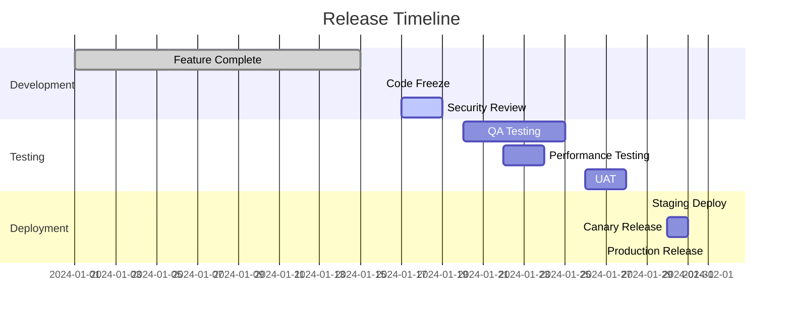

# 🚀 Enterprise Release Management Plan

**Metadata**
- Last Updated: {{DATE}}
- Maintainer: AI-Dev Toolkit
- Related Docs: 01_prd.md, 17_test_plan.md, 19_operational_readiness.md, 12_qa_gate.md

> **🎯 Executive Summary**
> A comprehensive, enterprise-grade release management framework ensuring zero-downtime deployments with automated quality gates, progressive rollouts, and immediate rollback capabilities. This plan orchestrates multi-channel releases across development, staging, and production environments with full observability and compliance tracking.

---

## 📋 1. Release Overview & Metadata

### 1.1 Release Information
- **Release Version:** _[Version number following semantic versioning]_
- **Release Code Name:** _[Internal code name for release tracking]_
- **Release Type:** _[Major/Minor/Patch/Hotfix]_
- **Target Date:** _[Planned release date]_
- **Release Manager:** _[Primary responsible person]_
- **Business Sponsor:** _[Executive stakeholder]_

### 1.2 Release Scope & Objectives
#### Business Objectives
- **Primary Goal:** _[Main business outcome expected]_
- **Success Metrics:** _[KPIs that define success]_
- **User Impact:** _[How users will benefit]_
- **Revenue Impact:** _[Expected financial outcome]_

#### Technical Scope
- **Features Included:** _[List of features in this release]_
- **Bug Fixes:** _[Critical issues being resolved]_
- **Performance Improvements:** _[Optimization work included]_
- **Security Updates:** _[Security patches and improvements]_
- **Technical Debt:** _[Refactoring and cleanup work]_

### 1.3 Stakeholder Matrix
| Role | Name | Responsibility | Contact | Backup |
|------|------|----------------|---------|---------|
| **Release Manager** | _[Name]_ | Overall release coordination | _[Email/Slack]_ | _[Backup person]_ |
| **Engineering Lead** | _[Name]_ | Technical implementation oversight | _[Email/Slack]_ | _[Backup person]_ |
| **QA Lead** | _[Name]_ | Quality assurance and testing | _[Email/Slack]_ | _[Backup person]_ |
| **DevOps Lead** | _[Name]_ | Infrastructure and deployment | _[Email/Slack]_ | _[Backup person]_ |
| **Product Owner** | _[Name]_ | Feature acceptance and priority | _[Email/Slack]_ | _[Backup person]_ |
| **Security Lead** | _[Name]_ | Security review and compliance | _[Email/Slack]_ | _[Backup person]_ |

---

## 🎯 2. Release Strategy & Channels

### 2.1 Deployment Channels
#### Primary Channels
```yaml
# Release Channel Configuration
Production Channels:
  Web Application:
    - Primary: AWS CloudFront + ALB
    - Backup: Azure Front Door + Load Balancer
    - CDN: Global edge locations (50+ POPs)

  Mobile Applications:
    - iOS App Store (production release)
    - Google Play Store (production release)
    - Enterprise Distribution (internal apps)

  API Services:
    - REST API: versioned endpoints (v1, v2)
    - GraphQL: schema evolution support
    - WebSocket: real-time services
    - gRPC: internal service communication

  Infrastructure:
    - Kubernetes clusters (multi-region)
    - Serverless functions (AWS Lambda/Azure Functions)
    - Database migrations (blue-green)
    - Cache layer updates (Redis/Memcached)
```

#### Testing Channels
```yaml
Pre-production Environments:
  Development:
    - Purpose: Feature development and unit testing
    - Audience: Engineering team
    - Data: Synthetic test data
    - Deployment: Automatic on commit

  Staging:
    - Purpose: Integration testing and QA validation
    - Audience: QA team, Product owners
    - Data: Production-like anonymized data
    - Deployment: Manual approval required

  Performance:
    - Purpose: Load testing and performance validation
    - Audience: Performance engineers
    - Data: High-volume synthetic data
    - Deployment: Scheduled automated tests

  User Acceptance Testing (UAT):
    - Purpose: Business stakeholder validation
    - Audience: Business users, Product owners
    - Data: Production-like with PII scrubbed
    - Deployment: Release candidate builds
```

### 2.2 Progressive Rollout Strategy
#### Phased Deployment Plan
```yaml
# Multi-Phase Release Strategy
Phase 1 - Canary Release (1% traffic):
  Duration: 24 hours
  Audience: Internal users + early adopters
  Success Criteria:
    - Error rate < 0.1%
    - Response time < 200ms (95th percentile)
    - Zero critical security issues
    - User satisfaction > 4.0/5.0

Phase 2 - Limited Release (10% traffic):
  Duration: 48 hours
  Audience: Beta users + selected customers
  Success Criteria:
    - Error rate < 0.05%
    - Response time < 150ms (95th percentile)
    - Customer support tickets < baseline
    - Feature adoption > 20%

Phase 3 - Expanded Release (50% traffic):
  Duration: 72 hours
  Audience: Half of production traffic
  Success Criteria:
    - System stability maintained
    - Performance metrics within SLA
    - No increase in support escalations
    - Business metrics improving

Phase 4 - Full Release (100% traffic):
  Duration: Ongoing
  Audience: All production users
  Success Criteria:
    - Complete feature availability
    - All monitoring green
    - Business objectives met
    - User adoption targets achieved
```

### 2.3 Feature Flag Strategy
```javascript
// Feature Flag Configuration
const featureFlags = {
  // Core feature rollout
  newUserDashboard: {
    enabled: true,
    rolloutPercentage: 25,
    targetAudience: ['beta_users', 'premium_customers'],
    killSwitch: true,
    dependencies: ['userProfile_v2', 'analytics_v3']
  },

  // Performance optimization
  optimizedSearch: {
    enabled: true,
    rolloutPercentage: 50,
    targetAudience: ['power_users'],
    killSwitch: true,
    performanceThresholds: {
      maxResponseTime: 100, // ms
      maxCpuUsage: 70      // percentage
    }
  },

  // A/B testing variant
  checkoutFlowV2: {
    enabled: true,
    rolloutPercentage: 10,
    targetAudience: ['new_users'],
    experimentGroup: 'checkout_optimization',
    metrics: ['conversion_rate', 'cart_abandonment']
  }
};

// Feature flag evaluation
function evaluateFeatureFlag(flagName, user, context) {
  const flag = featureFlags[flagName];
  if (!flag || !flag.enabled) return false;

  // Check kill switch
  if (flag.killSwitch && isKillSwitchActivated(flagName)) {
    return false;
  }

  // Check audience targeting
  if (flag.targetAudience && !flag.targetAudience.includes(user.segment)) {
    return false;
  }

  // Check rollout percentage
  const userHash = hashUser(user.id);
  return (userHash % 100) < flag.rolloutPercentage;
}
```

---

## 📈 3. Release Timeline & Milestones

### 3.1 Pre-Release Timeline


### 3.2 Critical Milestones
| Milestone | Date | Owner | Success Criteria | Dependencies |
|-----------|------|-------|------------------|-------------|
| **Feature Complete** | _[Date]_ | Engineering | All features implemented, unit tests pass | Requirements sign-off |
| **Code Freeze** | _[Date]_ | Release Manager | No new features, only bug fixes allowed | Feature complete |
| **Security Review** | _[Date]_ | Security Team | Security scan pass, vulnerabilities addressed | Code freeze |
| **QA Sign-off** | _[Date]_ | QA Lead | All test cases pass, no critical bugs | Security review |
| **Performance Validation** | _[Date]_ | DevOps | Load tests pass, SLA requirements met | QA sign-off |
| **Go/No-Go Decision** | _[Date]_ | Release Committee | Formal approval to proceed with release | All validations complete |
| **Production Deployment** | _[Date]_ | DevOps | Successful deployment, smoke tests pass | Go decision |

### 3.3 Communication Schedule
```yaml
# Stakeholder Communication Plan
T-14 days:
  - Release readiness review
  - Stakeholder notification
  - Customer communication draft

T-7 days:
  - Final testing status
  - Go/No-Go readiness check
  - Customer announcement

T-1 day:
  - Final deployment checklist
  - On-call team briefing
  - Emergency contacts verification

T-0 (Release day):
  - Deployment kickoff
  - Real-time status updates
  - Success confirmation

T+1 day:
  - Post-release review
  - Metrics analysis
  - Lessons learned capture
```

---

## 🔄 4. Deployment Architecture & Process

### 4.1 Infrastructure Architecture
```yaml
# Production Infrastructure Layout
Load Balancer Tier:
  - AWS Application Load Balancer
  - SSL termination (TLS 1.3)
  - Health check endpoints
  - Geographic routing

Application Tier:
  - Kubernetes cluster (3 availability zones)
  - Auto-scaling (2-20 pods per service)
  - Rolling deployment strategy
  - Circuit breaker pattern

Database Tier:
  - Primary: PostgreSQL (Multi-AZ)
  - Read Replicas: 3 instances
  - Connection pooling (PgBouncer)
  - Automated backups (point-in-time recovery)

Cache Tier:
  - Redis Cluster (3 nodes)
  - Distributed caching
  - Session storage
  - Rate limiting data

Monitoring Tier:
  - Prometheus + Grafana
  - ELK Stack (Elasticsearch, Logstash, Kibana)
  - Jaeger (distributed tracing)
  - PagerDuty integration
```

### 4.2 Deployment Process
```bash
#!/bin/bash
# Automated Deployment Script

# 1. Pre-deployment validation
echo "🔍 Running pre-deployment checks..."
./scripts/pre-deployment-check.sh

# 2. Database migrations (if needed)
if [[ "$MIGRATION_REQUIRED" == "true" ]]; then
  echo "📊 Running database migrations..."
  kubectl apply -f migrations/job-migration.yaml
  kubectl wait --for=condition=complete job/db-migration --timeout=300s
fi

# 3. Build and push container images
echo "🐳 Building and pushing container images..."
docker build -t myapp:$RELEASE_VERSION .
docker tag myapp:$RELEASE_VERSION myregistry.com/myapp:$RELEASE_VERSION
docker push myregistry.com/myapp:$RELEASE_VERSION

# 4. Deploy to staging for final validation
echo "🚧 Deploying to staging..."
helm upgrade --install myapp-staging ./helm/myapp \
  --namespace staging \
  --set image.tag=$RELEASE_VERSION \
  --set replicas=2

# 5. Run smoke tests on staging
echo "🧪 Running smoke tests..."
./scripts/smoke-tests.sh staging

# 6. Deploy to production with rolling update
echo "🚀 Deploying to production..."
helm upgrade --install myapp ./helm/myapp \
  --namespace production \
  --set image.tag=$RELEASE_VERSION \
  --set replicas=10 \
  --wait --timeout=600s

# 7. Verify deployment success
echo "✅ Verifying deployment..."
./scripts/health-check.sh production

echo "🎉 Deployment completed successfully!"
```

### 4.3 Blue-Green Deployment Strategy
```yaml
# Blue-Green Deployment Configuration
Blue Environment (Current Production):
  - Namespace: production-blue
  - Traffic: 100% (before switch)
  - Database: Primary connection
  - Monitoring: Full observability stack

Green Environment (New Version):
  - Namespace: production-green
  - Traffic: 0% (validation only)
  - Database: Read replica for testing
  - Monitoring: Parallel metrics collection

Switch Process:
  1. Deploy to green environment
  2. Run full test suite on green
  3. Gradual traffic shift (0% → 5% → 25% → 50% → 100%)
  4. Monitor metrics at each step
  5. Rollback capability at any point
  6. Decommission blue after 24h stability
```

---

## 🛡️ 5. Quality Gates & Validation

### 5.1 Automated Quality Gates
```yaml
# CI/CD Pipeline Quality Gates
Code Quality Gate:
  - Unit test coverage > 80%
  - Integration test coverage > 70%
  - Static code analysis (SonarQube) > B grade
  - No critical security vulnerabilities
  - Code review approval from 2 senior engineers

Security Gate:
  - SAST scan (Static Application Security Testing)
  - DAST scan (Dynamic Application Security Testing)
  - Dependency vulnerability scan
  - Container image security scan
  - Infrastructure as Code security validation

Performance Gate:
  - Load test: 1000 concurrent users
  - Response time: 95th percentile < 200ms
  - Throughput: > 10,000 requests/minute
  - Error rate: < 0.1%
  - Resource utilization: CPU < 70%, Memory < 80%

Compliance Gate:
  - GDPR compliance validation
  - SOC2 control verification
  - Audit trail completeness
  - Data classification validation
  - Access control verification
```

### 5.2 Manual Validation Checklist
#### Technical Validation
- [ ] **Smoke Tests Passed:** Core functionality working
- [ ] **Integration Tests:** All external services responding
- [ ] **Database Health:** Connections stable, queries optimized
- [ ] **Cache Performance:** Redis cluster responding normally
- [ ] **CDN Status:** Content delivery working globally
- [ ] **SSL Certificates:** Valid and properly configured
- [ ] **Monitoring Active:** All dashboards showing green
- [ ] **Alerting Functional:** Test alerts firing correctly

#### Business Validation
- [ ] **Feature Functionality:** New features working as expected
- [ ] **User Workflows:** Critical paths tested and verified
- [ ] **Payment Processing:** Financial transactions working
- [ ] **Email Systems:** Notifications and confirmations sending
- [ ] **Analytics Tracking:** Events and metrics collecting
- [ ] **A/B Tests:** Experiment configurations correct
- [ ] **Content Updates:** CMS and static content updated
- [ ] **Customer Support:** Knowledge base updated

### 5.3 Success Metrics
#### Technical Metrics
```yaml
# Technical Success Criteria
Availability:
  - Uptime: > 99.9% (< 43 minutes downtime/month)
  - Error rate: < 0.1% of all requests
  - Response time: 95th percentile < 200ms

Performance:
  - Page load time: < 3 seconds
  - API response time: < 100ms median
  - Database query time: < 50ms average
  - CDN cache hit ratio: > 95%

Scalability:
  - Auto-scaling triggers: CPU > 70%, Memory > 80%
  - Maximum capacity: 10x normal load
  - Scale-up time: < 2 minutes
  - Scale-down time: < 5 minutes
```

#### Business Metrics
```yaml
# Business Success Criteria
User Engagement:
  - Daily Active Users (DAU): +5% from baseline
  - Session duration: +10% from baseline
  - Feature adoption: > 25% within 7 days
  - User satisfaction: > 4.0/5.0 rating

Revenue Impact:
  - Conversion rate: +2% from baseline
  - Average order value: maintained or improved
  - Customer acquisition cost: maintained or improved
  - Monthly recurring revenue: +3% from baseline

Operational Efficiency:
  - Support ticket volume: no increase from baseline
  - Critical incident count: 0 in first 48 hours
  - Time to resolution: < 4 hours for any issues
  - Customer complaints: < 5 in first week
```

---

## 🚨 6. Rollback Strategy & Emergency Procedures

### 6.1 Rollback Triggers
#### Automatic Rollback Triggers
```yaml
# Automated Rollback Conditions
Critical Thresholds:
  - Error rate > 1% for 5 consecutive minutes
  - Response time 95th percentile > 1000ms for 10 minutes
  - CPU utilization > 90% for 15 minutes
  - Memory utilization > 95% for 5 minutes
  - Database connection failures > 10% for 3 minutes

Business Thresholds:
  - Payment failure rate > 5%
  - User registration failure rate > 10%
  - Order completion rate drops > 20%
  - Customer support escalation spike > 50%

Security Thresholds:
  - Security incident detected
  - Unusual authentication patterns
  - Data breach indicators
  - Unauthorized access attempts > threshold
```

#### Manual Rollback Triggers
- **Business Impact:** Revenue loss exceeding $10,000/hour
- **Customer Impact:** User satisfaction score drops below 3.0
- **Operational Impact:** Support team overwhelmed (>100 tickets/hour)
- **Compliance Risk:** Regulatory violation detected
- **Executive Decision:** C-level executive calls for rollback

### 6.2 Rollback Procedures
#### Immediate Rollback (< 5 minutes)
```bash
#!/bin/bash
# Emergency Rollback Script

echo "🚨 INITIATING EMERGENCY ROLLBACK"

# 1. Stop traffic to new version
kubectl patch service myapp-service -p '{"spec":{"selector":{"version":"stable"}}}'

# 2. Scale down new deployment
kubectl scale deployment myapp-new --replicas=0

# 3. Scale up previous deployment
kubectl scale deployment myapp-stable --replicas=10

# 4. Verify rollback success
./scripts/health-check.sh

# 5. Notify stakeholders
./scripts/notify-rollback.sh "Emergency rollback completed"

echo "✅ Rollback completed in $(date)"
```

#### Database Rollback Procedures
```sql
-- Database Rollback Strategy
-- 1. For schema changes (if backward compatible)
-- No action needed - new schema supports old code

-- 2. For data migrations (if rollback needed)
BEGIN TRANSACTION;

-- Restore from backup if necessary
-- RESTORE DATABASE myapp FROM BACKUP_DEVICE = '/backup/myapp_pre_release.bak'

-- Or run reverse migration scripts
-- \i migrations/rollback/001_reverse_user_table_changes.sql

-- Verify data integrity
SELECT COUNT(*) FROM users WHERE created_at > '2024-01-01';

-- If everything looks good, commit
COMMIT;
-- If issues found, rollback transaction
-- ROLLBACK;
```

### 6.3 Post-Rollback Actions
```yaml
# Post-Rollback Checklist
Immediate Actions (0-30 minutes):
  - [ ] Verify system stability
  - [ ] Check all critical metrics
  - [ ] Confirm user-facing functionality
  - [ ] Notify executive team
  - [ ] Update status page

Short-term Actions (30 minutes - 4 hours):
  - [ ] Conduct incident response team meeting
  - [ ] Document root cause analysis
  - [ ] Plan fix strategy
  - [ ] Communicate with customers
  - [ ] Update internal stakeholders

Long-term Actions (4-24 hours):
  - [ ] Complete detailed post-mortem
  - [ ] Implement preventive measures
  - [ ] Update deployment procedures
  - [ ] Review and improve monitoring
  - [ ] Schedule lessons learned session
```

---

## 📊 7. Monitoring & Observability

### 7.1 Real-time Monitoring Dashboard
```yaml
# Production Monitoring Stack
Application Metrics:
  - Request rate (requests/second)
  - Error rate (errors/minute)
  - Response time (95th percentile)
  - Throughput (transactions/second)
  - Active user sessions

Infrastructure Metrics:
  - CPU utilization (per service)
  - Memory usage (per service)
  - Disk I/O (IOPS and throughput)
  - Network latency (inter-service)
  - Container health (running/failed pods)

Business Metrics:
  - User registrations/hour
  - Order completion rate
  - Revenue per hour
  - Feature adoption rate
  - Customer satisfaction score

External Dependencies:
  - Payment gateway response time
  - Email service delivery rate
  - CDN performance metrics
  - Database replica lag
  - Third-party API availability
```

### 7.2 Alerting Configuration
```yaml
# Alert Definitions
Critical Alerts (Immediate Response Required):
  - Service down (any production service)
  - Error rate > 1% for 5 minutes
  - Payment processing failure rate > 5%
  - Database connection failures
  - Security breach indicators

Warning Alerts (Response within 30 minutes):
  - Response time > 500ms (95th percentile)
  - CPU utilization > 80% for 10 minutes
  - Memory utilization > 85% for 10 minutes
  - Disk space > 80% on any server
  - High customer support ticket volume

Informational Alerts:
  - Deployment completion
  - Auto-scaling events
  - Feature flag changes
  - Scheduled maintenance windows
  - Performance improvements detected
```

### 7.3 Logging Strategy
```yaml
# Structured Logging Configuration
Application Logs:
  Level: INFO and above in production
  Format: JSON structured logs
  Fields: timestamp, level, service, message, trace_id, user_id
  Retention: 30 days in hot storage, 1 year in cold storage

Access Logs:
  Format: Combined log format with custom fields
  Fields: IP, method, URL, status, response_time, user_agent
  Retention: 90 days
  Analysis: Daily reports on traffic patterns

Security Logs:
  Events: Authentication, authorization, data access
  Format: SIEM-compatible JSON
  Retention: 2 years for compliance
  Monitoring: Real-time anomaly detection

Performance Logs:
  Metrics: Database queries, external API calls, cache operations
  Sampling: 1% of requests (configurable)
  Retention: 7 days
  Analysis: Performance optimization insights
```

---

## 📚 8. Communication & Documentation

### 8.1 Release Communication Plan
#### Internal Communication
```yaml
# Internal Stakeholder Communication
Pre-Release (T-7 days):
  - Engineering team: Technical briefing and readiness check
  - Product team: Feature functionality review
  - Customer support: Updated documentation and FAQs
  - Sales team: New feature benefits and positioning
  - Executive team: Business impact and risk assessment

During Release (T-0):
  - Real-time Slack channel: #release-deployment
  - Executive dashboard: Key metrics and status
  - Engineering team: Technical monitoring and support
  - Customer support: Proactive monitoring for issues
  - All hands: Go-live announcement

Post-Release (T+24 hours):
  - Engineering team: Technical performance review
  - Product team: Feature adoption analysis
  - Customer support: Issue summary and resolution
  - Executive team: Business impact assessment
  - All hands: Success metrics and celebration
```

#### External Communication
```yaml
# Customer Communication Strategy
Advance Notice (T-14 days):
  - Email announcement to all users
  - In-app notification for active users
  - Blog post with feature highlights
  - Social media teaser campaign
  - Customer advisory board briefing

Release Day (T-0):
  - Product announcement blog post
  - Email campaign to all users
  - In-app feature tour/onboarding
  - Social media launch campaign
  - Press release (if major release)

Post-Release Follow-up (T+7 days):
  - Feature adoption metrics sharing
  - User success stories highlight
  - Customer feedback collection
  - Support documentation updates
  - Community forum engagement
```

### 8.2 Documentation Updates
#### Technical Documentation
- [ ] **API Documentation:** Updated with new endpoints and changes
- [ ] **Architecture Diagrams:** Reflect new system components
- [ ] **Deployment Guides:** Include new procedures and configurations
- [ ] **Troubleshooting Guides:** Common issues and resolutions
- [ ] **Security Documentation:** Updated security model and controls

#### User Documentation
- [ ] **User Guide:** New features and updated workflows
- [ ] **FAQ Updates:** Anticipated questions and answers
- [ ] **Video Tutorials:** New feature demonstrations
- [ ] **Release Notes:** Comprehensive change documentation
- [ ] **Migration Guide:** For users upgrading from previous versions

### 8.3 Knowledge Transfer
```yaml
# Knowledge Transfer Sessions
Technical Team Sessions:
  - Architecture changes overview
  - New monitoring and alerting setup
  - Troubleshooting procedures
  - Performance optimization techniques
  - Security considerations

Support Team Sessions:
  - New feature functionality
  - Common user issues and resolutions
  - Escalation procedures
  - Customer communication scripts
  - Internal tools and resources

Business Team Sessions:
  - Feature benefits and positioning
  - Customer success metrics
  - Sales enablement materials
  - Marketing campaign coordination
  - Competitive differentiation points
```

---

## 🔍 9. Post-Release Activities

### 9.1 Immediate Post-Release (0-24 hours)
#### Monitoring & Validation
```yaml
# 24-Hour Monitoring Checklist
Hour 0-2 (Critical monitoring):
  - [ ] All services responding normally
  - [ ] Error rates within acceptable limits
  - [ ] Database performance stable
  - [ ] User authentication working
  - [ ] Payment processing functional

Hour 2-8 (Extended monitoring):
  - [ ] Feature adoption tracking
  - [ ] Performance metrics analysis
  - [ ] Customer support ticket review
  - [ ] Business metrics validation
  - [ ] Third-party integrations stable

Hour 8-24 (Comprehensive assessment):
  - [ ] Full feature functionality verified
  - [ ] User feedback collection started
  - [ ] Performance optimization opportunities identified
  - [ ] Security monitoring review
  - [ ] Business impact measurement
```

#### Issue Response Protocol
```yaml
# Issue Classification and Response
P0 - Critical (Response: Immediate):
  - Service outage or severe degradation
  - Security vulnerability exploitation
  - Data corruption or loss
  - Payment processing failure

P1 - High (Response: 1 hour):
  - Feature not working for some users
  - Performance degradation affecting UX
  - Authentication issues
  - Third-party integration failures

P2 - Medium (Response: 4 hours):
  - Minor feature bugs
  - UI/UX issues
  - Documentation inaccuracies
  - Non-critical performance issues

P3 - Low (Response: 24 hours):
  - Cosmetic issues
  - Feature enhancement requests
  - Documentation improvements
  - Non-urgent optimizations
```

### 9.2 Short-term Post-Release (1-7 days)
#### Success Metrics Analysis
```yaml
# Week 1 Success Metrics Review
Technical Metrics:
  - System uptime and availability
  - Performance benchmark comparison
  - Error rate trends
  - Resource utilization optimization
  - Security incident count

Business Metrics:
  - Feature adoption rate
  - User engagement changes
  - Revenue impact measurement
  - Customer satisfaction scores
  - Support ticket volume analysis

User Experience Metrics:
  - User onboarding completion rate
  - Feature discovery and usage
  - User feedback sentiment analysis
  - Customer support interaction quality
  - User retention impact
```

#### Optimization Activities
```yaml
# Post-Release Optimization
Performance Optimization:
  - Database query optimization
  - Cache hit ratio improvement
  - CDN configuration tuning
  - Image and asset optimization
  - API response time improvements

User Experience Optimization:
  - User interface refinements
  - Navigation flow improvements
  - Error message clarity
  - Onboarding process optimization
  - Mobile responsiveness enhancements

Business Process Optimization:
  - Customer support workflow updates
  - Sales team enablement
  - Marketing campaign optimization
  - Feature adoption strategies
  - User feedback integration process
```

### 9.3 Long-term Post-Release (1-4 weeks)
#### Comprehensive Review
```yaml
# Monthly Release Review
Quantitative Analysis:
  - ROI calculation and business impact
  - User growth and retention metrics
  - Revenue attribution to new features
  - Performance improvement measurements
  - Cost optimization opportunities

Qualitative Analysis:
  - User feedback themes and insights
  - Customer success story collection
  - Support team experience assessment
  - Development team retrospective
  - Stakeholder satisfaction review

Strategic Planning:
  - Next release planning inputs
  - Product roadmap adjustments
  - Technology stack evolution
  - Process improvement initiatives
  - Resource allocation optimization
```

---

## 📝 10. Release Governance & Compliance

### 10.1 Change Management Process
```yaml
# Formal Change Management
Change Advisory Board (CAB):
  Members:
    - Release Manager (Chair)
    - Engineering Lead
    - Operations Lead
    - Security Lead
    - Business Stakeholder
    - Customer Success Lead

Meeting Schedule:
  - Weekly for normal changes
  - Emergency meetings for critical changes
  - Post-release review meetings

Decision Criteria:
  - Business impact assessment
  - Technical risk evaluation
  - Security implications review
  - Customer impact analysis
  - Resource requirement validation
```

### 10.2 Compliance Requirements
```yaml
# Regulatory Compliance Tracking
SOC 2 Compliance:
  - Access control documentation
  - Change management evidence
  - Monitoring and alerting records
  - Incident response documentation
  - Data protection verification

GDPR Compliance:
  - Data processing impact assessment
  - Privacy by design verification
  - Data retention policy compliance
  - Consent management validation
  - Right to deletion implementation

Industry Standards:
  - ISO 27001 security controls
  - PCI DSS (if payment processing)
  - HIPAA (if healthcare data)
  - Financial regulations (if fintech)
  - Sector-specific requirements
```

### 10.3 Audit Trail & Documentation
```yaml
# Comprehensive Audit Trail
Release Documentation:
  - Formal release approval records
  - Technical design documents
  - Security review results
  - Testing evidence and results
  - Deployment execution logs

Change Documentation:
  - Change request submissions
  - Impact assessment documents
  - Approval workflow records
  - Implementation evidence
  - Rollback procedures validation

Compliance Documentation:
  - Regulatory requirement mapping
  - Control implementation evidence
  - Testing and validation records
  - Incident response documentation
  - Continuous monitoring evidence
```

---

**Release Plan Status:** [Draft/In Planning/Approved/In Progress/Completed]
**Next Review Date:** [Scheduled review date for plan updates]
**Release Manager Sign-off:** [Release manager approval and date]
**Business Sponsor Sign-off:** [Executive sponsor approval and date]
**Version:** 2.0
**Last Comprehensive Review:** 2025-09-16
**Release Management Maturity:** CMMI Level 4
