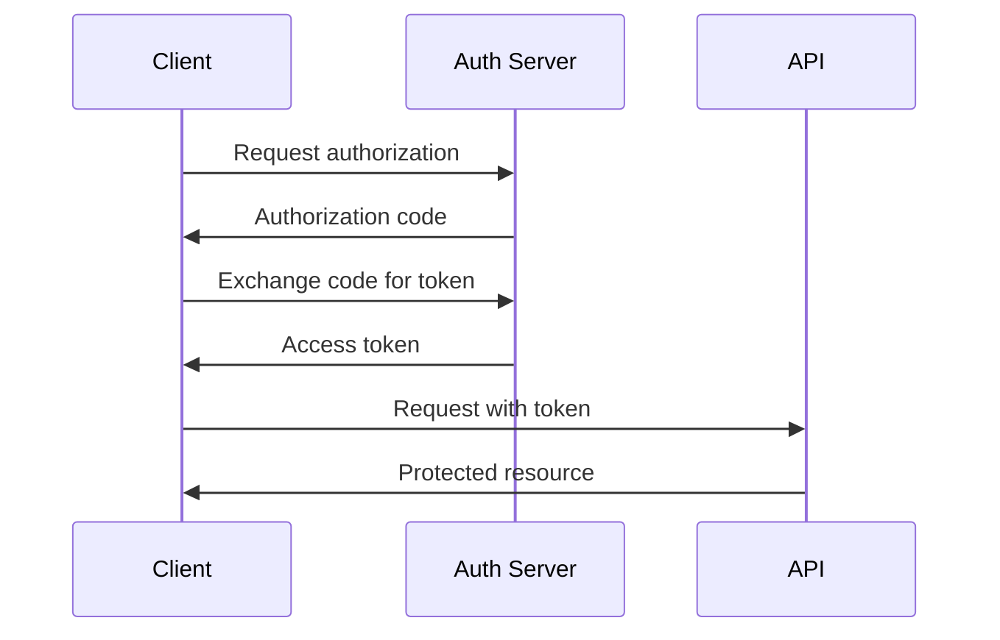

# Rule: Generating API Specifications

## Goal

To guide an AI assistant in creating comprehensive API specifications that clearly document endpoints, data models, authentication, and integration requirements for development teams.

## Process

1. **Receive API Description:** User provides API requirements.
2. **Ask API Design Questions:** AI *must* understand the API purpose and constraints.
3. **Generate API Spec:** Create detailed OpenAPI/Swagger documentation.
4. **Save API Spec:** Save as `api-spec-[service].md` and `openapi-[service].yaml` in `/tasks/`.
5. **Generate Examples:** Include request/response examples and SDKs.

## Clarifying Questions (LLM Must Ask)

**API Scope:**
1. What type of API is this?
   - A) RESTful API
   - B) GraphQL API
   - C) WebSocket API
   - D) gRPC API
   - E) SOAP API
   - F) Mixed/Multiple types

2. What is the primary purpose?
   - A) Public API for external developers
   - B) Internal microservices communication
   - C) Mobile app backend
   - D) Web application backend
   - E) Third-party integrations
   - F) Data sync/ETL

3. What authentication method?
   - A) API Keys
   - B) OAuth 2.0
   - C) JWT tokens
   - D) Basic Auth
   - E) mTLS
   - F) Multiple methods

**Technical Requirements:**
4. What are the performance requirements?
   - A) < 100ms response time
   - B) < 500ms response time
   - C) < 1 second response time
   - D) Batch processing acceptable
   - E) Real-time streaming

5. What versioning strategy?
   - A) URL path versioning (/v1/)
   - B) Header versioning
   - C) Query parameter versioning
   - D) Content negotiation
   - E) No versioning needed

## API Specification Structure

```markdown
# API Specification: [Service Name]

**Version:** 1.0.0
**Created:** [YYYY-MM-DD HH:MM]
**Author:** [Name/AI Assistant]
**Status:** Draft | Review | Published | Deprecated
**API Type:** REST | GraphQL | WebSocket | gRPC
**Base URL:** https://api.example.com/v1

## 1. Overview

### 1.1 Purpose
[What this API provides and why it exists]

### 1.2 Audience
- **Primary:** [Who will use this API]
- **Secondary:** [Other potential users]

### 1.3 Key Features
- [Feature 1]
- [Feature 2]
- [Feature 3]

## 2. Getting Started

### 2.1 Quick Start
```bash
# 1. Get your API key from the dashboard
export API_KEY="your-api-key-here"

# 2. Make your first request
curl -H "Authorization: Bearer $API_KEY" \
     https://api.example.com/v1/resources

# 3. Install SDK (optional)
npm install @example/api-client
```

### 2.2 Base URLs
| Environment | URL | Purpose |
|-------------|-----|---------|
| Production | https://api.example.com/v1 | Live data |
| Staging | https://staging-api.example.com/v1 | Testing |
| Sandbox | https://sandbox-api.example.com/v1 | Development |

### 2.3 API Limits
| Tier | Requests/Hour | Burst | Cost |
|------|---------------|-------|------|
| Free | 1,000 | 10/sec | $0 |
| Basic | 10,000 | 50/sec | $99/mo |
| Pro | 100,000 | 200/sec | $499/mo |
| Enterprise | Unlimited | Custom | Contact |

## 3. Authentication

### 3.1 API Key Authentication
```http
GET /resources HTTP/1.1
Host: api.example.com
Authorization: Bearer YOUR_API_KEY
```

### 3.2 OAuth 2.0 Flow


### 3.3 Token Management
```javascript
// SDK Example
const client = new APIClient({
  apiKey: process.env.API_KEY,
  autoRefresh: true,
  timeout: 5000
});

// Manual token refresh
const newToken = await client.auth.refresh();
```

## 4. Common Patterns

### 4.1 Pagination
```http
GET /resources?page=2&limit=20 HTTP/1.1

Response:
{
  "data": [...],
  "pagination": {
    "page": 2,
    "limit": 20,
    "total": 100,
    "pages": 5,
    "next": "/resources?page=3&limit=20",
    "prev": "/resources?page=1&limit=20"
  }
}
```

### 4.2 Filtering
```http
GET /resources?status=active&created_after=2025-01-01 HTTP/1.1
```

### 4.3 Sorting
```http
GET /resources?sort=created_at:desc,name:asc HTTP/1.1
```

### 4.4 Field Selection
```http
GET /resources?fields=id,name,status HTTP/1.1
```

## 5. Endpoints

### 5.1 Resources

#### GET /resources
List all resources with pagination.

**Parameters:**
| Name | Type | In | Required | Description |
|------|------|-----|----------|-------------|
| page | integer | query | No | Page number (default: 1) |
| limit | integer | query | No | Items per page (default: 20, max: 100) |
| status | string | query | No | Filter by status |
| search | string | query | No | Search in name and description |

**Response:** 200 OK
```json
{
  "data": [
    {
      "id": "res_1234",
      "name": "Resource Name",
      "status": "active",
      "created_at": "2025-01-15T10:00:00Z",
      "metadata": {
        "key": "value"
      }
    }
  ],
  "pagination": {
    "page": 1,
    "limit": 20,
    "total": 45
  }
}
```

#### GET /resources/{id}
Get a single resource by ID.

**Parameters:**
| Name | Type | In | Required | Description |
|------|------|-----|----------|-------------|
| id | string | path | Yes | Resource ID |

**Response:** 200 OK
```json
{
  "id": "res_1234",
  "name": "Resource Name",
  "status": "active",
  "description": "Detailed description",
  "created_at": "2025-01-15T10:00:00Z",
  "updated_at": "2025-01-15T14:30:00Z",
  "metadata": {
    "key": "value"
  },
  "relationships": {
    "owner": {
      "id": "user_5678",
      "type": "user"
    }
  }
}
```

#### POST /resources
Create a new resource.

**Request Body:**
```json
{
  "name": "New Resource",
  "description": "Resource description",
  "type": "standard",
  "metadata": {
    "key": "value"
  }
}
```

**Response:** 201 Created
```json
{
  "id": "res_9012",
  "name": "New Resource",
  "status": "pending",
  "created_at": "2025-01-15T15:00:00Z"
}
```

#### PUT /resources/{id}
Update a resource completely.

**Request Body:**
```json
{
  "name": "Updated Name",
  "description": "Updated description",
  "status": "active",
  "metadata": {
    "key": "new-value"
  }
}
```

**Response:** 200 OK

#### PATCH /resources/{id}
Partially update a resource.

**Request Body:**
```json
{
  "status": "inactive"
}
```

**Response:** 200 OK

#### DELETE /resources/{id}
Delete a resource.

**Response:** 204 No Content

### 5.2 Batch Operations

#### POST /resources/batch
Create multiple resources in one request.

**Request Body:**
```json
{
  "resources": [
    {
      "name": "Resource 1",
      "type": "standard"
    },
    {
      "name": "Resource 2",
      "type": "premium"
    }
  ]
}
```

**Response:** 207 Multi-Status
```json
{
  "succeeded": [
    {
      "id": "res_1001",
      "name": "Resource 1"
    }
  ],
  "failed": [
    {
      "name": "Resource 2",
      "error": "Invalid type"
    }
  ]
}
```

## 6. Data Models

### 6.1 Resource Object
```yaml
Resource:
  type: object
  required:
    - id
    - name
    - status
    - created_at
  properties:
    id:
      type: string
      format: uuid
      example: "res_1234"
    name:
      type: string
      minLength: 1
      maxLength: 255
      example: "My Resource"
    status:
      type: string
      enum: [active, inactive, pending, deleted]
      example: "active"
    description:
      type: string
      maxLength: 1000
      example: "Resource description"
    created_at:
      type: string
      format: date-time
      example: "2025-01-15T10:00:00Z"
    updated_at:
      type: string
      format: date-time
      example: "2025-01-15T14:30:00Z"
    metadata:
      type: object
      additionalProperties: true
```

### 6.2 Error Object
```yaml
Error:
  type: object
  required:
    - code
    - message
  properties:
    code:
      type: string
      example: "VALIDATION_ERROR"
    message:
      type: string
      example: "The request body is invalid"
    details:
      type: array
      items:
        type: object
        properties:
          field:
            type: string
          message:
            type: string
```

## 7. Error Handling

### 7.1 Error Codes
| HTTP Status | Code | Description |
|-------------|------|-------------|
| 400 | BAD_REQUEST | Invalid request format |
| 401 | UNAUTHORIZED | Missing or invalid authentication |
| 403 | FORBIDDEN | Valid auth but insufficient permissions |
| 404 | NOT_FOUND | Resource doesn't exist |
| 409 | CONFLICT | Resource already exists |
| 422 | VALIDATION_ERROR | Request validation failed |
| 429 | RATE_LIMITED | Too many requests |
| 500 | INTERNAL_ERROR | Server error |
| 503 | SERVICE_UNAVAILABLE | Temporary outage |

### 7.2 Error Response Format
```json
{
  "error": {
    "code": "VALIDATION_ERROR",
    "message": "Request validation failed",
    "details": [
      {
        "field": "name",
        "message": "Name is required"
      },
      {
        "field": "email",
        "message": "Invalid email format"
      }
    ],
    "request_id": "req_abc123",
    "documentation": "https://docs.example.com/errors/VALIDATION_ERROR"
  }
}
```

## 8. Webhooks

### 8.1 Webhook Events
| Event | Trigger | Payload |
|-------|---------|---------|
| resource.created | New resource created | Resource object |
| resource.updated | Resource modified | Resource object + changes |
| resource.deleted | Resource deleted | Resource ID |

### 8.2 Webhook Configuration
```json
POST /webhooks
{
  "url": "https://your-app.com/webhook",
  "events": ["resource.created", "resource.updated"],
  "secret": "webhook-secret-key"
}
```

### 8.3 Webhook Security
```javascript
// Verify webhook signature
const crypto = require('crypto');

function verifyWebhook(payload, signature, secret) {
  const hash = crypto
    .createHmac('sha256', secret)
    .update(payload)
    .digest('hex');

  return hash === signature;
}
```

## 9. SDKs and Code Examples

### 9.1 JavaScript/Node.js
```javascript
const APIClient = require('@example/api-client');

const client = new APIClient({
  apiKey: 'YOUR_API_KEY'
});

// List resources
const resources = await client.resources.list({
  page: 1,
  limit: 20,
  status: 'active'
});

// Create resource
const newResource = await client.resources.create({
  name: 'New Resource',
  type: 'standard'
});

// Update resource
await client.resources.update('res_1234', {
  status: 'inactive'
});

// Delete resource
await client.resources.delete('res_1234');
```

### 9.2 Python
```python
from example_api import Client

client = Client(api_key='YOUR_API_KEY')

# List resources
resources = client.resources.list(
    page=1,
    limit=20,
    status='active'
)

# Create resource
new_resource = client.resources.create(
    name='New Resource',
    type='standard'
)

# Update resource
client.resources.update('res_1234', status='inactive')

# Delete resource
client.resources.delete('res_1234')
```

### 9.3 cURL
```bash
# List resources
curl -X GET "https://api.example.com/v1/resources?status=active" \
     -H "Authorization: Bearer YOUR_API_KEY"

# Create resource
curl -X POST "https://api.example.com/v1/resources" \
     -H "Authorization: Bearer YOUR_API_KEY" \
     -H "Content-Type: application/json" \
     -d '{
       "name": "New Resource",
       "type": "standard"
     }'

# Update resource
curl -X PATCH "https://api.example.com/v1/resources/res_1234" \
     -H "Authorization: Bearer YOUR_API_KEY" \
     -H "Content-Type: application/json" \
     -d '{"status": "inactive"}'

# Delete resource
curl -X DELETE "https://api.example.com/v1/resources/res_1234" \
     -H "Authorization: Bearer YOUR_API_KEY"
```

## 10. Testing

### 10.1 Postman Collection
[Download Postman Collection](https://api.example.com/postman-collection.json)

### 10.2 Test Environment
```javascript
// Environment variables
{
  "base_url": "https://sandbox-api.example.com/v1",
  "api_key": "test_key_1234",
  "test_resource_id": "res_test_5678"
}
```

### 10.3 Integration Tests
```javascript
describe('API Integration Tests', () => {
  test('should list resources', async () => {
    const response = await client.resources.list();
    expect(response.data).toBeArray();
    expect(response.pagination).toHaveProperty('total');
  });

  test('should handle errors gracefully', async () => {
    try {
      await client.resources.get('invalid_id');
    } catch (error) {
      expect(error.code).toBe('NOT_FOUND');
      expect(error.status).toBe(404);
    }
  });
});
```

## 11. Migration Guide

### 11.1 From v0 to v1
```javascript
// Old (v0)
client.getResources()

// New (v1)
client.resources.list()

// Migration script
const migrateToV1 = (oldClient) => {
  return {
    resources: {
      list: () => oldClient.getResources(),
      get: (id) => oldClient.getResource(id),
      create: (data) => oldClient.createResource(data)
    }
  };
};
```

## 12. Rate Limiting

### 12.1 Headers
```http
HTTP/1.1 200 OK
X-RateLimit-Limit: 1000
X-RateLimit-Remaining: 999
X-RateLimit-Reset: 1642080000
```

### 12.2 Handling Rate Limits
```javascript
async function makeRequestWithRetry(fn, maxRetries = 3) {
  for (let i = 0; i < maxRetries; i++) {
    try {
      return await fn();
    } catch (error) {
      if (error.status === 429) {
        const resetTime = error.headers['x-ratelimit-reset'];
        const delay = resetTime * 1000 - Date.now();
        await sleep(delay);
      } else {
        throw error;
      }
    }
  }
}
```

## 13. Changelog

### Version 1.0.0 (2025-01-15)
- Initial API release
- Basic CRUD operations
- Authentication via API keys
- Rate limiting implemented

### Version 0.9.0 (2024-12-01)
- Beta release
- Limited to selected partners

## 14. Support

### 14.1 Contact
- **Email:** api-support@example.com
- **Slack:** #api-support
- **Documentation:** https://docs.example.com/api
- **Status Page:** https://status.example.com

### 14.2 SLA
| Tier | Uptime | Support Response |
|------|--------|------------------|
| Free | Best effort | 72 hours |
| Basic | 99.5% | 24 hours |
| Pro | 99.9% | 4 hours |
| Enterprise | 99.99% | 1 hour |

---

## Appendix A: OpenAPI Specification

```yaml
openapi: 3.0.0
info:
  title: Example API
  version: 1.0.0
  description: API for managing resources
servers:
  - url: https://api.example.com/v1
paths:
  /resources:
    get:
      summary: List resources
      # ... full OpenAPI spec
```

## Appendix B: GraphQL Schema

```graphql
type Query {
  resources(page: Int, limit: Int, status: String): ResourceConnection!
  resource(id: ID!): Resource
}

type Mutation {
  createResource(input: CreateResourceInput!): Resource!
  updateResource(id: ID!, input: UpdateResourceInput!): Resource!
  deleteResource(id: ID!): Boolean!
}

type Resource {
  id: ID!
  name: String!
  status: ResourceStatus!
  createdAt: DateTime!
}
```
```

## Version Control Integration

```bash
# Track API spec
echo "| api-spec-[service] | v1.0.0 | $(date +%Y-%m-%d) | [Status] |" >> API_SPEC_TRACKING.md

# Commit
git add tasks/api-spec-[service].md tasks/openapi-[service].yaml
git commit -m "API Spec: [Service Name]

- Version: 1.0.0
- Endpoints: [Number]
- Authentication: [Method]"
```

## AI Assistant Instructions

The AI must:
1. Include all HTTP methods and status codes
2. Provide complete request/response examples
3. Document all parameters and their constraints
4. Include authentication examples
5. Provide SDK code samples
6. Document rate limiting and quotas
7. Include versioning strategy
8. Provide migration guides

## Output

- **Format:** Markdown (`.md`) and OpenAPI (`.yaml`)
- **Location:** `/tasks/`
- **Filenames:** `api-spec-[service].md` and `openapi-[service].yaml`