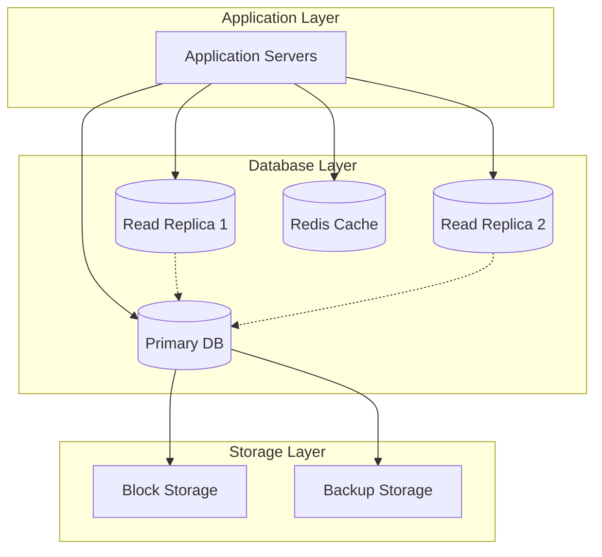
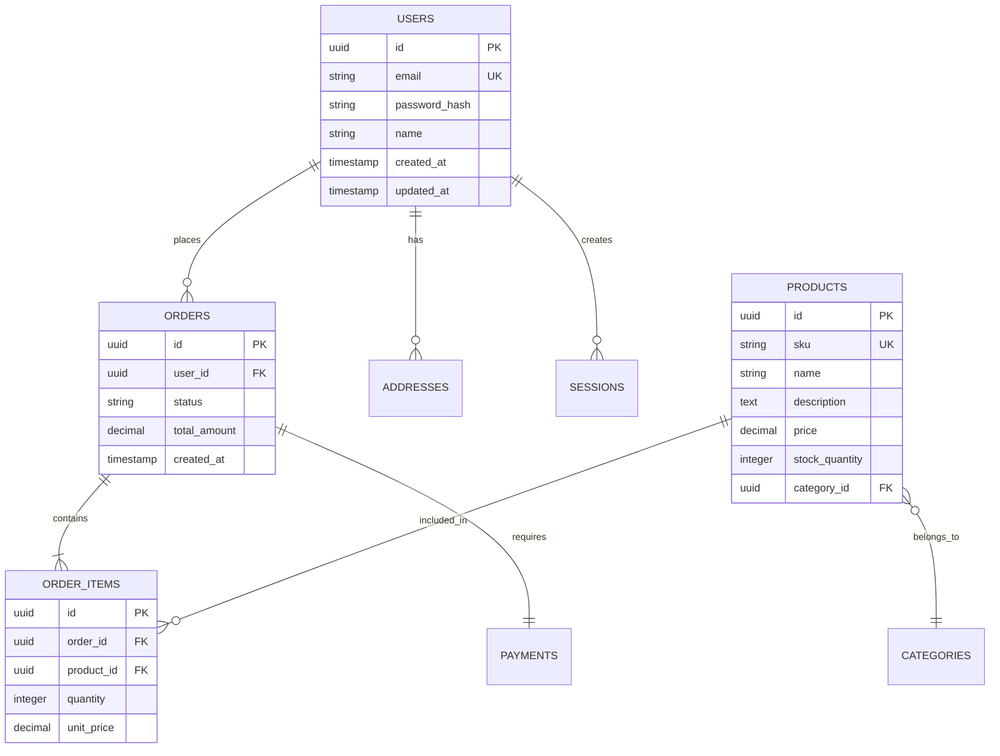

# Rule: Generating Database Schema Documentation

## Goal

To guide an AI assistant in creating comprehensive database schema documentation that clearly defines tables, relationships, indexes, and data governance for development and operations teams.

## Process

1. **Receive Database Requirements:** User provides database needs.
2. **Ask Data Architecture Questions:** AI *must* understand data relationships and constraints.
3. **Generate Schema Doc:** Create detailed database documentation.
4. **Save Schema Doc:** Save as `database-schema-[name].md` in `/tasks/`.
5. **Generate DDL Scripts:** Include executable SQL/migration scripts.

## Clarifying Questions (LLM Must Ask)

**Database Context:**
1. What database system?
   - A) PostgreSQL
   - B) MySQL/MariaDB
   - C) MongoDB
   - D) SQL Server
   - E) Oracle
   - F) DynamoDB
   - G) Multiple/Polyglot

2. What is the primary use case?
   - A) Transactional (OLTP)
   - B) Analytics (OLAP)
   - C) Mixed workload
   - D) Time-series data
   - E) Document store
   - F) Graph relationships

3. What is the expected data volume?
   - A) < 1 GB
   - B) 1-10 GB
   - C) 10-100 GB
   - D) 100 GB - 1 TB
   - E) > 1 TB

**Design Requirements:**
4. What are the consistency requirements?
   - A) Strong consistency (ACID)
   - B) Eventual consistency acceptable
   - C) Read-after-write consistency
   - D) Causal consistency
   - E) Mixed requirements

5. What are the performance priorities?
   - A) Fast writes
   - B) Fast reads
   - C) Complex queries
   - D) Real-time analytics
   - E) Balanced read/write

## Database Schema Structure

```markdown
# Database Schema: [System Name]

**Version:** 1.0.0
**Created:** [YYYY-MM-DD HH:MM]
**Author:** [Name/AI Assistant]
**Database:** [PostgreSQL/MySQL/MongoDB/etc.]
**Status:** Draft | Review | Production | Deprecated

## 1. Overview

### 1.1 Purpose
[What this database stores and why]

### 1.2 Architecture


### 1.3 Key Metrics
- **Tables:** [Number]
- **Estimated Records:** [Number]
- **Growth Rate:** [Records/day]
- **Storage Size:** [Current and projected]

## 2. Database Configuration

### 2.1 Connection Details
| Environment | Host | Port | Database | Purpose |
|-------------|------|------|----------|---------|
| Development | localhost | 5432 | app_dev | Local development |
| Staging | staging-db.example.com | 5432 | app_staging | Testing |
| Production | prod-db.example.com | 5432 | app_prod | Live system |

### 2.2 Performance Settings
```sql
-- PostgreSQL configuration
max_connections = 200
shared_buffers = 4GB
effective_cache_size = 12GB
maintenance_work_mem = 1GB
checkpoint_completion_target = 0.9
wal_buffers = 16MB
default_statistics_target = 100
random_page_cost = 1.1
effective_io_concurrency = 200
work_mem = 10485kB
```

## 3. Schema Design

### 3.1 Entity Relationship Diagram



### 3.2 Normalization Level
**Current:** 3NF (Third Normal Form)
**Rationale:** Balances data integrity with query performance

## 4. Table Definitions

### 4.1 Core Tables

#### users
Stores user account information.

```sql
CREATE TABLE users (
    id UUID PRIMARY KEY DEFAULT gen_random_uuid(),
    email VARCHAR(255) UNIQUE NOT NULL,
    password_hash VARCHAR(255) NOT NULL,
    name VARCHAR(100),
    phone VARCHAR(20),
    email_verified BOOLEAN DEFAULT FALSE,
    status VARCHAR(20) DEFAULT 'active',
    last_login TIMESTAMP,
    created_at TIMESTAMP DEFAULT CURRENT_TIMESTAMP,
    updated_at TIMESTAMP DEFAULT CURRENT_TIMESTAMP,
    deleted_at TIMESTAMP NULL
);

-- Indexes
CREATE INDEX idx_users_email ON users(email);
CREATE INDEX idx_users_status ON users(status) WHERE deleted_at IS NULL;
CREATE INDEX idx_users_created_at ON users(created_at);

-- Constraints
ALTER TABLE users ADD CONSTRAINT chk_email_format
    CHECK (email ~* '^[A-Za-z0-9._%+-]+@[A-Za-z0-9.-]+\.[A-Za-z]{2,}$');

-- Triggers
CREATE TRIGGER update_users_updated_at
    BEFORE UPDATE ON users
    FOR EACH ROW
    EXECUTE FUNCTION update_updated_at_column();
```

#### products
Product catalog with inventory tracking.

```sql
CREATE TABLE products (
    id UUID PRIMARY KEY DEFAULT gen_random_uuid(),
    sku VARCHAR(50) UNIQUE NOT NULL,
    name VARCHAR(255) NOT NULL,
    description TEXT,
    category_id UUID REFERENCES categories(id),
    price DECIMAL(10,2) NOT NULL CHECK (price >= 0),
    cost DECIMAL(10,2) CHECK (cost >= 0),
    stock_quantity INTEGER DEFAULT 0 CHECK (stock_quantity >= 0),
    low_stock_threshold INTEGER DEFAULT 10,
    weight_kg DECIMAL(8,3),
    dimensions_cm JSONB,
    images JSONB DEFAULT '[]'::jsonb,
    tags TEXT[],
    is_active BOOLEAN DEFAULT TRUE,
    created_at TIMESTAMP DEFAULT CURRENT_TIMESTAMP,
    updated_at TIMESTAMP DEFAULT CURRENT_TIMESTAMP
);

-- Indexes
CREATE INDEX idx_products_sku ON products(sku);
CREATE INDEX idx_products_category ON products(category_id);
CREATE INDEX idx_products_price ON products(price);
CREATE INDEX idx_products_tags ON products USING GIN(tags);
CREATE INDEX idx_products_active ON products(is_active) WHERE is_active = TRUE;

-- Full-text search
ALTER TABLE products ADD COLUMN search_vector tsvector;
CREATE INDEX idx_products_search ON products USING GIN(search_vector);

UPDATE products SET search_vector =
    to_tsvector('english', coalesce(name,'') || ' ' || coalesce(description,''));
```

#### orders
Order management with state tracking.

```sql
CREATE TABLE orders (
    id UUID PRIMARY KEY DEFAULT gen_random_uuid(),
    order_number VARCHAR(20) UNIQUE NOT NULL,
    user_id UUID REFERENCES users(id) ON DELETE RESTRICT,
    status VARCHAR(20) NOT NULL DEFAULT 'pending',
    subtotal DECIMAL(10,2) NOT NULL,
    tax_amount DECIMAL(10,2) DEFAULT 0,
    shipping_amount DECIMAL(10,2) DEFAULT 0,
    discount_amount DECIMAL(10,2) DEFAULT 0,
    total_amount DECIMAL(10,2) NOT NULL,
    currency VARCHAR(3) DEFAULT 'USD',
    shipping_address_id UUID REFERENCES addresses(id),
    billing_address_id UUID REFERENCES addresses(id),
    notes TEXT,
    metadata JSONB DEFAULT '{}'::jsonb,
    created_at TIMESTAMP DEFAULT CURRENT_TIMESTAMP,
    updated_at TIMESTAMP DEFAULT CURRENT_TIMESTAMP,
    completed_at TIMESTAMP
);

-- Indexes
CREATE INDEX idx_orders_user ON orders(user_id);
CREATE INDEX idx_orders_status ON orders(status);
CREATE INDEX idx_orders_created_at ON orders(created_at DESC);
CREATE INDEX idx_orders_number ON orders(order_number);

-- Constraints
ALTER TABLE orders ADD CONSTRAINT chk_order_status
    CHECK (status IN ('pending', 'processing', 'shipped', 'delivered', 'cancelled', 'refunded'));

ALTER TABLE orders ADD CONSTRAINT chk_order_amounts
    CHECK (total_amount = subtotal + tax_amount + shipping_amount - discount_amount);
```

### 4.2 Junction Tables

#### order_items
Links orders to products with quantity and pricing.

```sql
CREATE TABLE order_items (
    id UUID PRIMARY KEY DEFAULT gen_random_uuid(),
    order_id UUID REFERENCES orders(id) ON DELETE CASCADE,
    product_id UUID REFERENCES products(id),
    quantity INTEGER NOT NULL CHECK (quantity > 0),
    unit_price DECIMAL(10,2) NOT NULL,
    discount_amount DECIMAL(10,2) DEFAULT 0,
    tax_amount DECIMAL(10,2) DEFAULT 0,
    total_amount DECIMAL(10,2) NOT NULL,
    metadata JSONB DEFAULT '{}'::jsonb
);

-- Indexes
CREATE INDEX idx_order_items_order ON order_items(order_id);
CREATE INDEX idx_order_items_product ON order_items(product_id);

-- Constraints
ALTER TABLE order_items ADD CONSTRAINT chk_item_amounts
    CHECK (total_amount = (unit_price * quantity) - discount_amount + tax_amount);
```

### 4.3 Audit Tables

#### audit_log
Tracks all data changes for compliance.

```sql
CREATE TABLE audit_log (
    id BIGSERIAL PRIMARY KEY,
    table_name VARCHAR(50) NOT NULL,
    record_id UUID NOT NULL,
    action VARCHAR(10) NOT NULL,
    user_id UUID REFERENCES users(id),
    old_values JSONB,
    new_values JSONB,
    changed_fields TEXT[],
    ip_address INET,
    user_agent TEXT,
    created_at TIMESTAMP DEFAULT CURRENT_TIMESTAMP
);

-- Indexes
CREATE INDEX idx_audit_table_record ON audit_log(table_name, record_id);
CREATE INDEX idx_audit_user ON audit_log(user_id);
CREATE INDEX idx_audit_created ON audit_log(created_at DESC);
CREATE INDEX idx_audit_action ON audit_log(action);

-- Partitioning by month
CREATE TABLE audit_log_2025_01 PARTITION OF audit_log
    FOR VALUES FROM ('2025-01-01') TO ('2025-02-01');
```

## 5. Views and Materialized Views

### 5.1 Business Views

```sql
-- User order summary
CREATE VIEW v_user_order_summary AS
SELECT
    u.id as user_id,
    u.email,
    u.name,
    COUNT(DISTINCT o.id) as total_orders,
    SUM(o.total_amount) as lifetime_value,
    AVG(o.total_amount) as avg_order_value,
    MAX(o.created_at) as last_order_date
FROM users u
LEFT JOIN orders o ON u.id = o.user_id
WHERE u.deleted_at IS NULL
GROUP BY u.id, u.email, u.name;

-- Product performance
CREATE MATERIALIZED VIEW mv_product_performance AS
SELECT
    p.id as product_id,
    p.sku,
    p.name,
    COUNT(DISTINCT oi.order_id) as times_ordered,
    SUM(oi.quantity) as total_quantity_sold,
    SUM(oi.total_amount) as total_revenue,
    AVG(oi.unit_price) as avg_selling_price,
    p.stock_quantity as current_stock
FROM products p
LEFT JOIN order_items oi ON p.id = oi.product_id
LEFT JOIN orders o ON oi.order_id = o.id
WHERE o.status NOT IN ('cancelled', 'refunded')
GROUP BY p.id, p.sku, p.name, p.stock_quantity;

-- Refresh materialized view
CREATE INDEX ON mv_product_performance(product_id);
REFRESH MATERIALIZED VIEW CONCURRENTLY mv_product_performance;
```

## 6. Functions and Procedures

### 6.1 Utility Functions

```sql
-- Update timestamp trigger function
CREATE OR REPLACE FUNCTION update_updated_at_column()
RETURNS TRIGGER AS $$
BEGIN
    NEW.updated_at = CURRENT_TIMESTAMP;
    RETURN NEW;
END;
$$ LANGUAGE plpgsql;

-- Generate order number
CREATE OR REPLACE FUNCTION generate_order_number()
RETURNS VARCHAR AS $$
DECLARE
    order_num VARCHAR;
BEGIN
    order_num := 'ORD-' || TO_CHAR(CURRENT_DATE, 'YYMMDD') || '-' ||
                 LPAD(NEXTVAL('order_number_seq')::TEXT, 6, '0');
    RETURN order_num;
END;
$$ LANGUAGE plpgsql;

-- Calculate order totals
CREATE OR REPLACE FUNCTION calculate_order_total(order_id_param UUID)
RETURNS DECIMAL AS $$
DECLARE
    total DECIMAL;
BEGIN
    SELECT SUM(total_amount) INTO total
    FROM order_items
    WHERE order_id = order_id_param;

    RETURN COALESCE(total, 0);
END;
$$ LANGUAGE plpgsql;
```

### 6.2 Business Logic Procedures

```sql
-- Process order
CREATE OR REPLACE PROCEDURE process_order(
    IN order_id_param UUID,
    OUT success BOOLEAN,
    OUT message TEXT
)
LANGUAGE plpgsql
AS $$
BEGIN
    -- Start transaction
    BEGIN
        -- Update order status
        UPDATE orders
        SET status = 'processing',
            updated_at = CURRENT_TIMESTAMP
        WHERE id = order_id_param
        AND status = 'pending';

        IF NOT FOUND THEN
            success := FALSE;
            message := 'Order not found or not in pending status';
            RETURN;
        END IF;

        -- Reduce inventory
        UPDATE products p
        SET stock_quantity = stock_quantity - oi.quantity
        FROM order_items oi
        WHERE p.id = oi.product_id
        AND oi.order_id = order_id_param;

        -- Log the action
        INSERT INTO audit_log (table_name, record_id, action, new_values)
        VALUES ('orders', order_id_param, 'process',
                jsonb_build_object('status', 'processing'));

        success := TRUE;
        message := 'Order processed successfully';

    EXCEPTION
        WHEN OTHERS THEN
            success := FALSE;
            message := 'Error: ' || SQLERRM;
            ROLLBACK;
    END;
END;
$$;
```

## 7. Indexes Strategy

### 7.1 Index Analysis

| Table | Index | Type | Columns | Purpose |
|-------|-------|------|---------|---------|
| users | PRIMARY | B-tree | id | Primary key |
| users | idx_users_email | B-tree | email | Login queries |
| users | idx_users_status | Partial | status | Active user queries |
| products | idx_products_search | GIN | search_vector | Full-text search |
| orders | idx_orders_user | B-tree | user_id | User order history |
| orders | idx_orders_created_at | B-tree | created_at DESC | Recent orders |

### 7.2 Index Maintenance

```sql
-- Analyze index usage
SELECT
    schemaname,
    tablename,
    indexname,
    idx_scan,
    idx_tup_read,
    idx_tup_fetch,
    pg_size_pretty(pg_relation_size(indexrelid)) AS index_size
FROM pg_stat_user_indexes
ORDER BY idx_scan DESC;

-- Rebuild indexes
REINDEX TABLE CONCURRENTLY users;

-- Remove unused indexes
DROP INDEX CONCURRENTLY IF EXISTS idx_unused;
```

## 8. Data Migration

### 8.1 Migration Scripts

```sql
-- Migration: Add user preferences
BEGIN;

ALTER TABLE users ADD COLUMN IF NOT EXISTS preferences JSONB DEFAULT '{}'::jsonb;

-- Migrate existing data
UPDATE users SET preferences = jsonb_build_object(
    'newsletter', TRUE,
    'notifications', TRUE,
    'theme', 'light'
) WHERE preferences = '{}'::jsonb;

-- Add index
CREATE INDEX CONCURRENTLY idx_users_preferences
    ON users USING GIN(preferences);

COMMIT;
```

### 8.2 Rollback Scripts

```sql
-- Rollback: Remove user preferences
BEGIN;

DROP INDEX IF EXISTS idx_users_preferences;
ALTER TABLE users DROP COLUMN IF EXISTS preferences;

COMMIT;
```

## 9. Security

### 9.1 Access Control

```sql
-- Create roles
CREATE ROLE app_read;
CREATE ROLE app_write;
CREATE ROLE app_admin;

-- Grant permissions
GRANT SELECT ON ALL TABLES IN SCHEMA public TO app_read;
GRANT SELECT, INSERT, UPDATE ON ALL TABLES IN SCHEMA public TO app_write;
GRANT ALL PRIVILEGES ON ALL TABLES IN SCHEMA public TO app_admin;

-- Row-level security
ALTER TABLE orders ENABLE ROW LEVEL SECURITY;

CREATE POLICY orders_user_policy ON orders
    FOR ALL
    TO app_write
    USING (user_id = current_setting('app.current_user_id')::UUID);
```

### 9.2 Data Encryption

```sql
-- Encrypt sensitive data
CREATE EXTENSION IF NOT EXISTS pgcrypto;

-- Encrypt PII
UPDATE users
SET phone = encode(encrypt(phone::bytea, 'encryption_key', 'aes'), 'base64')
WHERE phone IS NOT NULL;

-- Decrypt for authorized access
SELECT
    id,
    email,
    convert_from(decrypt(decode(phone, 'base64'), 'encryption_key', 'aes'), 'UTF8') as phone
FROM users;
```

## 10. Backup and Recovery

### 10.1 Backup Strategy

```bash
# Daily backup script
#!/bin/bash
DATE=$(date +%Y%m%d_%H%M%S)
BACKUP_DIR="/backups/postgres"

# Full backup
pg_dump -h localhost -U postgres -d app_prod \
    --format=custom \
    --verbose \
    --file="${BACKUP_DIR}/full_backup_${DATE}.dump"

# Table-specific backup
pg_dump -h localhost -U postgres -d app_prod \
    --table=orders \
    --table=order_items \
    --format=custom \
    --file="${BACKUP_DIR}/orders_backup_${DATE}.dump"

# Compress and encrypt
tar -czf - "${BACKUP_DIR}/full_backup_${DATE}.dump" | \
    openssl enc -aes-256-cbc -salt -out "${BACKUP_DIR}/encrypted_${DATE}.tar.gz.enc"
```

### 10.2 Recovery Procedures

```bash
# Restore from backup
pg_restore -h localhost -U postgres -d app_prod \
    --verbose \
    --clean \
    --if-exists \
    "${BACKUP_DIR}/full_backup_${DATE}.dump"

# Point-in-time recovery
pg_basebackup -h localhost -U replicator -D /recovery/base -Fp -Xs -P

# Restore specific tables
pg_restore -h localhost -U postgres -d app_prod \
    --table=orders \
    --data-only \
    "${BACKUP_DIR}/orders_backup_${DATE}.dump"
```

## 11. Performance Optimization

### 11.1 Query Optimization

```sql
-- Identify slow queries
SELECT
    mean_exec_time,
    calls,
    query
FROM pg_stat_statements
WHERE mean_exec_time > 100
ORDER BY mean_exec_time DESC
LIMIT 10;

-- Query execution plan
EXPLAIN (ANALYZE, BUFFERS)
SELECT * FROM orders o
JOIN order_items oi ON o.id = oi.order_id
WHERE o.created_at >= CURRENT_DATE - INTERVAL '7 days';

-- Vacuum and analyze
VACUUM (VERBOSE, ANALYZE) orders;
```

### 11.2 Partitioning Strategy

```sql
-- Partition orders by month
CREATE TABLE orders_partitioned (
    LIKE orders INCLUDING ALL
) PARTITION BY RANGE (created_at);

-- Create partitions
CREATE TABLE orders_2025_01 PARTITION OF orders_partitioned
    FOR VALUES FROM ('2025-01-01') TO ('2025-02-01');

CREATE TABLE orders_2025_02 PARTITION OF orders_partitioned
    FOR VALUES FROM ('2025-02-01') TO ('2025-03-01');

-- Automatic partition creation
CREATE OR REPLACE FUNCTION create_monthly_partition()
RETURNS void AS $$
DECLARE
    partition_name TEXT;
    start_date DATE;
    end_date DATE;
BEGIN
    start_date := DATE_TRUNC('month', CURRENT_DATE);
    end_date := start_date + INTERVAL '1 month';
    partition_name := 'orders_' || TO_CHAR(start_date, 'YYYY_MM');

    EXECUTE format('CREATE TABLE IF NOT EXISTS %I PARTITION OF orders_partitioned
                    FOR VALUES FROM (%L) TO (%L)',
                    partition_name, start_date, end_date);
END;
$$ LANGUAGE plpgsql;
```

## 12. Monitoring

### 12.1 Health Checks

```sql
-- Database size
SELECT
    pg_database.datname,
    pg_size_pretty(pg_database_size(pg_database.datname)) AS size
FROM pg_database
ORDER BY pg_database_size(pg_database.datname) DESC;

-- Table sizes
SELECT
    schemaname,
    tablename,
    pg_size_pretty(pg_total_relation_size(schemaname||'.'||tablename)) AS size
FROM pg_tables
WHERE schemaname = 'public'
ORDER BY pg_total_relation_size(schemaname||'.'||tablename) DESC;

-- Connection count
SELECT
    state,
    COUNT(*)
FROM pg_stat_activity
GROUP BY state;

-- Lock monitoring
SELECT
    pg_stat_activity.pid,
    pg_class.relname,
    pg_locks.mode,
    pg_stat_activity.query
FROM pg_locks
JOIN pg_class ON pg_locks.relation = pg_class.oid
JOIN pg_stat_activity ON pg_locks.pid = pg_stat_activity.pid
WHERE NOT pg_locks.granted;
```

## 13. Data Dictionary

### 13.1 Column Definitions

| Table | Column | Type | Nullable | Default | Description |
|-------|--------|------|----------|---------|-------------|
| users | id | UUID | No | gen_random_uuid() | Unique user identifier |
| users | email | VARCHAR(255) | No | - | User email address |
| users | status | VARCHAR(20) | No | 'active' | Account status |
| orders | total_amount | DECIMAL(10,2) | No | - | Order total including tax |
| products | stock_quantity | INTEGER | No | 0 | Current inventory level |

### 13.2 Status Values

| Table | Column | Valid Values | Description |
|-------|--------|--------------|-------------|
| users | status | active, inactive, suspended, deleted | Account status |
| orders | status | pending, processing, shipped, delivered, cancelled, refunded | Order lifecycle |
| products | is_active | true, false | Product availability |

---

## Appendix A: Full DDL Script

[Link to complete DDL script file]

## Appendix B: Sample Data

[Link to sample data generation scripts]

## Appendix C: Database Diagram

[Link to full ERD diagram]
```

## Version Control Integration

```bash
# Track schema documentation
echo "| database-schema-[name] | v1.0.0 | $(date +%Y-%m-%d) | [Tables: X] |" >> DATABASE_SCHEMA_TRACKING.md

# Commit
git add tasks/database-schema-[name].md
git commit -m "Database Schema: [System Name]

- Tables: [Number]
- Database: [Type]
- Indexes: [Number]"
```

## AI Assistant Instructions

The AI must:
1. Include complete DDL scripts
2. Document all constraints and indexes
3. Provide performance optimization queries
4. Include backup and recovery procedures
5. Document security measures
6. Provide migration scripts
7. Include monitoring queries
8. Document all relationships

## Output

- **Format:** Markdown (`.md`)
- **Location:** `/tasks/`
- **Filename:** `database-schema-[name].md`