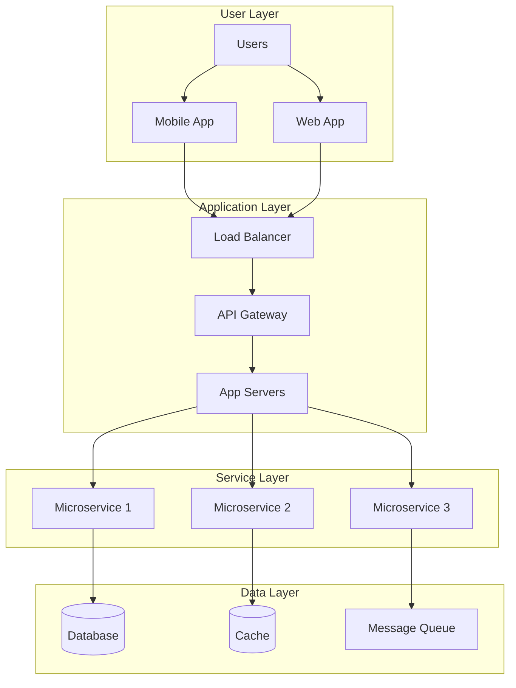
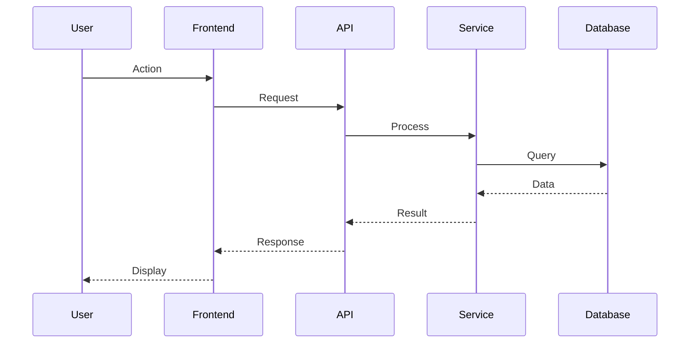
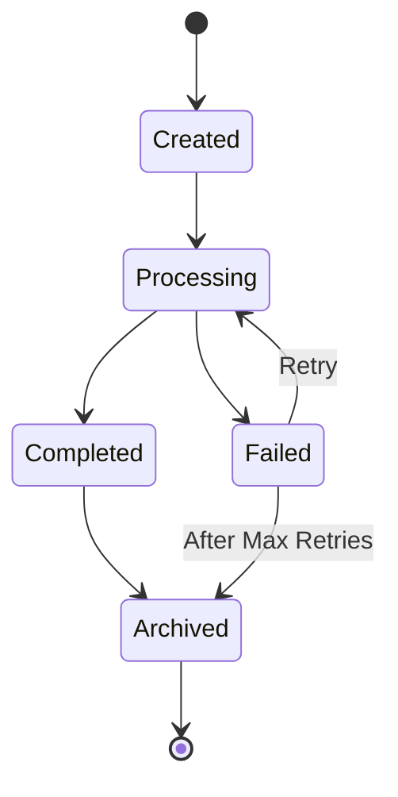

# Rule: Generating a Design Document

## Goal

To guide an AI assistant in creating a comprehensive design document that clearly communicates system architecture, component interactions, and design decisions to the development team.

## Process

1. **Receive System Description:** User provides system/feature to design.
2. **Ask Architecture Questions:** AI *must* understand the system deeply.
3. **Generate Design Doc:** Create detailed design documentation.
4. **Save Design Doc:** Save as `design-doc-[system-name].md` in `/tasks/`.
5. **Include Diagrams:** Add architecture diagrams and data flows.

## Clarifying Questions (LLM Must Ask)

**System Scope:**
1. What is the system's primary purpose?
   - A) User-facing application
   - B) Backend service
   - C) Data processing pipeline
   - D) Integration layer
   - E) Infrastructure component

2. What is the expected scale?
   - A) Prototype (< 100 users)
   - B) Small (100-1K users)
   - C) Medium (1K-10K users)
   - D) Large (10K-100K users)
   - E) Massive (> 100K users)

3. What are the main quality attributes?
   - A) Performance (speed)
   - B) Scalability (growth)
   - C) Reliability (uptime)
   - D) Security (data protection)
   - E) Maintainability (easy changes)
   - F) All important (specify priorities)

**Technical Context:**
4. What constraints exist?
   - A) Must use existing infrastructure
   - B) Budget limitations
   - C) Time constraints
   - D) Technology restrictions
   - E) Regulatory requirements

5. What integration points are needed?
   - List all systems this will connect to

## Design Document Structure

```markdown
# Design Document: [System Name]

**Version:** 1.0
**Created:** [YYYY-MM-DD HH:MM]
**Author:** [Name/AI Assistant]
**Status:** Draft | Review | Approved | Implemented
**Related Docs:** [Links to PRD, Tech Spec, ADRs]

## Executive Summary

[2-3 paragraph overview that any stakeholder can understand. What is being built and why?]

## Goals and Non-Goals

### Goals
1. [Specific, measurable goal]
2. [Another goal]
3. [Another goal]

### Non-Goals
1. [What this design explicitly does NOT address]
2. [Out of scope item]
3. [Future consideration]

## Background and Context

### Problem Statement
[What problem does this design solve?]

### Current State
[How things work today, if applicable]

### Proposed Solution
[High-level description of the solution]

## System Architecture

### High-Level Architecture



### Component Details

#### Component 1: [Name]
- **Purpose:** [What it does]
- **Technology:** [Tech stack]
- **Responsibilities:**
  - [Responsibility 1]
  - [Responsibility 2]
- **Interfaces:**
  - Input: [Data/API]
  - Output: [Data/API]

#### Component 2: [Name]
[Repeat structure for all components]

### Data Flow



## Detailed Design

### API Design

#### Endpoint: POST /api/v1/[resource]
```yaml
Request:
  Headers:
    Authorization: Bearer [token]
    Content-Type: application/json
  Body:
    {
      "field1": "value1",
      "field2": "value2"
    }

Response:
  Success (200):
    {
      "id": "uuid",
      "field1": "value1",
      "field2": "value2",
      "created_at": "timestamp"
    }
  Error (400):
    {
      "error": "Validation failed",
      "details": ["field1 is required"]
    }
```

### Data Model

```sql
-- Core entities
CREATE TABLE entities (
    id UUID PRIMARY KEY,
    name VARCHAR(255) NOT NULL,
    type VARCHAR(50),
    status VARCHAR(20) DEFAULT 'active',
    created_at TIMESTAMP DEFAULT NOW(),
    updated_at TIMESTAMP DEFAULT NOW()
);

-- Relationships
CREATE TABLE relationships (
    id UUID PRIMARY KEY,
    entity_1_id UUID REFERENCES entities(id),
    entity_2_id UUID REFERENCES entities(id),
    relationship_type VARCHAR(50)
);

-- Indexes for performance
CREATE INDEX idx_entities_status ON entities(status);
CREATE INDEX idx_entities_type ON entities(type);
```

### State Management



## Security Considerations

### Authentication & Authorization
- **Method:** OAuth 2.0 with JWT tokens
- **Token Lifetime:** 1 hour access, 30 days refresh
- **Permissions Model:** Role-Based Access Control (RBAC)

### Data Security
- **Encryption at Rest:** AES-256
- **Encryption in Transit:** TLS 1.3
- **PII Handling:** Tokenization for sensitive data
- **Audit Logging:** All data access logged

### Security Threats & Mitigations
| Threat | Impact | Mitigation |
|--------|--------|------------|
| SQL Injection | High | Parameterized queries |
| XSS | Medium | Input sanitization |
| DDOS | High | Rate limiting, CDN |
| Data Breach | Critical | Encryption, access controls |

## Performance Considerations

### Performance Requirements
- **Response Time:** p95 < 200ms
- **Throughput:** 10,000 requests/second
- **Availability:** 99.99% uptime

### Optimization Strategies
1. **Caching:**
   - Redis for session data
   - CDN for static assets
   - Application-level caching

2. **Database:**
   - Connection pooling
   - Query optimization
   - Read replicas for scaling

3. **Async Processing:**
   - Message queues for heavy operations
   - Background jobs for non-critical tasks

### Capacity Planning
| Metric | Current | 6 Months | 1 Year |
|--------|---------|----------|--------|
| Users | 1,000 | 10,000 | 50,000 |
| Storage | 100GB | 1TB | 5TB |
| Compute | 4 cores | 16 cores | 64 cores |

## Scalability Design

### Horizontal Scaling
- **Application Tier:** Stateless design, auto-scaling groups
- **Database:** Sharding strategy by user_id
- **Cache:** Redis Cluster

### Vertical Scaling
- **When:** CPU/Memory > 80% consistently
- **Limits:** Max 64GB RAM, 32 cores per instance

## Reliability and Fault Tolerance

### Failure Modes
| Component | Failure Mode | Impact | Recovery |
|-----------|--------------|--------|----------|
| Database | Connection lost | Service degraded | Failover to replica |
| Cache | Redis down | Slower response | Direct DB queries |
| Queue | Message loss | Data inconsistency | Dead letter queue |

### Disaster Recovery
- **RTO:** 1 hour
- **RPO:** 5 minutes
- **Backup Strategy:** Daily full, hourly incremental
- **Multi-region:** Active-passive setup

## Monitoring and Observability

### Key Metrics
- **Golden Signals:**
  - Latency: Response time percentiles
  - Traffic: Requests per second
  - Errors: Error rate percentage
  - Saturation: Resource utilization

### Monitoring Stack
- **Metrics:** Prometheus + Grafana
- **Logs:** ELK Stack
- **Traces:** Jaeger
- **Alerts:** PagerDuty

## Testing Strategy

### Test Levels
1. **Unit Tests:** 80% code coverage minimum
2. **Integration Tests:** All API endpoints
3. **Load Tests:** Verify performance requirements
4. **Chaos Engineering:** Failure scenario testing

### Test Scenarios
| Scenario | Expected Behavior |
|----------|-------------------|
| Database failover | Automatic switch to replica |
| High load | Auto-scaling triggers |
| Network partition | Graceful degradation |

## Migration Plan

### Phase 1: Foundation (Week 1-2)
- Set up infrastructure
- Deploy core services
- Implement basic functionality

### Phase 2: Migration (Week 3-4)
- Migrate existing data
- Switch traffic gradually (canary deployment)
- Monitor for issues

### Phase 3: Optimization (Week 5-6)
- Performance tuning
- Implement caching
- Add monitoring

## Alternative Designs Considered

### Alternative 1: Monolithic Architecture
**Pros:** Simpler deployment, easier debugging
**Cons:** Harder to scale, single point of failure
**Why rejected:** Doesn't meet scalability requirements

### Alternative 2: Serverless
**Pros:** No infrastructure management, auto-scaling
**Cons:** Vendor lock-in, cold starts
**Why rejected:** Performance requirements too strict

## Dependencies

### External Dependencies
| Service | Purpose | SLA | Fallback |
|---------|---------|-----|----------|
| Payment Gateway | Process payments | 99.95% | Queue for retry |
| Email Service | Notifications | 99.9% | Alternative provider |
| CDN | Static content | 99.99% | Direct serving |

### Internal Dependencies
| Service | Team | Contact |
|---------|------|---------|
| Auth Service | Platform Team | @platform-team |
| User Service | Core Team | @core-team |

## Cost Analysis

### Infrastructure Costs (Monthly)
| Component | Cost | Notes |
|-----------|------|-------|
| Compute | $2,000 | Auto-scaling 4-16 instances |
| Storage | $500 | 1TB with backups |
| Network | $300 | CDN and data transfer |
| **Total** | **$2,800** | ~$0.028 per user |

## Timeline and Milestones

| Milestone | Date | Deliverables |
|-----------|------|--------------|
| Design Approval | Week 1 | This document |
| Development Start | Week 2 | Environment setup |
| Alpha Release | Week 6 | Core features |
| Beta Release | Week 10 | Full features |
| Production | Week 12 | GA release |

## Open Questions

1. [ ] Should we implement multi-tenancy from the start?
2. [ ] What is the data retention policy?
3. [ ] Do we need GDPR compliance?
4. [ ] Should we support multiple cloud providers?

## Appendices

### Appendix A: Detailed API Specification
[Link to full OpenAPI spec]

### Appendix B: Database Schema
[Complete DDL scripts]

### Appendix C: Infrastructure as Code
[Terraform/CloudFormation templates]

---

## Sign-off

| Role | Name | Date | Approved |
|------|------|------|----------|
| Tech Lead | [Name] | [Date] | [ ] |
| Architect | [Name] | [Date] | [ ] |
| Product | [Name] | [Date] | [ ] |

## Revision History

| Version | Date | Changes | Author |
|---------|------|---------|--------|
| 1.0 | [Date] | Initial design | [Author] |
```

## Version Control Integration

```bash
# Track document
echo "| design-doc-[name] | Draft | $(date +%Y-%m-%d) | [System] |" >> DESIGN_DOC_TRACKING.md

# Commit
git add tasks/design-doc-[name].md
git commit -m "Design Doc: [System Name]

- Architecture: [Type]
- Components: [Number]
- Timeline: [Duration]"
```

## AI Assistant Instructions

The AI must:
1. Create clear architecture diagrams
2. Explain all design decisions
3. Address all quality attributes
4. Include concrete performance numbers
5. Provide migration strategies
6. Consider alternatives thoroughly
7. Include cost analysis

## Output

- **Format:** Markdown (`.md`)
- **Location:** `/tasks/`
- **Filename:** `design-doc-[system-name].md`