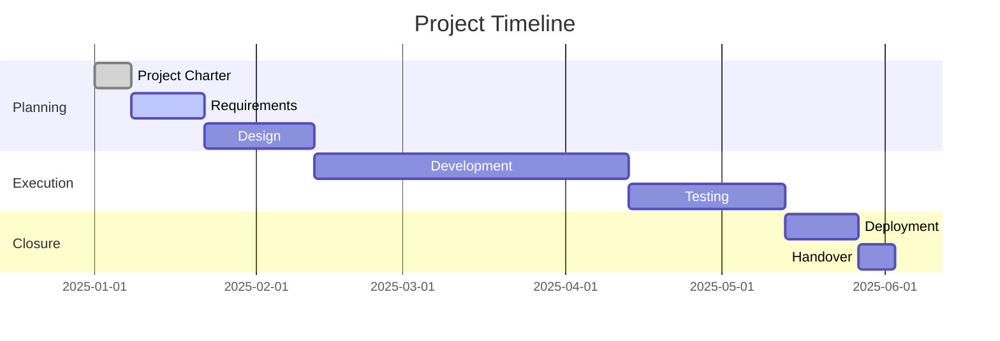
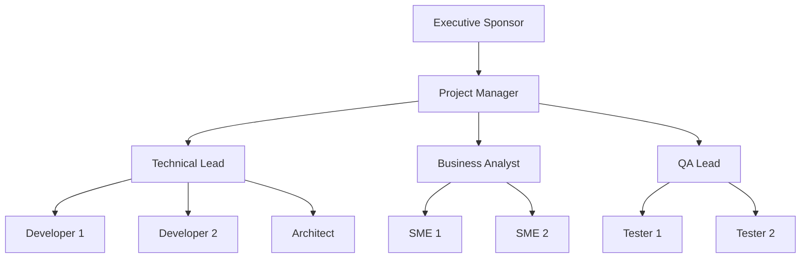

# Rule: Generating a Project Charter

## Goal

To guide an AI assistant in creating a comprehensive project charter that formally authorizes a project, defines objectives, and establishes boundaries for successful project execution.

## Process

1. **Receive Project Vision:** User provides project concept.
2. **Ask Strategic Questions:** AI *must* understand business context and constraints.
3. **Generate Charter:** Create formal project authorization document.
4. **Save Charter:** Save as `project-charter-[name].md` in `/tasks/`.
5. **Define Success Metrics:** Establish measurable success criteria.

## Clarifying Questions (LLM Must Ask)

**Project Context:**
1. What is the primary business driver?
   - A) Revenue growth
   - B) Cost reduction
   - C) Risk mitigation
   - D) Regulatory compliance
   - E) Customer satisfaction
   - F) Market expansion

2. What is the project scale?
   - A) Department level (< 10 people)
   - B) Division level (10-50 people)
   - C) Company-wide (50-200 people)
   - D) Enterprise (> 200 people)
   - E) Multi-organization

3. What is the timeline?
   - A) < 3 months
   - B) 3-6 months
   - C) 6-12 months
   - D) 1-2 years
   - E) > 2 years

**Resource Context:**
4. What is the budget range?
   - A) < $50K
   - B) $50K-$250K
   - C) $250K-$1M
   - D) $1M-$5M
   - E) > $5M

5. What are the main constraints?
   - A) Fixed budget
   - B) Fixed timeline
   - C) Fixed scope
   - D) Resource availability
   - E) Technology limitations
   - F) All of the above

## Project Charter Structure

```markdown
# Project Charter: [Project Name]

**Document Version:** 1.0
**Date:** [YYYY-MM-DD]
**Status:** Draft | Approved | Revised
**Project ID:** [Unique identifier]
**Confidentiality:** Public | Internal | Confidential | Restricted

## Executive Summary

[2-3 paragraph overview that executives can quickly understand. Include the problem, solution, and expected impact.]

## 1. Project Overview

### 1.1 Project Title
**Official Name:** [Formal project name]
**Code Name:** [Internal reference name]
**Acronym:** [If applicable]

### 1.2 Project Category
- [ ] Strategic Initiative
- [ ] Operational Excellence
- [ ] Technology Upgrade
- [ ] Regulatory Compliance
- [ ] Cost Optimization
- [ ] Revenue Generation

### 1.3 Strategic Alignment
| Corporate Goal | Project Contribution | Priority |
|----------------|---------------------|----------|
| [Goal 1] | [How project supports] | High |
| [Goal 2] | [How project supports] | Medium |
| [Goal 3] | [How project supports] | Low |

## 2. Business Case

### 2.1 Problem Statement
**Current State:**
[Describe the current situation and its problems]

**Pain Points:**
1. [Specific problem 1]
2. [Specific problem 2]
3. [Specific problem 3]

**Cost of Inaction:**
- Financial: $[Amount] per [period]
- Operational: [Impact description]
- Strategic: [Competitive disadvantage]

### 2.2 Opportunity
**Market Opportunity:**
[Describe the market opportunity or competitive advantage]

**Timing Rationale:**
[Why this project should be done now]

### 2.3 Proposed Solution
**Solution Overview:**
[High-level description of the proposed solution]

**Key Components:**
1. [Component 1]
2. [Component 2]
3. [Component 3]

## 3. Project Objectives

### 3.1 Primary Objectives
1. **Objective:** [Specific objective]
   - **Measure:** [How to measure success]
   - **Target:** [Quantifiable target]
   - **Deadline:** [Date]

2. **Objective:** [Specific objective]
   - **Measure:** [How to measure success]
   - **Target:** [Quantifiable target]
   - **Deadline:** [Date]

### 3.2 SMART Goals
| Goal | Specific | Measurable | Achievable | Relevant | Time-bound |
|------|----------|------------|------------|----------|------------|
| [Goal 1] | [Details] | [Metrics] | [Feasibility] | [Alignment] | [Deadline] |
| [Goal 2] | [Details] | [Metrics] | [Feasibility] | [Alignment] | [Deadline] |

## 4. Scope Definition

### 4.1 In Scope
✅ **Included in this project:**
- [Deliverable/feature 1]
- [Deliverable/feature 2]
- [Deliverable/feature 3]
- [Process/system 1]
- [Integration 1]

### 4.2 Out of Scope
❌ **NOT included in this project:**
- [Excluded item 1] - Reason: [Why excluded]
- [Excluded item 2] - Reason: [Why excluded]
- [Excluded item 3] - Reason: [Why excluded]

### 4.3 Scope Control
**Change Process:**
1. Submit change request form
2. Impact analysis by project team
3. Approval by change control board
4. Update project documentation

## 5. Deliverables

### 5.1 Major Deliverables
| Deliverable | Description | Due Date | Owner |
|-------------|-------------|----------|-------|
| [Deliverable 1] | [Description] | [Date] | [Name] |
| [Deliverable 2] | [Description] | [Date] | [Name] |
| [Deliverable 3] | [Description] | [Date] | [Name] |

### 5.2 Acceptance Criteria
| Deliverable | Acceptance Criteria | Approver |
|-------------|-------------------|----------|
| [Deliverable 1] | [Specific criteria] | [Name/Role] |
| [Deliverable 2] | [Specific criteria] | [Name/Role] |

## 6. Stakeholders

### 6.1 Stakeholder Register
| Name | Role | Interest | Influence | Engagement Strategy |
|------|------|----------|-----------|-------------------|
| [Name] | Sponsor | High | High | Weekly updates |
| [Name] | Customer | High | Medium | Monthly demos |
| [Name] | Team Lead | Medium | High | Daily standups |
| [Name] | End User | High | Low | Surveys, training |

### 6.2 RACI Summary
| Deliverable | Responsible | Accountable | Consulted | Informed |
|-------------|-------------|-------------|-----------|----------|
| Project Plan | PM | Sponsor | Team Leads | All |
| Technical Design | Tech Lead | PM | Architects | Sponsor |
| Testing | QA Lead | PM | Dev Team | Stakeholders |

## 7. Timeline

### 7.1 Major Milestones


### 7.2 Key Dates
| Milestone | Target Date | Dependencies |
|-----------|-------------|--------------|
| Project Kickoff | [Date] | Charter approval |
| Design Complete | [Date] | Requirements sign-off |
| Alpha Release | [Date] | Core development |
| Beta Release | [Date] | Testing complete |
| Go Live | [Date] | All deliverables |
| Project Closure | [Date] | Handover complete |

## 8. Budget

### 8.1 Budget Summary
| Category | Estimated Cost | % of Total |
|----------|---------------|------------|
| Labor | $[Amount] | [%] |
| Software/Licenses | $[Amount] | [%] |
| Hardware/Infrastructure | $[Amount] | [%] |
| Consulting/Contractors | $[Amount] | [%] |
| Training | $[Amount] | [%] |
| Contingency (10-20%) | $[Amount] | [%] |
| **Total** | **$[Amount]** | **100%** |

### 8.2 Financial Benefits
| Benefit Type | Year 1 | Year 2 | Year 3 | Total |
|--------------|--------|--------|--------|-------|
| Cost Savings | $[Amount] | $[Amount] | $[Amount] | $[Amount] |
| Revenue Increase | $[Amount] | $[Amount] | $[Amount] | $[Amount] |
| Efficiency Gains | $[Amount] | $[Amount] | $[Amount] | $[Amount] |
| **Total Benefits** | **$[Amount]** | **$[Amount]** | **$[Amount]** | **$[Amount]** |

### 8.3 ROI Calculation
- **Total Investment:** $[Amount]
- **Total Benefits (3 years):** $[Amount]
- **Net Present Value (NPV):** $[Amount]
- **Return on Investment (ROI):** [%]
- **Payback Period:** [Months]

## 9. Resources

### 9.1 Project Team Structure


### 9.2 Resource Requirements
| Role | FTE | Duration | Skills Required |
|------|-----|----------|-----------------|
| Project Manager | 1.0 | Full project | PMP, Agile |
| Technical Lead | 1.0 | Full project | Architecture, [Tech] |
| Developer | 3.0 | Development phase | [Languages/Tools] |
| Business Analyst | 1.0 | Requirements phase | Domain knowledge |
| QA Engineer | 2.0 | Testing phase | Test automation |

### 9.3 External Dependencies
| Dependency | Provider | Critical Path | Mitigation |
|------------|----------|---------------|------------|
| [System/Service] | [Vendor] | Yes/No | [Backup plan] |
| [Data/API] | [Partner] | Yes/No | [Alternative] |

## 10. Risks and Assumptions

### 10.1 Top Risks
| Risk | Probability | Impact | Score | Mitigation |
|------|-------------|--------|-------|------------|
| [Risk 1] | High | High | 9 | [Mitigation plan] |
| [Risk 2] | Medium | High | 6 | [Mitigation plan] |
| [Risk 3] | Low | Medium | 3 | [Mitigation plan] |

### 10.2 Key Assumptions
1. [Assumption 1] - Impact if false: [Description]
2. [Assumption 2] - Impact if false: [Description]
3. [Assumption 3] - Impact if false: [Description]

### 10.3 Dependencies
1. [Dependency 1] - Required by: [Date]
2. [Dependency 2] - Required by: [Date]

## 11. Success Criteria

### 11.1 Success Metrics
| Metric | Target | Measurement Method |
|--------|--------|-------------------|
| Project Delivery | On time (±5%) | Schedule variance |
| Budget Performance | Within budget (±10%) | Cost variance |
| Quality | < 5 critical defects | Defect tracking |
| User Satisfaction | > 4.0/5.0 | Survey scores |
| Adoption Rate | > 80% in 3 months | Usage analytics |

### 11.2 Definition of Done
- [ ] All deliverables completed and accepted
- [ ] Documentation complete and approved
- [ ] Training delivered to all users
- [ ] Production deployment successful
- [ ] Support transition complete
- [ ] Lessons learned documented

## 12. Governance

### 12.1 Governance Structure
| Committee | Purpose | Frequency | Chair |
|-----------|---------|-----------|-------|
| Steering Committee | Strategic decisions | Monthly | [Name] |
| Change Control Board | Scope changes | Bi-weekly | [Name] |
| Technical Review Board | Architecture decisions | Weekly | [Name] |

### 12.2 Reporting
| Report | Audience | Frequency | Format |
|--------|----------|-----------|--------|
| Status Report | Steering Committee | Weekly | Dashboard |
| Risk Report | PMO | Bi-weekly | Document |
| Budget Report | Finance | Monthly | Spreadsheet |
| Progress Report | All Stakeholders | Monthly | Presentation |

### 12.3 Communication Plan
| Stakeholder | Information Need | Method | Frequency |
|-------------|------------------|--------|-----------|
| Sponsor | High-level status | Meeting | Weekly |
| Team | Detailed tasks | Standup | Daily |
| Users | Progress updates | Newsletter | Monthly |
| PMO | Compliance | Reports | Weekly |

## 13. Constraints and Dependencies

### 13.1 Constraints
- **Budget:** Fixed at $[Amount]
- **Timeline:** Must complete by [Date]
- **Resources:** Maximum [Number] team members
- **Technology:** Must use existing [Platform]
- **Regulatory:** Must comply with [Regulation]

### 13.2 External Dependencies
| Dependency | Owner | Required By | Status |
|------------|-------|-------------|--------|
| [API Access] | [Team] | [Date] | Pending |
| [Data Migration] | [Vendor] | [Date] | In Progress |
| [License Approval] | [Legal] | [Date] | Complete |

## 14. Approval

### 14.1 Charter Approval
By signing below, the stakeholders agree to the project as described in this charter.

| Role | Name | Signature | Date |
|------|------|-----------|------|
| Executive Sponsor | [Name] | __________ | _____ |
| Project Manager | [Name] | __________ | _____ |
| Technical Lead | [Name] | __________ | _____ |
| Finance Representative | [Name] | __________ | _____ |

### 14.2 Revision History
| Version | Date | Changes | Author |
|---------|------|---------|--------|
| 1.0 | [Date] | Initial charter | [Name] |
| 1.1 | [Date] | Budget update | [Name] |

## 15. Appendices

### Appendix A: Detailed Budget Breakdown
[Link to detailed budget spreadsheet]

### Appendix B: Risk Register
[Link to complete risk register]

### Appendix C: Stakeholder Analysis
[Link to detailed stakeholder analysis]

### Appendix D: Technical Architecture
[Link to technical design documents]

---

**Next Steps:**
1. Review and approve charter
2. Assign project manager
3. Kick-off meeting
4. Develop detailed project plan
5. Begin requirements gathering
```

## Version Control Integration

```bash
# Track charter
echo "| project-charter-[name] | v1.0 | $(date +%Y-%m-%d) | [Status] |" >> PROJECT_CHARTER_TRACKING.md

# Commit
git add tasks/project-charter-[name].md
git commit -m "Project Charter: [Project Name]

- Budget: $[Amount]
- Timeline: [Duration]
- Team Size: [Number]"
```

## AI Assistant Instructions

The AI must:
1. Clearly define project boundaries
2. Include measurable success criteria
3. Document all stakeholders
4. Provide realistic timeline
5. Include budget with ROI
6. Identify major risks
7. Define governance structure
8. Get formal approval

## Output

- **Format:** Markdown (`.md`)
- **Location:** `/tasks/`
- **Filename:** `project-charter-[name].md`