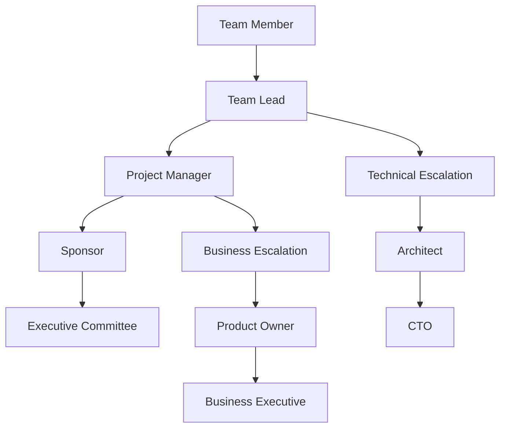

# Rule: Generating a RACI Matrix

## Goal

To guide an AI assistant in creating a comprehensive RACI (Responsible, Accountable, Consulted, Informed) matrix that clearly defines roles and responsibilities for project tasks and deliverables.

## Process

1. **Receive Project Structure:** User provides project scope and team.
2. **Ask Role Clarification Questions:** AI *must* understand all stakeholders and their involvement.
3. **Generate RACI Matrix:** Create detailed responsibility assignment matrix.
4. **Save RACI:** Save as `raci-matrix-[project].md` in `/tasks/`.
5. **Validate Coverage:** Ensure every task has clear ownership.

## Clarifying Questions (LLM Must Ask)

**Team Structure:**
1. How many team members are involved?
   - A) Small (< 5 people)
   - B) Medium (5-15 people)
   - C) Large (15-30 people)
   - D) Very Large (> 30 people)

2. What is the organizational structure?
   - A) Functional (department-based)
   - B) Matrix (dual reporting)
   - C) Projectized (dedicated team)
   - D) Hybrid
   - E) Flat/Agile

3. What is the decision-making model?
   - A) Hierarchical (top-down)
   - B) Consensus (team agreement)
   - C) Delegated (empowered teams)
   - D) Democratic (voting)
   - E) Mixed

**Project Complexity:**
4. How many major deliverables?
   - A) < 5
   - B) 5-10
   - C) 10-20
   - D) 20-50
   - E) > 50

5. What is the primary challenge?
   - A) Unclear roles
   - B) Too many stakeholders
   - C) Overlapping responsibilities
   - D) Geographic distribution
   - E) All of the above

## RACI Matrix Structure

```markdown
# RACI Matrix: [Project Name]

**Version:** 1.0
**Created:** [YYYY-MM-DD HH:MM]
**Author:** [Name/AI Assistant]
**Project:** [Project name and ID]
**Status:** Draft | Approved | In Use | Updated

## 1. RACI Overview

### 1.1 Purpose
This RACI matrix defines clear roles and responsibilities for all project activities, ensuring accountability and preventing gaps or overlaps in ownership.

### 1.2 RACI Definitions
- **R (Responsible):** The person who does the work to complete the task
- **A (Accountable):** The person ultimately answerable for the correct completion (only ONE per task)
- **C (Consulted):** People who provide input before the work or decision
- **I (Informed):** People who need to be kept up-to-date on progress

### 1.3 RACI Rules
✅ **Every task must have:**
- Exactly ONE Accountable (A) person
- At least ONE Responsible (R) person
- Clear escalation path

❌ **Avoid:**
- Multiple A's for one task
- Tasks with no R
- Everyone as C (causes delays)
- Too many I's (information overload)

## 2. Stakeholder Directory

### 2.1 Project Roles
| Code | Role | Name | Department | Contact |
|------|------|------|------------|---------|
| PM | Project Manager | [Name] | PMO | [email] |
| SP | Sponsor | [Name] | Executive | [email] |
| TL | Technical Lead | [Name] | Engineering | [email] |
| BA | Business Analyst | [Name] | Business | [email] |
| QA | QA Lead | [Name] | Quality | [email] |
| DV | Developer | [Name] | Engineering | [email] |
| UA | User Representative | [Name] | Operations | [email] |
| AR | Architect | [Name] | Engineering | [email] |
| SM | Scrum Master | [Name] | PMO | [email] |
| PO | Product Owner | [Name] | Product | [email] |

### 2.2 External Stakeholders
| Code | Organization | Representative | Role | Contact |
|------|--------------|----------------|------|---------|
| VN | Vendor A | [Name] | Account Manager | [email] |
| CL | Client | [Name] | Project Sponsor | [email] |
| RG | Regulator | [Name] | Compliance Officer | [email] |

## 3. Core RACI Matrix

### 3.1 Project Management Activities

| Activity | PM | SP | TL | BA | QA | DV | UA | AR | Notes |
|----------|----|----|----|----|----|----|----|----|-------|
| **Project Planning** |||||||||
| Create Project Charter | R | A | C | C | I | I | C | I | Sponsor must approve |
| Develop Project Plan | A/R | C | C | C | C | I | I | C | PM owns planning |
| Define Scope | R | A | C | R | I | I | C | C | Joint BA/PM effort |
| Estimate Timeline | R | A | R | C | C | R | I | C | Tech input critical |
| Allocate Resources | A | R | C | I | I | I | I | I | Sponsor allocates |
| **Risk Management** |||||||||
| Identify Risks | R | I | R | R | R | R | C | R | Everyone identifies |
| Assess Risk Impact | A/R | C | C | C | C | I | I | C | PM consolidates |
| Develop Mitigation | R | A | R | C | C | C | I | R | Technical risks need TL |
| Monitor Risks | A/R | I | R | R | R | I | I | I | Ongoing activity |

### 3.2 Technical Activities

| Activity | PM | SP | TL | BA | QA | DV | UA | AR | Notes |
|----------|----|----|----|----|----|----|----|----|-------|
| **Architecture & Design** |||||||||
| Solution Architecture | I | I | C | C | I | C | I | A/R | Architect owns |
| Technical Design | I | I | A | I | C | R | I | R | TL accountable |
| Database Design | I | I | A | C | I | R | I | C | DV implements |
| API Specification | I | I | A | C | C | R | C | R | External interfaces |
| Security Design | C | I | C | I | C | C | I | A/R | Security critical |
| **Development** |||||||||
| Code Development | I | I | A | I | I | R | I | C | TL oversees |
| Code Review | I | I | R | I | C | A/R | I | C | Peer review required |
| Unit Testing | I | I | C | I | I | A/R | I | I | Developer owned |
| Integration | C | I | A | I | C | R | I | C | TL coordinates |
| Documentation | C | I | C | R | C | R | C | C | BA leads docs |

### 3.3 Business Activities

| Activity | PM | SP | TL | BA | QA | DV | UA | AR | Notes |
|----------|----|----|----|----|----|----|----|----|-------|
| **Requirements** |||||||||
| Gather Requirements | C | C | I | A/R | I | I | R | I | BA facilitates |
| Document Requirements | I | C | I | A/R | C | I | C | I | BA owns docs |
| Validate Requirements | C | A | C | R | C | I | R | C | User validation key |
| Approve Requirements | C | A | C | R | I | I | R | I | Sponsor signs off |
| **User Acceptance** |||||||||
| Define UAT Criteria | C | C | I | R | R | I | A | I | Users define success |
| Execute UAT | I | I | I | C | C | I | A/R | I | Users execute |
| UAT Sign-off | C | A | I | C | I | I | R | I | Formal approval |
| **Training** |||||||||
| Develop Training | I | I | I | R | I | C | A | I | User-led content |
| Deliver Training | I | I | I | R | I | C | A/R | I | BA/Users deliver |
| Training Feedback | C | I | I | A/R | I | I | R | I | Continuous improvement |

### 3.4 Quality Assurance Activities

| Activity | PM | SP | TL | BA | QA | DV | UA | AR | Notes |
|----------|----|----|----|----|----|----|----|----|-------|
| **Test Planning** |||||||||
| Test Strategy | C | I | C | C | A/R | C | C | C | QA owns strategy |
| Test Plan Creation | I | I | C | C | A/R | C | C | I | Detailed planning |
| Test Case Design | I | I | I | C | A/R | C | C | I | QA with BA input |
| Test Data Preparation | I | I | C | C | A/R | R | C | I | Dev supports |
| **Test Execution** |||||||||
| System Testing | I | I | I | I | A/R | C | I | I | QA executes |
| Performance Testing | C | I | C | I | A/R | C | I | C | Specialized testing |
| Security Testing | C | I | C | I | R | I | I | A | Architecture involved |
| Regression Testing | I | I | I | I | A/R | C | I | I | After changes |
| **Defect Management** |||||||||
| Log Defects | I | I | I | C | A/R | I | C | I | QA tracks |
| Prioritize Defects | C | C | R | C | R | I | C | I | TL prioritizes |
| Fix Defects | I | I | A | I | I | R | I | I | Dev fixes |
| Verify Fixes | I | I | I | I | A/R | I | I | I | QA verifies |

### 3.5 Deployment Activities

| Activity | PM | SP | TL | BA | QA | DV | UA | AR | Notes |
|----------|----|----|----|----|----|----|----|----|-------|
| **Release Planning** |||||||||
| Release Strategy | R | A | C | C | C | I | C | C | PM coordinates |
| Deployment Plan | R | C | A/R | I | C | R | I | C | Technical plan |
| Rollback Plan | C | I | A/R | I | C | R | I | C | Risk mitigation |
| **Production Deployment** |||||||||
| Pre-deployment Check | C | I | A/R | I | R | R | I | C | Final verification |
| Execute Deployment | I | I | A | I | I | R | I | C | TL oversees |
| Smoke Testing | I | I | C | I | R | C | C | I | Quick validation |
| Go/No-Go Decision | R | A | R | C | R | I | C | C | Sponsor decides |
| **Post-Deployment** |||||||||
| Monitor Production | I | I | A/R | I | C | R | I | I | First 24-48 hours |
| Support Handover | R | I | R | R | C | R | C | I | Knowledge transfer |
| Lessons Learned | A/R | C | R | R | R | R | C | R | PM facilitates |

## 4. Phase-Specific RACI

### 4.1 Initiation Phase
| Deliverable | Responsible | Accountable | Consulted | Informed |
|-------------|-------------|-------------|-----------|----------|
| Business Case | BA, PM | Sponsor | TL, Finance | All |
| Feasibility Study | TL, AR | PM | BA, QA | Sponsor |
| Project Charter | PM | Sponsor | All Leads | Team |
| Stakeholder Analysis | PM, BA | PM | Sponsor | All |

### 4.2 Planning Phase
| Deliverable | Responsible | Accountable | Consulted | Informed |
|-------------|-------------|-------------|-----------|----------|
| Project Plan | PM | PM | All Leads | All |
| Requirements Doc | BA | BA | Users, TL | PM, QA |
| Architecture Doc | AR | TL | PM, DV | All |
| Test Strategy | QA | QA | TL, BA | PM |

### 4.3 Execution Phase
| Deliverable | Responsible | Accountable | Consulted | Informed |
|-------------|-------------|-------------|-----------|----------|
| Code | DV | TL | AR, QA | PM |
| Test Results | QA | QA | TL, BA | PM, SP |
| Documentation | BA, DV | BA | Users | PM |
| Training Materials | BA, UA | UA | QA | PM |

### 4.4 Closure Phase
| Deliverable | Responsible | Accountable | Consulted | Informed |
|-------------|-------------|-------------|-----------|----------|
| Final Report | PM | PM | All Leads | SP, All |
| Lessons Learned | PM | PM | All | All |
| Support Transition | TL, BA | TL | Support Team | PM |
| Project Archive | PM | PM | - | PMO |

## 5. Decision Rights Matrix

### 5.1 Key Decisions
| Decision | Recommends | Approves | Veto Power | Informed |
|----------|------------|----------|------------|----------|
| Scope Changes | PM, BA | Sponsor | Sponsor | All |
| Technical Standards | AR, TL | TL | AR | Team |
| Budget Changes | PM | Sponsor | Finance | All |
| Timeline Changes | PM | Sponsor | - | All |
| Resource Changes | PM | Sponsor | - | Team |
| Go-Live Decision | PM, TL | Sponsor | QA, Security | All |

### 5.2 Escalation Path


## 6. Communication Matrix

### 6.1 Meeting Responsibilities
| Meeting | Organizer | Chair | Required | Optional | Frequency |
|---------|-----------|-------|----------|----------|-----------|
| Steering Committee | PM | Sponsor | PM, All Leads | - | Monthly |
| Sprint Planning | SM | PO | Dev Team, QA | PM | Bi-weekly |
| Daily Standup | SM | SM | Dev Team | PM, BA | Daily |
| Design Review | AR | TL | AR, TL, DV | PM, QA | Weekly |
| Risk Review | PM | PM | All Leads | Sponsor | Bi-weekly |

### 6.2 Reporting Responsibilities
| Report | Creator | Reviewer | Approver | Distribution |
|--------|---------|----------|----------|--------------|
| Status Report | PM | - | PM | All |
| Risk Report | PM | TL | PM | Sponsor, Leads |
| Quality Report | QA | TL | QA | PM, Sponsor |
| Budget Report | PM | Finance | Sponsor | Steering |

## 7. RACI Analysis

### 7.1 Workload Distribution
| Role | Total R's | Total A's | Total C's | Total I's | Workload |
|------|-----------|-----------|-----------|-----------|----------|
| PM | 15 | 8 | 20 | 10 | High |
| TL | 12 | 10 | 15 | 8 | High |
| BA | 10 | 5 | 12 | 15 | Medium |
| QA | 8 | 7 | 10 | 20 | Medium |
| DV | 8 | 3 | 8 | 25 | Medium |

### 7.2 Potential Issues
⚠️ **Identified Concerns:**
1. PM has too many A's - consider delegation
2. Too many C's on requirements - may cause delays
3. AR not involved enough in testing - add as C
4. Users have limited R's - increase involvement

### 7.3 Optimization Recommendations
1. Delegate some PM accountabilities to team leads
2. Reduce consulted parties for routine decisions
3. Increase user involvement in design reviews
4. Add backup persons for critical A roles

## 8. RACI Validation

### 8.1 Completeness Check
- [ ] Every task has exactly one A
- [ ] Every task has at least one R
- [ ] No task has multiple A's
- [ ] Critical tasks have backup assignments
- [ ] All stakeholders appear in matrix

### 8.2 Clarity Check
- [ ] Roles are clearly defined
- [ ] No overlapping responsibilities
- [ ] Escalation path is clear
- [ ] Decision rights are explicit
- [ ] Communication lines are defined

### 8.3 Team Agreement
| Role | Name | Reviewed | Agreed | Date |
|------|------|----------|--------|------|
| PM | [Name] | ✓ | ✓ | [Date] |
| TL | [Name] | ✓ | ✓ | [Date] |
| BA | [Name] | ✓ | ✓ | [Date] |
| QA | [Name] | ✓ | ✓ | [Date] |

## 9. RACI Maintenance

### 9.1 Review Schedule
- **Weekly:** Quick review in team meeting
- **Monthly:** Full review with updates
- **Phase Gates:** Major revision if needed
- **Post-Project:** Lessons learned for next project

### 9.2 Change Process
1. Identify need for change
2. Propose modification
3. Impact assessment
4. Team consultation
5. Update and redistribute

### 9.3 Version History
| Version | Date | Changes | Author |
|---------|------|---------|--------|
| 1.0 | [Date] | Initial RACI | [Author] |
| 1.1 | [Date] | Added deployment tasks | [Author] |

## 10. Quick Reference

### 10.1 RACI at a Glance
```
Critical Tasks Owner Summary:
• Requirements: BA leads, Users validate
• Development: TL accountable, Devs responsible
• Testing: QA owns entirely
• Deployment: TL leads technical, PM coordinates
• Approval: Sponsor has final say
```

### 10.2 Contact for Questions
- **RACI Owner:** [PM Name] - [Email]
- **Process Questions:** [SM Name] - [Email]
- **Technical Questions:** [TL Name] - [Email]

---

## Appendix A: Detailed Task List
[Complete breakdown of all project tasks]

## Appendix B: Role Descriptions
[Detailed description of each role's responsibilities]

## Appendix C: RACI Template
[Blank template for future projects]
```

## Version Control Integration

```bash
# Track RACI matrix
echo "| raci-matrix-[project] | v1.0 | $(date +%Y-%m-%d) | [Roles: X] |" >> RACI_TRACKING.md

# Commit
git add tasks/raci-matrix-[project].md
git commit -m "RACI Matrix: [Project Name]

- Roles: [Number]
- Activities: [Number]
- Phase: [Current phase]"
```

## AI Assistant Instructions

The AI must:
1. Ensure every task has exactly one A
2. Verify at least one R per task
3. Avoid too many C's (causes delays)
4. Balance workload across roles
5. Include escalation paths
6. Define decision rights
7. Get team agreement
8. Plan maintenance process

## Output

- **Format:** Markdown (`.md`)
- **Location:** `/tasks/`
- **Filename:** `raci-matrix-[project].md`