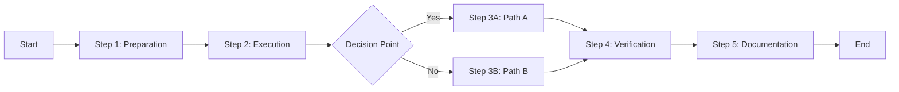

# Rule: Generating a Standard Operating Procedure (SOP)

## Goal

To guide an AI assistant in creating detailed Standard Operating Procedures that ensure consistent, repeatable execution of critical processes by any team member.

## Process

1. **Receive Process Description:** User provides process to document.
2. **Ask Process Detail Questions:** AI *must* understand every step.
3. **Generate SOP:** Create step-by-step procedure documentation.
4. **Save SOP:** Save as `sop-[process-name].md` in `/tasks/`.
5. **Validate Steps:** Ensure procedure is complete and accurate.

## Clarifying Questions (LLM Must Ask)

**Process Context:**
1. What type of process is this?
   - A) Technical operation
   - B) Business process
   - C) Emergency response
   - D) Maintenance procedure
   - E) Administrative task
   - F) Other (specify)

2. How frequently is this performed?
   - A) Daily
   - B) Weekly
   - C) Monthly
   - D) Quarterly
   - E) On-demand
   - F) Emergency only

3. What is the criticality level?
   - A) Critical (production impact)
   - B) High (service degradation)
   - C) Medium (internal impact)
   - D) Low (minimal impact)

**Execution Context:**
4. Who typically performs this?
   - A) Any team member
   - B) Specific role only
   - C) Requires approval
   - D) Multiple people required

5. What tools/access are required?
   - List all tools, systems, and permissions needed

## SOP Structure

```markdown
# Standard Operating Procedure: [Process Name]

**SOP Number:** SOP-[Department]-[Number]
**Version:** 1.0
**Effective Date:** [YYYY-MM-DD]
**Review Date:** [YYYY-MM-DD]
**Author:** [Name/AI Assistant]
**Approved By:** [Name]
**Department:** [Department Name]
**Classification:** Public | Internal | Confidential

## 1. Purpose

### 1.1 Objective
[Clear statement of what this SOP accomplishes]

### 1.2 Scope
[When and where this SOP applies]

### 1.3 Benefits
- Ensures consistency
- Reduces errors
- Speeds up execution
- Enables knowledge transfer

## 2. Responsibilities

### 2.1 Process Owner
- **Role:** [Title]
- **Responsibilities:**
  - Maintain and update this SOP
  - Train team members
  - Monitor compliance

### 2.2 Process Executor
- **Role:** [Title/Team]
- **Responsibilities:**
  - Follow procedure exactly
  - Report issues or improvements
  - Maintain documentation

### 2.3 Approver (if required)
- **Role:** [Title]
- **Responsibilities:**
  - Review and approve execution
  - Verify outcomes

## 3. Prerequisites

### 3.1 Required Access/Permissions
- [ ] System access: [System name and role]
- [ ] Tool access: [Tool name and license]
- [ ] Permission: [Specific permission needed]
- [ ] Approval: [If pre-approval required]

### 3.2 Required Tools/Software
| Tool | Version | Purpose | Access Link |
|------|---------|---------|-------------|
| [Tool] | [Version] | [Why needed] | [URL/Location] |

### 3.3 Required Knowledge
- Understanding of [concept/system]
- Familiarity with [tool/process]
- Training on [specific area]

### 3.4 Safety Requirements
⚠️ **Warning:** [Any safety concerns]
- Personal protective equipment: [If applicable]
- Security considerations: [If applicable]
- Data handling: [If sensitive data involved]

## 4. Procedure

### 4.1 Process Overview


### 4.2 Detailed Steps

#### Step 1: Preparation
**Time Required:** ~5 minutes

1.1. **Open required systems**
```bash
# Open terminal
ssh user@production-server

# Navigate to working directory
cd /path/to/application
```

1.2. **Verify prerequisites**
- [ ] Check system status: `systemctl status service-name`
- [ ] Verify disk space: `df -h`
- [ ] Check current version: `./app --version`

1.3. **Create backup**
```bash
# Backup current state
cp -r /current/data /backup/data-$(date +%Y%m%d)

# Verify backup
ls -la /backup/
```

📸 **Screenshot:** [Expected terminal output]

#### Step 2: Execute Main Process
**Time Required:** ~15 minutes

2.1. **Stop current service**
```bash
# Stop service gracefully
systemctl stop application-service

# Verify stopped
systemctl status application-service | grep "inactive"
```

⚠️ **Critical:** Wait for all connections to close before proceeding

2.2. **Perform the operation**
```bash
# Run the main operation
./maintenance-script.sh --option value

# Expected output:
# Processing... [████████████████] 100%
# Operation completed successfully
```

2.3. **Verify operation success**
```bash
# Check logs for errors
tail -100 /var/log/application/maintenance.log | grep ERROR

# Verify data integrity
./verify-data.sh
```

✅ **Success Criteria:** No errors in log, verification script returns 0

#### Step 3: Decision Point
**Time Required:** ~2 minutes

3.1. **Check operation result**

**IF** operation successful (exit code 0):
- Proceed to Step 4A

**ELSE IF** operation failed (exit code non-zero):
- Proceed to Step 4B
- Alert senior team member
- Do NOT proceed without approval

#### Step 4A: Normal Completion
**Time Required:** ~5 minutes

4A.1. **Restart service**
```bash
# Start the service
systemctl start application-service

# Verify running
systemctl status application-service | grep "active (running)"
```

4A.2. **Perform smoke test**
```bash
# Test basic functionality
curl -I https://application.example.com/health

# Expected response:
# HTTP/1.1 200 OK
```

4A.3. **Monitor for 5 minutes**
- Check error rates
- Verify performance metrics
- Confirm no user complaints

#### Step 4B: Rollback Procedure
**Time Required:** ~10 minutes

4B.1. **Restore from backup**
```bash
# Stop any running processes
systemctl stop application-service

# Restore backup
rm -rf /current/data
cp -r /backup/data-$(date +%Y%m%d) /current/data

# Restart service
systemctl start application-service
```

4B.2. **Verify rollback**
```bash
# Check service status
systemctl status application-service

# Verify functionality
./health-check.sh
```

4B.3. **Escalate issue**
- Create incident ticket
- Notify on-call engineer
- Document failure details

#### Step 5: Documentation
**Time Required:** ~5 minutes

5.1. **Update execution log**
```bash
echo "$(date): SOP executed by $(whoami), Result: [SUCCESS/FAILURE]" >> /var/log/sop-execution.log
```

5.2. **Complete checklist**
- [ ] Process executed
- [ ] Results verified
- [ ] Service restored
- [ ] Monitoring confirmed
- [ ] Documentation updated

5.3. **Send notification**
```bash
# Send completion email
echo "SOP-001 completed at $(date)" | mail -s "SOP Execution Complete" team@example.com
```

## 5. Troubleshooting

### 5.1 Common Issues and Solutions

| Issue | Symptoms | Solution | Prevention |
|-------|----------|----------|------------|
| Service won't stop | Process hangs | Force kill: `kill -9 PID` | Implement timeout |
| Backup fails | Disk full error | Clear old backups | Monitor disk space |
| Verification fails | Script error | Check data manually | Update script |
| Rollback fails | Corrupted backup | Use older backup | Test backups regularly |

### 5.2 Error Messages

**Error:** "Permission denied"
**Solution:** Verify sudo access or run with correct user

**Error:** "Connection refused"
**Solution:** Check if service is running and ports are open

**Error:** "Timeout exceeded"
**Solution:** Increase timeout value or investigate performance

### 5.3 Escalation Path

1. **Level 1:** Try troubleshooting steps above
2. **Level 2:** Contact team lead: [Contact info]
3. **Level 3:** Engage vendor support: [Support number]
4. **Level 4:** Invoke disaster recovery

## 6. Quality Control

### 6.1 Verification Checklist
- [ ] All steps completed in order
- [ ] No errors encountered
- [ ] Service functioning normally
- [ ] Performance metrics normal
- [ ] Documentation updated

### 6.2 Success Metrics
| Metric | Target | Actual | Pass/Fail |
|--------|--------|--------|-----------|
| Execution Time | < 30 min | [Time] | [ ] |
| Error Rate | 0% | [Rate] | [ ] |
| Service Uptime | 99.9% | [Uptime] | [ ] |
| User Impact | None | [Impact] | [ ] |

### 6.3 Audit Trail
All executions must be logged with:
- Date and time
- Executor name
- Result (success/failure)
- Any deviations from SOP
- Improvement suggestions

## 7. Training Requirements

### 7.1 Initial Training
- Read this SOP completely
- Shadow experienced operator
- Execute under supervision
- Independent execution with review

### 7.2 Certification
- [ ] SOP read and understood
- [ ] Practical demonstration completed
- [ ] Q&A session passed
- [ ] Certified by: [Name] Date: [Date]

### 7.3 Recertification
- Required annually
- After major changes
- After extended absence (> 3 months)

## 8. Compliance and Regulations

### 8.1 Regulatory Requirements
- Complies with: [Regulation/Standard]
- Audit requirement: [Frequency]
- Documentation retention: [Period]

### 8.2 Internal Policies
- Aligns with: [Policy name]
- Review cycle: [Frequency]
- Approval required: [Yes/No]

## 9. Related Documents

### 9.1 References
- [Runbook]: For emergency procedures
- [Technical Specification]: For system details
- [Training Manual]: For detailed training
- [Troubleshooting Guide]: For complex issues

### 9.2 Forms and Templates
- [Execution Checklist]: checklist-template.xlsx
- [Incident Report]: incident-template.docx
- [Change Request]: change-request.form

## 10. Definitions and Acronyms

| Term | Definition |
|------|------------|
| SOP | Standard Operating Procedure |
| SLA | Service Level Agreement |
| RTO | Recovery Time Objective |
| [Term] | [Definition] |

## 11. Revision History

| Version | Date | Changes | Author | Approved By |
|---------|------|---------|--------|-------------|
| 1.0 | [Date] | Initial version | [Name] | [Name] |
| 1.1 | [Date] | Added troubleshooting | [Name] | [Name] |

## 12. Appendices

### Appendix A: Command Reference
[Complete list of all commands used]

### Appendix B: Screenshots
[Visual guides for each step]

### Appendix C: Video Tutorial
[Link to video walkthrough]

### Appendix D: Quick Reference Card
```
QUICK REFERENCE - SOP-001
1. Backup: cp -r /data /backup/data-$(date +%Y%m%d)
2. Stop: systemctl stop service
3. Execute: ./maintenance-script.sh
4. Verify: ./verify-data.sh
5. Start: systemctl start service
6. Test: curl -I https://app/health
7. Document: Update log
```

---

## Approval Signatures

| Role | Name | Signature | Date |
|------|------|-----------|------|
| Process Owner | [Name] | _______ | ____ |
| Department Head | [Name] | _______ | ____ |
| Quality Assurance | [Name] | _______ | ____ |

---

**For questions about this SOP, contact:** [Contact information]

**Next Review Date:** [Date]
```

## Version Control Integration

```bash
# Track SOP
echo "| SOP-[number] | [Process] | v1.0 | $(date +%Y-%m-%d) |" >> SOP_TRACKING.md

# Commit
git add tasks/sop-[process].md
git commit -m "SOP: [Process Name]

- Department: [Name]
- Frequency: [How often]
- Criticality: [Level]"
```

## AI Assistant Instructions

The AI must:
1. Include exact commands and parameters
2. Provide specific success/failure criteria
3. Include screenshots or example outputs
4. Add troubleshooting for common issues
5. Specify exact timeframes
6. Include safety warnings prominently
7. Make procedures foolproof
8. Include rollback procedures

## Output

- **Format:** Markdown (`.md`)
- **Location:** `/tasks/`
- **Filename:** `sop-[process-name].md`