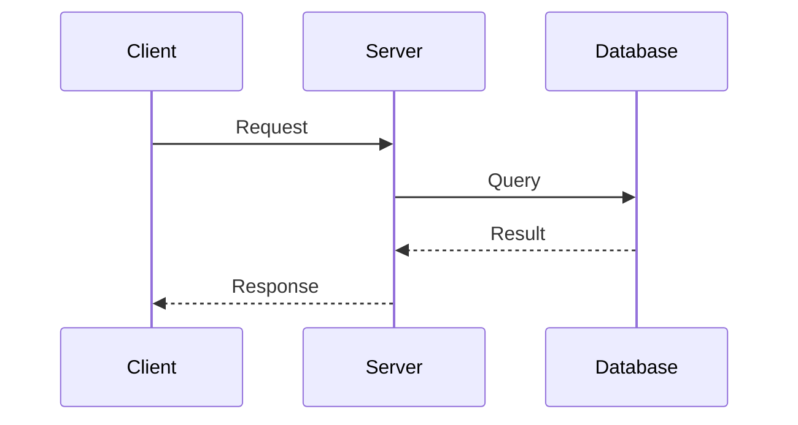

# Rule: Generating a Technical Specification Document

## Goal

To guide an AI assistant in creating a detailed Technical Specification that bridges the gap between business requirements and actual implementation, providing developers with a complete technical blueprint.

## Process

1. **Receive Technical Requirements:** User provides feature/system to be specified.
2. **Ask Technical Deep-Dive Questions:** AI *must* gather detailed technical context.
3. **Generate Tech Spec:** Create comprehensive technical documentation.
4. **Save Tech Spec:** Save as `tech-spec-[feature-name].md` in `/tasks/`.
5. **Link to Related Docs:** Reference related PRD, BRD, and RFCs.

## Clarifying Questions (LLM Must Ask)

**System Context:**
1. What type of system architecture?
   - A) Monolithic
   - B) Microservices
   - C) Serverless
   - D) Hybrid
   - E) Other (specify)

2. What are the performance requirements?
   - A) Response time: [specify ms]
   - B) Throughput: [specify req/sec]
   - C) Concurrent users: [specify number]
   - D) Data volume: [specify GB/TB]

3. What integration points exist?
   - A) Internal APIs
   - B) External APIs
   - C) Databases
   - D) Message queues
   - E) File systems
   - F) All of the above

**Technical Constraints:**
4. What technology constraints exist?
   - A) Must use existing tech stack
   - B) Specific language/framework required
   - C) Platform limitations
   - D) Security requirements
   - E) Compliance requirements

5. What is the deployment target?
   - A) Cloud (AWS/GCP/Azure)
   - B) On-premise
   - C) Hybrid
   - D) Edge devices
   - E) Container orchestration (K8s)

## Tech Spec Structure

```markdown
# Technical Specification: [Feature/System Name]

**Version:** 1.0
**Created:** [YYYY-MM-DD HH:MM]
**Last Updated:** [YYYY-MM-DD HH:MM]
**Author:** [Name/AI Assistant]
**Status:** Draft | Review | Approved | Implemented
**Related Documents:**
- PRD: [Link to PRD]
- BRD: [Link to BRD]
- RFC: [Link to RFC if applicable]

## 1. Overview

### 1.1 Purpose
[Technical purpose and goals of this specification]

### 1.2 Scope
[What is included and explicitly excluded from this spec]

### 1.3 Definitions and Acronyms
| Term | Definition |
|------|------------|
| [Term] | [Technical definition] |

## 2. System Architecture

### 2.1 High-Level Architecture
```
[ASCII or Mermaid diagram showing system components]

┌─────────────┐     ┌─────────────┐     ┌─────────────┐
│   Client    │────▶│   Server    │────▶│  Database   │
└─────────────┘     └─────────────┘     └─────────────┘
```

### 2.2 Component Breakdown
| Component | Responsibility | Technology | Interfaces |
|-----------|---------------|------------|------------|
| [Component] | [What it does] | [Tech stack] | [APIs/Protocols] |

### 2.3 Sequence Diagrams


## 3. Data Design

### 3.1 Data Models
```sql
-- Entity: users
CREATE TABLE users (
    id UUID PRIMARY KEY DEFAULT gen_random_uuid(),
    email VARCHAR(255) UNIQUE NOT NULL,
    created_at TIMESTAMP DEFAULT CURRENT_TIMESTAMP,
    updated_at TIMESTAMP DEFAULT CURRENT_TIMESTAMP
);

-- Entity: [other entities]
```

### 3.2 Data Flow
| Source | Transformation | Destination | Frequency | Volume |
|--------|---------------|-------------|-----------|---------|
| [Source] | [Processing] | [Target] | [How often] | [Size] |

### 3.3 Data Storage Requirements
- Estimated storage: [Size]
- Growth rate: [Rate]
- Retention policy: [Duration]
- Backup strategy: [Strategy]

## 4. API Design

### 4.1 REST API Endpoints
| Method | Endpoint | Description | Request Body | Response |
|--------|----------|-------------|--------------|----------|
| GET | /api/v1/resource | Get resources | None | 200: Resource[] |
| POST | /api/v1/resource | Create resource | Resource | 201: Resource |
| PUT | /api/v1/resource/:id | Update resource | Resource | 200: Resource |
| DELETE | /api/v1/resource/:id | Delete resource | None | 204: No Content |

### 4.2 API Request/Response Examples
```json
// POST /api/v1/resource
// Request:
{
    "name": "example",
    "type": "sample"
}

// Response (201 Created):
{
    "id": "uuid",
    "name": "example",
    "type": "sample",
    "created_at": "2025-09-14T10:00:00Z"
}
```

### 4.3 Error Handling
| Error Code | Description | Response Body |
|------------|-------------|---------------|
| 400 | Bad Request | {"error": "Invalid input"} |
| 401 | Unauthorized | {"error": "Authentication required"} |
| 404 | Not Found | {"error": "Resource not found"} |
| 500 | Server Error | {"error": "Internal server error"} |

## 5. Security Design

### 5.1 Authentication & Authorization
- Method: [JWT/OAuth2/API Keys]
- Token lifetime: [Duration]
- Refresh strategy: [Strategy]
- Role-based access: [Roles and permissions]

### 5.2 Data Security
- Encryption at rest: [Method]
- Encryption in transit: [TLS version]
- Sensitive data handling: [PII strategy]
- Secrets management: [Vault/KMS]

### 5.3 Security Checklist
- [ ] Input validation
- [ ] SQL injection prevention
- [ ] XSS protection
- [ ] CSRF tokens
- [ ] Rate limiting
- [ ] Audit logging

## 6. Performance Requirements

### 6.1 Performance Targets
| Metric | Target | Measurement Method |
|--------|--------|-------------------|
| Response Time (p95) | < 200ms | APM monitoring |
| Throughput | 1000 req/sec | Load testing |
| Availability | 99.9% | Uptime monitoring |
| Error Rate | < 0.1% | Error tracking |

### 6.2 Scaling Strategy
- Horizontal scaling: [Auto-scaling rules]
- Vertical scaling: [Resource limits]
- Caching strategy: [Redis/CDN]
- Database optimization: [Indexing strategy]

## 7. Implementation Plan

### 7.1 Development Phases
| Phase | Components | Duration | Dependencies |
|-------|------------|----------|--------------|
| Phase 1 | Database, Core API | 2 weeks | None |
| Phase 2 | Business Logic | 2 weeks | Phase 1 |
| Phase 3 | UI Integration | 1 week | Phase 2 |
| Phase 4 | Testing & Optimization | 1 week | Phase 3 |

### 7.2 Technology Stack
| Layer | Technology | Version | Justification |
|-------|------------|---------|---------------|
| Frontend | [Framework] | [Version] | [Why chosen] |
| Backend | [Language/Framework] | [Version] | [Why chosen] |
| Database | [DB System] | [Version] | [Why chosen] |
| Cache | [Cache System] | [Version] | [Why chosen] |
| Queue | [Queue System] | [Version] | [Why chosen] |

## 8. Testing Strategy

### 8.1 Test Coverage Requirements
- Unit tests: > 80% coverage
- Integration tests: All API endpoints
- E2E tests: Critical user journeys
- Performance tests: Load and stress testing

### 8.2 Test Scenarios
| Test Type | Scenario | Expected Result | Automation |
|-----------|----------|-----------------|------------|
| Unit | [Scenario] | [Result] | Yes/No |
| Integration | [Scenario] | [Result] | Yes/No |
| E2E | [Scenario] | [Result] | Yes/No |

## 9. Deployment

### 9.1 Deployment Architecture
```
[Deployment diagram showing environments]
Dev → Staging → Production
```

### 9.2 Deployment Process
1. Code review and approval
2. Automated tests pass
3. Build Docker image
4. Deploy to staging
5. Run smoke tests
6. Deploy to production
7. Monitor metrics

### 9.3 Rollback Strategy
- Rollback trigger criteria: [Criteria]
- Rollback procedure: [Steps]
- Data migration rollback: [Strategy]

## 10. Monitoring & Observability

### 10.1 Metrics to Monitor
| Metric | Tool | Alert Threshold |
|--------|------|-----------------|
| CPU Usage | Prometheus | > 80% |
| Memory Usage | Prometheus | > 85% |
| Error Rate | Sentry | > 1% |
| Response Time | DataDog | > 500ms |

### 10.2 Logging Strategy
- Log levels: DEBUG, INFO, WARN, ERROR
- Log retention: 30 days
- Log aggregation: [ELK/CloudWatch]
- Structured logging format: JSON

## 11. Migration Plan

### 11.1 Data Migration
- Migration strategy: [Blue-green/Rolling/Big bang]
- Data validation: [Methods]
- Rollback plan: [Strategy]

### 11.2 Backward Compatibility
- API versioning strategy
- Deprecation timeline
- Client migration guide

## 12. Documentation Requirements

### 12.1 Documentation Deliverables
- [ ] API documentation (OpenAPI/Swagger)
- [ ] Developer guide
- [ ] Operations runbook
- [ ] User documentation
- [ ] Architecture diagrams

## 13. Risks and Mitigations

| Risk | Probability | Impact | Mitigation |
|------|-------------|--------|------------|
| [Technical risk] | High/Med/Low | High/Med/Low | [Mitigation strategy] |

## 14. Appendices

### Appendix A: Database Schema (Full)
[Complete DDL scripts]

### Appendix B: API Specification (OpenAPI)
[Full OpenAPI specification]

### Appendix C: Configuration Templates
[Environment configurations]

---

## Approval Sign-off

| Role | Name | Date | Signature |
|------|------|------|-----------|
| Tech Lead | [Name] | [Date] | _________ |
| Architect | [Name] | [Date] | _________ |
| Security | [Name] | [Date] | _________ |

## Revision History

| Version | Date | Changes | Author |
|---------|------|---------|--------|
| 1.0 | [Date] | Initial draft | [Author] |
```

## Version Control Integration

After generating:

```bash
# Track the spec
echo "| tech-spec-[name] | Draft | $(date +%Y-%m-%d) | [Feature] |" >> TECH_SPEC_TRACKING.md

# Commit
git add tasks/tech-spec-[name].md
git commit -m "Tech Spec: [Feature Name]

- Components: [List main components]
- APIs: [Number of endpoints]
- Timeline: [Duration]"
```

## AI Assistant Instructions

The AI must:
1. Include concrete technical details, not abstractions
2. Provide actual code examples and schemas
3. Specify exact versions of technologies
4. Include performance metrics with numbers
5. Create implementable API specifications
6. Address all security concerns explicitly
7. Provide clear migration and rollback plans

## Output

- **Format:** Markdown (`.md`)
- **Location:** `/tasks/`
- **Filename:** `tech-spec-[feature-name].md`