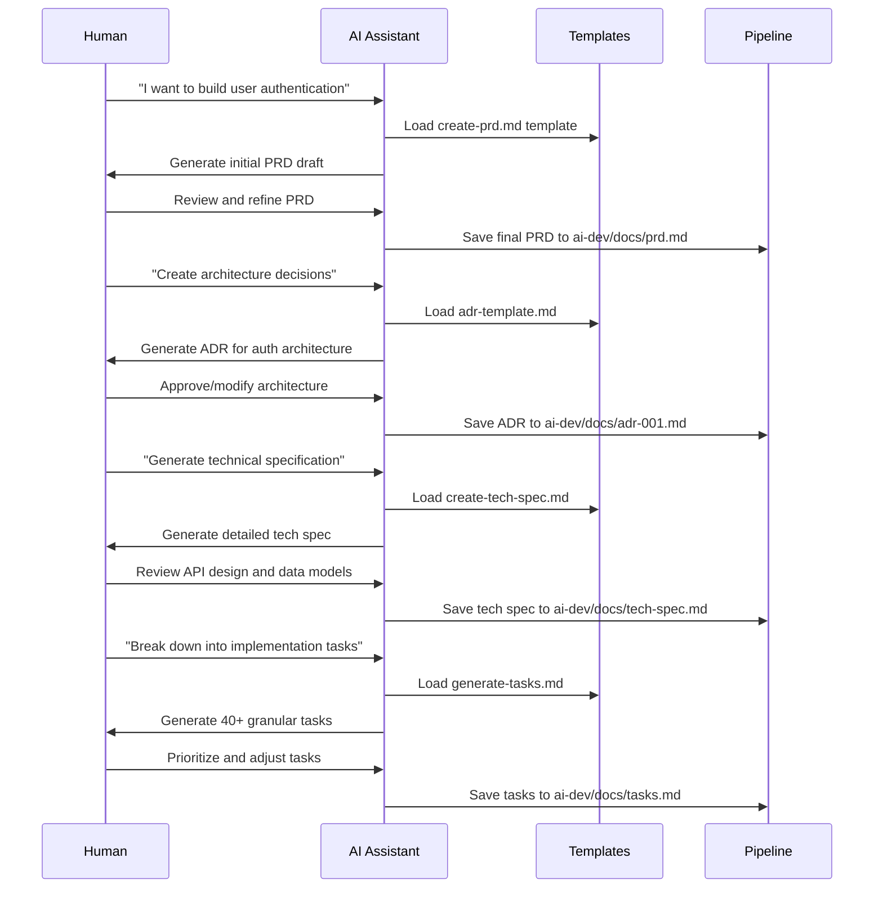
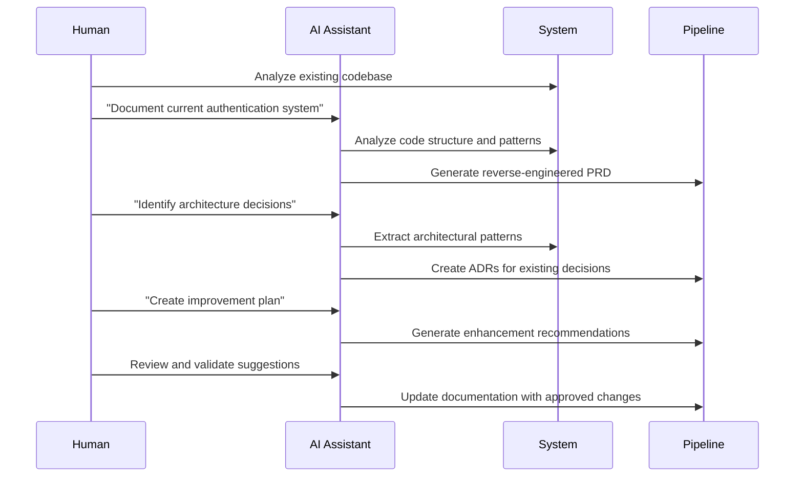
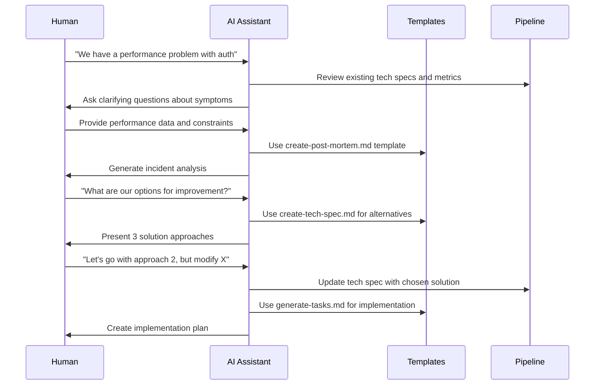
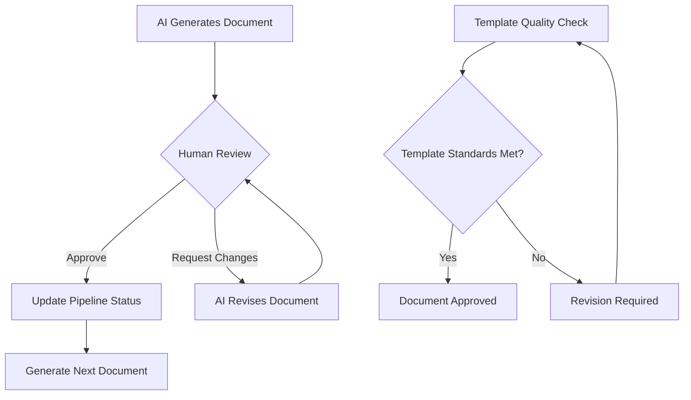
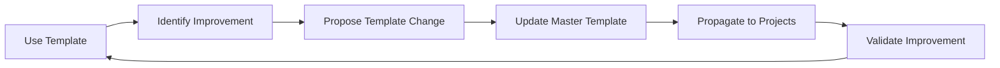

# Vibe-PRD: Complete AI Development Workflow Implementation

**Date:** 2025-09-15
**Project:** Enhanced vibe-prd - Complete AI Development Methodology
**Purpose:** Super detailed implementation plan and human-AI workflow documentation

---

## Table of Contents

1. [Executive Summary](#executive-summary)
2. [Current State Analysis](#current-state-analysis)
3. [Enhanced Architecture](#enhanced-architecture)
4. [Implementation Details](#implementation-details)
5. [Human-AI Workflow](#human-ai-workflow)
6. [Setup Scripts Specification](#setup-scripts-specification)
7. [Documentation Structure](#documentation-structure)
8. [Example Projects](#example-projects)
9. [Testing Strategy](#testing-strategy)
10. [Rollout Plan](#rollout-plan)

---

## Executive Summary

Transform `jeremylongshore/vibe-prd` from a single-project PRD generator into a **complete enterprise-grade AI development workflow system** that standardizes how humans and AI collaborate on software development projects.

### **Core Value Proposition**
- **Before:** "Use vibe-prd to create PRDs for Cursor"
- **After:** "Use vibe-prd for complete AI development lifecycle management - from ideation to deployment"

### **Target Users**
1. **Individual Developers** - Want structured AI assistance on personal projects
2. **Development Teams** - Need standardized AI workflows across multiple projects
3. **Organizations** - Require enterprise-grade AI development methodology
4. **AI Researchers** - Want to study effective human-AI collaboration patterns

---

## Current State Analysis

### **Existing vibe-prd Assets** ✅
```
jeremylongshore/vibe-prd/
├── README.md                          # Good foundation, needs enhancement
├── README_ENHANCED.md                 # Shows dual Cursor/CLI approach
├── PROFESSIONAL_TEMPLATES.md          # 16 professional templates documented
├── professional-templates/            # Complete template library
│   ├── create-prd.md                 # Enhanced PRD template
│   ├── create-tech-spec.md           # Technical specification
│   ├── create-api-spec.md            # API documentation
│   ├── create-database-schema.md     # Database design
│   ├── create-runbook.md             # Operations procedures
│   ├── create-test-plan.md           # Testing strategy
│   ├── create-risk-register.md       # Risk management
│   ├── adr-template.md               # Architecture decisions
│   └── ... (8 more professional templates)
├── cli-workflow/                      # CLI automation
│   ├── interactive.sh                # Menu-driven interface
│   ├── create-prd.sh                 # PRD generation script
│   ├── generate-tasks.sh             # Task breakdown script
│   └── README.md                     # CLI documentation
└── .cursorrules/                      # Original Cursor integration
    ├── 01-create-prd.mdc             # Cursor PRD creation
    ├── 03-generate-tasks.mdc         # Cursor task generation
    └── 04-task-list.mdc              # Cursor task processing
```

### **What's Missing** ❌
1. **Workspace Management** - No multi-project coordination
2. **Setup Automation** - Manual template copying
3. **Pipeline Tracking** - No progress visibility across projects
4. **Integration Guidance** - No clear methodology for existing projects
5. **Human-AI Workflow** - No documented collaboration patterns
6. **Scaling Documentation** - No enterprise adoption guidance

---

## Enhanced Architecture

### **New vibe-prd Structure**
```
jeremylongshore/vibe-prd/
├── README.md                          # Enhanced: 3 usage modes
├── PROFESSIONAL_TEMPLATES.md          # Existing documentation
├── METHODOLOGY.md                     # NEW: Complete workflow methodology
├── HUMAN_AI_COLLABORATION.md          # NEW: Interaction patterns
├── professional-templates/            # Existing template library (16 templates)
├── cli-workflow/                      # Existing CLI support
├── setup-scripts/                     # NEW: Automation scripts
│   ├── setup-workspace.sh            # Multi-project workspace setup
│   ├── setup-project.sh              # Single project ai-dev pipeline
│   ├── migrate-existing.sh           # Convert existing projects
│   ├── verify-setup.sh               # Installation verification
│   └── README.md                     # Setup script documentation
├── examples/                          # NEW: Real-world examples
│   ├── webapp-project/               # React/Node.js project example
│   │   ├── ai-dev/                   # Complete ai-dev pipeline
│   │   │   ├── README.md             # Pipeline status tracker
│   │   │   ├── docs/                 # Working documents
│   │   │   │   ├── prd.md            # Completed PRD example
│   │   │   │   ├── adr-001.md        # Architecture decisions
│   │   │   │   ├── tech-spec.md      # Technical specification
│   │   │   │   ├── api-spec.md       # API documentation
│   │   │   │   ├── tasks.md          # Implementation tasks
│   │   │   │   └── test-plan.md      # Testing strategy
│   │   │   ├── sop/                  # Standard procedures
│   │   │   └── templates -> ../../professional-templates
│   │   ├── src/                      # Example application code
│   │   ├── package.json              # Project dependencies
│   │   ├── Makefile                  # ai-dev automation
│   │   └── README.md                 # Project documentation
│   ├── api-project/                  # REST API project example
│   │   └── ai-dev/                   # API-specific ai-dev structure
│   ├── cli-project/                  # CLI tool project example
│   │   └── ai-dev/                   # CLI-specific ai-dev structure
│   └── README.md                     # Example projects documentation
├── docs/                             # NEW: Complete methodology documentation
│   ├── WORKSPACE_SETUP.md            # Multi-project management
│   ├── PROJECT_PIPELINE.md           # Single project ai-dev setup
│   ├── TEMPLATE_CUSTOMIZATION.md     # Template modification guide
│   ├── ENTERPRISE_ADOPTION.md        # Organizational implementation
│   ├── TROUBLESHOOTING.md            # Common issues and solutions
│   ├── BEST_PRACTICES.md             # Lessons learned
│   └── FAQ.md                        # Frequently asked questions
├── .cursorrules/                     # Existing Cursor integration
└── .github/                          # NEW: GitHub automation
    ├── workflows/                    # CI/CD for testing setup scripts
    └── ISSUE_TEMPLATE.md             # Structured issue reporting
```

---

## Implementation Details

### **Phase 1: Enhanced Documentation (Week 1)**

#### **1.1 METHODOLOGY.md - Complete Workflow Philosophy**
```markdown
# AI Development Methodology: Structured Human-AI Collaboration

## Core Principles
1. **Template-Driven Development** - Standardized document formats
2. **Incremental Verification** - Human review at each milestone
3. **Context Preservation** - Comprehensive documentation trail
4. **Scalable Architecture** - Works for individuals and organizations

## The Problem with Ad-Hoc AI Development
- Inconsistent output quality
- Lost context between sessions
- Difficulty tracking progress
- No standardized review points
- Hard to onboard new team members

## The vibe-prd Solution
- Professional template library
- Structured workflow checkpoints
- Documentation-driven development
- Clear human-AI handoff points
- Scalable across projects and teams
```

#### **1.2 HUMAN_AI_COLLABORATION.md - Interaction Patterns**
```markdown
# Human-AI Collaboration Patterns

## Collaboration Models

### Model 1: AI-First Development
**When to Use:** New features, greenfield projects
**Human Role:** Direction, review, approval
**AI Role:** Generation, implementation, documentation

**Workflow:**
1. Human provides high-level requirements
2. AI generates PRD using template
3. Human reviews and refines PRD
4. AI generates technical specification
5. Human approves architecture decisions
6. AI generates implementation tasks
7. Human reviews task breakdown
8. AI implements tasks incrementally
9. Human reviews each increment

### Model 2: Human-First Development
**When to Use:** Complex business logic, legacy systems
**Human Role:** Design, specification, oversight
**AI Role:** Implementation, documentation, testing

**Workflow:**
1. Human creates detailed PRD
2. Human defines architecture (ADR)
3. AI generates technical specification
4. Human reviews and approves
5. AI generates implementation plan
6. Human and AI collaborate on implementation
7. AI generates documentation

### Model 3: Pair Development
**When to Use:** Learning, complex problems, critical systems
**Human Role:** Real-time collaboration, decision making
**AI Role:** Code generation, suggestions, documentation

**Workflow:**
1. Human and AI collaborate on PRD in real-time
2. Immediate feedback and iteration
3. Shared decision making on architecture
4. AI implements with human oversight
5. Continuous review and adjustment
```

### **Phase 2: Setup Scripts (Week 2)**

#### **2.1 setup-workspace.sh - Multi-Project Management**
```bash
#!/bin/bash
# Setup vibe-prd as workspace-wide template system
set -euo pipefail

SCRIPT_DIR="$(cd "$(dirname "${BASH_SOURCE[0]}")" && pwd)"
VIBE_PRD_ROOT="$(dirname "$SCRIPT_DIR")"
WORKSPACE_ROOT="${WORKSPACE_ROOT:-$HOME/projects}"
TEMPLATES_DIR="${TEMPLATES_DIR:-$HOME/ai-dev-templates}"

echo "🚀 Setting up vibe-prd workspace management..."
echo "📁 Workspace: $WORKSPACE_ROOT"
echo "📚 Templates: $TEMPLATES_DIR"

# 1. Setup central template library
if [ ! -d "$TEMPLATES_DIR" ]; then
    echo "📦 Creating central template library..."
    cp -r "$VIBE_PRD_ROOT" "$TEMPLATES_DIR"
    echo "✅ Templates installed at: $TEMPLATES_DIR"
fi

# 2. Find all projects in workspace
echo "🔍 Scanning for projects in $WORKSPACE_ROOT..."
projects=()
while IFS= read -r -d '' project; do
    projects+=("$project")
done < <(find "$WORKSPACE_ROOT" -maxdepth 2 -name "*.git" -type d -exec dirname {} \; 2>/dev/null | sort -u | tr '\n' '\0')

echo "📊 Found ${#projects[@]} git repositories"

# 3. Setup ai-dev pipeline for each project
for project in "${projects[@]}"; do
    project_name=$(basename "$project")
    echo "🔧 Setting up ai-dev pipeline: $project_name"

    cd "$project"

    # Skip if already has ai-dev
    if [ -d "ai-dev" ]; then
        echo "⚠️  ai-dev already exists in $project_name, skipping..."
        continue
    fi

    # Create ai-dev structure
    mkdir -p ai-dev/{docs,sop,PRDs,ADRs,tasks,specifications}

    # Link to templates
    ln -sfn "$TEMPLATES_DIR/professional-templates" ai-dev/templates

    # Create project-specific README
    cat > ai-dev/README.md << EOF
# $project_name - AI Development Pipeline

**Project:** $project_name
**Setup:** $(date +%Y-%m-%d)
**Status:** Ready for development ✅

## 📚 Templates
**Source:** \`ai-dev/templates/\` → \`$TEMPLATES_DIR/professional-templates/\`

## 📋 Pipeline Status
- [ ] Project PRD → \`docs/prd.md\`
- [ ] Architecture ADR → \`docs/adr-001.md\`
- [ ] Technical Spec → \`docs/tech-spec.md\`
- [ ] Implementation Tasks → \`docs/tasks.md\`
- [ ] API Specification → \`docs/api-spec.md\`
- [ ] Test Plan → \`docs/test-plan.md\`
- [ ] Operations Runbook → \`docs/runbook.md\`
- [ ] Risk Register → \`docs/risk-register.md\`
- [ ] Standard Procedures → \`sop/procedures.md\`
- [ ] Database Schema → \`docs/database-schema.md\`

## 🚀 Quick Start
\`\`\`bash
# Create documents from templates
make create T=create-prd.md N=prd.md
make create T=adr-template.md N=adr-001.md
make create T=create-tech-spec.md N=tech-spec.md

# Check pipeline status
make status
\`\`\`

## 📖 Methodology
See: $TEMPLATES_DIR/METHODOLOGY.md
EOF

    # Create Makefile for document automation
    cat > Makefile << 'EOF'
DOCS=ai-dev/docs
SOP=ai-dev/sop
TPL=ai-dev/templates
T?=create-prd.md
N?=new-doc.md

.PHONY: status create list-templates help

status:
	@echo "📊 AI-Dev Pipeline Status: $(shell basename $(PWD))"
	@echo "========================================"
	@echo "📚 Templates: $(shell [ -L $(TPL) ] && echo "✅ Linked" || echo "❌ Missing")"
	@echo "📁 Documents: $(shell [ -d $(DOCS) ] && ls -1 $(DOCS) 2>/dev/null | wc -l || echo "0") files"
	@echo ""
	@echo "📋 Current Documents:"
	@[ -d $(DOCS) ] && ls -1 $(DOCS) 2>/dev/null | sed 's/^/  ✓ /' || echo "  (no documents yet)"
	@echo ""
	@echo "🎯 Next Steps:"
	@echo "  1. make create T=create-prd.md N=prd.md"
	@echo "  2. Edit ai-dev/docs/prd.md"
	@echo "  3. make create T=generate-tasks.md N=tasks.md"

create:
	@mkdir -p $(DOCS) $(SOP)
	@template_path="$(TPL)/$(T)"
	@if [ ! -f "$$template_path" ]; then
		echo "❌ Template not found: $(T)"
		echo "💡 Use 'make list-templates' to see available templates"
		exit 1
	fi
	@if echo "$(N)" | grep -q "sop\|procedure"; then
		cp "$$template_path" "$(SOP)/$(N)"
		echo "📄 Created: $(SOP)/$(N)"
	else
		cp "$$template_path" "$(DOCS)/$(N)"
		echo "📄 Created: $(DOCS)/$(N)"
	fi
	@echo "✏️  Edit your document, then update ai-dev/README.md pipeline status"

list-templates:
	@echo "📚 Available Templates:"
	@[ -d $(TPL) ] && ls -1 $(TPL)/*.md 2>/dev/null | sed 's|.*/||; s|\.md$$||' | sed 's/^/  - /' || echo "  (templates not found)"

help:
	@echo "🚀 AI-Dev Pipeline Commands"
	@echo "============================"
	@echo "make status           - Show pipeline status"
	@echo "make create T=X N=Y   - Create document Y from template X"
	@echo "make list-templates   - Show available templates"
	@echo ""
	@echo "📚 Common Templates:"
	@echo "  create-prd.md       - Product Requirements Document"
	@echo "  adr-template.md     - Architecture Decision Record"
	@echo "  create-tech-spec.md - Technical Specification"
	@echo "  generate-tasks.md   - Implementation Tasks"
	@echo ""
	@echo "📖 Full Documentation: $TEMPLATES_DIR/docs/"
EOF

    echo "✅ Setup complete: $project_name"
done

echo ""
echo "🎉 Workspace setup complete!"
echo "📊 Processed: ${#projects[@]} projects"
echo "📚 Templates: $TEMPLATES_DIR"
echo ""
echo "🚀 Next Steps:"
echo "  1. cd [project-directory]"
echo "  2. make status"
echo "  3. make create T=create-prd.md N=prd.md"
echo ""
echo "📖 Documentation: $TEMPLATES_DIR/docs/"
```

#### **2.2 setup-project.sh - Single Project Setup**
```bash
#!/bin/bash
# Add ai-dev pipeline to current project
set -euo pipefail

SCRIPT_DIR="$(cd "$(dirname "${BASH_SOURCE[0]}")" && pwd)"
VIBE_PRD_ROOT="$(dirname "$SCRIPT_DIR")"
PROJECT_ROOT="$(pwd)"
PROJECT_NAME="$(basename "$PROJECT_ROOT")"

echo "🔧 Setting up ai-dev pipeline for: $PROJECT_NAME"
echo "📁 Project: $PROJECT_ROOT"

# Check if we're in a git repository
if ! git rev-parse --git-dir >/dev/null 2>&1; then
    echo "⚠️  Not a git repository. Continue anyway? (y/N)"
    read -r response
    if [[ ! "$response" =~ ^[Yy]$ ]]; then
        echo "❌ Setup cancelled"
        exit 1
    fi
fi

# Check if ai-dev already exists
if [ -d "ai-dev" ]; then
    echo "⚠️  ai-dev directory already exists. Overwrite? (y/N)"
    read -r response
    if [[ ! "$response" =~ ^[Yy]$ ]]; then
        echo "❌ Setup cancelled"
        exit 1
    fi
    echo "🗑️  Backing up existing ai-dev to ai-dev.backup.$(date +%s)"
    mv ai-dev "ai-dev.backup.$(date +%s)"
fi

# Create ai-dev structure
echo "📁 Creating ai-dev directory structure..."
mkdir -p ai-dev/{docs,sop,PRDs,ADRs,tasks,specifications}

# Setup templates (choose method)
echo "📚 Setting up templates..."
echo "Choose template setup method:"
echo "  1) Symlink to vibe-prd (local development)"
echo "  2) Copy templates (portable)"
echo "  3) Git submodule (if project is in git)"
read -p "Selection (1-3): " method

case $method in
    1)
        ln -sfn "$VIBE_PRD_ROOT/professional-templates" ai-dev/templates
        template_source="symlink to vibe-prd"
        ;;
    2)
        cp -r "$VIBE_PRD_ROOT/professional-templates" ai-dev/templates
        template_source="local copy"
        ;;
    3)
        if git rev-parse --git-dir >/dev/null 2>&1; then
            git submodule add https://github.com/jeremylongshore/vibe-prd.git ai-dev/vibe-prd 2>/dev/null || true
            ln -sfn vibe-prd/professional-templates ai-dev/templates
            template_source="git submodule"
        else
            echo "❌ Not a git repository, falling back to copy"
            cp -r "$VIBE_PRD_ROOT/professional-templates" ai-dev/templates
            template_source="local copy"
        fi
        ;;
    *)
        echo "❌ Invalid selection"
        exit 1
        ;;
esac

# Create project README
echo "📄 Creating pipeline documentation..."
cat > ai-dev/README.md << EOF
# $PROJECT_NAME - AI Development Pipeline

**Project:** $PROJECT_NAME
**Setup Date:** $(date +%Y-%m-%d)
**Template Source:** $template_source
**Status:** Ready for development ✅

## 📋 Development Pipeline

### Phase 1: Planning & Architecture
- [ ] **PRD** → \`docs/prd.md\` (Product Requirements Document)
- [ ] **ADR-001** → \`docs/adr-001.md\` (Core Architecture Decisions)
- [ ] **Tech Spec** → \`docs/tech-spec.md\` (Technical Specification)

### Phase 2: Implementation Planning
- [ ] **Tasks** → \`docs/tasks.md\` (Implementation Task Breakdown)
- [ ] **API Spec** → \`docs/api-spec.md\` (API Documentation)
- [ ] **Database Schema** → \`docs/database-schema.md\` (Data Design)

### Phase 3: Quality & Operations
- [ ] **Test Plan** → \`docs/test-plan.md\` (Testing Strategy)
- [ ] **Runbook** → \`docs/runbook.md\` (Operations Guide)
- [ ] **Risk Register** → \`docs/risk-register.md\` (Risk Management)
- [ ] **SOP** → \`sop/procedures.md\` (Standard Procedures)

## 🚀 Quick Start

### Method 1: Using Make Commands
\`\`\`bash
# Check current status
make status

# Create PRD from template
make create T=create-prd.md N=prd.md

# Create architecture decision record
make create T=adr-template.md N=adr-001.md

# Create technical specification
make create T=create-tech-spec.md N=tech-spec.md
\`\`\`

### Method 2: Manual Template Usage
\`\`\`bash
# Copy template to working document
cp ai-dev/templates/create-prd.md ai-dev/docs/prd.md

# Edit the document
\$EDITOR ai-dev/docs/prd.md

# Update this README pipeline status
\$EDITOR ai-dev/README.md
\`\`\`

### Method 3: With AI Assistant (Cursor)
\`\`\`cursor
# Use template with AI
@ai-dev/templates/create-prd.md
Create a PRD for: [describe your feature]
Save as: ai-dev/docs/prd.md
\`\`\`

### Method 4: CLI Workflow
\`\`\`bash
# If you have vibe-prd CLI tools
../vibe-prd/cli-workflow/create-prd.sh "feature description"
../vibe-prd/cli-workflow/generate-tasks.sh ai-dev/docs/prd.md
\`\`\`

## 📚 Available Templates

| Template File | Purpose | Typical Output |
|---------------|---------|----------------|
| \`create-prd.md\` | Product Requirements | \`docs/prd.md\` |
| \`adr-template.md\` | Architecture Decisions | \`docs/adr-NNN.md\` |
| \`create-tech-spec.md\` | Technical Specification | \`docs/tech-spec.md\` |
| \`generate-tasks.md\` | Task Breakdown | \`docs/tasks.md\` |
| \`create-api-spec.md\` | API Documentation | \`docs/api-spec.md\` |
| \`create-database-schema.md\` | Database Design | \`docs/database-schema.md\` |
| \`create-test-plan.md\` | Testing Strategy | \`docs/test-plan.md\` |
| \`create-runbook.md\` | Operations Guide | \`docs/runbook.md\` |
| \`create-risk-register.md\` | Risk Management | \`docs/risk-register.md\` |
| \`create-sop.md\` | Standard Procedures | \`sop/procedures.md\` |

## 🔄 Workflow Integration

### With Git
\`\`\`bash
# Commit ai-dev setup
git add ai-dev/ Makefile
git commit -m "feat: add ai-dev pipeline structure"

# Create feature branch for development
git checkout -b feature/new-feature
# Work with ai-dev pipeline...
git add ai-dev/docs/prd.md
git commit -m "docs: add PRD for new feature"
\`\`\`

### With Team Collaboration
1. **Project Lead** creates PRD and architecture decisions
2. **Development Team** reviews and creates technical specifications
3. **Individual Developers** create task breakdowns for their work
4. **QA Team** creates test plans based on specifications
5. **DevOps Team** creates runbooks for deployment

### With AI Assistants
1. **Template-Driven**: Use templates to guide AI generation
2. **Incremental Review**: Human review after each document
3. **Context Preservation**: Complete document trail for AI context
4. **Consistent Format**: Standard structure across all documents

## 📊 Progress Tracking

Update the checkboxes above as documents are completed:
- \`- [ ]\` = Not started
- \`- [x]\` = Completed
- \`- [~]\` = In progress

## 🆘 Getting Help

- **Templates**: Browse \`ai-dev/templates/\` for all available templates
- **Commands**: Run \`make help\` for available automation
- **Documentation**: See vibe-prd documentation for complete methodology
- **Issues**: Report problems at https://github.com/jeremylongshore/vibe-prd/issues

---

**Template Source:** $template_source
**Last Updated:** $(date +%Y-%m-%d)
**Pipeline Version:** vibe-prd enhanced
EOF

# Copy Makefile from workspace setup (same content)
cp "$SCRIPT_DIR/../examples/webapp-project/Makefile" . 2>/dev/null || {
    # Create Makefile if example doesn't exist yet
    cat > Makefile << 'EOF'
DOCS=ai-dev/docs
SOP=ai-dev/sop
TPL=ai-dev/templates
T?=create-prd.md
N?=new-doc.md

.PHONY: status create list-templates help

status:
	@echo "📊 AI-Dev Pipeline Status: $(shell basename $(PWD))"
	@echo "========================================"
	@echo "📚 Templates: $(shell [ -d $(TPL) ] && echo "✅ Available" || echo "❌ Missing")"
	@echo "📁 Documents: $(shell [ -d $(DOCS) ] && ls -1 $(DOCS) 2>/dev/null | wc -l || echo "0") files"
	@echo ""
	@echo "📋 Current Documents:"
	@[ -d $(DOCS) ] && ls -1 $(DOCS) 2>/dev/null | sed 's/^/  ✓ /' || echo "  (no documents yet)"

create:
	@mkdir -p $(DOCS) $(SOP)
	@if [ ! -f "$(TPL)/$(T)" ]; then echo "❌ Template not found: $(T)"; exit 1; fi
	@if echo "$(N)" | grep -q "sop"; then
		cp "$(TPL)/$(T)" "$(SOP)/$(N)"
		echo "📄 Created: $(SOP)/$(N)"
	else
		cp "$(TPL)/$(T)" "$(DOCS)/$(N)"
		echo "📄 Created: $(DOCS)/$(N)"
	fi

list-templates:
	@echo "📚 Available Templates:"
	@[ -d $(TPL) ] && ls -1 $(TPL)/*.md | sed 's|.*/||' | sed 's/^/  - /'

help:
	@echo "make status    - Show pipeline status"
	@echo "make create    - Create document from template"
	@echo "make help      - Show this help"
EOF
}

echo ""
echo "✅ AI-Dev pipeline setup complete!"
echo ""
echo "🚀 Next Steps:"
echo "  1. make status                              # Check setup"
echo "  2. make create T=create-prd.md N=prd.md     # Create PRD"
echo "  3. Edit ai-dev/docs/prd.md                  # Define your project"
echo "  4. make create T=generate-tasks.md N=tasks.md # Break down into tasks"
echo ""
echo "📖 Documentation: ai-dev/README.md"
echo "🔗 Template Source: $template_source"
```

### **Phase 3: Example Projects (Week 3)**

#### **3.1 webapp-project/ - Complete React/Node.js Example**

**Project Structure:**
```
examples/webapp-project/
├── ai-dev/                            # Complete ai-dev pipeline example
│   ├── README.md                      # Pipeline tracker (shows completed status)
│   ├── docs/                          # All working documents
│   │   ├── prd.md                     # Complete PRD for user authentication
│   │   ├── adr-001.md                 # Architecture: React + Node.js + PostgreSQL
│   │   ├── adr-002.md                 # Authentication strategy: JWT + refresh tokens
│   │   ├── tech-spec.md               # Technical specification with API design
│   │   ├── api-spec.md                # OpenAPI specification
│   │   ├── database-schema.md         # PostgreSQL schema design
│   │   ├── tasks.md                   # 47 implementation tasks broken down
│   │   ├── test-plan.md               # Testing strategy (unit, integration, e2e)
│   │   ├── runbook.md                 # Deployment and operations guide
│   │   └── risk-register.md           # Security and operational risks
│   ├── sop/                           # Standard operating procedures
│   │   └── development-procedures.md  # Development workflow standards
│   └── templates -> ../../professional-templates
├── src/                               # Example application code
│   ├── frontend/                      # React application
│   │   ├── src/
│   │   │   ├── components/
│   │   │   │   ├── Auth/              # Authentication components
│   │   │   │   └── Dashboard/         # Dashboard components
│   │   │   ├── services/              # API client services
│   │   │   └── App.tsx                # Main application
│   │   ├── package.json
│   │   └── README.md
│   └── backend/                       # Node.js API
│       ├── src/
│       │   ├── routes/                # Express routes
│       │   ├── models/                # Database models
│       │   ├── middleware/            # Authentication middleware
│       │   └── app.ts                 # Express application
│       ├── package.json
│       └── README.md
├── docker-compose.yml                 # Development environment
├── Makefile                          # ai-dev automation + project commands
├── README.md                         # Project overview showing ai-dev integration
└── .gitignore
```

**Key Example Documents:**

**ai-dev/docs/prd.md:**
```markdown
# User Authentication System - Product Requirements Document

**Product:** TaskFlow Web Application
**Feature:** User Authentication & Authorization
**Version:** 1.0
**Date:** 2025-09-15
**Status:** Approved ✅

## Executive Summary

Implement secure user authentication and authorization system for TaskFlow web application, enabling users to create accounts, sign in securely, manage their profiles, and access protected features based on their roles.

## Business Context

### Problem Statement
- Current application has no user management
- Cannot personalize user experience
- No data security or privacy controls
- Unable to implement premium features
- No audit trail for user actions

### Business Goals
- Enable user registration and secure authentication
- Support role-based access control (free, premium, admin)
- Ensure GDPR compliance for user data
- Provide foundation for premium features
- Enable user analytics and engagement tracking

### Success Metrics
- 95% successful authentication rate
- < 500ms authentication response time
- Zero security incidents in first 6 months
- 80% user registration completion rate
- Support for 10,000 concurrent users

## User Requirements

### User Personas

#### Primary: Sarah (Productivity Enthusiast)
- **Demographics:** 28, Marketing Manager, Tech-savvy
- **Goals:** Organize tasks efficiently, access from multiple devices
- **Pain Points:** Frustrated by forgotten passwords, slow login processes
- **Technical Comfort:** High - expects modern UX patterns

#### Secondary: Mike (Small Business Owner)
- **Demographics:** 45, Restaurant Owner, Moderate tech skills
- **Goals:** Simple task management, team coordination
- **Pain Points:** Complex interfaces, security concerns
- **Technical Comfort:** Medium - prefers familiar patterns

### User Stories

#### Epic 1: Account Management
- **US-001:** As a new user, I want to create an account with email/password so I can start using the application
- **US-002:** As a user, I want to sign in with my credentials so I can access my personal workspace
- **US-003:** As a user, I want to reset my password if forgotten so I can regain access to my account
- **US-004:** As a user, I want to update my profile information so I can keep my account current
- **US-005:** As a user, I want to delete my account so I can remove my data permanently

#### Epic 2: Security & Sessions
- **US-006:** As a user, I want my session to remain active for a reasonable time so I don't have to constantly re-authenticate
- **US-007:** As a user, I want to sign out securely so my account is protected when I leave
- **US-008:** As a user, I want to see my active sessions so I can manage my account security
- **US-009:** As a user, I want to enable two-factor authentication so my account is more secure

#### Epic 3: Role-Based Access
- **US-010:** As a free user, I want access to basic features so I can evaluate the application
- **US-011:** As a premium user, I want access to advanced features so I get value from my subscription
- **US-012:** As an admin, I want to manage user accounts so I can provide customer support

## Functional Requirements

### FR-001: User Registration
- **Priority:** P0 (Must Have)
- **Description:** Users can create accounts with email and secure password
- **Acceptance Criteria:**
  - Email validation (format, uniqueness, verification)
  - Password requirements (8+ chars, mixed case, number, special char)
  - Account activation via email verification
  - GDPR consent collection and storage
  - Duplicate email prevention
  - Input sanitization and validation

### FR-002: User Authentication
- **Priority:** P0 (Must Have)
- **Description:** Secure sign-in with session management
- **Acceptance Criteria:**
  - Email/password authentication
  - JWT access tokens (15-minute expiry)
  - Refresh tokens (7-day expiry)
  - Rate limiting (5 attempts per 15 minutes)
  - Secure password hashing (bcrypt, 12 rounds)
  - Remember me functionality

### FR-003: Password Management
- **Priority:** P0 (Must Have)
- **Description:** Self-service password reset and change
- **Acceptance Criteria:**
  - Password reset via secure email link
  - Reset tokens expire in 1 hour
  - Password change for authenticated users
  - Previous password validation
  - Password history (prevent reuse of last 5)

### FR-004: Profile Management
- **Priority:** P1 (Should Have)
- **Description:** Users can view and update their profile
- **Acceptance Criteria:**
  - View profile information
  - Update name, email, timezone
  - Email change requires verification
  - Profile picture upload (optional)
  - Account deletion with confirmation

### FR-005: Role-Based Access Control
- **Priority:** P1 (Should Have)
- **Description:** Different access levels based on user roles
- **Acceptance Criteria:**
  - Role assignment (free, premium, admin)
  - Feature access based on role
  - Role upgrade/downgrade capability
  - Permission checking middleware
  - Admin interface for role management

### FR-006: Session Management
- **Priority:** P0 (Must Have)
- **Description:** Secure session handling and management
- **Acceptance Criteria:**
  - Active session tracking
  - Session invalidation on sign out
  - Multiple device session support
  - Session timeout handling
  - Device/location tracking for security

## Non-Functional Requirements

### NFR-001: Security
- **Requirement:** Industry-standard security practices
- **Acceptance Criteria:**
  - HTTPS everywhere (TLS 1.3 minimum)
  - Password hashing with bcrypt (12 rounds)
  - JWT tokens with secure claims
  - CSRF protection
  - SQL injection prevention
  - XSS protection
  - Rate limiting on auth endpoints
  - Security headers (HSTS, CSP, etc.)

### NFR-002: Performance
- **Requirement:** Fast authentication response times
- **Acceptance Criteria:**
  - Authentication: < 500ms response time
  - Registration: < 1000ms response time
  - Profile updates: < 750ms response time
  - 99.9% uptime SLA
  - Support 10,000 concurrent users
  - Database queries < 100ms

### NFR-003: Compliance
- **Requirement:** GDPR and privacy compliance
- **Acceptance Criteria:**
  - Explicit consent collection
  - Data portability (export user data)
  - Right to deletion implementation
  - Privacy policy integration
  - Audit logging for data access
  - Data minimization principles

### NFR-004: Usability
- **Requirement:** Intuitive user experience
- **Acceptance Criteria:**
  - Mobile-responsive design
  - Accessibility (WCAG 2.1 AA)
  - Clear error messages
  - Progressive enhancement
  - Browser compatibility (Chrome, Firefox, Safari, Edge)

## Technical Requirements

### TR-001: Technology Stack
- **Frontend:** React 18+ with TypeScript
- **Backend:** Node.js with Express.js
- **Database:** PostgreSQL 14+
- **Authentication:** JWT with refresh tokens
- **Password Hashing:** bcrypt
- **Email:** SendGrid or similar service
- **Deployment:** Docker containers

### TR-002: API Design
- **Standard:** REST API with OpenAPI 3.0 specification
- **Authentication:** Bearer token in Authorization header
- **Error Handling:** Consistent error response format
- **Validation:** Request/response validation with JSON Schema
- **Documentation:** Interactive API documentation

### TR-003: Database Schema
- **Users Table:** Core user information
- **User Roles:** Role-based permissions
- **User Sessions:** Active session tracking
- **Password Resets:** Secure reset token management
- **Audit Logs:** User action tracking

## Implementation Plan

### Phase 1: Core Authentication (Week 1-2)
- User registration and email verification
- Basic sign-in/sign-out functionality
- Password reset flow
- JWT token implementation
- Basic security measures

### Phase 2: Enhanced Features (Week 3)
- Profile management
- Session management
- Role-based access control
- Enhanced security features

### Phase 3: Polish & Compliance (Week 4)
- GDPR compliance features
- Enhanced UI/UX
- Performance optimization
- Security audit and testing

## Success Criteria

### Minimum Viable Product (MVP)
- [ ] User registration with email verification
- [ ] Secure sign-in and sign-out
- [ ] Password reset functionality
- [ ] Basic profile management
- [ ] JWT-based session management
- [ ] HTTPS in production

### Definition of Done
- [ ] All functional requirements implemented
- [ ] Security requirements validated
- [ ] Performance benchmarks met
- [ ] GDPR compliance verified
- [ ] API documentation complete
- [ ] Automated tests achieving 90% coverage
- [ ] Security audit passed
- [ ] User acceptance testing completed

## Risk Assessment

### High Priority Risks
1. **Security Vulnerabilities:** Comprehensive security testing required
2. **Performance Under Load:** Load testing with 10,000+ concurrent users
3. **GDPR Compliance:** Legal review of implementation required

### Medium Priority Risks
1. **Third-party Dependencies:** Email service reliability
2. **Browser Compatibility:** Testing across target browsers
3. **Database Migration:** Safe migration strategy for existing data

## Appendix

### Related Documents
- Technical Specification: `tech-spec.md`
- API Specification: `api-spec.md`
- Database Schema: `database-schema.md`
- Security Architecture: `adr-002.md`

### References
- OWASP Authentication Guidelines
- GDPR Compliance Checklist
- JWT Best Practices
- PostgreSQL Security Guidelines

---

**Document Status:** ✅ Approved
**Next Step:** Create technical specification
**Assigned To:** Development Team
**Review Date:** 2025-10-15
```

---

## Human-AI Workflow

### **Workflow Pattern 1: AI-First Feature Development**

#### **Scenario:** Building a new feature from scratch
#### **Timeline:** 2-3 days for complete feature specification



**Human Responsibilities:**
- Provide business context and requirements
- Review and approve each document
- Make high-level decisions about architecture
- Prioritize tasks and features
- Ensure business logic is correct

**AI Responsibilities:**
- Generate comprehensive documentation using templates
- Create detailed technical specifications
- Break down complex features into manageable tasks
- Ensure consistency across documents
- Follow established patterns and best practices

**Quality Gates:**
1. **PRD Review:** Business requirements are complete and accurate
2. **Architecture Review:** Technical decisions are sound and scalable
3. **Specification Review:** Implementation details are clear and complete
4. **Task Review:** Work breakdown is realistic and properly prioritized

### **Workflow Pattern 2: Human-First Design Review**

#### **Scenario:** Reviewing existing system or complex architecture decisions
#### **Timeline:** 1-2 days for comprehensive review



**Human Responsibilities:**
- Provide system context and constraints
- Validate AI understanding of existing system
- Make decisions about improvements and changes
- Ensure backward compatibility requirements
- Review security and compliance implications

**AI Responsibilities:**
- Analyze existing code and extract patterns
- Document current state accurately
- Identify improvement opportunities
- Generate migration plans
- Maintain consistency with existing documentation

### **Workflow Pattern 3: Collaborative Problem Solving**

#### **Scenario:** Complex technical challenges requiring back-and-forth discussion
#### **Timeline:** Ongoing collaboration throughout development



**Interaction Patterns:**

1. **Discovery Questions:** AI asks clarifying questions to understand context
2. **Option Generation:** AI provides multiple approaches with trade-offs
3. **Iterative Refinement:** Human and AI collaborate to refine solutions
4. **Decision Documentation:** AI captures decisions and rationale
5. **Implementation Planning:** AI breaks down solution into actionable tasks

### **Quality Assurance Workflow**

#### **Document Review Process:**



**Review Checklist for Each Document Type:**

**PRD Review:**
- [ ] Business objectives are clear and measurable
- [ ] User stories cover all major use cases
- [ ] Acceptance criteria are testable
- [ ] Non-functional requirements are realistic
- [ ] Risk assessment is comprehensive

**ADR Review:**
- [ ] Decision context is well explained
- [ ] Alternatives were considered
- [ ] Trade-offs are clearly stated
- [ ] Implementation implications are understood
- [ ] Future review date is set

**Technical Specification Review:**
- [ ] API design follows established patterns
- [ ] Data models are normalized and efficient
- [ ] Security considerations are addressed
- [ ] Performance requirements are specified
- [ ] Error handling is comprehensive

**Task List Review:**
- [ ] Tasks are properly sized (4-8 hours each)
- [ ] Dependencies are clearly identified
- [ ] Priority levels are appropriate
- [ ] Resource requirements are realistic
- [ ] Acceptance criteria are defined

### **Continuous Improvement Workflow**

#### **Template Evolution Process:**



**Feedback Collection:**
- Track template usage patterns
- Collect user feedback on template quality
- Monitor document completion rates
- Analyze common revision patterns
- Identify missing template types

**Template Maintenance:**
- Regular review of template effectiveness
- Update templates based on community feedback
- Add new templates for emerging patterns
- Deprecate outdated or unused templates
- Maintain version history for templates

---

## Testing Strategy

### **Phase 1: Setup Script Testing**

#### **Automated Testing Framework:**
```bash
#!/bin/bash
# test-setup-scripts.sh
set -euo pipefail

echo "🧪 Testing vibe-prd setup scripts..."

# Create isolated test environments
TEST_ROOT="/tmp/vibe-prd-test-$(date +%s)"
mkdir -p "$TEST_ROOT"/{workspace,single-project,existing-project}

# Test 1: Clean workspace setup
echo "📋 Test 1: Clean workspace setup"
cd "$TEST_ROOT/workspace"
git init
echo "console.log('test');" > app.js
git add . && git commit -m "initial commit"

# Run workspace setup
"$VIBE_PRD_ROOT/setup-scripts/setup-workspace.sh"

# Validate results
[ -d ai-dev ] || { echo "❌ ai-dev not created"; exit 1; }
[ -L ai-dev/templates ] || { echo "❌ templates symlink not created"; exit 1; }
[ -f Makefile ] || { echo "❌ Makefile not created"; exit 1; }
[ -f ai-dev/README.md ] || { echo "❌ README not created"; exit 1; }

echo "✅ Test 1 passed"

# Test 2: Single project setup
echo "📋 Test 2: Single project setup"
cd "$TEST_ROOT/single-project"
git init
echo "# Test Project" > README.md
git add . && git commit -m "initial commit"

# Run project setup
echo "1" | "$VIBE_PRD_ROOT/setup-scripts/setup-project.sh"

# Validate results
[ -d ai-dev/docs ] || { echo "❌ ai-dev/docs not created"; exit 1; }
[ -d ai-dev/sop ] || { echo "❌ ai-dev/sop not created"; exit 1; }
[ -L ai-dev/templates ] || { echo "❌ templates symlink not created"; exit 1; }

echo "✅ Test 2 passed"

# Test 3: Document creation
echo "📋 Test 3: Document creation"
cd "$TEST_ROOT/single-project"

# Test make commands
make status | grep -q "Templates: ✅" || { echo "❌ Template check failed"; exit 1; }
make create T=create-prd.md N=test-prd.md
[ -f ai-dev/docs/test-prd.md ] || { echo "❌ Document creation failed"; exit 1; }

echo "✅ Test 3 passed"

# Cleanup
rm -rf "$TEST_ROOT"
echo "🎉 All tests passed!"
```

### **Phase 2: Example Project Validation**

#### **Example Project Testing:**
```bash
#!/bin/bash
# test-examples.sh
set -euo pipefail

echo "🧪 Testing example projects..."

for example in webapp-project api-project cli-project; do
    echo "📋 Testing: $example"

    cd "$VIBE_PRD_ROOT/examples/$example"

    # Validate structure
    [ -d ai-dev ] || { echo "❌ ai-dev missing in $example"; exit 1; }
    [ -f ai-dev/README.md ] || { echo "❌ README missing in $example"; exit 1; }
    [ -L ai-dev/templates ] || { echo "❌ templates symlink missing in $example"; exit 1; }

    # Test Makefile commands
    make status >/dev/null || { echo "❌ make status failed in $example"; exit 1; }
    make list-templates >/dev/null || { echo "❌ make list-templates failed in $example"; exit 1; }

    # Validate documents exist
    [ -f ai-dev/docs/prd.md ] || { echo "❌ PRD missing in $example"; exit 1; }
    [ -f ai-dev/docs/tech-spec.md ] || { echo "❌ Tech spec missing in $example"; exit 1; }

    echo "✅ $example validated"
done

echo "🎉 All examples validated!"
```

### **Phase 3: Documentation Quality Testing**

#### **Documentation Completeness Check:**
```bash
#!/bin/bash
# test-documentation.sh
set -euo pipefail

echo "🧪 Testing documentation completeness..."

REQUIRED_DOCS=(
    "README.md"
    "METHODOLOGY.md"
    "HUMAN_AI_COLLABORATION.md"
    "docs/WORKSPACE_SETUP.md"
    "docs/PROJECT_PIPELINE.md"
    "docs/BEST_PRACTICES.md"
    "setup-scripts/README.md"
    "examples/README.md"
)

for doc in "${REQUIRED_DOCS[@]}"; do
    if [ ! -f "$VIBE_PRD_ROOT/$doc" ]; then
        echo "❌ Missing required documentation: $doc"
        exit 1
    fi

    # Check minimum content length
    if [ $(wc -l < "$VIBE_PRD_ROOT/$doc") -lt 50 ]; then
        echo "⚠️  Documentation may be incomplete: $doc (< 50 lines)"
    fi
done

echo "✅ Documentation completeness check passed"
```

---

## Rollout Plan

### **Phase 1: Foundation (Week 1)**
- [ ] Enhance existing documentation (METHODOLOGY.md, HUMAN_AI_COLLABORATION.md)
- [ ] Create setup-scripts/ directory with basic automation
- [ ] Update README.md to show three usage modes
- [ ] Create initial testing framework

### **Phase 2: Automation (Week 2)**
- [ ] Complete setup-workspace.sh with full functionality
- [ ] Complete setup-project.sh with multiple template options
- [ ] Create verify-setup.sh for installation validation
- [ ] Add comprehensive error handling and user feedback

### **Phase 3: Examples (Week 3)**
- [ ] Create webapp-project/ complete example
- [ ] Create api-project/ complete example
- [ ] Create cli-project/ complete example
- [ ] Add realistic PRDs, specs, and task breakdowns to examples

### **Phase 4: Documentation (Week 4)**
- [ ] Complete docs/ directory with all methodology documentation
- [ ] Create troubleshooting guides and FAQ
- [ ] Add best practices documentation
- [ ] Create video tutorials for setup and usage

### **Phase 5: Testing & Quality (Week 5)**
- [ ] Comprehensive testing of all setup scripts
- [ ] Validation of all example projects
- [ ] Documentation review and editing
- [ ] Community feedback collection and integration

### **Phase 6: Launch (Week 6)**
- [ ] Final testing in clean environments
- [ ] Update GitHub repository with all enhancements
- [ ] Create launch announcement and documentation
- [ ] Monitor initial adoption and gather feedback

---

## Success Metrics

### **Adoption Metrics**
- **GitHub Stars:** Target 500+ stars within 3 months
- **Forks:** Target 100+ forks within 3 months
- **Issues:** Healthy issue activity (10+ per month)
- **Setup Script Usage:** Track via analytics if possible

### **Quality Metrics**
- **Setup Success Rate:** >95% successful installations
- **Documentation Completeness:** All major use cases covered
- **Example Project Quality:** Realistic, comprehensive examples
- **Community Feedback:** Positive reception, constructive suggestions

### **Impact Metrics**
- **Developer Productivity:** Faster AI-assisted development workflows
- **Code Quality:** More consistent, well-documented projects
- **Knowledge Sharing:** Reusable methodology for AI development
- **Community Growth:** Active community of contributors and users

---

**Implementation Owner:** Jeremy Longshore
**Repository:** https://github.com/jeremylongshore/vibe-prd
**Target Completion:** 6 weeks from start date
**Success Criteria:** Complete AI development workflow system with automation, examples, and comprehensive documentation